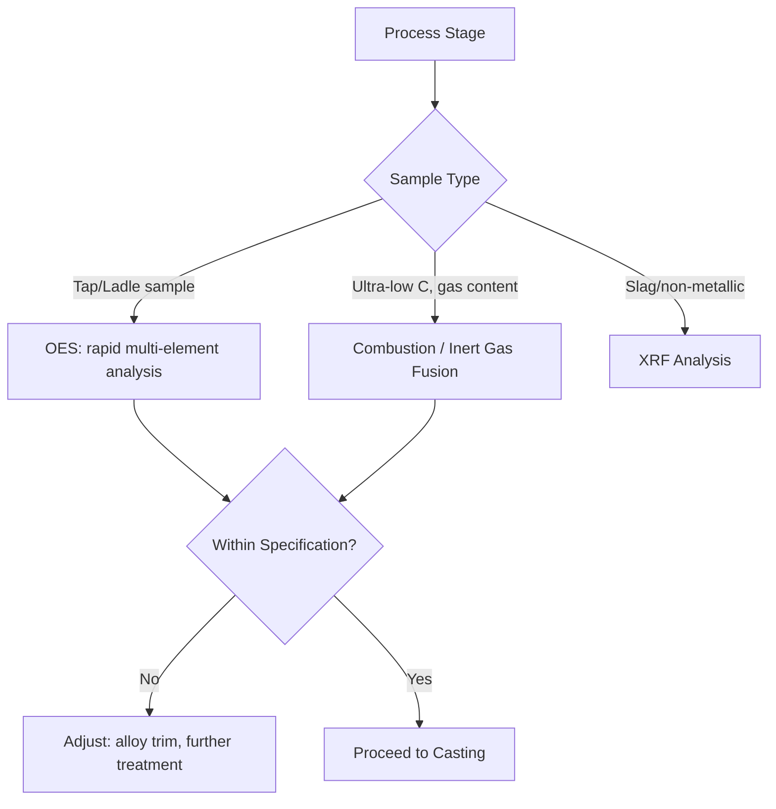

## Quality Control in Metal Production

### Overview

Quality control (QC) in metal production is the integrated set of sampling, testing, monitoring, and process-control practices used to verify that metal products meet specified chemical composition, mechanical properties, dimensional tolerances, and internal/surface soundness requirements throughout every stage — from raw material intake through primary and secondary metallurgy, casting, and final product inspection. Modern metal production QC blends **statistical process control (SPC)**, **destructive and non-destructive testing (NDT)**, and increasingly, **real-time sensor-based process monitoring**, reflecting a shift from purely end-of-line inspection toward controlling quality throughout the process itself.

### Quality Control Philosophy: Inspection vs. Process Control

| Approach | Description | Limitation |
| --- | --- | --- |
| End-of-line inspection | Testing/sampling of finished product only | Defects detected late, after value already added; scrap/rework cost incurred |
| In-process (statistical) control | Monitoring key process variables during production, intervening before defects occur | Requires reliable, timely process data and defined control limits |
| Design for quality | Process and equipment designed to inherently minimize defect occurrence | Requires upfront engineering investment; most effective long-term approach |

[Inference] Modern metallurgical quality practice generally favors an integrated combination of all three approaches rather than relying on any single one exclusively, since raw material and process variability make purely inspection-based quality assurance both costly (via scrap/rework) and reactive rather than preventive.

### Chemical Composition Control

**Sampling and Analysis**

Liquid metal composition is verified at multiple process stages (tap sample, ladle sample, mold/strand sample) using rapid analytical techniques suited to the fast pace of metallurgical operations:

- **Optical emission spectroscopy (OES)**: The dominant method for rapid multi-element analysis of solidified metal "pin" samples in steel and non-ferrous plants; a small sample is taken, cast into a standardized disk/pin shape, and analyzed within minutes, enabling near-real-time composition feedback to guide further alloy trim additions
- **X-ray fluorescence (XRF)**: Used for solid sample analysis, particularly common for slag and non-metallic material composition verification
- **Combustion/inert gas fusion analysis**: Used for precise determination of light elements (carbon, sulfur via combustion analysis; oxygen, nitrogen, hydrogen via inert gas fusion) that are difficult to measure accurately by OES alone, particularly relevant for ultra-low carbon and gas-sensitive specialty grades

**Key Points**

- The speed of chemical analysis directly constrains how responsively a plant can correct composition deviations before casting — this is a central reason OES remains the workhorse technique for liquid metal composition control despite newer analytical technologies, since its turnaround time (minutes) matches the operational tempo of ladle treatment and casting scheduling.

### Mechanical Property Testing

Mechanical properties are typically verified on samples taken from finished or semi-finished product, since mechanical behavior depends on the full processing history (composition, solidification structure, thermal/mechanical treatment) rather than composition alone.

| Test | Property Measured | Typical Method |
| --- | --- | --- |
| Tensile test | Yield strength, ultimate tensile strength, elongation | Standardized test specimen pulled to failure (e.g., per ASTM/ISO standards) |
| Hardness test | Resistance to indentation (correlates with strength) | Brinell, Rockwell, or Vickers indentation methods |
| Impact test | Toughness, particularly at low temperature | Charpy V-notch impact test |
| Bend test | Ductility, weld quality | Controlled bending to specified angle/radius, checking for cracking |
| Fatigue test | Resistance to cyclic loading failure | Cyclic stress application to failure, generating S-N curve data |

**Key Points**

- Mechanical testing is inherently destructive and statistical in nature (based on representative sampling from a heat/lot), meaning quality assurance for mechanical properties relies on the assumption that tested samples adequately represent the untested bulk of the production lot — a foundational statistical assumption underlying virtually all mechanical property certification in metal production.

### Non-Destructive Testing (NDT)

NDT methods allow inspection of finished or semi-finished product for internal and surface defects without destroying the part, essential for both 100% inspection of critical components and general quality assurance without sacrificing product.

**1. Ultrasonic Testing (UT)**

High-frequency sound waves are transmitted through the metal; internal discontinuities (voids, inclusions, cracks) reflect sound energy differently than sound base metal, detected as characteristic echo patterns. Widely used for internal defect detection in castings, forgings, and thick plate/slab product.

**2. Radiographic Testing (RT)**

X-ray or gamma-ray imaging reveals internal defects (porosity, inclusions, cracks) as density variations on film or digital detector, commonly used for weld inspection and casting quality verification.

**3. Magnetic Particle Testing (MT)**

Applicable to ferromagnetic materials only: magnetizing the part and applying fine magnetic particles reveals surface and near-surface discontinuities, as defects disrupt the magnetic field and cause particle accumulation at the defect location.

**4. Liquid Penetrant Testing (PT)**

A dye penetrant is applied to the surface, allowed to seep into surface-breaking defects, then a developer draws the penetrant back out to reveal defect location — applicable to any non-porous material regardless of magnetic properties, but limited to surface-breaking defects only (unlike UT/RT, which detect internal defects).

**5. Eddy Current Testing (ET)**

Alternating current induces eddy currents in conductive material; defects and property variations disrupt the induced current pattern, detectable via the resulting change in coil impedance. Commonly used for tube/pipe inspection and surface/near-surface defect detection.

| NDT Method | Defect Location | Material Requirement |
| --- | --- | --- |
| Ultrasonic (UT) | Internal | Any (best in homogeneous fine-grained metal) |
| Radiographic (RT) | Internal | Any (access to both sides typically needed) |
| Magnetic Particle (MT) | Surface/near-surface | Ferromagnetic only |
| Liquid Penetrant (PT) | Surface-breaking only | Any non-porous material |
| Eddy Current (ET) | Surface/near-surface | Electrically conductive |

### Statistical Process Control (SPC)

SPC applies statistical monitoring to key process variables (composition targets, temperature, casting speed, dimensional measurements) to distinguish **common cause variation** (inherent, expected process noise) from **special cause variation** (an identifiable, correctable process upset), using control charts with defined control limits (commonly based on process mean ± multiples of standard deviation).

**Key Points**

- The central value of SPC in metallurgical operations is enabling intervention *before* an out-of-specification product is produced, rather than discovering the deviation only at final inspection — this proactive characteristic is what distinguishes SPC from purely reactive end-of-line inspection, and is central to why SPC has become a standard component of modern quality management systems (e.g., IATF 16949 in automotive steel supply, and broader ISO 9001-based frameworks) across the metals industry.

### Traceability and Certification

Modern metal production requires robust **traceability** — the ability to link a finished product back through its full processing history (heat number, casting sequence, rolling/forging records, all associated test results) — both for internal quality management and for external certification requirements:

- **Mill test certificates (MTCs)**: Formal documents accompanying shipped product, certifying chemical composition and mechanical properties against the applicable specification (e.g., ASTM, EN, or customer-specific standards)
- **Heat/lot traceability systems**: Digital tracking systems linking each unit of product to its originating heat and full processing record, essential for root-cause investigation if a quality issue is discovered downstream (including, in critical applications, after the product has entered service)

[Inference] The specific traceability system architecture (heat number coding conventions, digital MES/quality database integration) varies considerably by plant and industry sector, with more demanding certification requirements (aerospace, pressure vessel, offshore) generally driving more rigorous and granular traceability practice than commodity-grade applications.

### Worked Example: Control Chart Limit Calculation

**Problem**: A plant monitors tap temperature for a given steel grade. Historical process data show a mean tap temperature of 1620°C with a standard deviation of 8°C. Calculate the upper and lower control limits (UCL, LCL) using standard 3-sigma control limits.

$$UCL = \bar{x} + 3\sigma = 1620 + 3(8) = 1620 + 24 = 1644°C$$

$$LCL = \bar{x} - 3\sigma = 1620 - 3(8) = 1620 - 24 = 1596°C$$

**Output**: Under standard 3-sigma control chart convention, tap temperatures between 1596°C and 1644°C would be considered within normal common-cause process variation, while readings outside this range would trigger investigation for a special (assignable) cause. [Inference] Actual control limit selection in plant practice may use different sigma multiples or additional control chart rules (e.g., Western Electric rules for detecting non-random patterns within control limits) depending on the specific quality management system and criticality of the monitored parameter.

### Environmental and Engineering Considerations

- **Scrap and rework cost**: Effective quality control directly reduces scrap and rework costs, which represent both an economic and an environmental burden (wasted energy and material inputs from producing off-specification product).
- **Testing resource intensity**: Comprehensive NDT and mechanical testing programs require significant equipment investment and skilled personnel; the extent of testing applied is generally proportional to application criticality (e.g., aerospace and pressure-vessel components receive far more extensive testing than commodity structural steel).
- **Digitalization and process data**: The increasing integration of real-time sensor data, machine learning-based defect prediction, and digital traceability systems represents an active area of ongoing development across the metals industry, though the maturity and specific implementation of such systems vary considerably by plant and company.
- **Standards and certification bodies**: Compliance with recognized standards (ASTM, EN, ISO, industry-specific frameworks such as API for oilfield tubulars or aerospace material specifications) underpins customer confidence and regulatory acceptance, and requirements continue to evolve, so current standard revisions should be checked when precision matters for a specific application.
- Specific control limits, testing frequencies, and certification requirements vary considerably by product, industry sector, and applicable standard; the examples and figures presented here should be read as illustrative of general quality control principles rather than fixed universal specifications.

### Related Topics

- Continuous Casting Fundamentals (in-process quality control application)
- Ladle Metallurgy and Refining (composition control before casting)
- Deoxidation and Desulfurization (inclusion cleanliness assessment)
- Non-Destructive Testing Methods in Metallurgical Inspection
- Statistical Process Control and Six Sigma in Manufacturing
- Mechanical Testing Standards (ASTM, ISO) for Metals
- Traceability Systems and Mill Test Certification
- Failure Analysis and Root Cause Investigation in Metals
- Inclusion Engineering and Steel Cleanliness Assessment