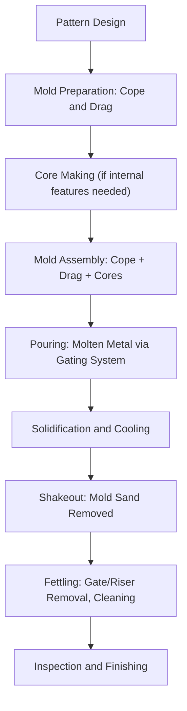
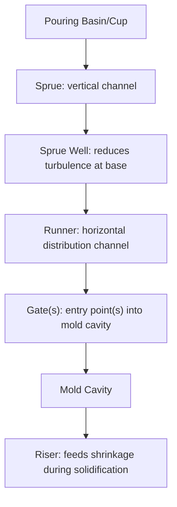

## Sand Casting and Mold Design

### Overview

Sand casting is the oldest and most versatile metal casting process, in which molten metal is poured into a mold cavity formed in compacted sand, allowed to solidify, and the mold is then broken away (destroyed) to reveal the casting. Its enduring industrial relevance stems from low tooling cost, geometric flexibility (capable of producing very large and very complex shapes), and applicability to virtually any castable alloy — ferrous or non-ferrous — making it the dominant process for low-to-medium production volumes and large components where the cost of permanent (metal) molds would be prohibitive.

### Sand Casting Process Sequence

### Pattern Design

The **pattern** is a replica of the desired casting (oversized to account for metal shrinkage) used to form the mold cavity. Pattern design incorporates several critical allowances:

- **Shrinkage allowance**: Patterns are made oversized using shrink rules specific to the alloy being cast, compensating for solidification and solid-state cooling contraction (which varies by alloy — e.g., aluminum alloys typically shrink more than gray cast iron)
- **Draft angle**: Tapered surfaces (typically a few degrees) on vertical pattern faces allow the pattern to be withdrawn from the sand mold without damaging the mold cavity
- **Machining allowance**: Extra material added to surfaces that will subsequently be machined to final dimension, ensuring adequate stock remains after accounting for as-cast surface roughness and dimensional variation
- **Distortion allowance**: For castings prone to warping during cooling (particularly large, thin, asymmetric shapes), patterns may incorporate a compensating pre-distortion

**Pattern Materials**: Wood (low-cost, suitable for prototype/low-volume production, but wears quickly and is dimensionally less stable), metal (aluminum, cast iron — durable, suitable for higher production volumes), and increasingly, 3D-printed polymer or composite patterns, which [Inference] have become widely adopted for rapid prototyping and low-to-medium volume production due to reduced lead time compared to traditional pattern-making, though pattern material choice ultimately depends on production volume, dimensional precision requirements, and cost considerations specific to each application.

### Mold Construction: Cope, Drag, and Molding Sand

**Cope and Drag**

The mold is typically made in two (or more) parts: the **drag** (bottom half) and **cope** (top half), each contained within a rigid frame called a **flask**. The pattern is packed in sand within each half, then the pattern is withdrawn, leaving the mold cavity, and the two halves are assembled (with any cores inserted) prior to pouring.

**Molding Sand Composition**

Molding sand is not simply raw sand but an engineered mixture:

| Component | Function |
| --- | --- |
| Silica sand (base aggregate) | Primary refractory material, forms the mold structure |
| Clay binder (e.g., bentonite) | Binds sand grains together, provides "green" (as-mixed, unbaked) strength |
| Water | Activates clay binder, provides plasticity for mold packing |
| Additives (sea coal, cereal binders, etc.) | Control surface finish, permeability, and collapsibility |

**Key Sand Properties**

- **Green strength**: Strength of the sand mixture in its moist, as-mixed state, sufficient to hold the mold cavity shape during pattern withdrawal and handling
- **Permeability**: The sand mixture must allow gases (steam from moisture, mold-metal reaction gases) generated during pouring to escape through the sand rather than becoming trapped in the casting as porosity defects
- **Refractoriness**: Resistance to fusion/breakdown at the pouring temperature of the specific alloy being cast
- **Collapsibility**: The sand mold (and any cores) must break down sufficiently after solidification to allow casting shrinkage without excessive restraint (which would otherwise cause hot tearing) and to permit shakeout/cleaning

**Key Points**

- These sand properties frequently trade off against one another — for example, higher clay content improves green strength but can reduce permeability — meaning molding sand formulation is an actively engineered balance specific to the casting geometry, alloy, and pouring practice involved, rather than a single universal "correct" mixture.

### Core Making

**Cores** are separate sand shapes (typically bonded with resin systems rather than clay, for higher strength and better collapsibility characteristics) inserted into the mold cavity to form internal features (holes, passages, undercuts) that the pattern alone cannot produce, since a pattern can only form external and simple internal geometry achievable through straightforward withdrawal.

- Cores are supported within the mold cavity by **core prints** — extensions of the core that rest in corresponding recesses in the mold, holding the core in the correct position and orientation during pouring
- Common core binder systems include resin-bonded (shell/cold-box processes) and, historically, oil-sand cores, selected based on required core strength, dimensional precision, and post-casting collapsibility/removability

### Gating System Design

The gating system controls how molten metal enters and fills the mold cavity, directly influencing casting quality (avoiding turbulence-induced defects, ensuring complete fill, and managing solidification sequence):

- **Pouring basin/cup**: Receives poured metal, helps establish smooth, controlled flow into the sprue
- **Sprue**: The primary vertical channel through which metal descends into the mold; often tapered to maintain a full flow condition and minimize air aspiration
- **Runner**: Horizontal channel(s) distributing metal from the sprue to one or more gates
- **Gate**: The final entry point where metal enters the mold cavity itself; gate location and size are chosen to control fill pattern and minimize turbulence/erosion of the mold cavity surface

**Key Points**

- Gating system design must balance filling the mold quickly enough to avoid premature solidification (a "cold" or incomplete casting) against filling slowly/smoothly enough to avoid turbulent entrainment of air and oxide inclusions into the casting — this is a central, actively engineered trade-off in gating system design rather than a simple "faster is always better" or "slower is always better" rule.

### Risers and Feeding

**Risers** (also called "feeder heads") are reservoirs of molten metal connected to the casting, designed to remain liquid longer than the casting section they feed, supplying additional liquid metal to compensate for solidification shrinkage and prevent shrinkage porosity/pipe defects in the casting itself.

**Riser Design Principle: Chvorinov's Rule**

Solidification time is proportional to the square of the volume-to-surface-area ratio:

$$t_s = C \left(\frac{V}{A}\right)^2$$

Where $t_s$ is solidification time, $V$ is casting (or riser) volume, $A$ is surface area, and $C$ is a mold constant dependent on mold material and metal properties.

For a riser to effectively feed a casting, it must solidify *after* the casting section it feeds — meaning the riser must be designed with a higher $V/A$ ratio than the casting section, achieved through appropriate riser sizing and shape (spherical or cylindrical risers, having lower surface-area-to-volume ratio than thin sections, are generally more efficient feeders per unit riser volume).

**Key Points**

- Chvorinov's Rule is the foundational quantitative tool for riser design in sand casting, directly informing riser placement, sizing, and the broader principle of "directional solidification" — designing the casting/riser/gating system so that solidification proceeds progressively from the section farthest from the riser toward the riser itself, ensuring liquid feed metal remains available at each point until that point solidifies.

### Worked Example: Chvorinov's Rule Application

**Problem**: A cylindrical casting section has a solidification time of 4 minutes. A spherical riser is being designed to solidify in at least 6 minutes (to ensure it remains liquid after the casting solidifies), using the same mold material (same constant $C$). If the casting section has $V/A = 1.2 \, cm$, calculate the minimum required $V/A$ ratio for the riser.

Since $t_s \propto (V/A)^2$ with constant $C$:

$$\frac{t_{riser}}{t_{casting}} = \left(\frac{(V/A)_{riser}}{(V/A)_{casting}}\right)^2$$

$$\frac{6}{4} = \left(\frac{(V/A)_{riser}}{1.2}\right)^2$$

$$1.5 = \left(\frac{(V/A)_{riser}}{1.2}\right)^2$$

$$\sqrt{1.5} = \frac{(V/A)_{riser}}{1.2} \implies 1.225 = \frac{(V/A)_{riser}}{1.2}$$

$$(V/A)_{riser} = 1.225 \times 1.2 \approx 1.47 \, cm$$

**Output**: The riser must be designed with a $V/A$ ratio of at least approximately 1.47 cm to ensure it solidifies after the casting section, providing adequate feeding throughout the casting's solidification. [Inference] In practice, riser design also incorporates a safety margin beyond the strict minimum calculated value, along with practical considerations such as riser yield (the fraction of poured metal that ends up in the riser rather than the final casting, which is later removed and recycled as gating/riser scrap), so this example illustrates the underlying Chvorinov's Rule principle rather than a complete industrial riser design procedure.

### Common Sand Casting Defects

| Defect | Cause | Mitigation |
| --- | --- | --- |
| Gas porosity | Trapped gas from mold moisture, inadequate permeability | Improved sand permeability, venting, moisture control |
| Shrinkage porosity | Inadequate riser feeding | Chvorinov's Rule-based riser design, directional solidification |
| Sand inclusions/erosion | Turbulent gating eroding mold surface | Gating system redesign, improved sand strength |
| Cold shut | Two metal streams meeting without fully fusing (premature solidification) | Increase pouring temperature/rate, improve gating design |
| Misrun | Metal solidifies before completely filling the cavity | Increase fluidity (temperature), improve gating/venting |
| Hot tearing | Restrained contraction during solidification/cooling, insufficient mold/core collapsibility | Improve core/mold collapsibility, redesign to reduce restraint |

### Environmental and Engineering Considerations

- **Sand reclamation**: Used molding sand is increasingly reclaimed (mechanically and/or thermally treated to remove spent binder) and reused, reducing both raw sand consumption and disposal volume — a significant sustainability consideration for foundries given the large sand-to-metal mass ratios typically involved in sand casting operations.
- **Binder system emissions**: Resin-bonded core and mold systems (used for improved dimensional precision and collapsibility relative to traditional clay-bonded sand) can generate volatile organic compound (VOC) emissions during pouring and cooling, an active area of foundry environmental control and binder system development.
- **Energy consumption**: Melting furnace energy (induction or other) represents the dominant energy consumption in sand casting foundries; casting yield (poured metal mass versus final part mass, after removing gates/risers/scrap) directly affects overall energy efficiency per unit of finished product.
- **Dust and silica exposure**: Silica sand handling generates respirable crystalline silica dust, a recognized occupational health hazard requiring dust control and personal protective measures in foundry operations.
- Specific sand formulations, riser design safety margins, and defect mitigation approaches vary considerably by alloy, casting geometry, and foundry-specific practice; the principles and figures presented here should be read as representative of general sand casting engineering rather than fixed universal specifications.

### Related Topics

- Investment Casting and Precision Casting Methods
- Die Casting and Permanent Mold Processes
- Solidification Structure and Segregation in Metals
- Casting Defect Analysis and Non-Destructive Testing
- Chvorinov's Rule and Directional Solidification Design
- Foundry Sand Reclamation and Environmental Control
- Core Making Processes (Shell, Cold-Box, No-Bake)
- Gating System and Riser Simulation Software
- Aluminum and Cast Iron Foundry Alloy Selection