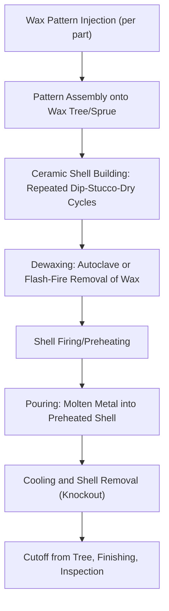
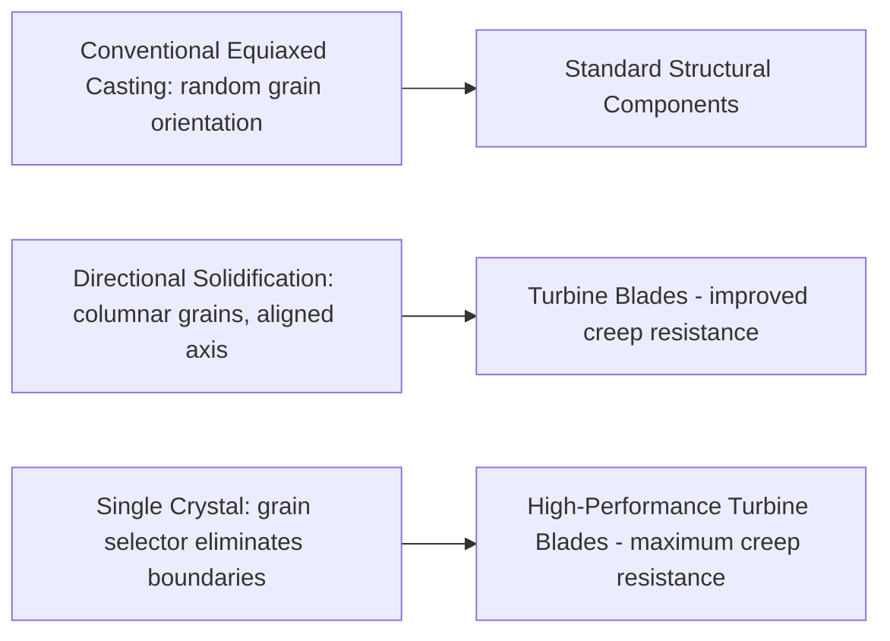

## Investment and Precision Casting

### Overview

Investment casting (also known as "lost-wax casting," one of the oldest metal-forming processes historically, dating back millennia, yet also one of the most advanced in its modern industrial form) is a precision casting process in which a disposable wax (or similar sacrificial) pattern is coated with a ceramic shell, then melted out and replaced by molten metal poured into the resulting ceramic mold cavity. It is distinguished from sand casting primarily by its ability to produce **near-net-shape** components with excellent dimensional accuracy, fine surface finish, and complex internal/external geometry unattainable with conventional sand casting or many machining processes — making it the process of choice for high-value, geometrically complex components in aerospace, medical, dental, jewelry, and turbine applications.

### Investment Casting Process Sequence

### Pattern Production

**Wax Injection**

A precision metal die (the "master tool," itself typically machined from aluminum or steel, representing significant upfront tooling investment) is used to injection-mold wax patterns replicating the final part geometry, oversized to account for both wax shrinkage and subsequent metal shrinkage during solidification.

**Key Points**

- The high tooling cost of the injection die is investment casting's principal barrier to entry for low-volume production, which is why investment casting is generally most economical for medium-to-high production volumes of a given part design, or for very high-value/complex parts where the precision benefit justifies tooling cost even at lower volumes — a direct contrast with sand casting, whose comparatively low tooling cost favors low-volume and one-off production.

**Pattern Assembly (Tree Building)**

Multiple individual wax patterns are attached to a central wax sprue/runner system, forming a "tree" that allows many parts to be cast simultaneously in a single ceramic shell and pour — significantly improving production efficiency per casting cycle relative to single-part molds.

### Ceramic Shell Building

The wax tree assembly is repeatedly dipped into a ceramic slurry (a fine refractory powder suspended in a liquid binder, commonly colloidal silica or ethyl silicate-based systems) and then coated with coarser refractory stucco (sand) particles, with drying time allowed between each layer. This dip-stucco-dry cycle is repeated multiple times (commonly [Inference] on the order of 5–10+ layers depending on part size and required shell strength) to build a shell of sufficient thickness and strength to withstand the thermal and mechanical stresses of dewaxing, firing, and pouring.

- **Primary (face) coat**: The first, finest slurry layer applied directly against the wax pattern, determining final casting surface finish — the finest refractory powder is used here to capture maximum surface detail
- **Backup coats**: Subsequent, progressively coarser layers building shell thickness and structural strength

**Key Points**

- Shell quality directly and predominantly determines final casting surface finish and dimensional accuracy, since the ceramic shell's inner surface geometry is what actually contacts and shapes the molten metal — this is why primary coat slurry formulation and application control receive disproportionate process engineering attention relative to backup coat layers.

### Dewaxing

Once the ceramic shell has fully dried and cured, the wax pattern must be removed from within the now-rigid shell, leaving a hollow ceramic mold cavity:

- **Steam autoclave dewaxing**: High-pressure steam rapidly melts and expels wax from the shell interior, minimizing thermal expansion stress on the still-relatively-fragile green shell (a key advantage, since wax has a significantly higher thermal expansion coefficient than the ceramic shell, and slow, uncontrolled wax expansion during heating can crack the shell)
- **Flash-fire dewaxing**: Rapid exposure to a very high-temperature furnace flashes off surface wax quickly before bulk thermal expansion can develop and crack the shell, an alternative to autoclave dewaxing

Some residual wax typically remains after initial dewaxing and is burned out during the subsequent shell firing/preheating step.

### Shell Firing and Preheating

The dewaxed ceramic shell is fired at high temperature (both to fully cure/strengthen the ceramic and to burn out any residual wax), and is typically poured while still hot (preheated) rather than allowed to cool to room temperature. Preheating serves multiple purposes:

- Removes any residual moisture and wax residue
- Increases shell fluidity-matching temperature, improving fine-detail fill (particularly important for thin sections)
- Reduces thermal shock to the shell upon pouring, and reduces the temperature gradient the poured metal experiences, which can influence solidification structure

[Inference] Shell preheat temperature is generally tailored to the specific alloy being cast and section thickness involved, since higher preheat temperatures improve thin-section fill and reduce misrun risk but can also reduce solidification rate and affect grain structure, so exact preheat practice varies by application and alloy system.

### Pouring and Solidification

Molten metal is poured (via gravity, or for very demanding aerospace/superalloy applications, under vacuum) into the preheated ceramic shell:

**Vacuum Investment Casting**

For reactive or oxidation-sensitive alloys (nickel-based superalloys, titanium alloys), pouring and solidification occur inside a vacuum chamber, preventing atmospheric oxidation/nitrogen pickup and enabling controlled solidification techniques.

**Directional Solidification (DS) and Single Crystal (SX) Casting**

For turbine blade applications specifically, specialized investment casting variants control the solidification front direction:

- **Directional solidification (DS)**: A controlled thermal gradient (typically via a water-cooled chill plate at the mold base and a heated zone above, with the mold gradually withdrawn from the hot zone) promotes columnar grain growth aligned along the blade's primary stress axis, improving creep resistance in service by eliminating transverse grain boundaries perpendicular to the primary loading direction
- **Single crystal (SX) casting**: An extension of DS technique incorporating a "grain selector" (a constricted spiral or helical passage in the mold) that allows only a single favorably oriented grain to propagate into the main casting cavity, eliminating grain boundaries entirely within the component — [Inference] widely regarded as providing superior high-temperature creep resistance for the most demanding turbine blade applications, given the complete absence of grain boundary-related creep mechanisms, though the specific quantitative performance benefit depends on alloy system and operating conditions

### Shell Removal and Finishing

After solidification and cooling, the ceramic shell is removed (mechanically via knockout/vibration, and/or chemically via caustic or high-pressure water blasting for residual ceramic in internal passages), individual castings are cut from the tree, and finishing operations (grinding gate stubs, surface cleaning, and often hot isostatic pressing (HIP) for critical aerospace components to close internal porosity) are performed.

**Key Points**

- Hot isostatic pressing, when applied, is a distinct post-casting densification treatment (applying simultaneous high temperature and isostatic gas pressure to collapse internal micro-porosity) rather than a routine step in all investment casting practice — it is generally reserved for critical, fatigue-sensitive applications where even minor internal porosity would be unacceptable, given its additional cost and cycle time.

### Comparison: Investment Casting vs. Sand Casting

| Factor | Investment Casting | Sand Casting |
| --- | --- | --- |
| Dimensional accuracy | High | Moderate |
| Surface finish | Excellent (as-cast) | Rough (requires machining for fine finish) |
| Tooling cost | High (injection die) | Low (pattern) |
| Complexity capability | Very high (fine detail, thin sections, internal passages) | Moderate (limited by pattern withdrawal, core complexity) |
| Typical part size | Small to medium (though larger parts possible) | Small to very large |
| Economic production volume | Medium-high (justifies tooling) | Low-medium (low tooling barrier) |
| Typical applications | Turbine blades, aerospace components, medical implants, jewelry | Engine blocks, machine bases, large structural castings |

### Worked Example: Shell Thickness Buildup Estimation

**Problem**: A ceramic shell requires a minimum thickness of 6 mm for adequate strength in a given part size. If each dip-stucco cycle adds approximately 0.8 mm of shell thickness on average, estimate the minimum number of dip cycles required.

$$n = \frac{6 \, mm}{0.8 \, mm/\text{cycle}} = 7.5 \implies 8 \, \text{cycles (rounding up)}$$

**Output**: Approximately 8 dip-stucco-dry cycles would be required to reach the target minimum shell thickness under this simplified linear buildup assumption. [Inference] Actual shell buildup per cycle can vary between the fine primary coat(s) and coarser backup coats, and total required thickness depends on part size, complexity, and metal pour temperature/pressure, so this example illustrates the general shell-building principle rather than a precise production specification for any given part.

### Environmental and Engineering Considerations

- **Wax reclamation**: Dewaxed wax is commonly filtered, reclaimed, and reused for subsequent pattern injection, reducing raw material consumption — an established sustainability practice in investment casting foundries given the relatively high cost of casting-grade waxes.
- **Ceramic shell disposal/recycling**: Spent ceramic shell material (post-knockout) represents a waste stream; [Inference] some foundries have explored ceramic shell material recycling or reuse in secondary applications (e.g., as aggregate), though the extent of industry-wide adoption varies and should be verified against current practice for specific operations.
- **Energy intensity**: Shell firing/preheating and metal melting represent the dominant energy consumers in the investment casting process; vacuum casting for superalloys adds further energy and equipment complexity relative to conventional gravity air-melt investment casting.
- **Binder system emissions**: Ceramic slurry binder systems (colloidal silica, ethyl silicate) have different emissions and handling profiles; ethyl silicate systems in particular involve alcohol-based solvents requiring appropriate ventilation and handling controls.
- Shell buildup rates, preheat practice, and achievable dimensional tolerances vary considerably with part geometry, alloy system, and foundry-specific process parameters; the figures and principles presented here should be read as representative of general investment casting engineering rather than fixed universal specifications.

### Related Topics

- Sand Casting and Mold Design (comparative casting process)
- Die Casting and Permanent Mold Processes
- Superalloy Metallurgy and Turbine Blade Materials
- Directional Solidification and Single Crystal Casting Theory
- Hot Isostatic Pressing (HIP) for Casting Densification
- Solidification Structure and Segregation in Metals
- Vacuum Melting and Casting Technologies
- Casting Defect Analysis and Non-Destructive Testing
- Aerospace Materials Qualification and Certification