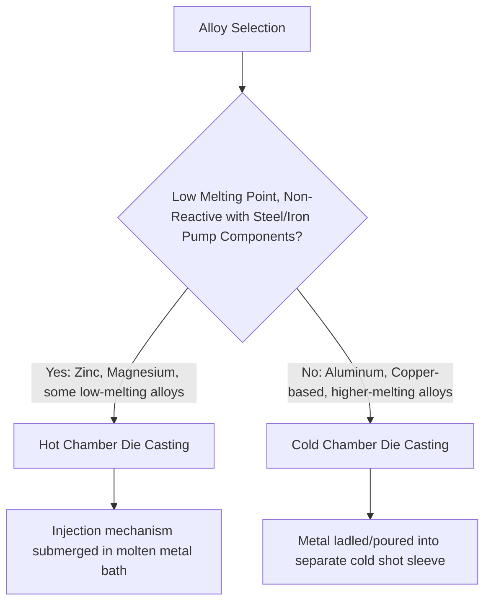
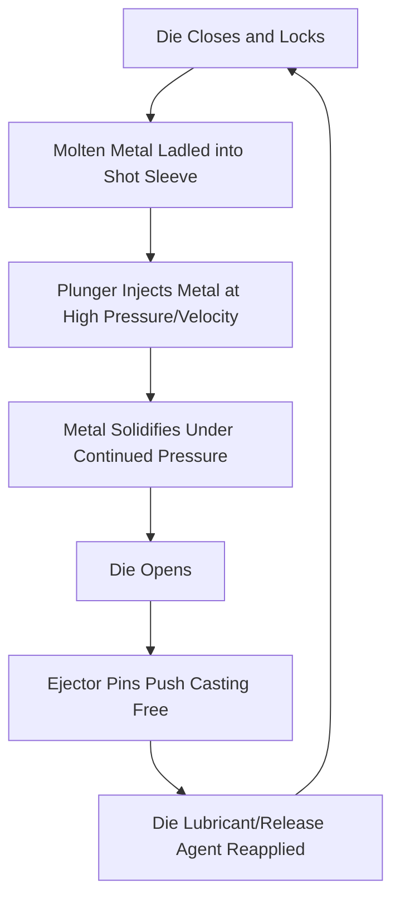

## Die Casting Processes

### Overview

Die casting is a permanent-mold casting process in which molten metal is injected under high pressure into a precision-machined steel mold (the "die"), producing near-net-shape components with excellent dimensional accuracy, fine surface finish, and very high production rates. Unlike sand or investment casting, where the mold is consumed (destroyed) with each casting, the die is reusable for many thousands to hundreds of thousands of cycles, making die casting the process of choice for high-volume production of relatively small-to-medium-sized non-ferrous components — automotive parts, electronic housings, hardware, and consumer goods.

### Fundamental Distinction: Hot Chamber vs. Cold Chamber

The single most important classification in die casting is the injection system type, which is dictated primarily by the alloy being cast — specifically, whether the alloy would chemically attack the injection system components at typical processing temperatures.

**Hot Chamber Die Casting**

The injection mechanism (gooseneck and plunger) is submerged directly within a molten metal holding furnace/bath, drawing metal directly into the injection cylinder and forcing it into the die cavity with each cycle. This design enables very fast cycle times since metal never needs to be separately ladled or transferred.

- **Applicable alloys**: Zinc, magnesium, and other low-melting-point alloys that do not chemically attack (dissolve/react with) the steel components of the injection system
- **Not suitable for aluminum**: Molten aluminum aggressively dissolves iron/steel components at typical processing temperatures, which would rapidly degrade the submerged injection mechanism — this is the fundamental metallurgical reason aluminum die casting requires the cold chamber approach instead

**Cold Chamber Die Casting**

Molten metal is ladled (manually or via automated ladling system) into a separate, unheated "shot sleeve" for each cycle, and a hydraulically driven plunger then forces this metered charge into the die cavity. Because the metal is not held in continuous contact with the injection system components, this design accommodates alloys that would otherwise attack a hot-chamber injection mechanism.

- **Applicable alloys**: Aluminum (the dominant cold chamber application), copper-based alloys (brass), and higher-melting-point alloys generally
- **Trade-off**: Slower cycle times than hot chamber (due to the separate ladling step per cycle) and generally requires higher injection pressures to compensate for the additional heat loss during transfer to the shot sleeve

**Key Points**

- The hot/cold chamber distinction is fundamentally driven by alloy-injection-system chemical compatibility, not simply by melting point alone — this is why aluminum (despite having a lower melting point than some steels) still requires cold chamber processing, since the compatibility issue is aluminum's specific chemical aggressiveness toward iron-based injection components rather than a general temperature limitation.

### Process Sequence (Cold Chamber, Illustrative)

### Die Design and Construction

**Die Materials**

Dies are machined from high-grade tool steels (commonly H13 hot-work tool steel for aluminum die casting, given its resistance to thermal fatigue cracking, or other specialized die steels selected for the specific alloy and production volume requirements) capable of withstanding thousands to hundreds of thousands of thermal and mechanical cycles.

**Die Components**

- **Cavity and core**: The two primary die halves forming the external and internal casting geometry respectively
- **Runner and gating system**: Channels distributing molten metal from the shot sleeve/injection point into the die cavity, analogous in function (though different in specific design constraints, given the much higher injection pressures involved) to sand casting gating systems
- **Overflow wells**: Small cavities positioned at the end of the expected metal flow path, designed to capture the leading edge of the metal flow (which is typically cooler, more oxidized, and may contain trapped air/gas) before it can contaminate the actual part cavity
- **Cooling channels**: Internal passages through which cooling water or oil circulates to control die temperature and cycle time, critical for both production rate and dimensional consistency
- **Ejector system**: Pins or plates that push the solidified casting out of the die once it opens, positioned to avoid distorting or damaging the casting during ejection

**Key Points**

- Die thermal management (cooling channel design) directly governs achievable cycle time, since the die must reach an appropriate temperature window before each subsequent shot — too hot and the casting cannot solidify quickly enough (extending cycle time and risking soldering/sticking to the die), too cold and thermal shock accelerates die fatigue cracking (heat checking).

### High-Pressure Injection Dynamics

Die casting is distinguished from other casting processes by the combination of **high injection velocity** and **high applied pressure**, both critical to filling thin-walled die cavities before the metal solidifies (since die casting components are frequently thin-walled relative to sand or investment castings, given the rapid heat extraction from the massive, actively cooled steel die):

- **Fast fill (high velocity)**: Ensures the die cavity, particularly thin sections, fills completely before solidification begins to block flow
- **Intensification pressure**: Additional pressure applied after initial cavity fill, forcing metal into the last-solidifying regions to reduce shrinkage porosity — analogous in intent to riser feeding in sand casting, but achieved through applied mechanical pressure rather than gravity-fed reservoir volume

**Key Points**

- The very fast fill velocities required for thin-wall filling inherently promote turbulent metal flow, which tends to entrap air within the casting as fine porosity — this is a fundamental, largely unavoidable trade-off in conventional high-pressure die casting (distinct from the porosity mechanisms discussed for sand/investment casting), and is the central reason conventional die castings are generally not recommended for high-integrity, pressure-tight, or weldable/heat-treatable applications without specialized process variants (see below).

### Porosity Challenge and Process Variants

Because conventional high-pressure die casting inherently entraps some air/gas during rapid, turbulent mold filling, several process variants have been developed to address applications requiring higher internal soundness:

**Vacuum Die Casting**

The die cavity is evacuated (partially or substantially) immediately before and during injection, reducing the volume of air present to be entrapped by the incoming metal stream, improving internal soundness for applications requiring heat treatment, welding, or pressure-tightness.

**Squeeze Casting**

Metal is introduced into the die more slowly (reducing turbulence) and then solidified under sustained, high applied pressure, producing castings with reduced porosity and improved mechanical properties (approaching wrought-alloy properties in some cases) at the cost of longer cycle time relative to conventional high-pressure die casting.

**Semi-Solid (Thixocasting/Rheocasting)**

Metal is processed in a semi-solid (partially solidified, slurry-like) state before injection, exploiting the reduced shrinkage and more laminar flow behavior of a semi-solid slurry (compared to fully liquid metal) to reduce porosity and improve mechanical properties. [Inference] These semi-solid processing technologies represent a more specialized, generally higher-cost segment of the die casting industry, applied selectively where their specific soundness/property benefits justify the additional process complexity relative to conventional high-pressure die casting.

### Comparison: Die Casting vs. Sand Casting vs. Investment Casting

| Factor | Die Casting | Sand Casting | Investment Casting |
| --- | --- | --- | --- |
| Mold type | Permanent (reusable steel die) | Consumed (destroyed) sand mold | Consumed (destroyed) ceramic shell |
| Tooling cost | Very high | Low | High |
| Cycle time | Very fast (seconds) | Slow (mold made per casting) | Slow (multi-step shell/dewax process) |
| Economic volume | Very high volume | Low-medium volume | Medium-high volume |
| Achievable alloys | Primarily low-melting non-ferrous (Zn, Al, Mg, some Cu alloys) | Virtually any castable alloy | Virtually any castable alloy, including reactive/high-temp alloys |
| Internal soundness (conventional) | Lower (entrapped porosity typical) | Good (with proper riser design) | Good |
| Surface finish/dimensional accuracy | Excellent | Moderate | Excellent |

### Worked Example: Cycle Time and Production Rate Estimation

**Problem**: A cold chamber aluminum die casting cell has a cycle time of 45 seconds per shot, producing 4 parts per shot (a 4-cavity die). Estimate the theoretical hourly production rate, and the daily output over a 20-hour production day (accounting for downtime allowance).

**Shots per hour:**

$$\frac{3600 \, s/hr}{45 \, s/shot} = 80 \, \text{shots/hr}$$

**Parts per hour:**

$$80 \, \text{shots/hr} \times 4 \, \text{parts/shot} = 320 \, \text{parts/hr}$$

**Daily output (20 hours):**

$$320 \, \text{parts/hr} \times 20 \, \text{hr} = 6{,}400 \, \text{parts/day}$$

**Output**: Under these illustrative assumptions, the cell would theoretically produce 6,400 parts per day. [Inference] Actual production output would be lower after accounting for scrap rate, unplanned downtime, die maintenance intervals, and other real-world operational efficiency losses not included in this simplified calculation, so this example illustrates the basic cycle-time-to-throughput relationship rather than a guaranteed achievable production figure for any specific operation.

### Environmental and Engineering Considerations

- **Energy efficiency and cycle speed**: Die casting's high production speed generally translates to good energy efficiency per part relative to slower casting processes, though melting furnace energy (particularly for aluminum, given its relatively high specific heat of fusion) remains a significant overall energy consideration.
- **Die lubricant/release agent emissions**: Water- or oil-based die lubricants sprayed onto the die between cycles (to prevent sticking/soldering and aid heat transfer control) can generate volatile emissions and require appropriate ventilation and wastewater/residue handling.
- **Scrap recyclability**: Runner, gate, and overflow well material removed from each casting is directly recyclable as remelt stock (particularly straightforward for aluminum and zinc die casting alloys), supporting relatively efficient material utilization despite the porosity-related yield considerations discussed above.
- **Die steel life and replacement**: Die fatigue cracking (heat checking) from repeated thermal cycling eventually necessitates die repair or replacement, representing a long-term tooling cost consideration weighed against production volume requirements when selecting die casting as a manufacturing process.
- Cycle times, achievable soundness, and die life vary considerably by alloy, part geometry, and specific process variant (conventional vs. vacuum/squeeze/semi-solid); the figures and comparisons presented here should be read as representative of general die casting engineering rather than fixed universal specifications.

### Related Topics

- Sand Casting and Mold Design (comparative low-tooling-cost process)
- Investment and Precision Casting (comparative high-precision process)
- Aluminum and Zinc Die Casting Alloy Selection
- Vacuum and Squeeze Casting Process Variants
- Semi-Solid Metal Processing (Thixocasting, Rheocasting)
- Casting Defect Analysis: Porosity and Soldering
- Tool Steel Selection for Die Casting Dies (H13 and Alternatives)
- Post-Casting Heat Treatment Limitations for Die Castings
- High-Pressure Die Casting Process Simulation