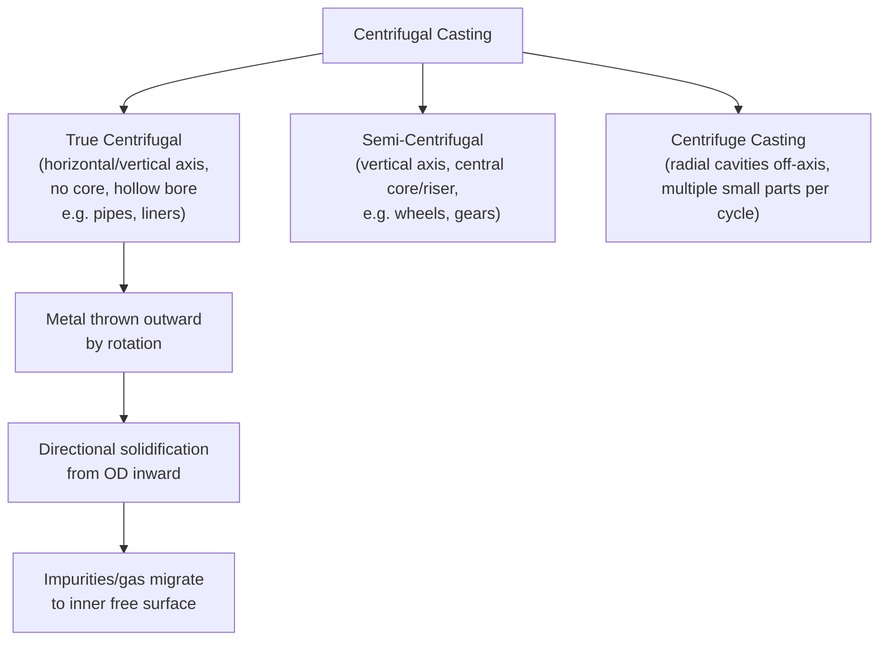

## Continuous and Centrifugal Casting

### Overview

Continuous casting and centrifugal casting are two specialized solidification processes that depart from conventional static mold casting. Both are used to produce semi-finished or near-net-shape products with specific geometries — continuous casting produces long, constant-cross-section products (billets, blooms, slabs) in an unending or semi-unending process, while centrifugal casting uses rotational forces to form hollow, axisymmetric components (pipes, sleeves, rings) with superior soundness. They are grouped together in foundry technology because both rely on controlled, directional solidification against a moving or rotating mold surface, rather than solidification in a static, stationary cavity.

---

### Continuous Casting

#### Principle

Continuous casting is a process in which molten metal is solidified into a semi-finished shape (billet, bloom, slab, or strand) for subsequent rolling in finishing mills, in a continuous or semi-continuous manner without individual mold filling and separate ingot handling. Liquid metal is poured into a bottomless, water-cooled mold and withdrawn continuously as a solid-shell-enclosed strand, which is further cooled and cut to length.

#### Process Sequence

1. **Ladle stage** — Molten metal (typically steel, but also aluminum and copper alloys) is transported in a ladle from the melting/refining furnace.
2. **Tundish** — Metal is poured into an intermediate holding vessel (tundish) that regulates flow rate, distributes metal to multiple strands, and helps separate slag/inclusions.
3. **Mold** — Metal flows from the tundish through a submerged entry nozzle (SEN) into an open-ended, water-cooled copper mold, which oscillates vertically to prevent sticking and promote uniform shell formation.
4. **Shell formation** — A thin solid shell forms at the mold walls almost immediately due to intense heat extraction; the core remains liquid.
5. **Withdrawal and secondary cooling** — Withdrawal rolls pull the strand downward (or along a curved path in curved-mold machines) at a controlled casting speed. Beyond the mold, the strand passes through a secondary cooling zone with water/air sprays that continue shell thickening until the core fully solidifies.
6. **Straightening (for curved-mold machines)** — The strand, cast in a curved arc, is straightened to horizontal.
7. **Cutting** — The continuous strand is cut to specified lengths using oxy-fuel torches or shears.

#### Machine Configurations

- **Vertical** — Strand travels straight down; used for high-quality, low-speed casting (e.g., special steels); large footprint (tall building).
- **Vertical-with-bending (curved)** — Strand starts vertically, then bends to horizontal; reduces height requirement.
- **Curved (bow-type)** — Entire path is curved from mold to horizontal; most common for high-productivity steel casting; compact footprint.
- **Horizontal** — Mold is horizontal; used for smaller sections, billets, and non-ferrous metals; no bending stresses on solidifying shell.

#### Key Process Parameters

- **Casting speed** — Must balance productivity against shell thickness at mold exit; too fast risks breakout (liquid core rupturing through a thin shell).
- **Mold oscillation** — Negative-strip time and oscillation frequency/stroke control lubrication (via mold flux) and reduce sticking/surface defects (oscillation marks).
- **Mold flux** — Provides lubrication, thermal insulation, and absorbs inclusions/slag at the meniscus.
- **Secondary cooling water flow** — Controls shell growth rate and surface/internal temperature gradients; excessive cooling causes surface cracking, insufficient cooling risks breakout.
- **Superheat** — Excess temperature of liquid metal above liquidus; controls initial solidification behavior and equiaxed-vs-columnar grain structure.
- **Electromagnetic stirring (EMS)** — Applied at mold, strand, or final stages to promote equiaxed grain structure, reduce center segregation, and break dendrite arms.

#### Governing Solidification Relationship

Shell thickness growth in continuous casting is commonly approximated by a square-root law derived from Fourier's law of heat conduction (Chvorinov-type relationship applied to a growing shell):

$$s = K\sqrt{t}$$

where $s$ is shell thickness, $t$ is time from initial contact with the mold, and $K$ is the solidification constant (dependent on thermal properties of metal and mold, and cooling intensity). This relationship underlies the **metallurgical length** calculation — the distance from the meniscus to the point of complete solidification — which determines minimum machine length to avoid liquid core breakout at the straightener or cutting station.

#### Products and Applications

- **Slabs** — Wide, thin rectangular sections (for plate and sheet rolling).
- **Blooms** — Large square/rectangular sections (for structural sections, rail).
- **Billets** — Smaller square sections (for bar, rod, wire rolling).
- **Thin-slab/strip casting** — Near-net-shape casting (e.g., Compact Strip Production, twin-roll strip casting) that reduces downstream rolling passes.

Continuous casting dominates modern steel production, accounting for the vast majority of global crude steel output, having largely replaced ingot casting due to higher yield, energy efficiency, and product consistency. [Inference: exact current global percentage figures vary by year and source and are not cited here as a fixed statistic.]

#### Common Defects

- **Breakouts** — Catastrophic rupture of the thin solidifying shell, releasing liquid metal; caused by excessive casting speed, inadequate cooling, or mold level fluctuations.
- **Longitudinal/transverse surface cracks** — From thermal stress, uneven cooling, or mold friction.
- **Internal cracks (midway, centerline)** — From bulging between support rolls, unbending strain, or thermal gradients.
- **Centerline segregation and porosity** — Solute-rich liquid concentrates at the final solidification zone.
- **Inclusions and oscillation marks** — From mold flux entrapment or oscillation-induced surface irregularities.

#### Advantages

- High yield (minimal cropping losses compared to ingot casting)
- Continuous, automatable process suited for high-volume production
- Improved surface quality and dimensional consistency
- Reduced energy consumption per ton versus ingot-and-reheat routes

#### Limitations

- High capital cost for machinery and control systems
- Sensitive to process upsets (breakouts can halt production and damage equipment)
- Segregation and centerline defects require careful process control (soft reduction, EMS)

---

### Centrifugal Casting

#### Principle

Centrifugal casting uses centripetal force generated by a rotating mold to distribute molten metal against the mold wall, forming a hollow cylindrical or axisymmetric shape without the need for a core. Denser metal is thrown outward against the mold surface, while lighter impurities, slag, and gases migrate toward the (free) inner surface, where they can be removed by machining.

#### Types

**1. True Centrifugal Casting**

Mold rotates about a horizontal, inclined, or vertical axis; no core is used; the bore is formed entirely by centrifugal force. Produces pipes, cylinder liners, bushings, and tubes.

**2. Semi-Centrifugal Casting**

Mold rotates about a vertical axis; a central core (or riser) may define the inner geometry (which may be a solid or symmetric cavity, not necessarily a plain hollow bore); gating is along the central axis. Used for symmetric parts such as wheels, gears, and pulleys where the center may not be fully utilized as functional material (center often machined away).

**3. Centrifuge Casting (True Centrifuging)**

Multiple mold cavities are arranged radially around a central sprue, off the central rotation axis; centrifugal force fills each cavity from the shared axial gate. Used for smaller, non-axisymmetric parts produced in multiples per cycle — the individual cavities need not be symmetric themselves.

#### Governing Physics

The centrifugal force per unit mass acting on the liquid metal is:

$$F = m\omega^2 r$$

where $m$ is mass, $\omega$ is angular velocity (rad/s), and $r$ is radius. The G-factor (ratio of centrifugal force to gravitational force) is used to determine minimum rotational speed for proper metal distribution:

$$G_f = \frac{\omega^2 r}{g}$$

For horizontal true centrifugal casting, practical G-factors typically range from approximately 60 to 80 for many ferrous and non-ferrous pipe-casting applications, though optimal values are alloy- and geometry-dependent. [Inference: specific G-factor targets vary substantially by casting size, alloy, and mold material, and should be validated against process-specific data rather than treated as universal constants.]

Rotational speed required can be derived from:

$$N = \frac{42.3}{\sqrt{R}}\sqrt{G_f}$$

where $N$ is rotational speed (rpm) and $R$ is the internal mold radius (m) — this is one common empirical formulation; constants vary by source/unit convention.

#### Process Sequence (Horizontal True Centrifugal, e.g., pipe casting)

1. Mold (typically metallic, sometimes sand-lined) is preheated and coated with a refractory wash.
2. Mold is spun up to operating speed.
3. Molten metal is poured through a trough/launder into the rotating mold at a controlled rate.
4. Metal is distributed by centrifugal force into a uniform-thickness cylindrical layer against the mold wall.
5. Solidification proceeds radially inward from the mold wall (directional solidification), assisted by external mold cooling (water jacket or air).
6. Mold rotation continues until solidification is complete; casting is then extracted.

#### Mold Materials

- **Metal molds (permanent)** — Cast iron or steel; used for high-volume production (e.g., cast iron/ductile iron pipe); provide fast heat extraction and fine grain structure.
- **Sand-lined metal molds** — Used for larger or thicker-walled castings, or where slower cooling/reduced chill is desired.
- **Graphite molds** — Used for some non-ferrous and specialty applications.

#### Products and Applications

- Cast iron and ductile iron pipes (water/sewer mains) — historically one of the largest-volume applications
- Cylinder liners for engines
- Bushings, bearing sleeves, gear blanks
- Large rings for bearings, flanges
- Gun barrels and specialty tubular components
- Bimetallic and composite rolls (using sequential pours of different alloys)

#### Advantages

- Produces dense, sound castings with minimal porosity in the outer (functional) region due to directional solidification and pressure from centrifugal force
- No core required for hollow sections, reducing tooling cost and core-related defects
- Inclusions and gas segregate toward the bore and can be machined away
- Fine, directionally-solidified grain structure improves mechanical properties
- Good dimensional accuracy on the outer diameter (mold-defined)

#### Limitations

- Limited to axisymmetric or rotationally-producible shapes (true and semi-centrifugal)
- Inner diameter surface finish/dimension is less controlled (free surface, not mold-defined) in true centrifugal casting
- Equipment cost and complexity (rotating machinery, balancing, safety guarding) higher than static casting
- Wall thickness control depends on precise pour rate and rotational speed control

#### Common Defects

- **Banding** — Concentric compositional variation from solidification segregation during rotation.
- **Hot tearing** — From restrained contraction against a rigid metal mold.
- **Inclusion streaks** — If gas/slag removal at the bore is incomplete.
- **Eccentric wall thickness** — From inadequate speed, mold misalignment, or premature partial solidification before full metal distribution.

---

### Comparison: Continuous vs. Centrifugal Casting

| Aspect | Continuous Casting | Centrifugal Casting |
| --- | --- | --- |
| Product form | Long constant cross-section strand | Hollow axisymmetric shapes |
| Driving force | Gravity + withdrawal mechanism | Centrifugal (rotational) force |
| Mold motion | Stationary/oscillating (translation) | Rotating |
| Typical materials | Steel, aluminum, copper alloys | Cast iron, steel, bronze, specialty alloys |
| Core requirement | N/A (solid cross-section, or strand) | Not needed for hollow bore (true centrifugal) |
| Primary output use | Feedstock for rolling mills | Finished/near-finished component |

---

### Illustration: Continuous Casting Process Schematic (svg_diagram)

<svg xmlns="http://www.w3.org/2000/svg" viewBox="0 0 640 460">
<text x="320" y="24" font-size="16" text-anchor="middle" font-family="Arial" font-weight="bold">Continuous Casting Process (svg_diagram)</text>

<rect x="260" y="40" width="120" height="60" fill="none" stroke="black" stroke-width="2" />
<text x="320" y="35" font-size="12" text-anchor="middle" font-family="Arial">Ladle</text>
<polygon points="270,100 370,100 350,130 290,130" fill="none" stroke="black" stroke-width="2" />

<rect x="240" y="140" width="160" height="40" fill="none" stroke="black" stroke-width="2" />
<text x="320" y="135" font-size="12" text-anchor="middle" font-family="Arial">Tundish</text>
<line x1="320" y1="180" x2="320" y2="210" stroke="black" stroke-width="2" />

<rect x="280" y="210" width="80" height="70" fill="none" stroke="black" stroke-width="3" />
<text x="400" y="245" font-size="11" font-family="Arial">Water-cooled</text>
<text x="400" y="258" font-size="11" font-family="Arial">Oscillating Mold</text>

<rect x="285" y="280" width="70" height="140" fill="none" stroke="black" stroke-width="2" />
<rect x="285" y="280" width="10" height="140" fill="#cccccc" stroke="none" />
<rect x="345" y="280" width="10" height="140" fill="#cccccc" stroke="none" />
<text x="470" y="320" font-size="11" font-family="Arial">Secondary cooling</text>
<text x="470" y="334" font-size="11" font-family="Arial">(spray zone)</text>
<text x="150" y="320" font-size="11" font-family="Arial">Solid shell</text>
<text x="150" y="334" font-size="11" font-family="Arial">(growing)</text>
<text x="290" y="350" font-size="10" font-family="Arial" fill="white">Liquid</text>
<text x="290" y="362" font-size="10" font-family="Arial" fill="white">core</text>

<circle cx="290" cy="420" r="10" fill="none" stroke="black" stroke-width="2" />
<circle cx="350" cy="420" r="10" fill="none" stroke="black" stroke-width="2" />
<text x="470" y="424" font-size="11" font-family="Arial">Withdrawal/support rolls</text>

<line x1="285" y1="440" x2="355" y2="440" stroke="black" stroke-width="2" stroke-dasharray="4,3" />
<text x="470" y="444" font-size="11" font-family="Arial">Torch cut-off</text>

<line x1="30" y1="250" x2="30" y2="410" stroke="black" stroke-width="1.5" marker-end="url(#arrow)" />
<text x="10" y="330" font-size="11" font-family="Arial" transform="rotate(-90 10,330)">Withdrawal direction</text>
</svg>

---

### Illustration: Centrifugal Casting Configurations

---

### Worked Example: Rotational Speed for Horizontal Centrifugal Pipe Casting

Given: A cast iron pipe with internal mold radius $R = 0.15\,\text{m}$, targeting a G-factor of $G_f = 70$.

Using $N = \dfrac{42.3}{\sqrt{R}}\sqrt{G_f}$:

$$N = \frac{42.3}{\sqrt{0.15}}\sqrt{70} = \frac{42.3}{0.387} \times 8.37 \approx 913\ \text{rpm}$$

This estimated speed would be validated against the specific machine, alloy freezing range, and pour rate in practice, since actual production parameters also account for pour duration and mold length. [Inference: this is an illustrative calculation using one common empirical formula; actual foundry practice may apply different empirical constants or safety factors.]

---

### Related Topics

- Sand casting and permanent mold casting fundamentals
- Die casting (high-pressure and low-pressure)
- Investment (lost-wax) casting
- Solidification theory: nucleation, dendritic growth, Chvorinov's rule
- Segregation phenomena (macrosegregation, microsegregation) in castings
- Electromagnetic stirring and soft reduction in continuous casting
- Thin-slab and strip casting technologies (Compact Strip Production, twin-roll casting)
- Riser and gating system design
- Casting defects: porosity, hot tears, inclusions, shrinkage
- Continuous casting of non-ferrous alloys (aluminum, copper)
- Quality control: ultrasonic and radiographic inspection of cast products