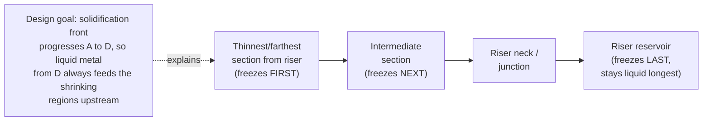

## Gating and Riser Design

### Overview

Gating and riser design constitute the engineering discipline of controlling how molten metal enters a mold cavity and how solidification shrinkage is compensated, respectively. A gating system is the network of channels that delivers molten metal from the pouring point into the mold cavity, while a riser (feeder) is a reservoir of molten metal designed to compensate for volumetric shrinkage during solidification. Both are critical to producing sound, defect-free castings and represent the difference between a successful casting and one riddled with porosity, misruns, or inclusions.

---

### Part 1: Gating System Design

#### Functions of a Gating System

1. Deliver molten metal to the mold cavity with minimal turbulence
2. Fill the cavity completely before solidification begins (avoid misruns/cold shuts)
3. Minimize air aspiration and oxide/gas entrainment
4. Trap slag, inclusions, and dross before they enter the cavity
5. Establish favorable thermal gradients to promote directional solidification toward risers
6. Minimize erosion of the mold/core surfaces

#### Elements of a Gating System

1. **Pouring basin (pouring cup)** — Receives metal from the ladle/pouring vessel; reduces turbulence and vortexing; may include a strainer core.
2. **Sprue** — Vertical channel conducting metal from the pouring basin down to the runner; tapered (larger at top, smaller at bottom) to remain full and prevent air aspiration as velocity increases with fall.
3. **Sprue well/base** — Enlarged cavity at the sprue base that reduces impact velocity and turbulence as metal turns to flow horizontally.
4. **Runner** — Horizontal channel distributing metal from the sprue to one or more gates; often trapezoidal in cross-section.
5. **Runner extension** — Short extension beyond the last ingate that traps the initial "dirty" metal (highest in oxides/slag) before it enters the casting.
6. **Ingate (gate)** — Final channel connecting the runner to the mold cavity; controls flow rate and entry velocity into the cavity.
7. **Skim bob / strainer core** — Trap inclusions and slag by flow-path design or filtration media.

#### Types of Gating Systems (by Ingate Location)

- **Top gating** — Metal enters at the top of the cavity; fast fill, favorable pressure-fed directional solidification (top-to-bottom), but causes turbulence, splashing, and mold erosion; suited for shallow, simple shapes.
- **Bottom gating** — Metal enters at the bottom and rises; minimizes turbulence and splashing (quiescent fill); but creates unfavorable thermal gradient (bottom solidifies first while it's hottest last... actually bottom metal cools while top remains hot, working against directional solidification toward a top riser) and risk of premature freezing at ingates for tall castings.
- **Parting-line gating** — Ingate at the parting plane; most common and practical compromise; moderate turbulence, easy pattern-making.
- **Step gating** — Multiple ingates at different heights, sequenced to fill progressively from bottom to top while minimizing turbulence at each level; used for tall castings requiring both quiescent fill and directional solidification.

#### Types of Gating Systems (by Flow Control / Pressure)

- **Pressurized gating system** — Total ingate area < total runner area < sprue exit area (i.e., area decreases toward the cavity, choking flow at the gates). System remains full ("choked") throughout pour, minimizing air aspiration; but higher gate velocities increase turbulence and erosion risk.
- **Unpressurized (naturally pressurized) gating system** — Total ingate area ≥ total runner area ≥ sprue exit area (i.e., area increases toward the cavity). Lower velocity at ingates reduces turbulence and erosion but risks the system running less than full, increasing air aspiration at the sprue.

Ratio notation, e.g., a 1:2:2 sprue:runner:gate ratio, is standard shorthand for area ratios used in system design; ratios are alloy- and process-specific and are typically selected from foundry engineering references or in-house standards. [Inference: specific numeric ratios vary considerably by alloy, casting geometry, and molding process, and should be treated as illustrative rather than universally prescriptive.]

#### Key Design Principles

**Sprue Design (Bernoulli-based sizing)**

The sprue is tapered to maintain a full, non-aspirating flow. Using Bernoulli's equation and continuity, the sprue exit area relative to the top area is:

$$\frac{A_2}{A_1} = \sqrt{\frac{h_1}{h_2}}$$

where $A_1, h_1$ are the top area and head height, and $A_2, h_2$ are the bottom area and total sprue height.

**Choke Area (Controls Fill Time)**

The smallest cross-sectional area in the gating system (the "choke," usually the ingate in a pressurized system) governs the volumetric flow rate:

$$Q = A_{choke} \cdot v = A_{choke}\sqrt{2gh}$$

where $Q$ is volumetric flow rate, $v$ is velocity at the choke, $g$ is gravitational acceleration, and $h$ is the effective metal head (sprue height, often corrected for basin geometry).

**Fill Time Requirement**

The fill/pouring time must be short enough to avoid premature solidification (misruns, cold shuts) but slow enough to avoid excessive turbulence and mold erosion. Empirical fill-time formulas (e.g., based on casting weight and section thickness) are commonly used:

$$t = K\sqrt{W}$$

where $t$ is pouring time, $W$ is casting weight, and $K$ is an empirical constant dependent on alloy and section thickness. [Inference: the specific form and constants of pouring-time formulas vary across foundry engineering references (e.g., different constants for steel vs. aluminum vs. cast iron); this is a representative general form, not a universal equation.]

**Gate Velocity Limits**

Ingate velocity is typically kept below a critical threshold (commonly cited around 0.5 m/s for aluminum alloys, higher for denser/less oxide-prone alloys such as gray iron) to avoid turbulent entrainment of air and oxide films. [Inference: critical velocity thresholds are alloy-specific and derived from experimental/empirical foundry data; values vary by source and alloy system.]

#### Common Gating-Related Defects

- **Misrun/cold shut** — Incomplete filling due to premature solidification (fill too slow or metal too cold)
- **Erosion/sand inclusion** — Excessive turbulence eroding mold/core walls
- **Air/gas entrainment porosity** — From aspirating or turbulent gating systems
- **Oxide film (dross) inclusions** — From turbulent, splashing fill exposing fresh metal surface to air repeatedly

---

### Part 2: Riser Design

#### Purpose

As metal solidifies, it contracts (liquid shrinkage, solidification shrinkage, and solid-state shrinkage). Risers are reservoirs of molten metal that remain liquid longer than the casting section they feed, supplying additional metal to compensate for solidification shrinkage and prevent shrinkage porosity/voids in the casting.

#### Requirements for an Effective Riser

1. **Solidifies later than the casting section it feeds** (directional solidification principle)
2. **Contains sufficient volume** of liquid metal to compensate for shrinkage
3. **Maintains a feeding channel** (neck) that stays open (liquid) long enough to feed metal
4. Is positioned to feed the **last-freezing regions** (hot spots) of the casting
5. Is **removable** without excessive cost/damage (risers are cut off and remelted as scrap/returns)

#### Types of Risers

- **Open (top) riser** — Open to atmosphere at the mold's cope surface; visible, allows feeding and observation, but loses heat readily (less feeding efficiency per unit volume).
- **Blind riser** — Fully enclosed within the mold (does not break the cope surface); more thermally efficient (retains heat better, smaller volume can feed effectively) since exposed surface area is reduced; often requires a vent or chill placement for control.
- **Side riser** — Attached to the side of the casting at the parting line.
- **Top riser** — Positioned directly above the casting section (often the thickest/heaviest section).

#### Chvorinov's Rule (Solidification Time)

Solidification time is governed by Chvorinov's rule, which relates solidification time to the ratio of casting volume to surface area:

$$t_s = C_m \left(\frac{V}{A}\right)^n$$

where $t_s$ is solidification time, $V$ is volume, $A$ is surface area (cooling surface), $C_m$ is the mold constant (dependent on mold material, metal properties, and pouring conditions), and $n$ is an empirical exponent (commonly taken as 2, though values between approximately 1.5–2 appear in various references depending on geometry and assumptions).

For a riser to solidify after the casting section it feeds, the riser's $V/A$ ratio must exceed that of the casting section — this is the foundational sizing principle:

$$\left(\frac{V}{A}\right)_{riser} > \left(\frac{V}{A}\right)_{casting}$$

In practice, a safety factor is applied (commonly the riser $V/A$ ratio is designed to exceed the casting section's by approximately 20–25%) to ensure the riser remains liquid with margin. [Inference: the specific safety factor is a matter of foundry engineering practice and varies by source, alloy, and risking method (e.g., Caine's method vs. modulus method vs. NRL/Wlodawer method).]

#### Riser Sizing Methods

1. **Chvorinov's Rule / Modulus Method** — Riser modulus ($M = V/A$) must exceed casting section modulus by a safety margin; widely used, straightforward.
2. **Caine's Method** — Empirical method relating riser volume ratio to freezing ratio using a hyperbolic relationship, calibrated from experimental casting data; historically used for steel castings.
3. **Naval Research Laboratory (NRL) Method** — Uses shape factor (surface area²/volume × length) charts to determine riser size; developed for steel castings.
4. **Wlodawer's Method** — Based on solidification time curves and directional solidification principles, commonly applied to steel and iron castings.

#### Feeding Distance and Directional Solidification

Beyond riser sizing, the **feeding distance** — how far a riser can effectively feed metal through the casting section before that path freezes shut — is critical. Feeding distance depends on:

- Section thickness (thicker sections feed farther)
- Alloy freezing range (short-freezing-range alloys feed more effectively over distance; long-freezing-range/mushy-freezing alloys are prone to dispersed micro-porosity that risers cannot fully eliminate)
- Use of **chills** (external or internal metal inserts) to locally accelerate cooling and redirect solidification fronts
- Use of **padding** (added wall thickness/taper) to create a favorable gradient toward the riser

**Directional solidification** — the principle that solidification should progress from the regions farthest from the riser toward the riser itself, so that liquid metal is always available to feed the shrinking regions — is the central design philosophy tying gating, risering, chilling, and padding together into a coherent casting design.

#### Riser Yield and Efficiency

Riser (feeding) efficiency is a major economic factor since riser metal is generally cut off and recycled, not sold as part of the casting:

$$\text{Casting Yield} = \frac{\text{Weight of casting}}{\text{Weight of casting} + \text{Weight of gating and risers}} \times 100\%$$

Higher yield reduces melting energy, cycle time, and cost per good casting. Techniques to improve yield include using blind risers, insulating/exothermic riser sleeves (which reduce required riser volume by slowing heat loss), and optimizing riser placement/number.

#### Insulating and Exothermic Riser Sleeves

Modern foundry practice widely uses **insulating sleeves** (low thermal conductivity refractory material) or **exothermic sleeves** (which chemically react to generate heat, keeping the riser liquid longer) placed around riser cavities. These reduce the required riser volume compared to plain sand risers for the same feeding effectiveness, directly improving casting yield. [Inference: specific yield improvement percentages vary by sleeve product, alloy, and casting geometry and are best obtained from sleeve manufacturer data for a specific application.]

#### Common Riser-Related Defects

- **Shrinkage porosity/pipe** — Riser undersized, improperly placed, or solidifies before the casting section it feeds
- **Riser not feeding a hot spot** — Isolated shrinkage cavity forms at a hot spot not connected to any riser's feeding path
- **Excessive scrap/low yield** — Oversized risers used as an overly conservative safety margin

---

### Illustration: Gating System Layout (svg_diagram)

<svg xmlns="http://www.w3.org/2000/svg" viewBox="0 0 640 420">
<text x="320" y="22" font-size="16" text-anchor="middle" font-family="Arial" font-weight="bold">Gating System Elements (svg_diagram)</text>

<polygon points="40,40 120,40 110,70 50,70" fill="none" stroke="black" stroke-width="2" />
<text x="20" y="30" font-size="11" font-family="Arial">Pouring basin</text>

<polygon points="70,70 90,70 82,220 78,220" fill="none" stroke="black" stroke-width="2" />
<text x="20" y="150" font-size="11" font-family="Arial">Sprue</text>

<ellipse cx="80" cy="225" rx="18" ry="8" fill="none" stroke="black" stroke-width="2" />
<text x="10" y="245" font-size="10" font-family="Arial">Sprue well</text>

<rect x="80" y="220" width="300" height="14" fill="none" stroke="black" stroke-width="2" />
<text x="160" y="215" font-size="11" font-family="Arial">Runner</text>
<rect x="380" y="220" width="30" height="14" fill="none" stroke="black" stroke-width="1" stroke-dasharray="3,2" />
<text x="385" y="255" font-size="9" font-family="Arial">Runner ext.</text>

<rect x="150" y="234" width="14" height="30" fill="none" stroke="black" stroke-width="2" />
<rect x="300" y="234" width="14" height="30" fill="none" stroke="black" stroke-width="2" />
<text x="140" y="280" font-size="10" font-family="Arial">Ingate</text>
<text x="290" y="280" font-size="10" font-family="Arial">Ingate</text>

<rect x="120" y="264" width="260" height="110" fill="none" stroke="black" stroke-width="3" />
<text x="230" y="325" font-size="13" font-family="Arial">Mold Cavity (Casting)</text>

<rect x="440" y="230" width="50" height="70" fill="none" stroke="black" stroke-width="2" />
<text x="430" y="220" font-size="11" font-family="Arial">Open riser</text>
<line x1="440" y1="265" x2="410" y2="290" stroke="black" stroke-width="1.5" stroke-dasharray="3,2" />
<text x="500" y="270" font-size="9" font-family="Arial">(feeds last-</text>
<text x="500" y="282" font-size="9" font-family="Arial">freezing region)</text>

<line x1="80" y1="230" x2="80" y2="228" stroke="black" stroke-width="1" />
</svg>

---

### Illustration: Directional Solidification Logic (Casting → Riser)

---

### Worked Example: Riser Sizing via Modulus Method

Given: A casting section is a plate with dimensions $200\,\text{mm} \times 150\,\text{mm} \times 25\,\text{mm}$.

**Step 1 — Casting section modulus:**

$$V = 200 \times 150 \times 25 = 750{,}000\ \text{mm}^3$$

Cooling surfaces (assuming top and bottom exposed, sides connected to gating/other sections — simplified to two dominant faces for illustration):

$$A \approx 2 \times (200 \times 150) = 60{,}000\ \text{mm}^2$$

$$M_{casting} = \frac{V}{A} = \frac{750{,}000}{60{,}000} = 12.5\ \text{mm}$$

**Step 2 — Required riser modulus (applying a 20% safety factor):**

$$M_{riser} \geq 1.2 \times M_{casting} = 1.2 \times 12.5 = 15\ \text{mm}$$

**Step 3 — Size a cylindrical riser** (height = diameter, $H = D$, a common proportion for cylindrical risers) with modulus $M = D/6$ (for a cylinder with $H=D$, cooling from the side and top only, blind riser approximation):

$$D = 6 \times M_{riser} = 6 \times 15 = 90\ \text{mm}$$

This gives an approximate riser diameter of 90 mm with matching height. [Inference: the modulus formula for a cylindrical riser depends on the assumed cooling surfaces (open vs. blind riser) and geometric proportions; this is a simplified illustrative calculation, and production riser design would be verified using solidification simulation software or established foundry riser design charts/tables.]

---

### **Related Topics**

- Chvorinov's rule and solidification time modeling
- Casting simulation software (mold filling and solidification simulation)
- Chills (external/internal) and padding techniques
- Continuous and centrifugal casting (comparison of feeding/solidification control)
- Shrinkage types: liquid, solidification, and solid-state shrinkage
- Sand casting process and mold/core making
- Casting defect analysis and root-cause diagnosis
- Riser sleeve materials: insulating vs. exothermic
- Casting yield optimization and cost engineering
- Solidification microstructure control (grain refinement, dendrite arm spacing)