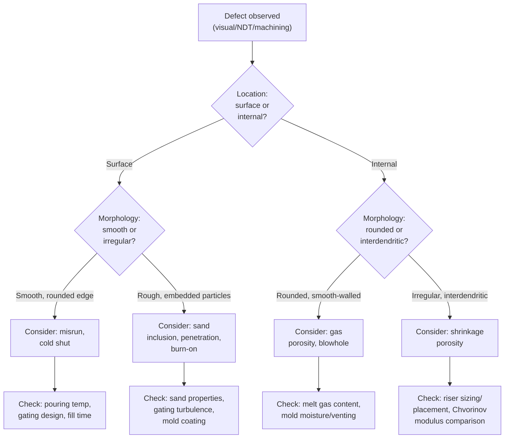

## Casting Defects and Their Prevention

### Overview

Casting defects are deviations from the intended shape, soundness, surface quality, or internal integrity of a casting, arising from deficiencies in mold/core design, metal quality, process parameters, or pattern equipment. Defect analysis is a core diagnostic discipline in foundry engineering: identifying a defect's characteristic morphology, correlating it to root cause(s), and applying corrective action in gating, risering, molding practice, or melt treatment. Defects are broadly classified by category: gas-related, shrinkage-related, mold/metal interaction, pouring metallurgy, mechanical/mold-related, and inclusion-related defects.

---

### Classification of Casting Defects

```mermaid
flowchart TD
    A["Casting Defects"] --> B["Gas Defects"]
    A --> C["Shrinkage Defects"]
    A --> D["Mold/Metal
    Interaction Defects"]
    A --> E["Pouring Metallurgy
    Defects"]
    A --> F["Mechanical/Mold-
    Related Defects"]
    A --> G["Inclusion Defects"]

    B --> B1["Blowholes"]
    B --> B2["Pinholes"]
    B --> B3["Gas porosity"]

    C --> C1["Shrinkage porosity"]
    C --> C2["Shrinkage cavity/pipe"]
    C --> C3["Hot tears"]

    D --> D1["Sand inclusion"]
    D --> D2["Metal penetration"]
    D --> D3["Burn-on/burn-in"]
    D --> D4["Veining"]

    E --> E1["Misrun"]
    E --> E2["Cold shut"]
    E --> E3["Slag/dross inclusion"]

    F --> F1["Mismatch/mold shift"]
    F --> F2["Swell"]
    F --> F3["Core shift"]
    F --> F4["Flash/fin"]

    G --> G1["Sand/slag inclusions"]
    G --> G2["Dross"]
    G --> G3["Oxide films"]
```

---

### 1. Gas Defects

#### Blowholes

**Description:** Large, smooth-walled, spherical or elongated cavities, typically found near the casting surface or subsurface, formed by entrapped gas that could not escape before solidification.

**Causes:**

- Excess moisture in sand mold (steam generation)
- Low mold/core permeability (gas cannot vent)
- Inadequate venting
- High mold gas-forming content (binders, additives)
- Poor gating design causing air entrapment

**Prevention:**

- Control sand moisture content within specification
- Ensure adequate mold/core permeability and venting (vent holes, chaplets with vent paths)
- Use gating systems designed to minimize air aspiration (see gating design principles)
- Bake/cure cores properly to remove volatile binder components

#### Pinholes

**Description:** Fine, small, often widely distributed gas holes, generally below the surface, frequently associated with dissolved gas (e.g., hydrogen in aluminum or steel) rejected during solidification.

**Causes:**

- Dissolved gas in the melt (hydrogen pickup from moisture, furnace atmosphere, or scrap contamination)
- Insufficient degassing prior to pouring
- Reaction between the molten metal and mold/core gases

**Prevention:**

- Melt degassing (e.g., rotary degassing with inert gas for aluminum alloys; vacuum degassing for steel)
- Control furnace atmosphere and charge material cleanliness
- Reduce mold/core moisture and gas-forming constituents
- Apply appropriate fluxing practice

#### Gas Porosity (General Dissolved-Gas Porosity)

**Description:** Dispersed, often rounded micro-porosity distributed through a casting section, distinct from shrinkage porosity by its more rounded, smooth-walled morphology (versus shrinkage porosity's irregular, interdendritic morphology) — though the two frequently coexist and can be difficult to distinguish without microscopy.

**Prevention:** Same as pinhole prevention — melt cleanliness, degassing, controlled solidification rate.

---

### 2. Shrinkage Defects

#### Shrinkage Porosity

**Description:** Irregular, interdendritic voids formed in the last-freezing regions of a casting where insufficient liquid metal was available to compensate for solidification shrinkage.

**Causes:**

- Inadequate riser size, number, or placement
- Riser solidifies before the casting section it feeds (violates Chvorinov's rule sizing requirement)
- Isolated hot spots not fed by any riser
- Long-freezing-range alloys prone to mushy-zone (dispersed) porosity

**Prevention:**

- Correct riser sizing using modulus method or equivalent (see riser design principles)
- Apply chills to promote directional solidification and eliminate isolated hot spots
- Use padding to create favorable feeding gradients
- Employ insulating/exothermic riser sleeves to extend riser feeding life
- For long-freezing-range alloys, consider pressure feeding or alternative process controls

#### Shrinkage Cavity / Pipe

**Description:** A concentrated, often funnel-shaped void, typically at or near the top of a casting or riser, from unfed volumetric contraction during solidification.

**Causes:** Same as shrinkage porosity but concentrated rather than dispersed — often indicates the riser itself was undersized or the feeding path froze shut early.

**Prevention:** Same as shrinkage porosity prevention.

#### Hot Tears (Hot Cracks)

**Description:** Irregular, often intergranular cracks that form at high temperature, while the casting is still partially in the mushy (semi-solid) state, due to restrained contraction during solidification.

**Causes:**

- Mold/core restraint preventing free contraction (e.g., hard sand cores, sharp internal corners)
- Poor casting design with abrupt section changes
- Alloys with wide freezing range and low high-temperature strength
- Excessive pouring temperature increasing thermal gradient severity

**Prevention:**

- Design generous fillets/radii at section junctions to reduce stress concentration
- Use collapsible core/mold materials or additives that break down under thermal stress
- Avoid abrupt cross-section changes
- Control pouring temperature and cooling rate
- Alloy modification (grain refinement, minor alloying adjustments) where applicable

---

### 3. Mold/Metal Interaction Defects

#### Sand Inclusion / Dirt

**Description:** Embedded particles of sand or mold material in the casting surface or subsurface.

**Causes:** Mold/core erosion from turbulent gating, weak mold surface (low strength), poor mold handling.

**Prevention:** Reduce gating turbulence (unpressurized gating, controlled velocity), increase mold/core surface strength (proper ramming/compaction, appropriate binder content), careful mold handling and closing practice.

#### Metal Penetration

**Description:** Molten metal infiltrates the pore spaces between sand grains, producing a rough, metal-impregnated surface layer that is difficult to remove.

**Causes:** Coarse sand grain size, low mold compaction/density, excessive metal head pressure, high pouring temperature, inadequate mold coating/wash.

**Prevention:** Use finer sand grain size or higher-density ramming, apply refractory mold coatings/washes, control pouring temperature and metallostatic head.

#### Burn-On / Burn-In

**Description:** A fused layer of sand and metal (or metal oxide) adhering strongly to the casting surface, more severe and adherent than simple sand inclusion.

**Causes:** Excessive pouring temperature, inadequate mold refractoriness or coating, prolonged contact time between hot metal and mold wall.

**Prevention:** Apply appropriate refractory coatings, control pouring temperature, improve mold material refractoriness for high-temperature alloys.

#### Veining

**Description:** Thin, raised fins of metal on the casting surface, following the pattern of sand mold/core cracks, caused by molten metal penetrating cracks formed in the mold/core from thermal expansion of the sand (particularly with silica sand near its phase transformation temperatures).

**Causes:** Silica sand thermal expansion/phase transformation, inadequate additives to control sand expansion.

**Prevention:** Use additives (e.g., wood flour, cellulose) to cushion sand expansion, use alternative sand systems (e.g., chromite, zircon sand with lower/more uniform thermal expansion) for critical applications.

---

### 4. Pouring Metallurgy / Fluidity Defects

#### Misrun

**Description:** Incomplete filling of the mold cavity, leaving a portion of the casting missing, with a characteristically smooth, rounded, premature-freezing edge at the incomplete region.

**Causes:**

- Insufficient metal fluidity (low pouring temperature, alloy composition)
- Section too thin relative to alloy's fluidity/freezing characteristics
- Inadequate gating (slow fill rate, undersized runners/gates)
- Low metallostatic pressure/head

**Prevention:**

- Increase pouring temperature within safe limits
- Redesign gating for faster, more complete fill (larger choke area, optimized ingate placement)
- Increase section thickness where feasible in design
- Verify alloy fluidity characteristics match section thickness requirements

#### Cold Shut

**Description:** A discontinuity or visible line/seam where two streams of metal met but did not fully fuse, due to premature solidification of the leading edges before they merged.

**Causes:** Similar to misrun — low pouring temperature, slow fill, multiple gating streams that solidify before merging, excessive distance between ingates.

**Prevention:** Same as misrun — optimize pouring temperature, fill rate, and ingate placement/spacing; consider single-gate designs for smaller castings.

#### Slag/Dross Inclusion

**Description:** Non-metallic inclusions (oxides, slag) entrapped within the casting, often visible as dark, irregular inclusions on machined or fractured surfaces.

**Causes:** Inadequate slag/dross skimming before pouring, turbulent gating re-entraining oxide films, absence of filtration in the gating system.

**Prevention:** Effective slag skimming practice, use of pouring basin strainer cores or ceramic foam filters in the gating system, unpressurized/quiescent gating design, proper degassing and fluxing.

---

### 5. Mechanical / Mold-Related Defects

#### Mismatch (Mold Shift)

**Description:** Misalignment between the cope and drag halves of the mold, producing a step or offset at the parting line.

**Causes:** Worn or damaged pattern equipment, improper mold assembly/alignment (locating pins, clamping).

**Prevention:** Maintain pattern and mold-box tooling condition, verify alignment pins/guides, proper mold clamping procedure.

#### Swell

**Description:** Localized or overall enlargement of the casting dimensions beyond the mold cavity, due to mold wall movement under metallostatic pressure.

**Causes:** Insufficient mold ramming density/strength, excessive metallostatic pressure (tall sprues, large castings), inadequate mold/flask rigidity.

**Prevention:** Increase mold compaction, use adequate flask rigidity and weighting/clamping, control pouring height/pressure.

#### Core Shift

**Description:** Displacement of a core from its intended position, producing uneven wall thickness.

**Causes:** Inadequate core print design, insufficient chaplets/supports, core buoyancy in molten metal (core lighter than displaced metal, causing upward float).

**Prevention:** Proper core print sizing and fit, adequate chaplet placement to resist buoyancy forces, core weight/density verification relative to alloy density.

#### Flash / Fin

**Description:** Thin, unwanted projections of metal at the parting line or core joints, from metal entering gaps between mold/core sections.

**Causes:** Worn pattern/core box equipment, insufficient clamping force, poor mold/core fit.

**Prevention:** Tooling maintenance, adequate clamping force, quality core-box and pattern fit tolerances.

---

### Root Cause Correlation Table

| Defect | Primary Root Cause Category | Key Prevention Lever |
| --- | --- | --- |
| Blowhole | Gas evolution / venting | Mold permeability, moisture control, venting |
| Pinhole | Dissolved gas in melt | Degassing, melt cleanliness |
| Shrinkage porosity/pipe | Inadequate feeding | Riser sizing, chills, padding |
| Hot tear | Restrained contraction | Fillet design, mold collapsibility |
| Sand inclusion | Mold erosion | Gating turbulence control, mold strength |
| Metal penetration | High head/coarse sand | Sand fineness, mold coating |
| Veining | Sand thermal expansion | Additives, alternative sand |
| Misrun/cold shut | Insufficient fluidity/fill | Pouring temperature, gating redesign |
| Slag/dross inclusion | Poor melt cleanliness | Skimming, filtration, quiescent gating |
| Mismatch | Tooling/alignment | Pattern maintenance, alignment checks |
| Core shift | Buoyancy/support | Chaplets, core print design |

---

### Diagnostic Approach: Defect Investigation Sequence

---

### Non-Destructive Testing (NDT) for Defect Detection

- **Visual inspection** — Surface defects (cold shuts, misruns, flash, mismatch)
- **Dye penetrant testing (PT)** — Surface-breaking cracks and porosity
- **Magnetic particle testing (MT)** — Surface/near-surface defects in ferromagnetic castings
- **Radiographic testing (RT)** — Internal porosity, shrinkage cavities, inclusions
- **Ultrasonic testing (UT)** — Internal discontinuities, particularly in thick sections
- **Pressure/leak testing** — For pressure-retaining castings (valve bodies, pump housings) to detect interconnected porosity

---

### Prevention Strategy Summary

Effective defect prevention integrates multiple foundry engineering disciplines rather than treating defects as isolated problems:

1. **Casting design** — Uniform wall thickness, generous fillets, avoidance of isolated heavy sections (hot spots)
2. **Gating design** — Controlled fill velocity and turbulence (see gating design principles), adequate choke sizing for fill time
3. **Riser design** — Modulus-based sizing with adequate safety margin, correct placement relative to hot spots (see riser design principles)
4. **Melt quality control** — Degassing, fluxing, inclusion filtration, chemistry control
5. **Mold/core quality control** — Sand properties (permeability, strength, moisture, grain fineness), proper compaction, adequate venting
6. **Process parameter control** — Pouring temperature, pouring rate, mold/metal temperature differential
7. **Simulation-based validation** — Modern foundries increasingly use casting simulation software (mold filling and solidification analysis) to predict defect-prone regions before tooling is committed, reducing costly trial-and-error iteration. [Inference: adoption levels and specific simulation tool capabilities vary by foundry and are not universal across the industry.]

---

### **Related Topics**

- Gating and riser design (feeding and fill control fundamentals)
- Continuous and centrifugal casting (defect modes specific to these processes)
- Sand casting fundamentals (mold/core making, sand properties)
- Solidification theory: nucleation, dendritic growth, freezing range
- Non-destructive testing methods in foundry quality control
- Casting simulation and solidification modeling software
- Chills and padding for directional solidification control
- Alloy fluidity and its influence on castability
- Melt treatment: degassing, fluxing, inoculation, modification
- Statistical process control (SPC) in foundry quality management