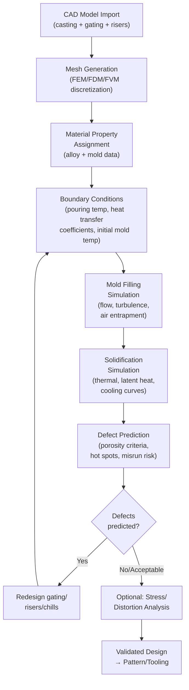

## Solidification Simulation for Casting

### Overview

Solidification simulation is the computational modeling of mold filling and metal solidification behavior to predict defect formation, optimize gating/riser design, and validate casting process parameters before physical tooling is committed. It applies numerical methods (finite element, finite difference, or finite volume) to solve heat transfer, fluid flow, and phase transformation equations governing the casting process, enabling foundries to virtually iterate designs and reduce costly trial-and-error prototyping.

---

### Purpose and Value Proposition

1. **Defect prediction** — Identify shrinkage porosity, misrun, cold shut, and hot spot locations before pouring metal
2. **Gating/riser optimization** — Virtually test and refine gating systems and riser placement/sizing without cutting new patterns
3. **Process parameter validation** — Evaluate pouring temperature, fill rate, and cooling conditions
4. **Reduced lead time and cost** — Fewer physical trial castings needed to reach a validated design
5. **Microstructure prediction** — Some advanced solvers predict grain structure, dendrite arm spacing, and resulting mechanical properties
6. **Distortion and residual stress prediction** — Thermal-mechanical coupled solvers can predict warpage and residual stress from non-uniform cooling

---

### Governing Physics

#### Heat Transfer (Core Governing Equation)

Solidification simulation fundamentally solves the transient heat conduction equation with a latent heat source term (to account for the heat released during phase change):

$$\rho c_p \frac{\partial T}{\partial t} = \nabla \cdot (k \nabla T) + \dot{Q}_L$$

where $\rho$ is density, $c_p$ is specific heat, $T$ is temperature, $t$ is time, $k$ is thermal conductivity, and $\dot{Q}_L$ is the latent heat release rate during the liquid-to-solid phase transformation.

#### Latent Heat Handling

Since the phase change occurs over a temperature range (for alloys with a freezing range) or at a single point (for pure metals/eutectics), simulation codes commonly use:

- **Enthalpy method** — Reformulates the governing equation in terms of enthalpy ($H$) rather than temperature alone, naturally incorporating latent heat release without needing to track the phase boundary explicitly.
- **Effective specific heat method** — Adds an artificially elevated specific heat over the freezing range to represent latent heat release, an approximation that is computationally simpler but less rigorous than the enthalpy method.

#### Fluid Flow (Mold Filling)

Mold filling simulation solves the Navier-Stokes equations coupled with a free-surface tracking method to model the advancing metal front:

$$\rho\left(\frac{\partial \vec{v}}{\partial t} + \vec{v}\cdot\nabla \vec{v}\right) = -\nabla p + \mu \nabla^2 \vec{v} + \rho \vec{g}$$

where $\vec{v}$ is velocity, $p$ is pressure, $\mu$ is dynamic viscosity, and $\vec{g}$ is gravitational acceleration. Free-surface tracking commonly uses:

- **Volume of Fluid (VOF) method** — Tracks the fraction of each computational cell occupied by metal versus air; widely used in commercial mold-filling codes due to robustness and mass conservation.
- **Level-set method** — Tracks the interface as a zero-level contour of a signed distance function; offers smoother interface representation but is less commonly the default in commercial foundry codes.

#### Shrinkage/Porosity Prediction Criteria

Since directly simulating microscopic pore nucleation and growth is computationally prohibitive for full-casting-scale models, most commercial codes use empirical or semi-empirical **porosity/feeding criteria functions** applied to the solidification results, such as:

- **Niyama criterion** — A widely used empirical criterion for predicting centerline/microporosity susceptibility in the final stages of solidification, defined as:

$$Ny = \frac{G}{\sqrt{\dot{T}}}$$

where $G$ is the local temperature gradient and $\dot{T}$ is the local cooling rate at a reference temperature near the end of solidification. Regions where $Ny$ falls below a critical (alloy-dependent) threshold are flagged as porosity-prone, since a low gradient combined with a high cooling rate indicates poor feeding access in the mushy zone. [Inference: critical Niyama threshold values are alloy- and process-specific and are typically calibrated against experimental casting trials for a given foundry's practice.]

- **Feeding resistance / hot spot identification** — Algorithms that identify isolated liquid "pools" that become disconnected from feeding paths (risers) during solidification, flagging them as shrinkage-prone.

---

### Typical Simulation Workflow

#### Step Details

1. **CAD import and geometry preparation** — Import casting geometry along with the proposed gating system, risers, chills, and cores; repair/simplify geometry as needed for meshing.
2. **Mesh generation** — Discretize the domain into elements/cells (tetrahedral or hexahedral for FEM; structured/unstructured grids for FVM/FDM); mesh density directly affects accuracy and computation time, with finer meshes required near thin sections and expected hot-spot regions.
3. **Material property assignment** — Assign temperature-dependent thermophysical properties for the alloy (density, thermal conductivity, specific heat, latent heat, liquidus/solidus temperatures, viscosity) and the mold/core material (thermal conductivity, heat capacity), typically drawn from material property databases within the simulation software or user-supplied experimental data.
4. **Boundary condition definition** — Set pouring temperature, mold initial temperature, interfacial heat transfer coefficients (metal-mold, metal-air), and environmental conditions.
5. **Mold filling simulation** — Solve fluid flow equations to predict filling pattern, air entrapment, and turbulence-related defect risk during the pour.
6. **Solidification simulation** — Solve transient heat transfer with latent heat to compute cooling curves, solidification time, and temperature gradients throughout the casting.
7. **Defect prediction** — Apply porosity criteria functions, identify hot spots and isolated liquid regions, predict misrun/cold shut risk from filling results.
8. **Iterative redesign** — Modify gating, riser size/placement, chill locations, or process parameters and re-simulate until defects are minimized or eliminated.
9. **Optional coupled analyses** — Stress/distortion simulation (thermal-mechanical coupling) for residual stress and warpage prediction; microstructure simulation for grain size and mechanical property prediction.

---

### Numerical Methods Comparison

| Method | Basis | Typical Use | Characteristics |
| --- | --- | --- | --- |
| Finite Difference Method (FDM) | Structured grid, Taylor series discretization | Early/simpler codes; structured Cartesian meshes | Computationally efficient, less flexible for complex geometry |
| Finite Element Method (FEM) | Weighted residual over discretized elements | General-purpose casting simulation (filling + solidification) | Handles complex geometry well, widely used in commercial codes |
| Finite Volume Method (FVM) | Conservation form over control volumes | CFD-heavy applications (filling, turbulence) | Strong conservation properties, common in filling simulation |

---

### Commercial and Research Simulation Tools

Widely referenced commercial casting simulation packages include tools such as MAGMASOFT, ProCAST, FLOW-3D CAST, NovaFlow&Solid, SOLIDCast, and AnyCasting, among others, each offering mold filling, solidification, defect prediction, and (in varying degrees) stress/microstructure modules. [Unverified: specific current feature sets, licensing models, and market positioning of individual commercial packages change over time; readers should consult vendor documentation for current capabilities rather than relying on a fixed description here.] Open-source and research-oriented tools (e.g., OpenFOAM-based casting solvers, academic FEM codes) are also used in research settings, typically requiring more manual setup of material models and boundary conditions than commercial packages.

---

### Key Input Data Requirements

1. **Thermophysical properties** — Temperature-dependent density, thermal conductivity, specific heat, latent heat of fusion, liquidus/solidus temperatures (or full solidification path for alloys, often from CALPHAD-based thermodynamic databases)
2. **Rheological properties** — Viscosity of the liquid metal (for filling simulation)
3. **Interfacial heat transfer coefficients (IHTC)** — Metal-mold and metal-air heat transfer coefficients, often the most significant source of simulation uncertainty since they depend on mold coating, air gap formation, and casting-specific contact conditions [Inference: IHTC values are frequently calibrated empirically for a given foundry's mold materials and coatings rather than taken as fixed literature constants, since air-gap formation dynamics are process-specific]
4. **Mold/core material properties** — Thermal conductivity, density, specific heat of sand, permanent mold, or die material
5. **Process parameters** — Pouring temperature, pouring time/rate, initial mold temperature, ambient conditions

---

### Validation and Calibration

Simulation results require validation against physical trials to build confidence in a foundry's specific process parameters:

- **Thermocouple instrumentation** — Embedding thermocouples in trial castings/molds to compare predicted vs. actual cooling curves
- **Radiographic/CT comparison** — Comparing predicted porosity location/severity against X-ray or CT-scanned trial castings
- **Sectioning and metallography** — Physical sectioning to verify predicted defect locations and microstructure
- **Iterative IHTC calibration** — Adjusting interfacial heat transfer coefficients until simulated cooling curves match measured data, since this parameter carries substantial uncertainty

---

### Applications Beyond Defect Prediction

1. **Microstructure and property prediction** — Coupled models predicting grain size, dendrite arm spacing (DAS), and correlating to mechanical properties (via empirical Hall-Petch-type or DAS-property relationships)
2. **Stress and distortion analysis** — Thermal-mechanical coupled simulation predicting residual stress, hot tearing risk, and dimensional distortion from non-uniform cooling
3. **Segregation prediction** — Macrosegregation modeling (e.g., in large steel ingots or continuous casting) using coupled solidification and solute transport models
4. **Die casting-specific simulation** — High-pressure die casting simulation additionally models fast-fill turbulent flow, air entrapment in the shot sleeve, and die thermal cycling
5. **Investment casting simulation** — Includes shell mold thermal behavior and wax pattern burnout considerations

---

### Limitations and Practical Considerations

- **Computational cost** — Fine-mesh, coupled filling-solidification-stress simulations of large or complex castings can require substantial computation time, though this is offset against the cost of physical trial iterations
- **Input data uncertainty** — Material property data (especially at high temperature, and IHTC values) is often the largest source of prediction error, more so than numerical method choice
- **Model does not replace physical validation** — Simulation is a design aid to reduce trial-and-error iterations, not a substitute for final physical casting trials and inspection, particularly for critical/safety components
- **User expertise dependency** — Meaningful interpretation of results (distinguishing genuine defect risk from meshing artifacts, setting realistic boundary conditions) requires foundry process knowledge in addition to software proficiency

---

### Illustration: Simulation-Predicted Cooling Curve and Porosity Risk (svg_diagram)

<svg xmlns="http://www.w3.org/2000/svg" viewBox="0 0 640 380">
<text x="320" y="22" font-size="16" text-anchor="middle" font-family="Arial" font-weight="bold">Cooling Curve with Latent Heat Plateau (svg_diagram)</text>

<line x1="70" y1="320" x2="580" y2="320" stroke="black" stroke-width="2" />
<line x1="70" y1="320" x2="70" y2="50" stroke="black" stroke-width="2" />
<text x="320" y="355" font-size="12" text-anchor="middle" font-family="Arial">Time</text>
<text x="30" y="185" font-size="12" font-family="Arial" transform="rotate(-90 30,185)">Temperature</text>

<path d="M 90,70 L 200,160 L 220,175 L 380,180 L 400,195 L 560,290" fill="none" stroke="black" stroke-width="2.5" />

<line x1="70" y1="160" x2="580" y2="160" stroke="gray" stroke-width="1" stroke-dasharray="4,3" />
<text x="585" y="164" font-size="10" font-family="Arial">Liquidus</text>
<line x1="70" y1="195" x2="580" y2="195" stroke="gray" stroke-width="1" stroke-dasharray="4,3" />
<text x="585" y="199" font-size="10" font-family="Arial">Solidus</text>

<rect x="220" y="175" width="160" height="20" fill="#dddddd" opacity="0.5" />
<text x="230" y="215" font-size="11" font-family="Arial">Latent heat release</text>
<text x="230" y="228" font-size="11" font-family="Arial">(mushy zone / freezing range)</text>

<text x="420" y="260" font-size="10" font-family="Arial">Steep slope near end of</text>

<text x="420" y="273" font-size="10" font-family="Arial">solidification → high cooling</text>

<text x="420" y="286" font-size="10" font-family="Arial">rate → check Niyama criterion</text>

</svg>

---

### Worked Example: Interpreting a Niyama Result

Given: A simulation reports, at a suspect region near the final solidification point, a temperature gradient $G = 0.8\ \text{K/mm}$ and a cooling rate $\dot{T} = 0.05\ \text{K/s}$.

$$Ny = \frac{G}{\sqrt{\dot{T}}} = \frac{0.8}{\sqrt{0.05}} = \frac{0.8}{0.224} \approx 3.58\ \text{K}^{0.5}\text{min}^{0.5}/\text{mm (units per convention used)}$$

If the foundry's calibrated critical Niyama threshold for this alloy (from prior correlation with sectioned/radiographed trial castings) is, for example, $Ny_{crit} \approx 1.0$–$2.0$ in the same units, a computed value of 3.58 would generally indicate low porosity risk at this location, since it comfortably exceeds the critical threshold. [Inference: this is an illustrative numerical example; actual critical Niyama values, their units, and their alloy-specific calibration must come from the specific simulation software's documentation and the foundry's own validated correlation data, as conventions for Niyama units and thresholds vary between software packages and literature sources.]

---

### **Related Topics**

- Gating and riser design (the design output that simulation validates)
- Casting defects and their prevention (the defect modes simulation predicts)
- Chvorinov's rule and solidification time fundamentals
- Continuous and centrifugal casting (process-specific simulation considerations)
- CALPHAD and thermodynamic databases for alloy property generation
- Microstructure simulation: dendrite arm spacing and grain structure prediction
- Residual stress and distortion analysis in castings
- Interfacial heat transfer coefficient (IHTC) determination methods
- Die casting and investment casting process-specific simulation
- Statistical/Design-of-Experiments (DOE) approaches combined with simulation for process optimization