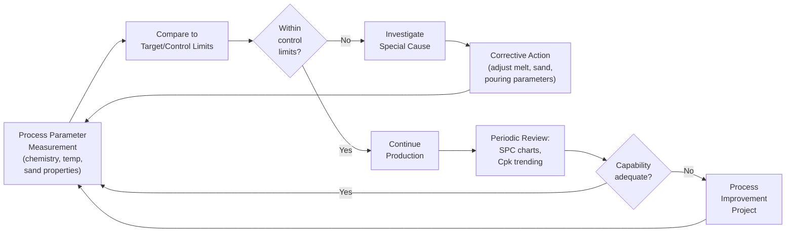

## Foundry Process Control

### Overview

Foundry process control encompasses the systems, methods, and metrics used to monitor, regulate, and continuously improve casting production processes — from raw material receiving and melting through molding, pouring, cleaning, and final inspection. Unlike design-stage activities (gating/riser design, simulation), process control operates during production, ensuring that castings consistently meet dimensional, metallurgical, and soundness specifications while minimizing scrap, rework, and energy/material waste. It integrates statistical methods, sensor-based monitoring, standardized procedures, and quality management systems.

---

### Scope of Foundry Process Control

```mermaid
flowchart TD
    A["Foundry Process Control"] --> B["Melt Quality
    Control"]
    A --> C["Molding/Core-
    Making Control"]
    A --> D["Pouring Process
    Control"]
    A --> E["Post-Cast
    Processing Control"]
    A --> F["Quality Systems &
    Statistical Control"]

    B --> B1["Chemistry
    (spectrometry)"]
    B --> B2["Temperature
    monitoring"]
    B --> B3["Inoculation/
    modification control"]
    B --> B4["Gas content
    (degassing verification)"]

    C --> C1["Sand properties
    (moisture, strength,
    permeability)"]
    C --> C2["Compaction/
    density control"]
    C --> C3["Core dimensional
    and strength QC"]

    D --> D1["Pouring temperature"]
    D --> D2["Pouring rate/time"]
    D --> D3["Ladle metallurgy
    timing"]

    E --> E1["Shakeout timing"]
    E --> E2["Heat treatment
    control"]
    E --> E3["Cleaning/fettling
    inspection"]

    F --> F1["SPC charts"]
    F --> F2["NDT/dimensional
    inspection"]
    F --> F3["Traceability &
    documentation"]
```

---

### 1. Melt Quality Control

#### Chemical Composition Control

Molten metal chemistry is verified using **optical emission spectrometry (OES)** for ferrous and most non-ferrous alloys, providing rapid multi-element analysis from a sample "chill disc" poured and solidified for testing. Results are compared against specified alloy composition ranges before tapping/pouring proceeds. Thermal analysis (cooling curve analysis) is also widely used, particularly for cast iron, to infer carbon equivalent, inoculation response, and graphite morphology tendency from characteristic features of the solidification cooling curve.

#### Temperature Monitoring

Melt temperature is monitored at multiple stages (furnace, ladle, pouring point) using:

- **Immersion thermocouples** (contact, consumable-tip probes for periodic spot checks)
- **Continuous/permanent thermocouples** in furnace linings
- **Optical/infrared pyrometry** for non-contact temperature reading, particularly at the pouring stream

Maintaining pouring temperature within a controlled window (alloy- and casting-geometry-dependent) is critical, since excessive superheat increases gas pickup, oxidation, and mold erosion risk, while insufficient temperature causes misruns and cold shuts (see casting defects).

#### Degassing and Cleanliness Verification

For aluminum alloys, hydrogen content is commonly verified via:

- **Reduced Pressure Test (RPT)** — A metal sample solidifies under vacuum; resulting porosity level indicates dissolved hydrogen content
- **First-bubble/immersion hydrogen probes** — In-line sensors providing real-time hydrogen readings
- **K-mold or similar fracture test methods** — Visual/fracture assessment of gas and inclusion content

For steel, vacuum degassing units (VD, VOD, RH degassing) include process instrumentation (vacuum level, temperature, time) as integral control parameters.

#### Inoculation and Modification Control

For cast iron, inoculant addition (to promote graphite nucleation and control chill tendency) and, for ductile iron, magnesium treatment (nodularization) require tight control of addition rate, timing, and fade (the decay of inoculation effectiveness over time after treatment). Process control verifies nodularity/graphite form via thermal analysis or metallographic sampling. For aluminum-silicon alloys, modification (e.g., strontium or sodium addition to refine eutectic silicon morphology) is similarly monitored.

---

### 2. Molding and Core-Making Control

#### Sand Properties (Green Sand Systems)

Green sand molding requires continuous monitoring of:

- **Moisture content** — Typically controlled within a narrow target band (excess moisture causes gas defects; insufficient moisture reduces mold strength)
- **Compactability** — Measures sand's response to standardized compaction, correlating with moldability
- **Green compressive strength** — Verifies mold will withstand handling and metallostatic pressure without swell/erosion
- **Permeability** — Ensures adequate gas venting capacity (see blowhole prevention)
- **Clay (active clay) content and Loss on Ignition (LOI)** — Track binder system condition and organic/volatile content in systems using bentonite and carbonaceous additives

Automated sand testing stations (often integrated into muller/mixer control loops) sample and test return sand continuously, with automatic water and additive dosing adjustments to maintain target properties — a common form of closed-loop process control in high-volume green sand foundries.

#### Chemically Bonded Sand/Core Systems

For no-bake, cold-box, and shell processes, control parameters include:

- Resin/catalyst ratio and mixing accuracy
- Strip time (time to adequate strength for handling)
- Ambient temperature/humidity effects on cure rate
- Core dimensional verification (coordinate measurement or optical scanning)
- Core strength testing (tensile/transverse strength specimens)

#### Compaction and Density Control

Mold hardness testing (e.g., B-scale mold hardness testers) and, in automated molding lines, direct compaction pressure/density sensors verify consistent mold rigidity, reducing swell and dimensional variation defects (see casting defects).

---

### 3. Pouring Process Control

#### Pouring Temperature and Rate

As noted under melt control, pouring temperature is monitored at or near the point of pour. Pouring rate/time is controlled via:

- Manual ladle operator training and standardized procedures
- Automated pouring systems (stopper-rod ladles, tilt pouring, robotic pouring) providing repeatable, programmable fill profiles
- Pour weight/volume monitoring (load cells on ladles) to verify correct metal quantity per mold

#### Automated and Robotic Pouring

Many modern foundries employ automated pouring systems that control ladle tilt rate, stream position, and pour duration according to a programmed profile calibrated to the gating system design, improving pour-to-pour consistency compared to manual pouring and reducing operator-dependent variation in fill rate and turbulence. [Inference: the degree of automation varies substantially by foundry scale and product type; smaller job-shop foundries commonly retain manual pouring while high-volume production foundries more often invest in automated systems.]

---

### 4. Post-Cast Processing Control

#### Shakeout Timing

Shakeout (mold/casting separation) timing affects casting microstructure (cooling rate in the mold versus in air) and residual stress; premature shakeout of thin sections can risk distortion or cracking while metal is still at elevated temperature.

#### Heat Treatment Control

Where specified, heat treatment furnace control (temperature uniformity, time-at-temperature, quench severity/timing) is verified via:

- Furnace temperature uniformity surveys (thermocouple mapping)
- Load thermocouples embedded in representative castings during production runs
- Hardness testing to verify resulting mechanical properties

#### Cleaning, Fettling, and Finishing Inspection

Removal of gating/risers, grinding, shot blasting, and surface finishing operations include inspection checkpoints (visual, dimensional) before castings proceed to final inspection.

---

### 5. Statistical Process Control (SPC) and Quality Systems

#### Control Charts

SPC applies statistical control charts to key process variables (pouring temperature, sand moisture, chemistry deviation from target, dimensional measurements) to distinguish common-cause (inherent process) variation from special-cause (assignable) variation requiring intervention. Common chart types include:

- **X-bar and R charts** — Monitor process mean and range for continuous variables (e.g., pouring temperature)
- **p-charts** — Monitor defect/reject rate proportions (e.g., scrap rate per shift/batch)
- **c-charts** — Monitor defect counts per unit (e.g., porosity indications per casting)

#### Process Capability

Process capability indices ($C_p$, $C_{pk}$) quantify how well a controlled process meets specification tolerances:

$$C_{pk} = \min\left(\frac{USL - \bar{x}}{3\sigma}, \frac{\bar{x} - LSL}{3\sigma}\right)$$

where $USL$/$LSL$ are the upper/lower specification limits, $\bar{x}$ is the process mean, and $\sigma$ is the process standard deviation. Higher $C_{pk}$ values indicate a process is well-centered and has low variation relative to specification width; foundries commonly target $C_{pk}$ values above an internally-set threshold (often 1.33 or higher in many manufacturing quality systems) for critical dimensional or metallurgical characteristics. [Inference: specific target $C_{pk}$ thresholds are set by individual quality systems/customer requirements and are not universal across all foundries or applications.]

#### Non-Destructive and Dimensional Inspection Integration

Process control extends into final inspection via:

- Radiographic/ultrasonic testing for internal soundness (see casting defects)
- Coordinate measuring machines (CMM) or 3D optical scanning for dimensional verification against CAD models
- Statistical sampling plans (e.g., based on AQL — Acceptable Quality Level standards) determining inspection frequency/sample size

#### Traceability and Documentation

Quality management systems (commonly aligned with ISO 9001 and industry-specific standards such as IATF 16949 for automotive castings, or API/ASME standards for pressure-retaining components) require heat/batch traceability linking each casting back to melt chemistry records, mold/core batch data, and process parameters — essential for root-cause investigation when defects are discovered and for regulatory/customer compliance in critical applications. [Unverified: specific standard applicability depends on the casting's end-use industry and customer contractual requirements; this list is illustrative of commonly referenced standards, not exhaustive.]

---

### Process Control Feedback Loop

---

### Key Process Control Metrics Summary

| Process Stage | Key Metric(s) | Typical Monitoring Method |
| --- | --- | --- |
| Melting | Chemistry, temperature, gas content | OES spectrometry, thermocouples, RPT/hydrogen probes |
| Molding/Core-making | Moisture, compactability, strength, permeability | Automated sand test stations, mold hardness testers |
| Pouring | Pour temperature, fill rate, pour weight | Pyrometry, load cells, automated pouring control |
| Post-cast | Shakeout timing, heat treatment profile | Load thermocouples, furnace surveys |
| Final quality | Dimensional accuracy, internal soundness, hardness | CMM/optical scanning, RT/UT, hardness testers |
| Overall process health | Scrap rate, $C_{pk}$, defect rate trends | SPC control charts, quality management system records |

---

### Worked Example: Interpreting a Process Capability Result

Given: A foundry's target pouring temperature for an aluminum alloy is $700 \pm 15\,^{\circ}\text{C}$ (so $USL = 715\,^{\circ}\text{C}$, $LSL = 685\,^{\circ}\text{C}$). Process data shows $\bar{x} = 702\,^{\circ}\text{C}$ and $\sigma = 3.5\,^{\circ}\text{C}$.

$$C_{pk} = \min\left(\frac{715 - 702}{3(3.5)}, \frac{702 - 685}{3(3.5)}\right) = \min\left(\frac{13}{10.5}, \frac{17}{10.5}\right) = \min(1.24, 1.62) = 1.24$$

The limiting factor is the upper specification side (process mean is closer to $USL$ than $LSL$). A $C_{pk}$ of 1.24 indicates a reasonably capable process, though below a common 1.33 target threshold, suggesting either re-centering the process mean closer to 700°C or reducing variation ($\sigma$) would improve capability. [Inference: this is an illustrative calculation; actual interpretation and target thresholds depend on the foundry's specific quality system and the criticality of the characteristic being measured.]

---

### **Related Topics**

- Casting defects and their prevention (the outcomes process control aims to eliminate)
- Gating and riser design (design inputs that process control parameters must support)
- Solidification simulation for casting (design-stage validation complementing production-stage control)
- Melt treatment: degassing, fluxing, inoculation, modification
- Sand testing methods and green sand system control
- Statistical process control (SPC) and Six Sigma methodologies
- ISO 9001 and industry-specific quality management systems (IATF 16949, API, ASME)
- Non-destructive testing methods in foundry quality control
- Heat treatment process control for cast alloys
- Automated and robotic pouring systems