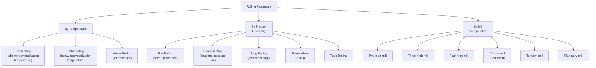

## Rolling Processes

### Overview

Rolling is a bulk metal-forming process in which a workpiece is passed between one or more pairs of rotating rolls to reduce cross-sectional thickness, produce a uniform section profile, or impart a specific surface finish/pattern. It is the most widely used metal forming process by tonnage, converting cast ingots, slabs, blooms, and billets into semi-finished and finished products such as sheet, plate, strip, bar, rod, structural shapes, and rail. Rolling operates on the principle of plastic deformation under compressive stress applied through the roll gap.

---

### Fundamental Principles

#### Roll Gap Geometry and Deformation

As a workpiece passes through the roll gap, its thickness is reduced from $h_0$ (entry) to $h_f$ (exit), while its length increases and, to a lesser extent, its width increases (spread). The draft (reduction per pass) is:

$$d = h_0 - h_f$$

The maximum possible draft is limited by the coefficient of friction $\mu$ between roll and workpiece and the roll radius $R$:

$$d_{max} = \mu^2 R$$

This relationship arises because the horizontal component of the friction force must be sufficient to draw the workpiece into the roll gap; if the required draft exceeds this limit, the rolls will slip rather than bite into the material.

#### Angle of Contact (Bite Angle)

The angle of contact $\alpha$ between the roll and workpiece is related to draft and roll radius by:

$$\cos\alpha = 1 - \frac{d}{R}$$

For rolling to proceed (self-feeding "bite"), the condition $\tan\alpha \leq \mu$ must be satisfied.

#### Roll Force and Torque

Roll separating force (the force tending to push the rolls apart, which the mill stand and bearings must resist) is approximated as:

$$F = \bar{Y} \cdot w \cdot L$$

where $\bar{Y}$ is the average flow stress of the material during deformation, $w$ is the workpiece width, and $L$ is the contact length (approximated as $L \approx \sqrt{R \cdot d}$ for small drafts). Roll torque per roll is approximately:

$$T \approx 0.5 \cdot F \cdot L$$

and rolling power is:

$$P = 2\pi N T$$

where $N$ is rotational speed (rev/unit time). [Inference: these are simplified first-order approximations commonly used in introductory rolling mechanics; more rigorous analyses (e.g., slab method with friction hill, or Sims' method for hot rolling) account for friction distribution across the contact arc and neutral point location, yielding more accurate force predictions for mill design.]

#### Neutral Point (No-Slip Point)

Within the roll gap, the workpiece surface velocity is slower than the roll surface velocity at entry (roll "slides" relative to workpiece, friction acts to draw material in) and faster than roll surface velocity at exit (friction acts to resist material ejection). The point where workpiece and roll surface velocities are equal is the **neutral point** (or no-slip point); its location affects the friction force distribution and is a key parameter in rolling mechanics analysis (e.g., the friction hill model).

---

### Classification of Rolling Processes

---

### Hot Rolling vs. Cold Rolling

#### Hot Rolling

Performed above the material's recrystallization temperature, allowing continuous grain refinement/recrystallization during deformation, which eliminates strain hardening effects and permits large reductions per pass with lower force requirements.

**Characteristics:**

- Large reductions achievable per pass (dynamic recrystallization prevents excessive strain hardening)
- Lower rolling forces compared to cold rolling for equivalent reduction
- Poorer surface finish and dimensional tolerance (scale formation, thermal expansion/contraction effects)
- Refines as-cast grain structure, closes porosity, and breaks up dendritic structure — often the first mechanical working step after continuous casting
- Typical products: hot-rolled slabs/blooms/billets, hot-rolled plate, structural shapes, rail

**Applications:** Primary breakdown of cast material (blooming/slabbing mills), plate mills, structural/rail mills, hot strip mills for coiled sheet feedstock.

#### Cold Rolling

Performed below the recrystallization temperature (often at room temperature), producing strain hardening (work hardening) as deformation proceeds, which limits achievable reduction per pass and requires higher rolling forces.

**Characteristics:**

- Excellent surface finish and tight dimensional tolerance
- Strain hardening increases strength/hardness but reduces ductility (may require intermediate annealing between passes for large total reductions)
- Improved mechanical properties (higher strength) via strain hardening, where desired
- Typical products: cold-rolled sheet, precision strip, foil

**Applications:** Final finishing passes on hot-rolled coil (e.g., automotive sheet, appliance panels, tin plate, foil production).

#### Comparison Table

| Aspect | Hot Rolling | Cold Rolling |
| --- | --- | --- |
| Temperature | Above recrystallization temperature | Below recrystallization temperature |
| Strain hardening | Negligible (dynamic recrystallization) | Significant (accumulates with passes) |
| Reduction per pass | Large | Limited (requires more passes/annealing) |
| Surface finish | Moderate (scale present) | Excellent |
| Dimensional tolerance | Looser | Tight |
| Rolling force | Lower | Higher |
| Typical use | Primary breakdown, structural products | Finishing, precision sheet/strip |

---

### Mill Configurations

#### Two-High Mill

Simplest configuration: a single pair of opposing rolls. May be **reversing** (workpiece passes back and forth through the same roll pair, direction reversed each pass) or **non-reversing** (one-direction only, workpiece returned via separate path for subsequent passes).

#### Three-High Mill

Three rolls stacked vertically; workpiece passes forward through the bottom pair, then backward through the top pair (or vice versa), avoiding the need to reverse roll rotation direction between passes — improves productivity over simple two-high reversing mills.

#### Four-High Mill

Two smaller-diameter working rolls (in contact with the workpiece) are backed by two larger-diameter backup rolls, which provide rigidity and resist roll bending/deflection. Smaller working rolls reduce roll force and enable thinner gauge rolling, while backup rolls maintain flatness/thickness uniformity across the strip width. Widely used for cold rolling of sheet/strip.

#### Cluster Mill (Sendzimir Mill)

Each working roll is backed by multiple tiers of increasingly larger backup rolls, providing very high rigidity with very small-diameter working rolls, enabling extremely thin gauge and high-strength/hard-to-roll material processing (e.g., stainless steel foil, precision strip).

#### Tandem Mill

Multiple rolling stands arranged in series, with the workpiece passing continuously through successive stands, each providing further reduction, enabling high-volume continuous strip production (common in hot strip mills and cold reduction mills) without intermediate coiling/handling between stands.

#### Planetary Mill

A large central roll surrounded by numerous small planetary rolls, each imparting a small increment of reduction as the workpiece passes, achieving very large total reduction in a single pass (theoretically capable of reducing slab directly to strip in one pass), used in specialized high-reduction applications.

---

### Shape Rolling and Special Rolling Processes

#### Shape Rolling

Produces non-flat profiles (I-beams, channels, angles, rail) using a series of grooved roll passes (a "pass schedule"), progressively transforming a billet/bloom cross-section into the final structural profile through multiple roll stands, each with a differently shaped groove.

#### Ring Rolling

Forms seamless rings (bearing races, flanges, gear blanks, jet engine casings) by rolling a pierced/donut-shaped preform between an idler roll (inside the ring) and a driven roll (outside the ring), progressively reducing wall thickness while increasing ring diameter. Produces components with favorable circumferential grain flow, improving mechanical properties compared to machining from plate/bar stock.

#### Thread Rolling and Gear Rolling

Cold-forming processes in which dies (flat or cylindrical) displace material to form thread or gear tooth profiles without cutting, producing improved fatigue strength (via favorable grain flow following the thread/tooth contour and induced compressive residual stress) compared to machined (cut) threads/teeth.

#### Tube Rolling (Mandrel Mill, Plug Mill, Pilger Mill)

Seamless tube production processes using rolls in combination with an internal mandrel or plug to control internal diameter/wall thickness while external rolls control outer diameter, typically following a piercing operation (e.g., Mannesmann piercing) that creates the initial hollow shell from a solid round billet.

---

### Defects in Rolled Products

| Defect | Description | Primary Cause |
| --- | --- | --- |
| **Edge cracking** | Cracks along the strip/plate edges | Insufficient material ductility, excessive edge reduction, poor edge condition entering the mill |
| **Alligatoring** | Splitting of the workpiece along a horizontal plane, opening like an alligator's jaws | Non-uniform deformation through thickness, inhomogeneous material (porosity, segregation) |
| **Wavy edges** | Edge buckling from differential elongation across width | Roll camber mismatch, uneven reduction across width |
| **Zipper cracks (centerline cracking)** | Cracks along the strip centerline | Non-uniform through-thickness deformation, center porosity in the incoming material |
| **Laminations** | Internal separations parallel to the rolled surface | Pre-existing internal defects (porosity, inclusions) elongated and flattened during rolling |
| **Scale pits** | Surface pitting from rolled-in oxide scale | Inadequate descaling before hot rolling |

---

### Roll Flattening and Flatness Control

Under high rolling loads, working rolls elastically flatten (increasing effective contact length, a phenomenon addressed by the **Hitchcock formula** for corrected roll radius) and deflect (bend), which can cause non-uniform strip thickness/flatness across width if uncompensated. Flatness control methods include:

- **Roll crown** — Rolls machined with a slight barrel-shaped (crowned) profile to compensate for deflection under load
- **Roll bending (work roll bending)** — Hydraulic actuators apply counter-bending forces to working rolls to actively compensate for deflection under varying load conditions
- **Roll shifting/crossing** — Axial shifting or slight crossing of roll axes to adjust effective crown profile dynamically
- **Backup rolls** — As discussed under four-high/cluster mills, provide rigidity to resist working roll deflection

---

### Illustration: Two-High Rolling Mill — Roll Gap Geometry (svg_diagram)

<svg xmlns="http://www.w3.org/2000/svg" viewBox="0 0 640 380">
<text x="320" y="22" font-size="16" text-anchor="middle" font-family="Arial" font-weight="bold">Roll Gap Geometry (svg_diagram)</text>

<circle cx="320" cy="120" r="90" fill="none" stroke="black" stroke-width="2.5" />
<text x="320" y="60" font-size="11" text-anchor="middle" font-family="Arial">Top roll (R)</text>

<circle cx="320" cy="300" r="90" fill="none" stroke="black" stroke-width="2.5" />
<text x="320" y="360" font-size="11" text-anchor="middle" font-family="Arial">Bottom roll (R)</text>

<rect x="60" y="185" width="160" height="50" fill="none" stroke="black" stroke-width="2" />
<text x="140" y="270" font-size="11" text-anchor="middle" font-family="Arial">h0 (entry)</text>

<rect x="420" y="200" width="160" height="20" fill="none" stroke="black" stroke-width="2" />
<text x="500" y="245" font-size="11" text-anchor="middle" font-family="Arial">hf (exit)</text>

<line x1="220" y1="185" x2="270" y2="205" stroke="black" stroke-width="1.5" />
<line x1="220" y1="235" x2="270" y2="215" stroke="black" stroke-width="1.5" />
<line x1="370" y1="205" x2="420" y2="200" stroke="black" stroke-width="1.5" />
<line x1="370" y1="215" x2="420" y2="220" stroke="black" stroke-width="1.5" />

<text x="255" y="150" font-size="10" font-family="Arial">alpha</text>

<path d="M 260,175 A 20,20 0 0,1 275,195" fill="none" stroke="black" stroke-width="1" />

<circle cx="330" cy="207" r="4" fill="black" />
<text x="335" y="195" font-size="9" font-family="Arial">Neutral point</text>

<line x1="30" y1="210" x2="55" y2="210" stroke="black" stroke-width="1.5" marker-end="url(#arrow2)" />
<text x="10" y="200" font-size="9" font-family="Arial">Feed</text>
</svg>

---

### Worked Example: Roll Force Estimation

Given: A steel strip is hot rolled from $h_0 = 25\,\text{mm}$ to $h_f = 20\,\text{mm}$ using a roll of radius $R = 300\,\text{mm}$ and width $w = 800\,\text{mm}$. Average flow stress during deformation is $\bar{Y} = 140\,\text{MPa}$.

**Step 1 — Draft:**

$$d = h_0 - h_f = 25 - 20 = 5\,\text{mm}$$

**Step 2 — Contact length:**

$$L \approx \sqrt{R \cdot d} = \sqrt{300 \times 5} = \sqrt{1500} \approx 38.7\,\text{mm}$$

**Step 3 — Roll separating force:**

$$F = \bar{Y} \cdot w \cdot L = 140\,\text{N/mm}^2 \times 800\,\text{mm} \times 38.7\,\text{mm} \approx 4{,}333{,}000\,\text{N} \approx 4.33\,\text{MN}$$

This simplified estimate does not account for the friction hill effect (which typically increases actual force above this baseline estimate) or redundant work; production mill force calculations use more rigorous methods (e.g., Sims' method) incorporating friction distribution across the arc of contact. [Inference: the simplified $F = \bar{Y}wL$ formula provides an order-of-magnitude estimate; actual mill force requirements in practice are typically higher due to friction effects not captured in this basic approximation, and detailed mill design relies on more comprehensive analytical or empirical models.]

---

### **Related Topics**

- Forging processes (comparison of bulk deformation methods)
- Extrusion processes
- Wire drawing and bar drawing
- Recrystallization and grain growth in metals
- Strain hardening and the flow curve
- Sheet metal forming (downstream of cold-rolled strip)
- Roll pass design for shape rolling
- Continuous casting (upstream feedstock for hot rolling)
- Residual stress in rolled products
- Texture development (crystallographic) from rolling deformation