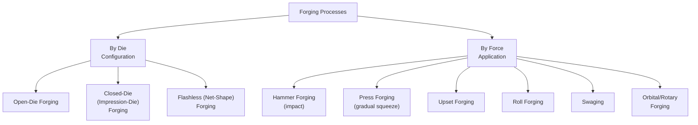
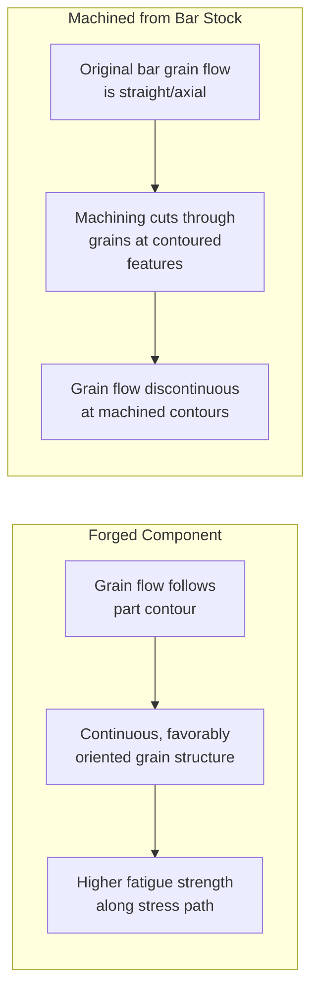

## Forging Processes

### Overview

Forging is a bulk metal-forming process in which a workpiece is plastically deformed by compressive forces — applied by hammering, pressing, or rolling action — typically using localized compressive force between dies, to produce a desired shape while refining internal grain structure. Forging is distinguished from other bulk forming processes (rolling, extrusion) by its typically discontinuous, shape-specific application of force and its emphasis on producing near-net or net-shape components with favorable grain flow for demanding structural and safety-critical applications (aerospace, automotive, oil & gas, power generation).

---

### Metallurgical Basis of Forging

#### Grain Flow

A defining metallurgical advantage of forging over machining from bar/plate stock is that forging deforms and reorients the material's internal grain structure to follow the contours of the finished part, rather than cutting through grains as machining does. This continuous, favorably-oriented grain flow improves fatigue strength, toughness, and directional mechanical properties along the primary stress-bearing axes of the component.

#### Hot, Warm, and Cold Forging

- **Hot forging** — Performed above the recrystallization temperature; lowest flow stress (least force required), largest achievable deformation per operation, but coarser surface finish/tolerance and scale formation; most common for large or complex components.
- **Warm forging** — Performed at intermediate temperatures (below recrystallization but above room temperature); balances reduced flow stress (versus cold forging) against improved surface finish/tolerance (versus hot forging) and reduced scaling.
- **Cold forging** — Performed near room temperature; produces excellent surface finish, tight tolerances, and strain-hardened (higher strength) final properties, but requires higher forming forces and is generally limited to less severe deformation and more ductile materials without intermediate annealing.

---

### Classification of Forging Processes

---

### Open-Die Forging

#### Principle

The workpiece is deformed between simple, flat or contoured dies that do not fully enclose the material, with the workpiece free to flow laterally outside the die contact area. Shape is controlled by successive die placements and manipulation of the workpiece (often via a manipulator or crane) rather than by a fully shaped cavity.

#### Characteristics

- Suitable for very large workpieces (large shafts, rings, discs) up to hundreds of tons
- Requires significant operator/manipulator skill to achieve final shape through multiple deformation steps
- Relatively low tooling cost (simple flat/contoured dies) but higher labor/skill input per part
- Produces coarser dimensional tolerances than closed-die forging, typically requiring subsequent machining
- Common operations: **cogging** (progressive reduction along the length of a bar/billet, similar in principle to incremental rolling), **drawing out** (elongating and reducing cross-section), **upsetting** (increasing diameter/reducing length), **piercing** (forming a hole)

#### Applications

Large shafts (turbine, generator, ship propulsion), pressure vessel components, large rings (via subsequent ring rolling from an open-die-forged preform), ingots converted to billet form for further processing.

---

### Closed-Die (Impression-Die) Forging

#### Principle

The workpiece is placed between two die halves, each containing a portion of the desired final shape (impression), and deformed under pressure until it fills the die cavity. Excess material is extruded out of the cavity through a thin gap, forming **flash**, which is subsequently trimmed.

#### Process Sequence (Typical Hot Closed-Die Forging)

1. **Billet preparation** — Cut to length, heated to forging temperature
2. **Fullering/blocking (preforming)** — Intermediate die impressions redistribute material to approximate the final shape before final forging, reducing material flow demands on the finisher die
3. **Finishing (final impression)** — Final die impression forms the near-final part shape, with excess material forced into the flash gap
4. **Trimming** — Flash is sheared off using a trim die
5. **Coining/restriking (optional)** — Additional precision-forming operation to achieve tight tolerances on specific features
6. **Heat treatment and finishing** — As required by specification

#### Flash Design

The flash gap is intentionally narrow and often includes a flash gutter (wider relief channel just beyond the narrow land), causing back-pressure that forces the material to fully fill the die cavity, including fine details, before flowing out as flash. Flash geometry (land width, gutter dimensions) is a critical tooling design parameter balancing complete die fill against excessive material waste and forging load.

#### Characteristics

- Higher tooling cost (machined die cavities) but better dimensional accuracy, repeatability, and material utilization than open-die forging for the given geometry (though flash itself is scrap loss)
- Suited to medium-to-high production volumes justifying die cost
- Grain flow follows part contours for improved mechanical properties

#### Applications

Automotive components (crankshafts, connecting rods, steering knuckles), aerospace structural components, hand tools, hardware, gears (forged blanks).

---

### Flashless (Closed-Cavity/Net-Shape) Forging

#### Principle

The die cavity is fully enclosed with no flash gap, requiring precise control of billet volume (since no excess material can escape as flash) to exactly fill the cavity without under-fill or excessive die pressure from over-fill.

**Advantages:** Eliminates flash trimming operation and associated material loss, improving material utilization.

**Challenges:** Requires precise billet volume control and die design; higher die stresses since all deformation pressure is contained within the cavity.

---

### Force-Application-Based Processes

#### Hammer Forging (Drop Forging)

Deformation is achieved through repeated impact blows from a falling ram (gravity drop hammers) or power-assisted ram (steam, air, or hydraulic-assisted hammers), with energy delivered in short, high-strain-rate impacts. Multiple blows are typically required to progressively fill the die cavity.

#### Press Forging

Deformation is achieved through a single, continuous, gradual application of force (mechanical, hydraulic, or screw presses) rather than impact, producing more uniform deformation through the workpiece thickness (versus the more localized, surface-concentrated deformation of hammer forging) and generally better process control/repeatability. Common press types:

- **Mechanical (crank/eccentric) presses** — Fixed stroke, high speed, good for high-volume production
- **Hydraulic presses** — Variable stroke/speed, full-stroke force capability, suited to large or complex forgings requiring extended contact time for complete die fill
- **Screw presses** — Combine impact-like and press-like characteristics; energy delivered via a rotating screw mechanism

#### Upset Forging

Increases the diameter (or cross-section) of a workpiece, typically a bar end, by compressing it axially, reducing its length. Widely used for forming heads on bolts/fasteners and enlarging local sections of shafts. Governed by an empirical rule-of-thumb limiting unsupported length-to-diameter ratio (to avoid buckling) in a single upset blow, with multi-step upsetting used for longer unsupported lengths.

#### Roll Forging

A specialized process using contoured rolls (rather than flat rolling mill rolls) to progressively reduce and shape the cross-section of a bar as it passes between rotating roll segments, often used to preform stock before final closed-die forging (e.g., producing a tapered/contoured blank for connecting rod or axle forging).

#### Swaging (Rotary Swaging)

A cold or hot forming process using a set of reciprocating dies arranged radially around a workpiece, rapidly hammering to progressively reduce diameter or form a taper/point on bar, tube, or wire stock. Commonly used for pointing wire/rod ends, reducing tube diameter, and assembling components via mechanical interference (e.g., swaging fittings onto cable).

#### Orbital (Rotary) Forging

Uses an inclined, rotating upper die that maintains partial, continuously-rotating contact with the workpiece (rather than full-face simultaneous contact), progressively forming the part with substantially reduced peak force compared to conventional press forging of an equivalent part, since only a portion of the die face is in contact at any instant. Suited to disc-shaped or axisymmetric components (gears, bevel gear blanks).

---

### Forging Defects

| Defect | Description | Primary Cause |
| --- | --- | --- |
| **Underfill** | Die cavity not completely filled | Insufficient billet volume, inadequate forging force/temperature, poor preform design |
| **Cold shut (forging lap)** | Folding of metal surface onto itself without fusion | Improper metal flow, sharp die corners, incorrect preform shape |
| **Flow-through/flow line defects** | Discontinuous or unfavorable grain flow | Poor die design, excessive/uncontrolled material flow |
| **Internal cracking (chevron/central burst)** | Internal cracks along the workpiece centerline | Insufficient deformation at the center, particularly in open-die/extrusion-like processes with low die angle and light reduction |
| **Surface cracking** | Cracks at the workpiece surface | Excessive strain rate, low forging temperature, poor ductility |
| **Scale pits** | Surface pitting from oxide scale worked into the surface | Inadequate descaling before/during hot forging |
| **Die wear/mismatch** | Dimensional inaccuracy from worn or misaligned dies | Tooling wear, misalignment, excessive production volume on a single die set |

---

### Forging Force Estimation

#### Open-Die (Flat Die) Upsetting — Frictionless Idealization

For idealized frictionless upsetting of a cylindrical workpiece, the forging force is:

$$F = \bar{Y} \cdot A$$

where $\bar{Y}$ is the average flow stress and $A$ is the instantaneous cross-sectional area. In practice, friction at the die-workpiece interface causes non-uniform (barreling) deformation and increases actual force requirements above this idealized value. A common correction incorporating friction is:

$$F = \bar{Y} \cdot A \left(1 + \frac{2\mu r}{3h}\right)$$

where $\mu$ is the coefficient of friction, $r$ is the instantaneous radius, and $h$ is the instantaneous height — this is one widely referenced approximate correction (a simplified form derived from slab-method analysis); more rigorous slab-method or upper-bound analyses provide more precise force predictions accounting for the full friction hill pressure distribution. [Inference: the specific correction factor form varies among forging mechanics references; the equation given represents one standard simplified approximation.]

#### Closed-Die Forging Force

Closed-die forging force estimation commonly uses an empirical shape-complexity factor $K_f$ applied to flow stress and projected (planform) area:

$$F = K_f \cdot \bar{Y} \cdot A_p$$

where $A_p$ is the projected area of the forging (including flash) and $K_f$ is a multiplying factor (typically ranging from roughly 3 to 10 or more, depending on shape complexity, from simple shapes to complex shapes with thin ribs/webs) accounting for die-fill difficulty and friction effects not captured by a simple flow-stress-times-area calculation. [Inference: $K_f$ values are empirically derived and vary by reference source, part geometry, and forging condition; specific values should be drawn from established forging design handbooks or in-house empirical data for a given part family.]

---

### Illustration: Closed-Die Forging Sequence (svg_diagram)

<svg xmlns="http://www.w3.org/2000/svg" viewBox="0 0 640 300">
<text x="320" y="22" font-size="16" text-anchor="middle" font-family="Arial" font-weight="bold">Closed-Die Forging Stages (svg_diagram)</text>

<rect x="40" y="150" width="60" height="100" fill="none" stroke="black" stroke-width="2" />
<text x="70" y="270" font-size="10" text-anchor="middle" font-family="Arial">1. Billet</text>

<line x1="115" y1="200" x2="145" y2="200" stroke="black" stroke-width="1.5" marker-end="url(#a1)" />

<path d="M 160,190 Q 180,150 220,150 Q 260,150 280,190 L 280,240 Q 260,260 220,260 Q 180,260 160,240 Z" fill="none" stroke="black" stroke-width="2" />
<text x="220" y="280" font-size="10" text-anchor="middle" font-family="Arial">2. Blocked (preform)</text>

<line x1="300" y1="200" x2="330" y2="200" stroke="black" stroke-width="1.5" marker-end="url(#a1)" />

<path d="M 350,180 Q 370,140 420,140 Q 470,140 490,180 L 490,230 Q 470,250 420,250 Q 370,250 350,230 Z" fill="none" stroke="black" stroke-width="2" />
<rect x="345" y="195" width="150" height="6" fill="#dddddd" stroke="black" stroke-width="1" />
<text x="420" y="270" font-size="10" text-anchor="middle" font-family="Arial">3. Finish-forged</text>
<text x="420" y="283" font-size="9" text-anchor="middle" font-family="Arial">(with flash)</text>

<line x1="510" y1="200" x2="540" y2="200" stroke="black" stroke-width="1.5" marker-end="url(#a1)" />

<path d="M 555,180 Q 570,150 600,150 Q 630,150 620,190 L 615,225 Q 600,245 575,245 Q 555,235 555,210 Z" fill="none" stroke="black" stroke-width="2" />
<text x="587" y="270" font-size="9" text-anchor="middle" font-family="Arial">4. Trimmed</text>
</svg>

---

### Illustration: Grain Flow — Forged vs. Machined Component

---

### Worked Example: Closed-Die Forging Force Estimation

Given: A steel connecting rod forging has a projected area (including flash) of $A_p = 12{,}000\,\text{mm}^2$, average flow stress $\bar{Y} = 150\,\text{MPa}$ at forging temperature, and shape complexity factor $K_f = 6$ (moderately complex shape with ribs).

$$F = K_f \cdot \bar{Y} \cdot A_p = 6 \times 150\,\text{N/mm}^2 \times 12{,}000\,\text{mm}^2 = 10{,}800{,}000\,\text{N} = 10.8\,\text{MN}$$

This estimate would guide selection of an appropriately-rated forging press (with adequate margin for process variation), though final press selection in practice also accounts for flash behavior, die temperature effects, and strain rate sensitivity of the specific alloy. [Inference: this is an illustrative calculation using a representative $K_f$ value; actual complexity factors for a specific part geometry are typically obtained from forging process design handbooks or validated through trial forging and force monitoring.]

---

### **Related Topics**

- Rolling processes (comparison of bulk deformation methods)
- Extrusion processes
- Sheet metal forming
- Forging die design and material selection (tool steels)
- Grain flow and its influence on fatigue/mechanical properties
- Forging defect inspection (NDT for forged components)
- Recrystallization and dynamic recrystallization in hot working
- Isothermal and hot-die forging (for superalloys/titanium)
- Powder metallurgy forging (P/M forging)
- Near-net-shape manufacturing strategies