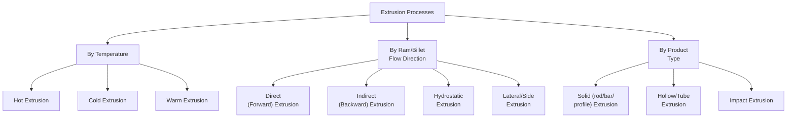

## Extrusion Processes

### Overview

Extrusion is a bulk metal-forming process in which a billet is forced through a shaped die orifice under compressive force, producing a continuous product with a constant cross-sectional profile matching the die geometry. It is particularly well-suited to producing long products with complex, constant cross-sections (rods, tubes, structural profiles, channels) that would be difficult or costly to achieve by rolling or machining, and is widely applied to aluminum, copper, magnesium, and (to a lesser extent, due to higher required forces) steel alloys.

---

### Fundamental Principle

A billet, heated (for hot extrusion) or at/near room temperature (for cold extrusion), is placed in a container and forced by a ram through a die with an orifice shaped to the desired cross-section. Material undergoes severe compressive and shear deformation as it converges toward the die opening, extruding continuously as long as the ram advances and sufficient billet material remains.

#### Extrusion Ratio

The extrusion ratio $R_x$ quantifies the degree of deformation:

$$R_x = \frac{A_0}{A_f}$$

where $A_0$ is the initial billet cross-sectional area and $A_f$ is the final extruded cross-sectional area. Higher extrusion ratios represent more severe deformation, requiring higher force and generally being limited by the material's ductility and the press capacity available.

#### Extrusion Pressure (Ideal Work Method)

For frictionless, ideal deformation, the extrusion pressure can be estimated using the ideal work method:

$$p = \bar{Y} \ln(R_x)$$

where $\bar{Y}$ is the average flow stress. In practice, friction (at the container wall and die land) and redundant (non-uniform) deformation work increase actual required pressure above this ideal value, commonly incorporated via an empirical extrusion constant $K_x$ (or die/container friction correction factors), giving:

$$p = \bar{Y}(a + b\ln R_x)$$

where $a$ and $b$ are empirical constants dependent on friction conditions and die geometry (die angle, use of a container liner, etc.). [Inference: the specific empirical constants $a$ and $b$ vary considerably across extrusion mechanics references and are typically calibrated from experimental extrusion trials for a given material/tooling combination rather than treated as fixed universal values.]

---

### Classification of Extrusion Processes

---

### Hot vs. Cold Extrusion

#### Hot Extrusion

Performed above the material's recrystallization temperature, substantially lowering flow stress and enabling higher extrusion ratios and more complex profiles than cold extrusion, at the cost of scale formation, higher tooling wear (from combined high temperature and pressure), and generally looser dimensional tolerance requiring cooling/handling control (e.g., aluminum profile straightness and temper considerations after press quenching).

**Typical materials:** Aluminum alloys (very widely extruded — architectural, automotive, and structural profiles), copper and brass, magnesium, steel (for specific heavy sections, requiring very high press forces and specialized glass or other lubricant systems to manage extreme temperatures and die wear).

#### Cold Extrusion

Performed near room temperature, producing excellent surface finish, tight tolerances, and strain-hardened (strengthened) final properties, but requiring higher forces and generally limited to more ductile materials and lower extrusion ratios per operation (multi-stage cold extrusion or intermediate annealing used for more severe total deformation).

**Typical materials/products:** Steel and aluminum fasteners, automotive components (e.g., cold-extruded gear blanks, shafts), collapsible tubes (toothpaste, cosmetic tubes) via impact extrusion.

---

### Direct (Forward) Extrusion

#### Principle

The ram pushes the billet through the container toward a stationary die at the opposite end; extruded product exits in the same direction as ram travel. Friction exists between the billet and the entire container wall length throughout the stroke, since the billet slides relative to the container.

#### Characteristics

- Simplest, most common configuration
- Friction between billet and container wall increases required ram force, and force increases somewhat as the stroke progresses in some analyses, and generally decreases toward the end of the stroke as remaining billet length (and thus frictional contact area) decreases, though the detailed force-stroke curve depends on the specific friction and redundant work conditions
- A **dummy block** (slightly smaller than the container bore) is typically placed between the ram and billet to prevent extrusion of a thin skin of oxidized/contaminated outer billet surface into the product, that skin instead remaining behind as discard

#### Applications

Most common configuration for aluminum profile extrusion, general rod/bar/structural shape production.

---

### Indirect (Backward) Extrusion

#### Principle

The die is mounted on the ram (a hollow ram) rather than being stationary; as the ram advances, the die moves into the container while the billet remains stationary relative to the container wall, and extruded product flows backward through the hollow ram, opposite to the ram's direction of travel.

#### Characteristics

- Since the billet does not slide relative to the container wall (no relative motion at that interface), container wall friction is substantially reduced (limited to the shorter contact length near the die), lowering required extrusion force compared to direct extrusion for an equivalent extrusion ratio
- More complex tooling (hollow ram, limited ram/product routing) and reduced ram/press rigidity due to the hollow ram design
- Force-stroke curve is generally flatter (more uniform) than direct extrusion, since friction contact length remains more constant throughout the stroke

#### Applications

Used where lower force requirements or more uniform force-stroke behavior are advantageous — often for higher-ratio or harder-to-extrude alloys and, notably, in can-body impact extrusion (a specialized indirect/impact variant).

---

### Hydrostatic Extrusion

#### Principle

The billet is surrounded by a pressurized fluid (rather than direct mechanical ram contact against the billet's cylindrical surface) that transmits pressure hydrostatically to force the billet through the die; essentially eliminates container wall friction entirely since the fluid, not solid contact, transmits force along the billet length.

#### Characteristics

- Very low friction (only at the die itself), enabling extrusion of brittle or low-ductility materials that might otherwise crack under the higher, less uniform stress states of direct/indirect extrusion
- Can be performed at room temperature for many materials due to the favorable (predominantly compressive) stress state
- Requires specialized sealing and pressurization equipment, adding complexity and cost; less common in general industrial practice compared to direct extrusion

#### Applications

Extrusion of brittle materials, wire drawing of hard-to-process metals, specialty/research applications.

---

### Impact Extrusion

#### Principle

A rapid, high-force blow (typically via a mechanical or hydraulic press in a single stroke) drives a punch into a slug of material (commonly a soft metal such as aluminum, lead, tin, or zinc) positioned in a die cavity, causing the material to flow either forward (around the punch, forward impact extrusion, typically for solid shapes) or backward (up around the punch shank in the annular gap between punch and die, backward/indirect impact extrusion, typically for thin-walled cup/tube shapes) at high speed.

#### Characteristics

- Performed cold or warm, typically as a single-stroke, high-speed operation
- Produces thin-walled, hollow, cup-like shapes very economically at high production rates
- Wall thickness is controlled by the clearance between the punch and die cavity

#### Applications

Collapsible tubes (toothpaste, adhesive tubes), aluminum aerosol cans, small automotive/electronic hollow components, battery cases.

---

### Tube (Hollow) Extrusion

Hollow profiles/tubes are produced by one of several tooling approaches:

- **Spider (porthole) die** — The billet is divided into separate streams by "legs"/spider supports within the die, which flow around and rejoin (weld) downstream of the mandrel-forming section under high pressure and temperature, forming a seamless hollow section without a separate piercing step; widely used for aluminum tube/hollow profile extrusion.
- **Piercing mandrel with a solid billet** — A mandrel is advanced through a pre-pierced or piercing die assembly concurrently with extrusion, forming the hollow bore as the solid billet is extruded around it.
- **Hollow (pre-pierced) billet with a fixed or floating mandrel** — A billet with a pre-formed central hole is extruded over a mandrel that defines the internal bore profile.

---

### Extrusion Defects

| Defect | Description | Primary Cause |
| --- | --- | --- |
| **Extrusion (pipe) defect** | A funnel-shaped oxide/impurity-laden defect drawn from the billet surface into the center of the extrudate near the end of the extrusion stroke | Surface oxide/contamination being drawn inward as the final billet material is extruded; commonly mitigated by leaving a discard (butt) at the end of the stroke rather than extruding the full billet |
| **Surface cracking (speed cracking / fir-tree cracking)** | Periodic transverse surface cracks | Extrusion speed too high for the temperature/alloy combination, causing surface temperature rise (from friction/deformation heating) that exceeds the material's hot-shortness threshold |
| **Internal cracking (center burst / chevron cracking)** | Internal cracks along the extrudate centerline | Low die angle combined with light reduction promoting non-uniform (secondary) deformation zones, similar in mechanism to central burst in drawing/open-die forging |
| **Die lines** | Longitudinal surface scratches/grooves along the extrudate | Die surface imperfections or wear, or hard particle inclusions dragging along the die land surface |
| **Non-uniform grain structure / coarse grain surface (streaking)** | Bands of abnormal grain size, sometimes at the surface | Local shear-zone deformation and recrystallization behavior differences within the deformation zone (particularly relevant to aluminum alloys, where it can affect anodizing appearance) |

---

### Process Parameters and Tooling Considerations

#### Die Angle and Dead Metal Zone

Die geometry (angle of convergence) affects the material flow pattern within the extrusion container:

- **Square (shear-face) dies** — Simple to manufacture; promote formation of a stable **dead metal zone** (a region of stagnant, non-flowing material adjacent to the die face) that itself acts as a natural, self-forming die angle for the actively flowing material — a common approach in aluminum extrusion.
- **Conical (tapered) dies** — Directly shaped convergence angle guiding material flow; reduces redundant deformation work in some cases but requires more complex die manufacturing.

#### Lubrication

- **Aluminum hot extrusion** — Typically extruded without lubricant (relying on the dead-metal-zone/shear-face die mechanism), as lubricants can interfere with surface finish and weld quality in hollow/porthole die extrusion.
- **Steel and other high-temperature/high-friction extrusion** — Often requires specialized lubricants (e.g., glass lubrication systems providing both thermal insulation and low-friction die/container interface) given the much higher temperatures and pressures involved.
- **Cold extrusion** — Phosphate/soap coatings (common for steel cold extrusion) or other cold-forming lubricant systems to manage high contact pressures without lubricant breakdown.

#### Container and Die Temperature Control

Maintaining controlled container and die temperature is critical for consistent flow stress, dimensional control, and avoiding thermally-induced surface defects (speed cracking), particularly in hot extrusion where extrusion speed must be balanced against the alloy's hot-workability temperature window.

---

### Illustration: Direct vs. Indirect Extrusion (svg_diagram)

<svg xmlns="http://www.w3.org/2000/svg" viewBox="0 0 640 340">
<text x="320" y="22" font-size="15" text-anchor="middle" font-family="Arial" font-weight="bold">Direct vs. Indirect Extrusion (svg_diagram)</text>

<text x="150" y="55" font-size="12" text-anchor="middle" font-family="Arial" font-weight="bold">Direct Extrusion</text>

<rect x="40" y="70" width="220" height="60" fill="none" stroke="black" stroke-width="2" />

<text x="150" y="105" font-size="10" text-anchor="middle" font-family="Arial">Billet (in container)</text>

<rect x="10" y="80" width="30" height="40" fill="`#cccccc`" stroke="black" stroke-width="2" />

<text x="25" y="75" font-size="9" text-anchor="middle" font-family="Arial">Ram</text>

<line x1="260" y1="70" x2="260" y2="130" stroke="black" stroke-width="4" />

<text x="260" y="65" font-size="9" text-anchor="middle" font-family="Arial">Die</text>

<rect x="270" y="95" width="80" height="10" fill="none" stroke="black" stroke-width="2" />

<text x="310" y="145" font-size="9" text-anchor="middle" font-family="Arial">Extrudate</text>

<line x1="45" y1="100" x2="90" y2="100" stroke="black" stroke-width="1.5" marker-end="url(#dx1)" />

<line x1="360" y1="100" x2="395" y2="100" stroke="black" stroke-width="1.5" marker-end="url(#dx1)" />

<text x="200" y="150" font-size="9" text-anchor="middle" font-family="Arial">Ram and product travel same direction</text>

<text x="480" y="55" font-size="12" text-anchor="middle" font-family="Arial" font-weight="bold">Indirect Extrusion</text>

<rect x="400" y="70" width="220" height="60" fill="none" stroke="black" stroke-width="2" />

<text x="480" y="105" font-size="10" text-anchor="middle" font-family="Arial">Billet (stationary)</text>

<rect x="580" y="75" width="40" height="50" fill="`#cccccc`" stroke="black" stroke-width="2" />

<text x="600" y="70" font-size="9" text-anchor="middle" font-family="Arial">Hollow ram/die</text>

<rect x="590" y="90" width="20" height="20" fill="white" stroke="black" stroke-width="1" />

<line x1="600" y1="130" x2="600" y2="165" stroke="black" stroke-width="4" />

<text x="600" y="185" font-size="9" text-anchor="middle" font-family="Arial">Extrudate (backward)</text>

<line x1="560" y1="100" x2="585" y2="100" stroke="black" stroke-width="1.5" marker-end="url(#dx1)" />

<text x="480" y="150" font-size="9" text-anchor="middle" font-family="Arial">Product exits opposite to ram travel</text>

</svg>

---

### Worked Example: Extrusion Pressure Estimation

Given: An aluminum billet with initial diameter $D_0 = 200\,\text{mm}$ is hot extruded to a final rod diameter $D_f = 50\,\text{mm}$. Average flow stress $\bar{Y} = 30\,\text{MPa}$ at extrusion temperature. Using empirical constants $a = 0.8$, $b = 1.5$ (representative values for a moderately efficient direct extrusion setup).

**Step 1 — Extrusion ratio:**

$$R_x = \frac{A_0}{A_f} = \frac{D_0^2}{D_f^2} = \frac{200^2}{50^2} = \frac{40{,}000}{2{,}500} = 16$$

**Step 2 — Extrusion pressure:**

$$p = \bar{Y}(a + b\ln R_x) = 30 \times (0.8 + 1.5 \times \ln 16)$$

$$\ln 16 \approx 2.773$$

$$p = 30 \times (0.8 + 1.5 \times 2.773) = 30 \times (0.8 + 4.16) = 30 \times 4.96 \approx 148.8\,\text{MPa}$$

**Step 3 — Ram force:**

$$F = p \times A_0 = 148.8\,\text{N/mm}^2 \times \frac{\pi}{4}(200)^2\,\text{mm}^2 \approx 148.8 \times 31{,}416 \approx 4{,}674{,}000\,\text{N} \approx 4.67\,\text{MN}$$

This illustrates the general magnitude of press force required; actual empirical constants and resulting force would be validated against the specific alloy, die design, and extrusion press manufacturer's process data. [Inference: the empirical constants $a$ and $b$ used here are representative illustrative values; actual values depend on specific friction conditions, container/die design, and are typically determined from published extrusion mechanics references or in-house trial data for a given tooling setup.]

---

### **Related Topics**

- Rolling processes (comparison of bulk deformation methods)
- Forging processes (comparison of bulk deformation methods)
- Wire and bar drawing (downstream process often following extrusion)
- Die design for extrusion (spider/porthole dies, die angle optimization)
- Hot working vs. cold working fundamentals
- Aluminum extrusion alloy selection and temper designation
- Extrusion defect inspection and quality control
- Strain hardening and flow stress determination
- Friction and lubrication in bulk metal forming
- Powder extrusion and metal matrix composite extrusion