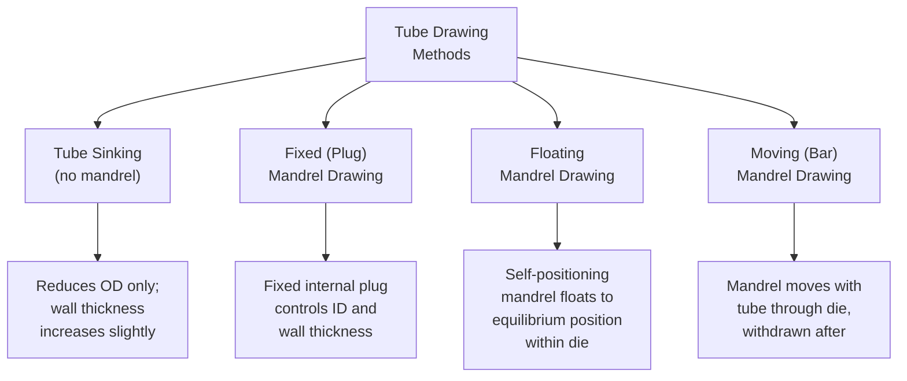

## Wire and Tube Drawing

### Overview

Drawing is a bulk metal-forming process in which a workpiece (wire, rod, or tube) is pulled through a die with a converging cross-section, reducing its diameter (and, for tube, wall thickness) while increasing its length. Unlike extrusion, where material is pushed through a die, drawing pulls the material through under tensile force applied to the exiting end — a distinction with significant implications for achievable reduction per pass, since the material must withstand the drawing (tensile) stress without necking or fracturing at the exit.

---

### Fundamental Principle

#### Force Application and the Key Constraint

The drawing force is applied by gripping the reduced (exit) end of the workpiece and pulling it through the die, meaning the exiting material — already at its final, reduced cross-section — must carry the full drawing load. This is the central design constraint distinguishing drawing from extrusion: the drawing stress at the die exit must remain below the material's yield strength at that point, or the material will yield/neck/fracture rather than draw successfully.

#### Draw Ratio and Area Reduction

The area reduction per pass is expressed as:

$$r = \frac{A_0 - A_f}{A_0} \times 100\%$$

where $A_0$ is entry cross-sectional area and $A_f$ is exit cross-sectional area. The reduction limit per pass is fundamentally governed by the maximum drawing stress the exiting material can withstand without exceeding its yield strength.

---

### Drawing Stress (Ideal Work Method)

For idealized frictionless drawing, the drawing stress is:

$$\sigma_d = \bar{Y} \ln\left(\frac{A_0}{A_f}\right)$$

Since the exiting material must withstand this stress without yielding, and assuming (in the idealized limiting case) that the exiting material's flow stress equals the average flow stress $\bar{Y}$, the theoretical maximum area reduction per pass (frictionless, no redundant work) works out to approximately 63% (corresponding to $\ln(A_0/A_f) = 1$, i.e., $\sigma_d = \bar{Y}$). In practice, accounting for friction and redundant deformation work, a more realistic incorporating correction is:

$$\sigma_d = \bar{Y}\left(1 + \frac{\mu}{\tan\alpha}\right)\ln\left(\frac{A_0}{A_f}\right)\phi$$

where $\mu$ is the coefficient of friction, $\alpha$ is the die (half) angle, and $\phi$ is a redundant work factor (accounting for non-uniform/inhomogeneous deformation, often itself a function of the ratio of contact length to mean workpiece diameter). Because of these practical losses, actual industrial area reductions per pass are typically limited to roughly 20–45% for wire drawing, considerably below the idealized frictionless limit. [Inference: the redundant work factor $\phi$ and practical maximum reduction percentages vary by alloy, die angle, lubrication condition, and drawing speed; specific numeric limits should be drawn from process-specific drawing schedules and experience for a given material.]

#### Optimum Die Angle

For a given reduction, there exists an optimum die (half) angle $\alpha^*$ that minimizes drawing force, balancing two competing effects: a larger die angle reduces the contact length (and thus friction work) but increases redundant (non-uniform, shearing) deformation work; a smaller die angle reduces redundant work but increases friction work over the longer contact length. This trade-off is commonly analyzed via slab-method force equations differentiated with respect to $\alpha$ to find the minimizing angle. [Inference: the precise optimum angle depends on the specific friction coefficient and reduction ratio for a given pass, and is typically determined via iterative calculation or empirical drawing-schedule tables rather than a single universal value.]

---

### Wire Drawing

#### Process Overview

Wire drawing progressively reduces rod/wire diameter through a series of dies (a "draw bench" for single-pass/heavy draws, or continuous multi-die "wire drawing machines" for fine wire), with intermediate annealing steps inserted as needed to restore ductility consumed by strain hardening (since drawing is almost universally performed cold, accumulating work hardening with each pass).

#### Die Zones

A wire drawing die typically comprises four functional zones along its bore profile:

1. **Entry (bell) zone** — Wide, funnel-shaped entry that guides the wire and lubricant into the die, preventing lubricant scraping/damage at the entrance
2. **Approach (reduction) zone** — The actual conical working angle where diameter reduction occurs
3. **Bearing (land) zone** — A short cylindrical section of constant diameter that sizes the final wire dimension and provides some die wear allowance
4. **Back-relief (exit) zone** — A slight relief angle allowing the wire to exit without additional friction/damage

#### Multi-Pass (Continuous) Wire Drawing

For fine wire production, multiple dies are arranged in series on a single continuous drawing machine, with the wire passing through successive dies while being taken up on intermediate capstans (rotating drums) that also provide the pulling force for each die stage. Since wire speed increases with each pass (constant volumetric flow rate through progressively smaller cross-sections), capstan speeds must be precisely synchronized across the line — a **slip** (small speed differential) is typically permitted at each capstan to accommodate elastic recovery and avoid excessive tension between stages.

#### Die Materials

- **Tungsten carbide dies** — Widely used for general wire drawing due to good wear resistance and toughness balance
- **Diamond dies (natural or polycrystalline)** — Used for very fine wire (down to micron-scale diameters) requiring extreme wear resistance and surface finish, particularly for electrical/electronic-grade fine wire
- **Steel dies** — Used for larger diameter, lower-volume, or less demanding applications

#### Lubrication

Dry lubrication (soap-based powder coatings, often following a phosphate or lime conversion coating pretreatment to improve lubricant adhesion) is common for steel wire; wet lubrication (oil- or emulsion-based, often with the die submerged or flooded) is common for non-ferrous wire and higher-speed drawing operations, providing cooling in addition to lubrication.

---

### Tube Drawing

#### Purpose

Tube drawing reduces tube outer diameter and/or wall thickness beyond what tube rolling/extrusion alone achieves, providing improved dimensional accuracy, surface finish, and mechanical properties (via strain hardening and controlled grain structure) compared to as-extruded or as-rolled tube.

#### Tube Drawing Methods

**Tube Sinking** — The tube is drawn through a die with no internal support; only the outer diameter is directly controlled by the die, while inner diameter and wall thickness change according to volume constancy and the material's natural flow behavior (wall thickness typically increases somewhat). Simplest tooling but least precise control.

**Fixed (Plug) Mandrel Drawing** — A mandrel (plug), held fixed on a rod extending back through the tube, sits within the die's reduction zone, so that the tube is squeezed between the die (controlling OD) and the plug (controlling ID) simultaneously, giving precise control of both diameter and wall thickness in a single pass.

**Floating Mandrel Drawing** — Similar principle to fixed plug drawing, but the mandrel is not rigidly connected to a support rod; instead, it self-positions ("floats") to an equilibrium location within the die's reduction zone based on the balance of forces acting on it, eliminating the need for a mandrel rod (important for very long tube lengths where a rigid support rod would be impractical) and enabling continuous, coiled tube drawing.

**Moving (Bar) Mandrel Drawing** — A mandrel on a support bar moves through the die together with the tube at the same speed, after which the bar (and mandrel) is withdrawn from the finished tube; provides excellent dimensional control but limits maximum drawable tube length to the available bar length and requires an additional mandrel-withdrawal step.

---

### Drawing Defects

| Defect | Description | Primary Cause |
| --- | --- | --- |
| **Centerline (chevron/cuppy) cracking** | Internal, periodic V-shaped cracks along the wire/rod centerline | Low die angle combined with light reduction, promoting a secondary (non-uniform) deformation zone at the center that does not fully consolidate; also called central burst |
| **Seams** | Longitudinal surface discontinuities from pre-existing surface defects in the starting stock | Surface defects in the incoming rod/tube (laps, scratches) elongated during drawing rather than healed |
| **Scoring/die marks** | Longitudinal surface scratches | Die wear, hard inclusions, inadequate lubrication |
| **Necking/fracture during draw** | Localized diameter reduction leading to breakage | Drawing stress approaching or exceeding the exiting material's yield/tensile strength, often from excessive reduction per pass or inadequate annealing between passes |
| **Directionality/anisotropy** | Non-uniform mechanical properties (axial vs. transverse) | Elongated grain structure and crystallographic texture developed from heavy cold reduction |

---

### Bar Drawing

Bar drawing follows the same fundamental principles as wire drawing but is applied to larger-diameter stock (rod/bar, generally above roughly 20 mm, though the wire/bar boundary is not sharply defined and varies by industry convention), typically performed on a **draw bench** — a linear system using a moving carriage/chain to grip and pull the bar through a stationary die, rather than the capstan-based continuous systems used for fine wire, since bar stock is generally drawn in single passes or short multi-pass sequences on a bench rather than continuous multi-die lines.

---

### Illustration: Die Zones in Wire/Rod Drawing (svg_diagram)

<svg xmlns="http://www.w3.org/2000/svg" viewBox="0 0 640 260">
<text x="320" y="22" font-size="15" text-anchor="middle" font-family="Arial" font-weight="bold">Wire Drawing Die Zones (svg_diagram)</text>

<path d="M 100,60 L 250,60 L 380,110 L 420,110 L 460,60 L 580,60 L 580,80 L 460,80 L 430,130 L 380,130 L 250,80 L 100,80 Z" fill="none" stroke="black" stroke-width="2" />

<rect x="30" y="55" width="70" height="30" fill="#cccccc" stroke="black" stroke-width="1.5" />
<text x="65" y="105" font-size="9" text-anchor="middle" font-family="Arial">Incoming</text>
<text x="65" y="117" font-size="9" text-anchor="middle" font-family="Arial">wire</text>

<rect x="580" y="63" width="50" height="14" fill="#cccccc" stroke="black" stroke-width="1.5" />
<text x="605" y="105" font-size="9" text-anchor="middle" font-family="Arial">Drawn</text>
<text x="605" y="117" font-size="9" text-anchor="middle" font-family="Arial">wire</text>

<text x="175" y="45" font-size="9" text-anchor="middle" font-family="Arial">Entry</text>

<text x="175" y="57" font-size="9" text-anchor="middle" font-family="Arial">(bell)</text>

<text x="330" y="145" font-size="9" text-anchor="middle" font-family="Arial">Approach</text>

<text x="330" y="157" font-size="9" text-anchor="middle" font-family="Arial">(reduction) zone</text>

<text x="440" y="45" font-size="9" text-anchor="middle" font-family="Arial">Bearing</text>

<text x="440" y="57" font-size="9" text-anchor="middle" font-family="Arial">(land)</text>

<text x="530" y="45" font-size="9" text-anchor="middle" font-family="Arial">Back</text>

<text x="530" y="57" font-size="9" text-anchor="middle" font-family="Arial">relief</text>

<line x1="640" y1="70" x2="660" y2="70" stroke="none" />
<line x1="10" y1="200" x2="620" y2="200" stroke="black" stroke-width="1" stroke-dasharray="4,3" />
<line x1="600" y1="195" x2="620" y2="200" stroke="black" stroke-width="1.5" />
<line x1="600" y1="205" x2="620" y2="200" stroke="black" stroke-width="1.5" />
<text x="320" y="220" font-size="10" text-anchor="middle" font-family="Arial">Draw direction (pulled, not pushed)</text>
</svg>

---

### Worked Example: Drawing Stress and Pass Feasibility Check

Given: Copper wire is drawn from $D_0 = 3.0\,\text{mm}$ to $D_f = 2.6\,\text{mm}$ in a single pass. Average flow stress during the pass $\bar{Y} = 300\,\text{MPa}$; die half-angle $\alpha = 8°$; friction coefficient $\mu = 0.08$; redundant work factor $\phi = 1.08$ (typical illustrative value). The exiting wire's yield strength at the final (strain-hardened) condition is approximately $\sigma_y = 380\,\text{MPa}$.

**Step 1 — Area reduction:**

$$A_0 = \frac{\pi}{4}(3.0)^2 = 7.07\,\text{mm}^2, \quad A_f = \frac{\pi}{4}(2.6)^2 = 5.31\,\text{mm}^2$$

$$r = \frac{7.07 - 5.31}{7.07} \times 100\% \approx 24.9\%$$

**Step 2 — Drawing stress:**

$$\ln\left(\frac{A_0}{A_f}\right) = \ln\left(\frac{7.07}{5.31}\right) = \ln(1.331) \approx 0.286$$

$$\sigma_d = \bar{Y}\left(1 + \frac{\mu}{\tan\alpha}\right)\ln\left(\frac{A_0}{A_f}\right)\phi$$

$$\tan(8°) \approx 0.1405$$

$$\sigma_d = 300 \times \left(1 + \frac{0.08}{0.1405}\right) \times 0.286 \times 1.08$$

$$\sigma_d = 300 \times (1 + 0.569) \times 0.286 \times 1.08 = 300 \times 1.569 \times 0.286 \times 1.08 \approx 145.5\,\text{MPa}$$

**Step 3 — Feasibility check:**

Since $\sigma_d (145.5\,\text{MPa}) < \sigma_y (380\,\text{MPa})$, the pass is feasible with reasonable margin — the drawing stress is well below the exiting wire's yield strength, indicating the wire will not neck or fracture during this pass. A safety margin (drawing stress typically kept to some fraction of exit yield strength, commonly cited as roughly 50–60% or less in conservative practice) is generally maintained to account for process variation. [Inference: the specific safety margin convention and redundant work factor are illustrative; production drawing schedules are typically developed from established process data, trial drawing, and in-line tension monitoring for a specific alloy and die train.]

---

### **Related Topics**

- Extrusion processes (comparison of push vs. pull bulk forming)
- Rolling processes (upstream feedstock production for drawing)
- Strain hardening and the flow curve
- Recrystallization annealing between drawing passes
- Die design and die materials for wire/tube drawing
- Central burst (chevron cracking) mechanics in drawing and extrusion
- Wire and cable manufacturing (downstream applications)
- Residual stress in drawn products
- Lubrication systems in cold forming processes
- Tensile testing and mechanical property evaluation of drawn products