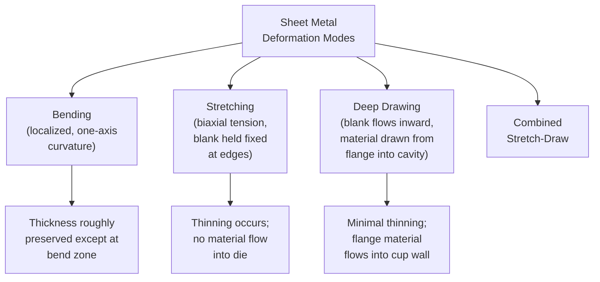

## Sheet Metal Forming

### Overview

Sheet metal forming encompasses processes that plastically deform flat sheet or coil stock into three-dimensional shapes without significant change in material thickness (as distinguished from bulk deformation processes like rolling/forging where thickness change is the primary objective). It is distinguished by high surface-area-to-volume ratios in the workpiece, deformation dominated by tensile and shear stresses (rather than the predominantly compressive stresses of bulk forming), and strong sensitivity to sheet anisotropy, thinning, and localized instability (necking, wrinkling, tearing).

---

### Fundamental Deformation Modes

#### Stretching vs. Drawing vs. Bending

Most real stamping operations combine elements of stretching and drawing, and the balance between the two — controlled largely by blank-holder force and lubrication — is a central process design variable.

#### Strain State: The Forming Limit Diagram

Sheet metal formability is commonly characterized using a **Forming Limit Diagram (FLD)**, which plots major principal strain ($\varepsilon_1$) against minor principal strain ($\varepsilon_2$) at each point on a formed part, with an empirically/analytically determined **Forming Limit Curve (FLC)** separating safe deformation from necking/failure. Strain states are classified by the ratio $\varepsilon_2/\varepsilon_1$:

- **Uniaxial tension** ($\varepsilon_2 < 0$, roughly $\varepsilon_2 \approx -\varepsilon_1/2$) — one direction stretches, the perpendicular in-plane direction contracts (as in a simple tensile test)
- **Plane strain** ($\varepsilon_2 = 0$) — generally the most failure-prone strain state, since no strain can distribute in the minor direction to relieve local thinning
- **Equibiaxial stretching** ($\varepsilon_2 = \varepsilon_1$) — both in-plane directions stretch equally, as at the pole of a hemispherical punch stretch

The FLC minimum typically occurs near the plane-strain condition, reflecting its heightened necking sensitivity. [Inference: exact FLC shape and minimum strain values are material-, thickness-, and strain-rate-dependent and are determined experimentally (e.g., via Nakazima or Marciniak testing) for each specific sheet material/gauge combination rather than being universal.]

---

### Bending

#### Principle

Bending deforms sheet by applying a moment across a line (the bend axis), producing plastic strain that varies through thickness: tension on the outer (convex) fiber, compression on the inner (concave) fiber, with a neutral axis (approximately at mid-thickness for simple bends, though it shifts toward the inner radius with sharper bends) experiencing no strain.

#### Springback

Upon unloading, the elastic strain component recovers, causing the bend angle/radius to partially return toward the original flat condition — a phenomenon called **springback**. Springback magnitude increases with higher yield strength, lower elastic modulus, and larger bend radius relative to sheet thickness, and is commonly compensated in die design via **overbending** (bending beyond the target angle to compensate for the anticipated elastic recovery) or **bottoming/coining** (applying high localized pressure at the bend to plastically reset the bend zone, reducing springback).

#### Minimum Bend Radius

Each material has a practical minimum bend radius (expressed as a multiple of sheet thickness, e.g., $1t$, $2t$) below which outer-fiber strain exceeds the material's fracture strain, causing cracking at the bend's outer surface. Minimum bend radius decreases with increasing material ductility and generally increases with material strength/hardness.

#### Common Bending Operations

- **V-bending** — Simple V-shaped punch and die; versatile, low tooling cost, used for prototyping and low-volume production
- **Edge (wipe) bending** — Sheet is clamped and a wiping punch bends the unsupported portion over a die edge/radius
- **Rotary bending** — A rotating forming tool bends sheet around a fixed radius block, producing minimal marking and consistent bend quality
- **Roll bending** — Sheet or plate is passed between three or more rolls to form large-radius curved or cylindrical shapes (e.g., tank shells, pipe sections)

---

### Deep Drawing

#### Principle

A flat sheet blank is formed into a cup or box shape by a punch pressing the blank into a die cavity, with a **blank holder** (or draw ring) applying controlled pressure on the blank's flange to regulate material flow into the die and prevent wrinkling, while allowing sufficient flow to avoid excessive thinning/tearing at the punch corner radius.

#### Key Process Parameters

- **Blank-holder force** — Balances two competing failure modes: too little force allows wrinkling in the flange (unsupported material buckles under the compressive hoop stress generated as the flange diameter decreases while being drawn inward); too much force restricts material flow, increasing tensile strain and risking tearing at the punch profile radius or cup wall
- **Drawing ratio** — $DR = D_0/D_p$, where $D_0$ is blank diameter and $D_p$ is punch diameter; a key formability metric indicating the severity of a draw, with a **limiting drawing ratio (LDR)** representing the maximum achievable in a single draw for a given material/lubrication/tooling combination before failure
- **Punch and die corner radii** — Sharper radii concentrate strain and increase tearing risk; excessively large radii can promote wrinkling in unsupported regions
- **Clearance (die-to-punch gap)** — Typically set slightly larger than sheet thickness to avoid unintended ironing (wall thinning) unless ironing is a deliberate secondary operation

#### Multi-Stage (Redraw) Operations

When the required drawing ratio exceeds what can be achieved in a single draw (the LDR), the part is formed through successive **redraw** operations, each further reducing diameter and increasing cup height, sometimes with intermediate **annealing** to restore ductility consumed by strain hardening between stages — analogous in principle to multi-pass wire drawing.

#### Earing

Deep-drawn cups from sheet with pronounced **planar anisotropy** (directional variation in mechanical properties within the sheet plane, arising from crystallographic texture developed during rolling) develop wavy, non-uniform rim height around the cup circumference, called **earing**, with ears typically forming at characteristic angular positions relative to the original rolling direction.

---

### Stretch Forming

#### Principle

The sheet is clamped rigidly at its edges (no material flow inward, unlike drawing) and formed over a die or form block predominantly by biaxial or uniaxial tensile stretching, producing thinning proportional to the local strain and generally excellent, wrinkle-free surface quality since the sheet remains under tension throughout.

#### Applications

Aircraft skin panels (using large stretch-forming presses that wrap sheet over a contoured form block while applying tension), automotive body panels with large, shallow-curvature surfaces where wrinkling risk from drawing would be unacceptable for a Class-A (visible, cosmetic) surface finish.

---

### Other Sheet Forming Processes

#### Ironing

A secondary operation (often following deep drawing) in which the punch-die clearance is deliberately set smaller than the incoming wall thickness, forcing controlled wall thinning and improving wall thickness uniformity and surface finish — the primary process for producing beverage can bodies from a drawn cup.

#### Spinning

A sheet blank, rotating with a mandrel on a lathe-like spinning machine, is progressively formed over the mandrel's contour by a roller or forming tool applying localized pressure, producing axisymmetric hollow parts (cones, hemispheres, cylindrical shells) without dedicated matched die sets — well suited to low-volume or large-diameter parts where full die tooling would be uneconomical.

#### Hydroforming

Sheet (or tube) is formed against a die cavity using pressurized fluid rather than a solid punch, providing more uniform pressure distribution and enabling complex, deep-draw geometries with improved formability compared to matched-die stamping, at the cost of longer cycle times and specialized pressure-vessel tooling. **Tube hydroforming** similarly expands a tube outward against a die cavity using internal fluid pressure combined with axial feed, widely used for automotive structural components (engine cradles, exhaust manifolds) requiring complex cross-sectional variation along the part's length.

#### Superplastic Forming

Certain fine-grained alloys (notably some titanium and aluminum alloys) exhibit **superplasticity** — the ability to sustain very large tensile elongations (often several hundred percent) at elevated temperature and low strain rate without necking — enabling forming of highly complex geometries in a single operation, typically using gas pressure to form sheet against a die at elevated temperature, though at slow cycle times unsuited to high-volume production.

---

### Shearing and Blanking (Preparatory/Complementary Operations)

While not "forming" in the deformation sense, shearing-family operations are integral to most sheet metal process sequences:

- **Blanking** — Cuts a flat piece (the blank) from sheet stock, with the blank being the desired part/workpiece and the surrounding material scrap
- **Piercing (punching)** — Cuts a hole in the sheet, with the removed slug being scrap and the surrounding sheet being the workpiece
- **Trimming** — Removes excess material (flange, flash) from a formed part
- **Notching, shearing, slitting** — Various edge-cutting operations

Shearing clearance (the gap between punch and die) significantly affects cut edge quality (burnish zone, fracture zone, burr formation) and is typically specified as a percentage of sheet thickness dependent on material and thickness.

---

### Formability Testing

- **Tensile test parameters** — Strain hardening exponent $n$ (higher $n$ indicates better distributed straining and resistance to localized necking) and normal anisotropy ratio $\bar{r}$ (higher $\bar{r}$ indicates better resistance to thinning, favorable for deep drawing) are standard formability indicators derived from uniaxial tensile testing.
- **Cupping tests (Erichsen, Olsen)** — A hemispherical punch stretches a clamped sheet blank until fracture; the punch depth at fracture is a simple relative formability index.
- **Nakazima and Marciniak tests** — Use varying specimen widths (Nakazima) or a carrier blank technique (Marciniak) to generate a range of strain states (from uniaxial through plane strain to equibiaxial) for constructing the full experimental Forming Limit Curve.

---

### Sheet Forming Defects

| Defect | Description | Primary Cause |
| --- | --- | --- |
| **Wrinkling** | Buckling/waviness in unsupported or compressively-stressed flange or wall regions | Insufficient blank-holder force, unsupported sheet in compression |
| **Tearing/splitting** | Localized fracture from excessive local thinning | Excessive blank-holder force restricting flow, sharp die/punch radii, drawing ratio exceeding LDR |
| **Earing** | Non-uniform rim height in deep-drawn cups | Planar anisotropy from sheet rolling texture |
| **Springback distortion** | Deviation from intended geometry after die release | Elastic recovery, high yield strength material, insufficient overbend compensation |
| **Orange peel** | Rough, dimpled surface texture visible after forming | Coarse grain size relative to sheet thickness |
| **Stretcher strains (Lüders bands)** | Visible surface striations/bands | Discontinuous yielding (Lüders effect) in certain low-carbon steels lacking temper/skin-pass rolling treatment |

---

### Illustration: Deep Drawing Force Balance (svg_diagram)

<svg xmlns="http://www.w3.org/2000/svg" viewBox="0 0 640 340">
<text x="320" y="22" font-size="15" text-anchor="middle" font-family="Arial" font-weight="bold">Deep Drawing Tooling (svg_diagram)</text>

<rect x="120" y="180" width="120" height="30" fill="none" stroke="black" stroke-width="2" />
<rect x="200" y="180" width="200" height="30" fill="none" stroke="black" stroke-width="2" />
<text x="500" y="200" font-size="10" font-family="Arial">Die</text>
<path d="M 240,180 Q 260,180 260,200" fill="none" stroke="black" stroke-width="2" />

<rect x="260" y="210" width="120" height="100" fill="none" stroke="black" stroke-width="2" />

<rect x="120" y="140" width="120" height="20" fill="none" stroke="black" stroke-width="2" />
<text x="60" y="150" font-size="10" font-family="Arial">Blank</text>
<text x="60" y="163" font-size="10" font-family="Arial">holder</text>
<line x1="150" y1="120" x2="150" y2="140" stroke="black" stroke-width="1.5" marker-end="url(#dd1)" />
<text x="150" y="110" font-size="9" text-anchor="middle" font-family="Arial">Blank-holder force</text>

<path d="M 120,160 L 240,160 Q 260,160 260,180 L 260,290 Q 260,300 270,300 L 370,300 Q 380,300 380,290 L 380,180 Q 380,160 400,160" fill="none" stroke="black" stroke-width="2.5" />

<text x="450" y="250" font-size="9" font-family="Arial">Cup wall</text>

<text x="450" y="264" font-size="9" font-family="Arial">(minimal thinning)</text>

<rect x="290" y="90" width="60" height="140" fill="none" stroke="black" stroke-width="2.5" />
<text x="320" y="80" font-size="10" text-anchor="middle" font-family="Arial">Punch</text>
<line x1="320" y1="60" x2="320" y2="90" stroke="black" stroke-width="1.5" marker-end="url(#dd1)" />
<text x="320" y="50" font-size="9" text-anchor="middle" font-family="Arial">Punch force</text>

<line x1="180" y1="150" x2="220" y2="150" stroke="black" stroke-width="1.2" marker-end="url(#dd1)" stroke-dasharray="2,2" />
<text x="130" y="175" font-size="8" font-family="Arial">Flange flows inward</text>
</svg>

---

### Worked Example: Limiting Drawing Ratio Check

Given: A cylindrical cup is to be drawn from steel sheet with a blank diameter $D_0 = 150\,\text{mm}$ to a punch (cup) diameter $D_p = 70\,\text{mm}$. The material's limiting drawing ratio, established from prior trials/material data, is $LDR = 2.1$.

**Step 1 — Required drawing ratio:**

$$DR = \frac{D_0}{D_p} = \frac{150}{70} \approx 2.14$$

**Step 2 — Feasibility check:**

Since $DR (2.14) > LDR (2.1)$, the draw exceeds the material's single-draw capability by a small margin, indicating high risk of tearing at the punch corner radius if attempted in one operation. A two-stage draw (initial draw to an intermediate diameter, e.g., $D_1 \approx 95$–$100\,\text{mm}$, followed by a redraw to the final 70 mm diameter, potentially with intermediate stress-relief or process annealing) would be the standard corrective approach. [Inference: this is an illustrative feasibility check; actual LDR values are material-, thickness-, lubrication-, and tooling-dependent and are typically established through material characterization or trial draws rather than assumed from a generic figure.]

---

### **Related Topics**

- Rolling processes (upstream sheet/coil production)
- Forming limit diagrams and formability testing methods
- Anisotropy and crystallographic texture in sheet metal
- Springback prediction and compensation methods
- Sheet metal forming simulation (finite element analysis)
- Press and die design for stamping operations
- Hydroforming (sheet and tube)
- Superplastic forming of titanium and aluminum alloys
- Strain hardening exponent and its role in formability
- Automotive body panel manufacturing processes