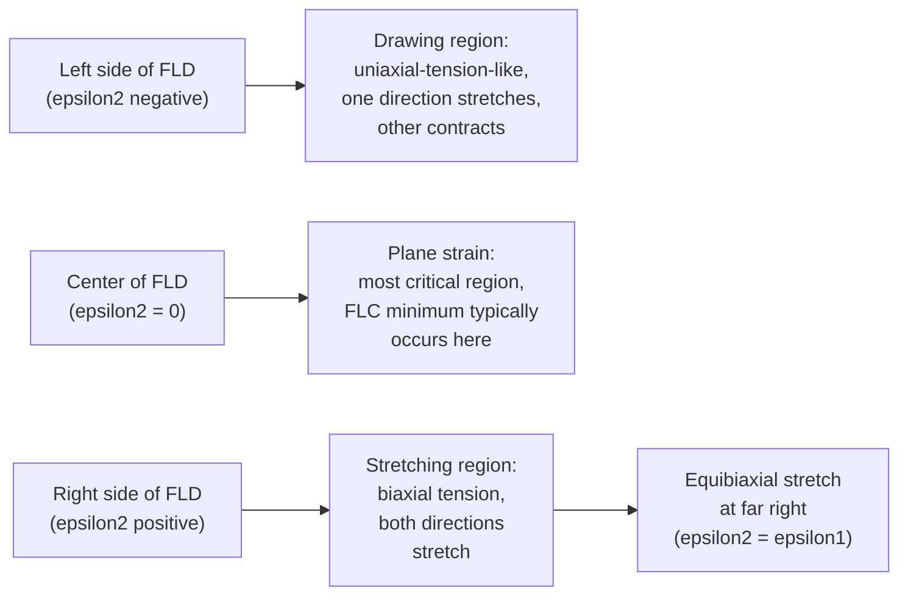
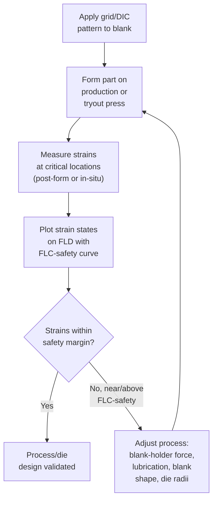

## Formability and Forming Limit Diagrams

### Overview

Formability is the capacity of a sheet metal (or, more broadly, a metal workpiece) to undergo plastic deformation into a desired shape without failure — through necking, tearing, wrinkling, or fracture. The **Forming Limit Diagram (FLD)** is the primary engineering tool used to quantify and predict sheet metal formability, mapping the strains a material can safely sustain under different loading (strain path) conditions. This topic addresses the material science underlying formability, the construction and interpretation of FLDs, and the material parameters that govern forming behavior.

---

### Fundamental Concepts in Formability

#### What Limits Formability

Formability failure in sheet metal is governed primarily by two distinct instability mechanisms:

1. **Diffuse necking** — A broad, gradual localization of strain over a relatively large region, typically occurring first under certain strain states (notably near-uniaxial tension); often precedes but does not immediately cause fracture.
2. **Localized necking** — A narrow, sharp band of intense strain localization that rapidly leads to fracture; this is the failure mode that the Forming Limit Curve is specifically constructed to predict, since it represents the practical onset of unusable/scrap material in a stamping operation.

#### Key Material Parameters Governing Formability

**Strain Hardening Exponent ($n$-value)**

Derived from the power-law (Hollomon) flow curve relationship:

$$\sigma = K\varepsilon^n$$

where $\sigma$ is true stress, $\varepsilon$ is true strain, $K$ is the strength coefficient, and $n$ is the strain hardening exponent. A higher $n$-value indicates the material continues to strain-harden significantly as deformation proceeds, which delays the onset of localized necking (per the Considère criterion, necking begins when $d\sigma/d\varepsilon = \sigma$, i.e., at true strain $\varepsilon = n$ for uniaxial tension) and promotes more uniform strain distribution across a formed part — generally correlating with better overall stretchability.

**Normal Anisotropy Ratio ($\bar{r}$-value, Lankford coefficient)**

Defined from a uniaxial tensile test as the ratio of width strain to thickness strain:

$$r = \frac{\varepsilon_w}{\varepsilon_t}$$

The average (normal) anisotropy across multiple sheet orientations is:

$$\bar{r} = \frac{r_0 + 2r_{45} + r_{90}}{4}$$

where subscripts denote the angle relative to the rolling direction. A high $\bar{r}$-value indicates the material resists thinning in favor of deformation in the sheet plane, which is particularly beneficial for deep drawing (where wall-thinning/tearing at the punch radius is a primary failure mode), since the material preferentially flows inward from the flange rather than thinning at the cup wall.

**Planar Anisotropy ($\Delta r$)**

$$\Delta r = \frac{r_0 - 2r_{45} + r_{90}}{2}$$

Quantifies directional variation in $r$-value within the sheet plane; a non-zero $\Delta r$ is the primary cause of **earing** in deep-drawn cups (see Sheet Metal Forming), with ears forming preferentially in directions of higher $r$-value.

**Strain Rate Sensitivity ($m$-value)**

$$\sigma = C\dot{\varepsilon}^m$$

where $\dot{\varepsilon}$ is strain rate and $C$ is a material constant. A higher $m$-value indicates the material's flow stress increases more with strain rate, which suppresses local necking (a locally thinning, faster-straining region experiences a disproportionate local strength increase, redistributing strain to adjacent material) — this effect is the physical basis for **superplasticity**, where very high $m$-values (often above roughly 0.3–0.5) enable extreme uniform elongation.

---

### The Forming Limit Diagram

#### Construction and Axes

The FLD plots **major principal (engineering or true) strain** $\varepsilon_1$ (vertical axis, always the larger, positive in-plane strain) against **minor principal strain** $\varepsilon_2$ (horizontal axis, which may be positive or negative) measured at points across a formed part (historically via a printed circle-grid pattern on the sheet before forming, with post-forming ellipse measurements giving the strain state at each grid location; increasingly via digital image correlation (DIC) systems for continuous, high-resolution strain mapping).

#### The Forming Limit Curve (FLC)

The FLC is an empirically (or analytically) determined boundary line on the FLD separating combinations of $(\varepsilon_1, \varepsilon_2)$ that are safely achievable from those that result in localized necking/failure. Strain states plotting below the FLC are considered safe; states on or above it indicate imminent or actual failure.

#### Strain Path Regions on the FLD

- **Left region (drawing, $\varepsilon_2 < 0$)** — Corresponds to material in the flange of a deep-drawn part, where hoop compression accompanies radial tension; the material is relatively forgiving here since thinning is resisted by the biaxial-opposite strain state.
- **Center (plane strain, $\varepsilon_2 = 0$)** — The most formability-critical strain state, since no strain relief is available in the minor direction; this is where the FLC typically reaches its lowest major strain value ($FLD_0$, the plane-strain forming limit, a commonly cited single-value formability benchmark for comparing sheet materials/gauges).
- **Right region (stretching, $\varepsilon_2 > 0$)** — Corresponds to biaxial stretching over a punch dome or die cavity; generally more forgiving than plane strain since strain can distribute in both principal directions.

---

### Experimental Determination of the FLC

#### Nakazima Test

Uses a series of rectangular specimens of varying width (from narrow strips approaching uniaxial tension to full-width discs approaching equibiaxial stretch), each stretched over a hemispherical punch until fracture, with strains measured at/near the fracture location using the circle-grid or DIC method. Varying specimen width produces different friction and constraint conditions that generate the full range of strain paths needed to map the complete FLC.

#### Marciniak Test

Uses a flat-bottomed (rather than hemispherical) punch combined with a sacrificial "carrier blank" (a perforated or slotted sheet placed between the punch and test specimen) that localizes deformation and failure to the flat, central region of the test specimen away from punch-radius friction effects, providing a more friction-independent measurement of the underlying material strain limit — often preferred for research-grade FLC determination for this reason.

#### Circle Grid Analysis (Traditional Method)

A grid of small circles (traditionally printed via electrochemical etching) is applied to the flat blank before forming; after forming, circles near or within the failure zone deform into ellipses, whose major and minor axis strains directly give the local $(\varepsilon_1, \varepsilon_2)$ strain state, with circles nearest to (but not within) the visible neck/fracture typically taken as representing the forming limit condition.

#### Digital Image Correlation (DIC)

A modern alternative/supplement to circle-grid analysis: a random speckle pattern is applied to the sheet surface, and stereo cameras track pattern deformation throughout the forming process, providing continuous, full-field, time-resolved strain measurement (rather than a single post-forming snapshot), enabling more precise identification of the strain state at the instant necking initiates.

---

### Empirical FLC Prediction Models

Since full experimental FLC determination is time- and material-intensive, several empirical formulas relate the plane-strain forming limit $FLD_0$ to more readily available material properties, most notably sheet thickness and strain hardening exponent:

**Keeler-Brazier Equation** (a widely referenced empirical relationship for steels):

$$FLD_0 = \left(23.3 + 14.13t\right)\frac{n}{0.21}$$

where $t$ is sheet thickness (in mm) and $n$ is the strain hardening exponent, with $FLD_0$ expressed as engineering percent major strain at plane strain. [Inference: this specific empirical formula and its coefficients are commonly cited in formability literature for low-carbon/mild steels; applicability to other alloy systems (aluminum, advanced high-strength steels, etc.) is limited, and such alloys typically require their own calibrated empirical relationships or direct experimental FLC determination, since the underlying correlation was developed from a specific class of materials.]

The general trend the equation reflects — that $FLD_0$ increases with both sheet thickness and strain hardening exponent — is broadly consistent with the physical understanding that thicker sheet delays through-thickness necking localization and higher $n$-value materials distribute strain more uniformly before failure.

---

### Practical Application in Stamping Process Design

#### Safety Margin (Forming Limit Curve for Process Design)

In production die design and process validation, a **Forming Limit Curve for Safety (FLC-safety or FLCsafety)** is commonly used — offset below the experimentally-measured FLC (a common convention subtracts a fixed strain margin, e.g., roughly 10% engineering major strain, though conventions vary by industry standard and OEM specification) to account for material batch-to-batch variation, measurement uncertainty, and process variation in production, ensuring a safety margin below the point of actual imminent failure. [Inference: the specific safety margin convention varies by industry standard, OEM specification, or in-house quality practice, and is not a single universally fixed value.]

#### Strain Analysis Workflow in Die Tryout

#### Simulation Integration

Modern stamping process design routinely integrates finite element forming simulation with FLD-based failure prediction, allowing virtual assessment of strain distribution and failure risk before physical die tryout, analogous in philosophy to solidification simulation in casting — reducing costly physical die iteration cycles. [Inference: the degree of simulation-driven versus physical-tryout-driven die development varies by company scale, part criticality, and industry sector.]

---

### Formability Comparison Across Material Classes

| Material Class | Typical $n$-value range | Typical $\bar{r}$-value | General Formability Notes |
| --- | --- | --- | --- |
| Low-carbon (mild) steel | ~0.20–0.25 | ~1.0–1.8 | Good general formability; widely used baseline |
| Advanced High-Strength Steel (AHSS, e.g., DP, TRIP) | ~0.10–0.20 (varies by grade) | ~0.8–1.0 | Reduced formability vs. mild steel; strength-formability trade-off is a major design consideration |
| Aluminum alloys (5xxx, 6xxx sheet) | ~0.20–0.30 | ~0.6–0.8 | Lower $\bar{r}$ than steel (less resistance to thinning); often requires larger die radii, different lubrication practice |
| Austenitic stainless steel | ~0.40–0.50 | ~0.9–1.1 | High $n$-value gives excellent stretch formability; work hardens substantially |

[Inference: the numeric ranges above are broadly representative order-of-magnitude figures commonly cited in formability literature; specific values vary considerably by exact alloy grade, temper, gauge, and processing history, and production formability data should be obtained from material supplier certifications or direct testing for a specific material lot.]

---

### Illustration: Forming Limit Diagram Schematic (svg_diagram)

<svg xmlns="http://www.w3.org/2000/svg" viewBox="0 0 640 420">
<text x="320" y="22" font-size="15" text-anchor="middle" font-family="Arial" font-weight="bold">Forming Limit Diagram (svg_diagram)</text>

<line x1="320" y1="380" x2="320" y2="50" stroke="black" stroke-width="2" />
<line x1="100" y1="330" x2="580" y2="330" stroke="black" stroke-width="2" />
<text x="320" y="40" font-size="12" text-anchor="middle" font-family="Arial">Major strain (e1)</text>
<text x="585" y="334" font-size="12" font-family="Arial">Minor strain (e2)</text>
<text x="130" y="345" font-size="10" font-family="Arial">Drawing</text>
<text x="440" y="345" font-size="10" font-family="Arial">Stretching</text>
<text x="315" y="345" font-size="9" text-anchor="middle" font-family="Arial">0</text>

<path d="M 140,120 Q 220,180 320,220 Q 420,150 500,90" fill="none" stroke="black" stroke-width="2.5" />

<text x="500" y="78" font-size="10" font-family="Arial">FLC</text>

<path d="M 150,160 Q 220,210 320,245 Q 410,190 480,135" fill="none" stroke="black" stroke-width="1.5" stroke-dasharray="5,4" />

<text x="460" y="128" font-size="9" font-family="Arial">FLC-safety</text>

<text x="180" y="270" font-size="9" font-family="Arial">Safe zone</text>

<circle cx="220" cy="270" r="4" fill="black" />
<circle cx="280" cy="255" r="4" fill="black" />
<circle cx="340" cy="235" r="4" fill="black" />
<circle cx="400" cy="180" r="4" fill="red" />
<text x="405" y="175" font-size="8" font-family="Arial" fill="red">near limit</text>

<line x1="320" y1="330" x2="320" y2="220" stroke="gray" stroke-width="1" stroke-dasharray="3,2" />
<text x="325" y="290" font-size="8" font-family="Arial" fill="gray">Plane strain path</text>
<line x1="320" y1="330" x2="500" y2="90" stroke="gray" stroke-width="1" stroke-dasharray="3,2" />
<text x="440" y="220" font-size="8" font-family="Arial" fill="gray" transform="rotate(-35 440,220)">Equibiaxial path</text>
</svg>

---

### Worked Example: Assessing an $n$-Value's Effect on Necking Onset

Given: A sheet material follows $\sigma = 550\varepsilon^{0.18}$ (MPa). Per the Considère criterion, diffuse necking under uniaxial tension begins at true strain $\varepsilon = n$.

**Step 1 — Necking onset strain:**

$$\varepsilon_{neck} = n = 0.18$$

**Step 2 — Stress at necking onset:**

$$\sigma_{neck} = 550 \times (0.18)^{0.18}$$

$$(0.18)^{0.18} = e^{0.18\ln(0.18)} = e^{0.18 \times (-1.715)} = e^{-0.309} \approx 0.734$$

$$\sigma_{neck} \approx 550 \times 0.734 \approx 403.7\,\text{MPa}$$

**Interpretation:** A material with this relatively modest $n = 0.18$ would begin diffuse necking at only 18% true strain under uniaxial tension, indicating comparatively limited uniform elongation capacity compared to a higher-$n$ alternative (e.g., an austenitic stainless steel with $n \approx 0.45$ would sustain uniform straining to roughly 45% true strain before necking onset under the same idealized analysis) — illustrating why $n$-value is a primary formability screening parameter in material selection for stretch-dominated stamping operations. [Inference: the Considère criterion applies strictly to uniaxial tension; the qualitative comparison to more complex biaxial FLD behavior is illustrative of the general correlation between $n$-value and stretchability, not a direct quantitative equivalence.]

---

### **Related Topics**

- Sheet metal forming (bending, drawing, stretching processes)
- Rolling processes (source of sheet anisotropy via rolling texture)
- Strain hardening and the flow curve (Hollomon equation)
- Anisotropy and crystallographic texture in metals
- Tensile testing and mechanical property determination
- Finite element simulation of sheet metal forming
- Advanced High-Strength Steels (AHSS) and their formability challenges
- Superplastic forming and strain rate sensitivity
- Digital image correlation (DIC) strain measurement techniques
- Earing and planar anisotropy in deep drawing