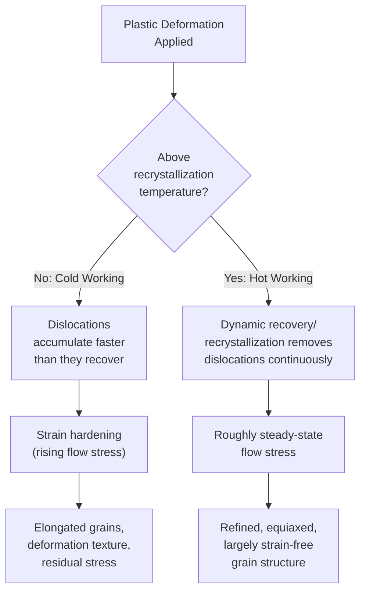
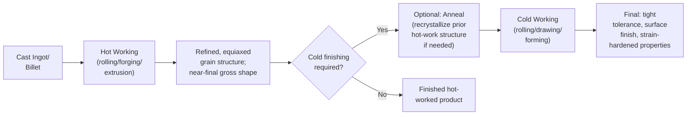

## Hot Working versus Cold Working

### Overview

Hot working and cold working are the two fundamental thermal regimes of metal deformation processing, distinguished not by an absolute temperature but by the deformation temperature's relationship to the material's **recrystallization temperature**. This distinction underlies the mechanical, microstructural, and practical process differences seen across rolling, forging, extrusion, and drawing (each covered separately in this chapter), and represents one of the most fundamental organizing concepts in metal forming and physical metallurgy.

---

### The Defining Criterion: Recrystallization Temperature

#### Definition

Hot working is deformation performed **above** a material's recrystallization temperature; cold working is deformation performed **below** it. The recrystallization temperature itself is commonly approximated (for many metals) as:

$$T_{recrystallization} \approx 0.3\text{–}0.5 \times T_m \text{ (absolute/homologous temperature)}$$

where $T_m$ is the material's absolute melting temperature. This is why "hot" and "cold" working are homologous-temperature concepts rather than fixed absolute temperatures: lead and tin recrystallize near room temperature (so deforming them at room temperature is metallurgically "hot working"), while tungsten and molybdenum require temperatures of many hundreds of degrees Celsius to recrystallize, and processing them at what would seem like an elevated temperature by everyday standards may still be metallurgically "cold" or "warm" working. [Inference: the 0.3–0.5 $T_m$ range is a widely cited approximate rule of thumb; the precise recrystallization temperature for a given alloy depends on composition, prior deformation history, and grain size, and is more accurately determined experimentally for critical applications.]

#### Warm Working

An intermediate regime, performed above room temperature but below the full recrystallization threshold, balancing some of the reduced flow-stress benefit of hot working against better dimensional control and surface finish characteristic of cold working; discussed as a distinct category in the process-specific chapters (forging, extrusion) but governed by the same underlying physical principles described here.

---

### Metallurgical Mechanisms

#### What Happens During Cold Working

Deformation below the recrystallization temperature increases dislocation density substantially, as dislocations generated by plastic strain accumulate and interact (tangling, pile-ups at grain boundaries and other obstacles) faster than any thermally-activated recovery process can remove them at the low working temperature. This dislocation accumulation is the physical basis of **strain hardening (work hardening)**, described by the Hollomon flow curve relationship:

$$\sigma = K\varepsilon^n$$

As deformation proceeds, flow stress rises continuously (positive $n$), grains elongate and flatten in the direction of principal strain, and a preferred crystallographic orientation (**deformation texture**) develops, contributing to mechanical anisotropy in the finished product.

#### What Happens During Hot Working

At temperatures above the recrystallization threshold, thermally-activated processes — **dynamic recovery** (dislocation rearrangement and partial annihilation during deformation) and, at sufficiently high temperature and strain, **dynamic recrystallization** (nucleation and growth of new, strain-free grains during the deformation process itself) — continuously counteract dislocation accumulation. This keeps flow stress comparatively low and roughly steady-state (rather than continuously rising) throughout extended deformation, and yields a refined, largely strain-free, equiaxed grain structure in the finished product rather than the elongated, texture-heavy structure typical of cold-worked material.

---

### Comparative Characteristics

| Characteristic | Hot Working | Cold Working |
| --- | --- | --- |
| Temperature regime | Above recrystallization temperature | Below recrystallization temperature |
| Flow stress | Low, roughly steady-state | Higher, rising with strain (strain hardening) |
| Force/energy required | Lower | Higher (for equivalent reduction) |
| Achievable deformation per operation | Large | Limited (without intermediate annealing) |
| Resulting grain structure | Refined, equiaxed | Elongated, textured |
| Strengthening mechanism | Minimal residual work hardening (mostly annealed/recrystallized) | Significant strain hardening (strengthened but less ductile) |
| Surface finish | Poorer (oxidation/scale formation) | Excellent |
| Dimensional tolerance | Looser (thermal expansion/contraction effects) | Tight |
| Residual stress | Generally low | Can be significant, depending on process |
| Porosity/casting defect closure | Effective (deformation + diffusion at high temp closes internal voids) | Less effective at closing internal defects |
| Typical first processing step | Yes (breakdown of cast ingot/billet structure) | No (typically follows hot working as a finishing step) |

---

### Hot Working: Detailed Considerations

#### Advantages

1. **Grain refinement and homogenization** — Breaks up the coarse, dendritic as-cast structure (see Continuous and Centrifugal Casting) into a finer, more uniform equiaxed grain structure
2. **Porosity closure** — The combination of high temperature (enabling diffusion-assisted bonding) and compressive/shear deformation can close internal porosity and voids present in cast material
3. **Large deformation with lower force** — Since flow stress remains low and roughly constant, very large total reductions are achievable economically, making hot working the natural choice for primary breakdown of cast ingots/blooms into workable stock
4. **Improved mechanical properties from grain refinement** — Finer, more uniform grain structure generally improves toughness and ductility compared to the original cast structure

#### Disadvantages

1. **Oxidation and scale formation** — High temperature promotes surface oxidation, producing scale that must be removed (descaling) and can cause surface pitting/defects if not adequately managed
2. **Poor dimensional control** — Thermal expansion during heating and contraction during post-deformation cooling introduce dimensional variability, requiring looser tolerances or subsequent cold finishing operations
3. **Tooling wear and cost** — Elevated temperatures accelerate tool/die wear and may require specialized (heat-resistant) tooling materials and lubrication systems
4. **Energy consumption for heating** — Requires furnace heating of the workpiece, adding energy cost and process time compared to processing at ambient temperature
5. **Potential for hot shortness/cracking** — Certain alloys or impurity conditions (e.g., sulfur-induced hot shortness in some steels) can cause cracking if hot working is performed outside an appropriate temperature window

---

### Cold Working: Detailed Considerations

#### Advantages

1. **Excellent surface finish** — No oxidation/scale at ambient temperature; smooth, often bright surface finish achievable
2. **Tight dimensional tolerance** — No thermal expansion/contraction effects during forming, enabling precision net or near-net shape production
3. **Strengthening via strain hardening** — Increases yield and tensile strength (and generally hardness) compared to the annealed starting condition, which can be a deliberately engineered final property (e.g., cold-drawn wire, cold-rolled sheet tempers)
4. **No furnace/heating equipment required** — Lower energy consumption and simpler process infrastructure for the forming step itself

#### Disadvantages

1. **Limited deformation per operation** — Strain hardening progressively raises the force required and reduces remaining ductility, limiting achievable reduction before intermediate annealing becomes necessary
2. **Higher forming forces** — For an equivalent reduction, cold working requires substantially higher force/pressure than hot working, demanding more robust (and costly) tooling and equipment
3. **Residual stress** — Non-uniform deformation through the workpiece section can leave significant residual stresses in the finished product, which may require stress-relief treatment for dimensionally critical or fatigue-sensitive applications
4. **Reduced ductility in the strengthened condition** — While strength increases, ductility and toughness typically decrease with increasing cold work, a trade-off that must be managed against the application's requirements
5. **Anisotropy** — Deformation texture developed during cold working produces direction-dependent mechanical properties (see Formability and Forming Limit Diagrams — anisotropy ratio $\bar{r}$ and planar anisotropy $\Delta r$)

---

### Typical Process Sequencing: Hot-then-Cold Practice

A very common industrial practice sequences hot working (for large-scale shape/section reduction from cast or billet stock, taking advantage of low force and large achievable deformation) followed by cold working (for final dimensional precision, surface finish, and/or engineered strengthening), often with an intermediate annealing/recrystallization heat treatment step between the two if substantial cold deformation is required:

This sequence is seen across nearly every process family in this chapter: hot-rolled coil is often cold-rolled for automotive sheet; hot-extruded rod is cold-drawn for precision wire/bar; hot-forged blanks may receive cold coining/restriking for tight-tolerance features.

---

### Annealing Between Cold-Working Stages

Since cold working accumulates strain hardening that limits further deformation, **process (intermediate) annealing** — heating the strain-hardened material above its recrystallization temperature, then cooling — is used between heavy cold-working stages to restore ductility by triggering static recrystallization (new, strain-free grain nucleation and growth occurring after deformation has stopped, as opposed to the dynamic recrystallization occurring during hot working itself). This annealing-and-deform cycle can be repeated as many times as needed to reach a final heavily cold-worked dimension while managing ductility at each stage — directly analogous to the multi-pass drawing schedules discussed under Wire and Tube Drawing.

---

### Recovery, Recrystallization, and Grain Growth (Annealing Stages)

Upon annealing cold-worked material, three sequential (and partially overlapping) stages occur with increasing temperature/time:

1. **Recovery** — Dislocation rearrangement and partial annihilation without new grain formation; relieves some internal stress and partially restores properties (e.g., some ductility improvement) while retaining most of the strengthened, elongated grain structure and much of the original strength.
2. **Recrystallization** — Nucleation and growth of new, strain-free grains, consuming the deformed microstructure entirely; produces a substantial drop in strength/hardness and corresponding increase in ductility, effectively "resetting" the material's work-hardening state.
3. **Grain growth** — At higher temperature or longer time beyond full recrystallization, the newly formed strain-free grains continue to grow (driven by reduction in total grain boundary energy), which can reduce strength (via the Hall-Petch relationship, since larger grain size generally reduces yield strength) if annealing is carried too far.

---

### Illustration: Flow Stress Behavior — Hot vs. Cold Working (svg_diagram)

<svg xmlns="http://www.w3.org/2000/svg" viewBox="0 0 640 380">
<text x="320" y="22" font-size="15" text-anchor="middle" font-family="Arial" font-weight="bold">Flow Stress vs. Strain: Hot vs. Cold Working (svg_diagram)</text>

<line x1="80" y1="330" x2="80" y2="60" stroke="black" stroke-width="2" />
<line x1="80" y1="330" x2="580" y2="330" stroke="black" stroke-width="2" />
<text x="330" y="360" font-size="12" text-anchor="middle" font-family="Arial">True strain</text>
<text x="35" y="200" font-size="12" font-family="Arial" transform="rotate(-90 35,200)">Flow stress</text>

<path d="M 80,320 Q 200,220 350,140 Q 450,100 560,75" fill="none" stroke="black" stroke-width="2.5" />

<text x="450" y="90" font-size="11" font-family="Arial">Cold working

(strain hardening, sigma = K*eps^n)</text>

<text x="380" y="105" font-size="11" font-family="Arial">Cold working</text>

<text x="380" y="118" font-size="10" font-family="Arial">(rising, strain hardening)</text>

<path d="M 80,320 Q 130,250 180,235 Q 250,225 560,225" fill="none" stroke="black" stroke-width="2.5" stroke-dasharray="7,4" />

<text x="380" y="245" font-size="10" font-family="Arial">Hot working (roughly steady-state,</text>

<text x="380" y="258" font-size="10" font-family="Arial">dynamic recovery/recrystallization)</text>

<text x="150" y="280" font-size="9" font-family="Arial">Both start from</text>

<text x="150" y="292" font-size="9" font-family="Arial">same initial yield</text>

</svg>

---

### Worked Example: Comparing Relative Flow Stress

Given: A steel is cold worked and follows $\sigma_{cold} = 600\varepsilon^{0.20}$ (MPa) up to $\varepsilon = 0.5$. The same alloy, hot worked at an elevated temperature, exhibits a roughly steady-state flow stress of $\sigma_{hot} \approx 80\,\text{MPa}$ throughout comparable strain levels.

**Cold working flow stress at $\varepsilon = 0.5$:**

$$\sigma_{cold} = 600 \times (0.5)^{0.20}$$

$$(0.5)^{0.20} = e^{0.20 \times \ln(0.5)} = e^{0.20 \times (-0.693)} = e^{-0.1386} \approx 0.8706$$

$$\sigma_{cold} \approx 600 \times 0.8706 \approx 522.4\,\text{MPa}$$

**Comparison:**

$$\frac{\sigma_{cold}}{\sigma_{hot}} = \frac{522.4}{80} \approx 6.5$$

At this strain level, the cold-worked flow stress is roughly 6.5 times the hot-worked flow stress — illustrating quantitatively why cold-forming equipment (presses, rolling mills, drawing benches) generally requires substantially greater force/power capacity than equivalent hot-working equipment for the same material and deformation amount, and why hot working is the practical choice for heavy primary deformation. [Inference: these are illustrative representative values; actual flow stress magnitudes and their ratio depend heavily on the specific alloy, exact hot-working temperature/strain rate, and cold-working strain path, and should be obtained from material-specific flow curve data for engineering calculations.]

---

### **Related Topics**

- Rolling processes (hot rolling vs. cold rolling applications)
- Forging processes (hot, warm, and cold forging)
- Extrusion processes (hot vs. cold extrusion)
- Wire and tube drawing (cold working with intermediate annealing)
- Strain hardening and the Hollomon flow curve equation
- Recovery, recrystallization, and grain growth (annealing theory)
- Formability and Forming Limit Diagrams (anisotropy from deformation texture)
- Dynamic vs. static recrystallization mechanisms
- Hot shortness and temperature-dependent workability windows
- Residual stress in formed metal products