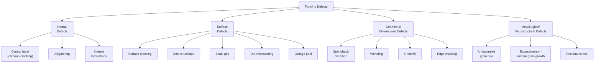
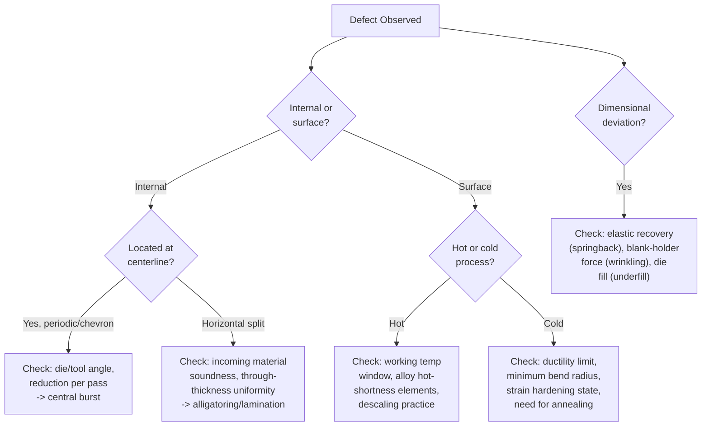

## Forming Defects and Their Causes

### Overview

Forming defects are deviations from intended geometry, surface quality, or internal soundness arising during bulk and sheet metal deformation processes (rolling, forging, extrusion, drawing, and sheet forming). Unlike casting defects, which originate from solidification phenomena, forming defects arise from plastic flow behavior — non-uniform deformation, friction effects, material ductility limits, and process/tooling parameters. This topic consolidates and cross-references defect mechanisms across all forming processes covered in this chapter, providing a unified diagnostic framework.

---

### Classification Framework

---

### 1. Internal Defects

#### Central Burst (Chevron Cracking)

**Description:** Internal, periodic V-shaped or chevron-pattern cracks occurring along the centerline of a workpiece, generally invisible from the exterior surface, requiring internal inspection (ultrasonic testing, sectioning) for detection.

**Mechanism:** Occurs when the deformation zone geometry — specifically a combination of low die/tool angle and light reduction per pass — produces a secondary, non-uniform plastic zone at the workpiece center that does not fully consolidate the material, leaving a region of hydrostatic tension at the centerline (as opposed to the compressive stress state dominating elsewhere in the deformation zone) that opens as periodic internal cracks.

**Processes affected:** Wire and rod drawing, extrusion (particularly at low extrusion ratios/shallow die angles), and to some extent open-die forging of bar stock.

**Prevention:** Increase die/tool angle or increase reduction per pass (both increase the hydrostatic compression at the centerline, suppressing the secondary tensile zone); avoid combinations of very light reduction with very shallow die angles; select die angle nearer the process's theoretically optimal angle for the given reduction (see Wire and Tube Drawing, optimum die angle discussion).

#### Alligatoring

**Description:** Splitting of a workpiece along a horizontal (through-thickness) plane during rolling, opening like an alligator's jaws as the workpiece progresses through the roll gap.

**Mechanism:** Arises from non-uniform through-thickness deformation combined with material inhomogeneity (e.g., centerline porosity or segregation inherited from casting), such that the surface layers deform differently from the core, generating a horizontal shear/tensile condition at the interface.

**Processes affected:** Primarily rolling, particularly of cast material with unrefined internal structure.

**Prevention:** Ensure adequate prior breakdown/homogenization (hot working) of cast structure before heavy rolling reduction; verify incoming material soundness (absence of significant internal porosity/segregation).

#### Internal Laminations

**Description:** Internal separations parallel to the working direction/rolled surface.

**Mechanism:** Pre-existing internal defects (porosity, inclusions, segregation bands) in the starting material are elongated and flattened during deformation rather than healed or consolidated, particularly if deformation temperature/pressure conditions are insufficient to promote diffusion bonding across the defect interface.

**Processes affected:** Rolling (most common), forging.

**Prevention:** Incoming material quality control (soundness verification via ultrasonic testing before heavy working); adequate hot-working temperature and reduction to promote defect closure/healing.

---

### 2. Surface Defects

#### Surface Cracking (Hot Shortness / Speed Cracking)

**Description:** Cracks appearing at the workpiece surface, sometimes periodic/transverse (particularly in extrusion, "fir-tree" pattern) or more randomly distributed.

**Mechanism:** In hot working, surface cracking commonly results from **hot shortness** — reduced ductility at the working temperature due to low-melting-point grain boundary phases (e.g., iron sulfide in steel without adequate manganese to tie up sulfur) that weaken grain boundaries at elevated temperature — or from excessive local temperature rise (from deformation/friction heating exceeding the alloy's safe working window, particularly at high extrusion/rolling speeds). In cold working, surface cracking results from exceeding the material's cold ductility limit (e.g., excessive bend severity relative to minimum bend radius, or excessive cold reduction without intermediate annealing).

**Processes affected:** Hot rolling, hot extrusion (speed cracking), forging, sheet bending (outer-fiber cracking at tight bend radii).

**Prevention:** Control working temperature within the alloy's safe hot-working window; control alloy composition (e.g., sulfur/manganese balance in steel) to avoid hot-shortness-promoting phases; reduce working speed if speed-induced temperature rise is implicated; for cold operations, respect minimum bend radius or apply intermediate annealing for heavy cold reduction.

#### Cold Shuts (Forging Laps) and Seams (Drawing/Rolling)

**Description:** A surface discontinuity where metal has folded onto itself without fusing (forging cold shut/lap) or an elongated surface line from a pre-existing surface defect (drawing/rolling seam).

**Mechanism:** In forging, improper material flow (often from poor preform/die design causing metal to fold back on itself as it fills a die cavity) creates a lap that does not weld together under the applied pressure. In drawing/rolling, pre-existing surface defects in the incoming stock (laps, scratches, seams from earlier processing) are elongated along the working direction rather than healed.

**Processes affected:** Closed-die forging (cold shuts/laps), wire/rod drawing and rolling (seams from incoming stock defects).

**Prevention:** Forging: improve preform/blocking die design to promote favorable, non-folding material flow; verify adequate die fill sequence. Drawing/rolling: incoming stock surface inspection and conditioning (grinding, pickling) before working.

#### Scale Pits

**Description:** Surface pitting from oxide scale mechanically worked into the surface during hot deformation.

**Mechanism:** Inadequate descaling before or during hot working allows oxide scale to be pressed into the workpiece surface by the working tool/die/roll, leaving pits upon scale removal or subsequent processing.

**Processes affected:** Hot rolling, hot forging.

**Prevention:** Effective descaling (high-pressure water descaling, mechanical scale breakers) immediately before working; minimize time at temperature (limiting scale growth) prior to deformation.

#### Die Lines / Scoring

**Description:** Longitudinal surface scratches or grooves aligned with the working direction.

**Mechanism:** Die or roll surface imperfections (wear, damage) or hard particle inclusions/debris dragging along the workpiece-tool interface during deformation.

**Processes affected:** Extrusion (die lines), drawing (scoring), rolling.

**Prevention:** Regular die/roll inspection and maintenance/polishing; adequate lubrication; incoming material cleanliness (avoiding hard inclusions/debris).

#### Orange Peel

**Description:** Rough, dimpled surface texture, resembling the skin of an orange, visible after forming, particularly on stretched/formed sheet surfaces.

**Mechanism:** Coarse grain size relative to sheet thickness causes individual grains to deform somewhat independently at the free surface during forming, each grain rotating/deforming slightly differently and producing visible surface roughness at the grain scale.

**Processes affected:** Sheet metal forming (stretching, drawing), particularly with coarse-grained starting material.

**Prevention:** Use finer-grained starting sheet material (control of prior annealing/recrystallization grain size); avoid excessive grain growth in upstream processing.

---

### 3. Geometric and Dimensional Defects

#### Springback Distortion

**Description:** Deviation of a bent or formed part from its intended geometry after die/tool release, due to elastic strain recovery (see Sheet Metal Forming and Hot Working versus Cold Working for underlying mechanism).

**Mechanism:** Upon unloading, the elastic component of total strain recovers, partially reversing the plastic bend/form; magnitude increases with higher material yield strength, lower elastic modulus, and larger bend radius-to-thickness ratio.

**Processes affected:** Sheet bending, forming; to a lesser extent, other cold-forming operations with significant elastic strain components.

**Prevention:** Overbending compensation, bottoming/coining at the bend, die design compensation informed by springback simulation or empirical trial-and-correction.

#### Wrinkling

**Description:** Buckling or waviness in regions of a formed sheet part subjected to compressive in-plane stress without adequate support.

**Mechanism:** Unsupported (or insufficiently constrained) sheet material under compressive stress buckles out-of-plane rather than deforming smoothly, typically in the flange region of a deep-drawn part where hoop compression develops as the flange diameter decreases during drawing.

**Processes affected:** Deep drawing (flange wrinkling), stretch forming (less common due to tensile-dominant stress state).

**Prevention:** Adequate blank-holder force, appropriately designed draw beads, blank-holder/die surface design.

#### Underfill

**Description:** Incomplete filling of a die cavity, leaving a portion of the intended geometry missing or under-formed.

**Mechanism:** Insufficient material volume, inadequate forming force/pressure, premature cooling (hot forging), or poor preform design directing material flow away from cavity extremities that require filling.

**Processes affected:** Closed-die forging primarily; also relevant to any die-cavity-filling process.

**Prevention:** Correct billet volume calculation, adequate forming force/press capacity, preform/blocking die design optimization, verification of adequate forging temperature throughout the operation.

#### Edge Cracking

**Description:** Cracks initiating at the edges of a rolled or formed sheet/plate/strip.

**Mechanism:** Edge material, often less constrained than the bulk (particularly at sheared or as-cast slab edges with inherent surface irregularities or microstructural inhomogeneity), experiences locally concentrated strain, low ductility regions, or stress concentrations from edge surface condition, initiating cracks that can propagate inward.

**Processes affected:** Rolling (particularly of less ductile alloys or with pre-existing edge defects), sheet forming (blanked edge condition affecting subsequent stretch flanging).

**Prevention:** Edge conditioning/trimming before rolling, control of edge reduction severity, appropriate material ductility selection relative to edge deformation severity, quality shearing/blanking practice for downstream forming operations.

---

### 4. Metallurgical and Microstructural Defects

#### Unfavorable Grain Flow

**Description:** Grain flow pattern within a formed component that does not follow the part's primary load-bearing contours, or that is discontinuous at critical features.

**Mechanism:** Poor die/preform design causing material to fold, shear excessively, or flow in a pattern misaligned with the component's service stress directions (particularly relevant to forging, where favorable grain flow is a primary metallurgical objective — see Forging Processes).

**Processes affected:** Primarily forging; also relevant to shape rolling of structural sections.

**Prevention:** Die and preform sequence design informed by grain flow analysis/simulation, avoiding excessive or discontinuous material flow patterns.

#### Excessive or Non-Uniform Grain Growth

**Description:** Coarse or non-uniform final grain size, reducing strength (via the Hall-Petch relationship) and potentially contributing to surface roughness (orange peel) or non-uniform mechanical properties.

**Mechanism:** Excessive time at high temperature (hot working or subsequent annealing) beyond the point of full recrystallization allows grain growth to proceed further than desired (see Hot Working versus Cold Working, recovery/recrystallization/grain growth stages); non-uniform deformation (some regions receiving critical strain levels that promote abnormal grain growth, others insufficient strain for recrystallization at all) can also produce mixed/non-uniform grain structure.

**Processes affected:** Any hot-worked or subsequently annealed product.

**Prevention:** Controlled hot-working temperature and time-at-temperature; adequate, uniform deformation (avoiding critical strain ranges that promote abnormal grain growth); controlled cooling rate after hot working.

#### Residual Stress

**Description:** Internal stresses remaining in a component after forming, in the absence of external load, which can cause distortion upon subsequent machining, contribute to stress-corrosion cracking susceptibility, or affect fatigue performance (compressive residual surface stress is generally beneficial for fatigue; tensile residual surface stress is generally detrimental).

**Mechanism:** Non-uniform plastic deformation through the workpiece section (common in bending, non-uniform-thickness-reduction rolling, or asymmetric forming) leaves different regions with different degrees of permanent strain, which upon unloading generates a self-equilibrating internal stress state as differently-strained regions constrain one another elastically.

**Processes affected:** Virtually all forming processes to some degree; particularly pronounced in bending, asymmetric rolling, and heavily cold-worked products.

**Prevention:** Stress-relief annealing (sub-recrystallization temperature heat treatment to reduce residual stress without significant microstructural change), symmetric/uniform deformation process design where feasible, shot peening or other engineered residual-stress-introduction techniques where compressive surface stress is deliberately desired.

---

### Cross-Process Defect Comparison

| Defect | Rolling | Forging | Extrusion | Drawing | Sheet Forming |
| --- | --- | --- | --- | --- | --- |
| Central burst/chevron cracking | — | Possible (open-die) | Common (low angle/light reduction) | Common (low angle/light reduction) | — |
| Alligatoring | Yes | — | — | — | — |
| Surface/speed cracking | Yes (hot) | Yes | Yes (speed cracking) | — | Yes (bend cracking) |
| Cold shuts / laps / seams | Yes (seams) | Yes (laps) | — | Yes (seams) | — |
| Springback | — | Limited | — | — | Yes (primary concern) |
| Wrinkling | — | — | — | — | Yes (primary concern) |
| Edge cracking | Yes | — | — | — | Yes (blank edges) |
| Underfill | — | Yes (primary concern) | — | — | — |

---

### Diagnostic Approach: Linking Symptom to Process Parameter

---

### Prevention Strategy Summary

Effective forming defect prevention, paralleling the integrated approach discussed for casting defects, requires coordination across:

1. **Material selection and incoming quality control** — Verified soundness (absence of internal defects), appropriate alloy composition (avoiding hot-shortness-promoting elements where relevant), controlled starting grain size
2. **Process parameter control** — Working temperature within the safe window for the alloy, appropriate reduction/deformation per pass or stage, controlled working speed
3. **Tooling design** — Appropriate die/tool angles (avoiding central-burst-prone combinations), adequate radii (avoiding stress concentration and underfill), proper preform/blocking sequence design for complex shapes
4. **Lubrication and friction management** — Appropriate lubricant selection and application for the specific process and temperature regime, reducing scoring/die-line defects and managing the friction-redundant-work balance affecting force and internal defect risk
5. **Process monitoring and simulation** — Force/temperature monitoring during production, combined with forming simulation (analogous to solidification simulation in casting) to predict and mitigate defect risk before physical trial iterations
6. **Post-forming treatment** — Stress-relief or full annealing where residual stress or excessive strain hardening from the forming sequence warrants correction before subsequent processing or service

---

### **Related Topics**

- Rolling processes, forging processes, extrusion processes, wire and tube drawing, sheet metal forming (process-specific defect detail)
- Hot working versus cold working (temperature-dependent defect mechanisms)
- Formability and Forming Limit Diagrams (sheet forming failure prediction)
- Casting defects and their prevention (comparison with solidification-origin defects)
- Non-destructive testing methods for forged/rolled/drawn products
- Residual stress measurement and stress-relief heat treatment
- Recovery, recrystallization, and grain growth
- Forming process simulation (finite element analysis)
- Lubrication systems in metal forming
- Die and tool design principles across forming processes