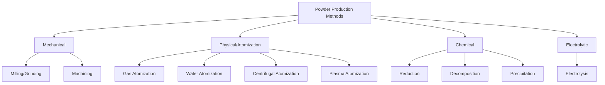

## Powder Production Methods

### Overview

Powder production is the foundational stage in powder metallurgy (PM), determining particle size, shape, purity, and microstructure — all of which govern downstream compaction behavior, sintering kinetics, and final mechanical properties. Methods are broadly classified into mechanical, physical, and chemical processes.

### Classification of Powder Production Methods

---

### 1. Mechanical Methods

#### 1.1 Milling and Grinding

**Key Points**

- Uses mechanical force (impact, attrition, shear, compression) to fracture bulk material into powder
- Common equipment: ball mills, attritor mills, vibratory mills, jet mills
- Suitable for brittle materials (ceramics, some intermetallics); ductile metals tend to flatten rather than fracture

**Ball Milling**

- Grinding media (steel or ceramic balls) tumble inside a rotating drum, repeatedly impacting the feedstock
- Governing parameters: ball-to-powder ratio (BPR, typically 10:1 to 20:1), rotation speed, milling time, and milling atmosphere (inert gas to prevent oxidation)
- Mechanical alloying variant: enables solid-state alloying of immiscible elements and production of nanocrystalline or amorphous powders through repeated cold welding and fracturing

**Attritor Milling**

- Vertical tank with an internal agitator shaft driving the media at higher energy density than conventional ball mills
- Produces finer particle sizes in shorter processing times

**Limitations**

- Contamination from media wear (Fe pickup from steel balls) is a persistent concern; addressed using WC-lined or ceramic media for high-purity applications
- [Inference] Processing time and contamination risk generally trade off against achievable fineness, though exact relationships are highly equipment- and material-dependent

#### 1.2 Machining

- Powder generated as a byproduct of turning, milling, or filing operations
- Produces coarse, irregular chips rather than true spherical powder
- Limited to niche or low-volume applications; largely superseded by atomization

---

### 2. Atomization (Physical Methods)

Atomization is the dominant industrial technique for producing metal powders, especially for PM parts requiring good flow and packing behavior.

#### 2.1 Gas Atomization

**Process**

- Molten metal stream is disintegrated into fine droplets by high-velocity inert gas jets (argon, nitrogen, helium)
- Droplets solidify in flight within an atomization tower before collection

**Key Points**

- Produces spherical powders with good flowability — ideal for additive manufacturing (AM) and metal injection molding (MIM)
- Particle size range: typically 10–150 μm, with distribution controlled by gas-to-metal ratio, nozzle design, and melt superheat
- Lower oxygen content compared to water atomization due to inert atmosphere

**Governing Relationship**

Droplet size is inversely related to the gas-to-metal mass flow ratio (GMR) and atomization gas velocity:

$$d \propto \frac{1}{GMR \cdot v_g^n}$$

where $d$ is mean droplet diameter, $v_g$ is gas velocity, and $n$ is an empirical exponent typically between 1 and 2. [Inference] The exact exponent varies significantly with nozzle geometry and is usually determined empirically for a given system.

#### 2.2 Water Atomization

**Process**

- Similar to gas atomization but uses high-pressure water jets as the disintegration medium

**Key Points**

- Faster cooling rate than gas atomization due to higher heat extraction capacity of water
- Produces irregular, non-spherical particles due to rapid, non-uniform solidification
- More economical than gas atomization; widely used for iron and low-alloy steel powders
- Higher oxide content on particle surfaces, often requiring a subsequent reduction annealing step

#### 2.3 Centrifugal Atomization

**Process**

- Molten metal is fed onto a rapidly rotating disk or electrode; centrifugal force flings molten droplets outward, which solidify in flight

**Variants**

- Rotating Electrode Process (REP): a consumable rotating electrode is melted (via plasma or arc) at one end, flinging off droplets
- Plasma Rotating Electrode Process (PREP): uses a plasma arc heat source for cleaner, higher-purity powder — common for reactive/refractory metals (Ti, Ni-superalloys)

**Key Points**

- Produces highly spherical, clean powder with minimal satellite particles
- No crucible contact in PREP, minimizing ceramic inclusion contamination — critical for aerospace-grade Ti and Ni alloy powders

#### 2.4 Plasma Atomization

**Process**

- Metal wire or powder feedstock is melted by plasma torches and atomized into fine spherical droplets

**Key Points**

- Produces very high sphericity and narrow particle size distribution
- Preferred for AM feedstocks (e.g., Ti-6Al-4V) requiring stringent flowability and packing density
- Higher cost relative to gas atomization due to plasma torch energy consumption

---

### 3. Chemical Methods

#### 3.1 Reduction

**Process**

- Metal oxides are reduced to metal powder using a reducing agent (hydrogen, carbon monoxide, or carbon) at elevated temperature

**Example**

$$Fe_2O_3 + 3H_2 \rightarrow 2Fe + 3H_2O$$

**Key Points**

- Widely used for iron powder production (sponge iron process)
- Produces porous, irregular ("sponge") particle morphology with high surface area — beneficial for green strength during compaction
- Tungsten and molybdenum powders are commonly produced via hydrogen reduction of their oxides

#### 3.2 Thermal Decomposition (Carbonyl Process)

**Process**

- Metal carbonyls (e.g., $Ni(CO)_4$, $Fe(CO)_5$) are formed at moderate pressure/temperature, then thermally decomposed to deposit pure metal powder while releasing CO gas

**Key Points**

- Produces exceptionally pure, fine, spherical powder (typically 2–10 μm)
- Onion-like layered internal structure is characteristic of carbonyl iron powder
- Used for high-purity nickel and iron powders in specialized applications (magnetic cores, catalysts)
- Carbonyl gases are highly toxic, requiring stringent process safety controls

#### 3.3 Precipitation from Solution

**Process**

- Metal salts in aqueous solution are chemically precipitated as metal powder or metal compound powder using a reducing or precipitating agent

**Key Points**

- Common for producing fine copper, silver, and cobalt powders
- Particle size and morphology controlled by solution concentration, pH, temperature, and reducing agent choice
- Enables co-precipitation for chemically homogeneous multi-component powders (e.g., WC-Co precursor powders)

---

### 4. Electrolytic Deposition

**Process**

- Metal is electrodeposited from an aqueous or fused-salt electrolyte onto a cathode under controlled current density, then removed and comminuted into powder

**Key Points**

- Produces high-purity, dendritic powder with irregular morphology
- Copper powder is the most common commercial product of this route
- High compressibility due to dendritic particle shape, but lower apparent density

---

### Comparison of Key Methods

| Method | Particle Shape | Typical Size Range | Purity | Relative Cost |
| --- | --- | --- | --- | --- |
| Gas Atomization | Spherical | 10–150 μm | High | High |
| Water Atomization | Irregular | 20–200 μm | Moderate | Low |
| Centrifugal (PREP) | Highly spherical | 50–200 μm | Very high | Very high |
| Reduction | Sponge/irregular | 1–100 μm | Moderate | Low |
| Carbonyl Decomposition | Spherical/layered | 2–10 μm | Very high | High |
| Electrolytic | Dendritic | 1–100 μm | High | Moderate |

### Particle Characterization Relevance

Downstream powder metallurgy behavior depends heavily on characteristics set during production:

- **Particle shape**: spherical powders (atomized) flow well but pack less efficiently in compaction than irregular powders, which interlock mechanically
- **Particle size distribution (PSD)**: affects green density, sintering shrinkage, and dimensional control
- **Surface oxide content**: influences sintering activation energy and requires reduction atmospheres during sintering to remove

[Speculation] Selection among these methods in industrial practice is often driven as much by capital equipment cost and throughput requirements as by pure metallurgical optimization, though this varies by producer and end-use sector.

**Related Topics**

- Particle Size Analysis and Distribution Characterization
- Powder Flowability and Apparent/Tap Density
- Powder Compaction Techniques (Die Compaction, Cold Isostatic Pressing)
- Sintering Mechanisms and Stages
- Metal Injection Molding (MIM) Feedstock Requirements
- Additive Manufacturing Powder Feedstock Specifications
- Powder Surface Oxide Reduction and Atmosphere Control