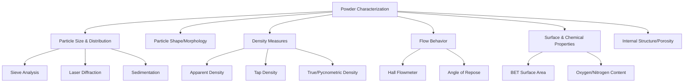

## Powder Characterization

### Overview

Powder characterization quantifies the physical, chemical, and morphological attributes of metal/ceramic powders that govern compaction behavior, sintering response, and final part properties. Characterization spans particle size, shape, density, flow, surface chemistry, and internal structure.

### Characterization Categories

---

### 1. Particle Size and Size Distribution

#### 1.1 Sieve Analysis

**Key Points**

- Powder passed through a stack of standardized woven-wire sieves (mesh sizes per ASTM E11 or ISO 3310) with decreasing aperture
- Yields mass fraction retained on each sieve, expressed as a particle size distribution (PSD) histogram
- Practical lower limit around 38–45 μm; finer powders require alternative methods
- Simple, low-cost, industry-standard method (ASTM B214)

#### 1.2 Laser Diffraction

**Key Points**

- Measures angular scattering intensity of a laser beam passed through a dispersed powder sample
- Larger particles scatter light at smaller angles; smaller particles scatter at larger angles (Mie scattering theory)
- Covers a broad range, roughly 0.1 μm to 3 mm, in a single measurement
- Reports $D_{10}$, $D_{50}$, $D_{90}$ — the diameters below which 10%, 50%, and 90% of the particle volume lies

#### 1.3 Sedimentation and Microscopy-Based Methods

- Sedimentation: particle settling velocity in a fluid, related to size via Stokes' law:

$$v = \frac{(\rho_p - \rho_f) g d^2}{18\mu}$$

where $v$ is settling velocity, $\rho_p$ and $\rho_f$ are particle and fluid densities, $g$ is gravitational acceleration, $d$ is particle diameter, and $\mu$ is fluid viscosity

- Dynamic/static image analysis and SEM: direct visual measurement of individual particle size and shape, useful for verifying PSD instrument results and capturing morphology simultaneously

#### 1.4 Distribution Descriptors

- PSD is commonly modeled using a log-normal or Rosin-Rammler distribution
- Span (a normalized breadth metric) is defined as:

$$Span = \frac{D_{90} - D_{10}}{D_{50}}$$

---

### 2. Particle Shape and Morphology

**Key Points**

- Assessed via SEM imaging and image analysis software
- Common descriptors: aspect ratio, circularity, sphericity, convexity

**Sphericity**

$$\psi = \frac{\pi^{1/3}(6V_p)^{2/3}}{A_p}$$

where $V_p$ is particle volume and $A_p$ is particle surface area; $\psi = 1$ represents a perfect sphere

**Typical Morphologies by Production Route**

- Gas/plasma atomized: spherical, some satellite particles
- Water atomized: irregular, angular
- Sponge iron (reduction): porous, irregular
- Carbonyl: spherical, layered internal structure
- Electrolytic: dendritic

**Example**: A water-atomized 316L stainless steel powder typically shows aspect ratios of 1.3–1.8, while gas-atomized equivalents show aspect ratios closer to 1.0–1.1, directly affecting powder bed packing in AM and die-fill behavior in PM compaction.

---

### 3. Density Measurements

#### 3.1 Apparent Density

- Mass of loose, uncompacted powder per unit volume under standardized free-fall conditions (ASTM B212, using a Hall flowmeter funnel)
- Reflects packing efficiency of the as-poured powder; strongly influenced by particle shape and size distribution

#### 3.2 Tap Density

- Density after mechanical tapping/vibration of the powder bed to eliminate loosely packed voids (ASTM B527)
- Always greater than or equal to apparent density
- Hausner ratio, an indicator of flowability, is derived from these two measures:

$$HR = \frac{\rho_{tap}}{\rho_{apparent}}$$

Lower Hausner ratios (closer to 1.0–1.2) indicate better flowability; higher ratios (>1.4) indicate cohesive, poor-flowing powder. [Inference] Exact threshold values for flowability classification vary somewhat between standards and powder chemistries.

#### 3.3 True (Pycnometric) Density

- Measured via gas (helium) pycnometry, accounting for the actual solid volume excluding inter-particle voids
- Used to calculate theoretical density and compute relative/green density of compacted parts:

$$\rho_{relative} = \frac{\rho_{measured}}{\rho_{true}} \times 100\%$$

---

### 4. Flow Behavior

#### 4.1 Hall Flowmeter Test

- Measures time (seconds) for a fixed powder mass (typically 50 g) to flow through a calibrated funnel orifice (ASTM B213)
- Faster flow times indicate better flowability
- Fine, cohesive, or irregular powders may not flow at all without a Carney funnel (larger orifice) modification

#### 4.2 Angle of Repose

- The angle formed between a freely formed powder pile and the horizontal plane when powder is poured onto a flat surface
- Angles below ~30° indicate excellent flow; angles above 45° indicate poor flow
- Correlates with Hausner ratio and Carr Index as complementary flowability indicators

**Carr Index**

$$CI = \frac{\rho_{tap} - \rho_{apparent}}{\rho_{tap}} \times 100\%$$

---

### 5. Surface and Chemical Characterization

#### 5.1 Specific Surface Area (BET Method)

- Brunauer-Emmett-Teller (BET) gas adsorption measures specific surface area (m²/g)
- Higher surface area (common in fine or porous sponge powders) increases sintering reactivity but also raises oxidation susceptibility and handling hazards (pyrophoricity risk in very fine metal powders)

#### 5.2 Chemical Composition and Interstitials

- Oxygen, nitrogen, and carbon content measured via inert gas fusion (LECO analysis) or combustion analysis
- Oxygen content is particularly critical for reactive metals (Ti, Al) since surface oxide layers impede sintering neck formation and can degrade ductility
- Bulk chemistry verified via ICP-OES/ICP-MS or XRF for alloying element content

#### 5.3 Internal Porosity

- Cross-sectioned particles examined via SEM/optical microscopy to assess internal voids, particularly relevant for gas-atomized powders where entrapped argon can form internal pores
- Internal porosity is a known contributor to residual porosity in AM and PM parts, as entrapped gas pores are difficult to eliminate during densification

---

### Summary Table of Key Standards

| Property | Method | Governing Standard |
| --- | --- | --- |
| Particle Size (coarse) | Sieve Analysis | ASTM B214 / ISO 4497 |
| Particle Size (fine) | Laser Diffraction | ISO 13320 |
| Apparent Density | Hall Flowmeter | ASTM B212 |
| Tap Density | Mechanical Tapping | ASTM B527 |
| Flow Rate | Hall Flowmeter | ASTM B213 |
| Surface Area | BET Adsorption | ASTM C1274 |
| Oxygen/Nitrogen Content | Inert Gas Fusion | ASTM E1409 / E1019 |

**Related Topics**

- Powder Production Methods (Atomization, Reduction, Carbonyl Process)
- Powder Flowability Optimization and Flow Aids
- Green Density and Compaction Behavior
- Particle Packing Models and Bimodal Powder Blending
- Sintering Kinetics and Neck Growth Mechanisms
- Powder Handling Safety (Pyrophoricity, Dust Explosion Hazards)