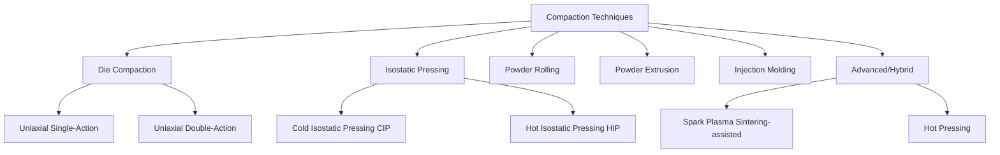

## Compaction Techniques

### Overview

Compaction consolidates loose powder into a coherent "green" part with sufficient handling strength for subsequent sintering. The process reduces porosity, increases inter-particle contact area, and imparts near-net shape geometry prior to densification.

### Classification of Compaction Techniques

---

### 1. Die (Uniaxial) Compaction

#### 1.1 Process Description

**Key Points**

- Powder is loaded into a rigid die cavity and compressed axially between upper and lower punches
- Most widely used industrial PM technique due to high production rates and dimensional precision
- Typical pressures range from 100–800 MPa depending on material and desired green density

**Stages of Densification**

1. Particle rearrangement — particles slide and reorient to fill voids at low pressure
2. Elastic/plastic deformation — particle contact points deform, increasing contact area
3. Work hardening — further densification requires increasing pressure as material hardens
4. Fragmentation (brittle powders) — particle fracture contributes to filling remaining voids

#### 1.2 Single-Action vs. Double-Action Pressing

**Single-Action**

- Pressure applied from one punch only; the die wall and lower punch remain stationary
- Produces a density gradient, with the highest density near the moving punch face due to die-wall friction losses

**Double-Action**

- Pressure applied simultaneously from both upper and lower punches
- Produces more uniform density distribution, though a lower-density neutral zone can still persist at mid-height for parts with high length-to-diameter ratios

**Density Variation Illustration (svg_diagram)**

<svg xmlns="http://www.w3.org/2000/svg" viewBox="0 0 500 260">
<text x="250" y="20" text-anchor="middle" font-size="14" font-weight="bold" fill="#222">Density Gradient: Single vs Double-Action Pressing (svg_diagram)</text>
<rect x="40" y="50" width="150" height="180" fill="none" stroke="#333" stroke-width="2" />
<text x="115" y="245" text-anchor="middle" font-size="12" fill="#333">Single-Action</text>
<rect x="40" y="50" width="150" height="40" fill="#08519c" />
<rect x="40" y="90" width="150" height="40" fill="#3182bd" />
<rect x="40" y="130" width="150" height="40" fill="#6baed6" />
<rect x="40" y="170" width="150" height="30" fill="#bdd7e7" />
<rect x="40" y="200" width="150" height="30" fill="#eff3ff" />
<text x="10" y="75" font-size="10" fill="#333">Punch →</text>
<rect x="300" y="50" width="150" height="180" fill="none" stroke="#333" stroke-width="2" />
<text x="375" y="245" text-anchor="middle" font-size="12" fill="#333">Double-Action</text>
<rect x="300" y="50" width="150" height="30" fill="#08519c" />
<rect x="300" y="80" width="150" height="30" fill="#3182bd" />
<rect x="300" y="110" width="150" height="40" fill="#bdd7e7" />
<rect x="300" y="150" width="150" height="30" fill="#3182bd" />
<rect x="300" y="180" width="150" height="30" fill="#08519c" />
<rect x="300" y="210" width="150" height="20" fill="#08519c" />
<text x="270" y="65" font-size="10" fill="#333">Punch →</text>
<text x="270" y="220" font-size="10" fill="#333">Punch →</text>
</svg>

#### 1.3 Compaction Pressure–Density Relationship

A commonly used empirical relation for green density as a function of compaction pressure is the Heckel equation:

$$\ln\left(\frac{1}{1 - D}\right) = KP + A$$

where $D$ is relative density, $P$ is applied pressure, and $K$ and $A$ are material-dependent constants. [Inference] The Heckel model assumes idealized densification kinetics and deviates for powders with significant work hardening or complex geometries.

#### 1.4 Lubrication

- Die-wall friction is minimized using internal lubricants (e.g., zinc stearate, wax) mixed with the powder, or external die-wall lubrication
- Lubricants reduce ejection force and die-wall scoring but occupy volume that must be removed (burned off) during a de-lubrication step in early-stage sintering

---

### 2. Isostatic Pressing

#### 2.1 Cold Isostatic Pressing (CIP)

**Process**

- Powder is enclosed in a flexible elastomeric mold (rubber or polyurethane), sealed, and immersed in a pressurized fluid (typically water or oil) within a pressure vessel
- Pressure is applied uniformly from all directions (typically 200–400 MPa)

**Key Points**

- Produces uniform density throughout the compact, without the directional density gradients seen in uniaxial die pressing
- Enables complex and large near-net shapes not achievable with rigid dies
- Two variants: wet-bag (mold removed and filled outside the vessel) and dry-bag (mold fixed within the vessel, suited to automated production)
- Lower dimensional precision than die compaction; typically requires machining or further processing post-sintering

#### 2.2 Hot Isostatic Pressing (HIP)

**Process**

- Combines isostatic pressure with elevated temperature, typically using inert gas (argon) as the pressurizing medium in an autoclave
- Applied to pre-sintered (encapsulated) or as-atomized loose powder in a sealed can, or to castings for defect healing

**Key Points**

- Achieves near-full theoretical density (>99.5%) by combining plastic flow, creep, and diffusion bonding mechanisms
- Typical conditions: 100–200 MPa, 0.5–0.8 $T_m$ (homologous temperature)
- Widely used for aerospace superalloy and titanium components requiring maximum fatigue performance
- Can consolidate powder directly into near-net shape parts without a separate compaction/sintering sequence (HIP-to-shape)

---

### 3. Powder Rolling (Roll Compaction)

**Key Points**

- Powder is fed continuously between two counter-rotating rolls, compacting it into a continuous green strip or sheet
- Used for producing sheet/strip products (e.g., porous filter media, electrical contact strip, clad materials)
- Advantages: continuous process, suitable for thin-gauge products difficult to achieve via die pressing
- Green strip density and thickness controlled by roll gap, roll speed, and powder feed rate

---

### 4. Powder Extrusion

**Key Points**

- Powder is often first canned/encapsulated (or mixed with a binder in cold extrusion) and then extruded through a die under high pressure, often with heat
- Produces continuous or semi-continuous long-length products such as rods, tubes, and profiles
- Hot extrusion of canned powder (e.g., for rapidly solidified aluminum alloys) achieves both consolidation and grain refinement/texture control in a single step

---

### 5. Powder Injection Molding (PIM/MIM)

**Key Points**

- Fine powder (<20 μm) is mixed with a thermoplastic/wax binder system to form a feedstock, injection molded into a "green" part using standard plastic injection molding equipment
- Binder is removed in a separate debinding step (thermal or solvent) prior to sintering
- Enables complex, small, high-volume net-shape parts unachievable via die compaction (e.g., watch components, surgical instruments, firearm parts)
- Significant sintering shrinkage (15–20% linear) must be accounted for in mold design

---

### 6. Advanced and Hybrid Techniques

#### 6.1 Hot Pressing

- Simultaneous application of uniaxial pressure and elevated temperature in a die, typically graphite for high-temperature ceramics/cermets
- Achieves higher density than cold compaction plus separate sintering, at lower pressures than HIP, but limited to simple shapes and lower throughput

#### 6.2 Spark Plasma Sintering (SPS) — Compaction-Assisted

- Pulsed DC current passed through a graphite die and powder compact under uniaxial pressure, generating rapid Joule heating and, per some models, localized spark discharge effects at particle necks
- Enables very rapid densification cycles (minutes rather than hours), suppressing grain growth — beneficial for nanostructured and metastable materials
- [Unverified] The extent to which actual "spark plasma" discharge phenomena occur (versus pure resistive/Joule heating) remains a subject of ongoing research debate in the literature

---

### Comparison of Compaction Techniques

| Technique | Density Uniformity | Typical Pressure | Shape Complexity | Production Rate |
| --- | --- | --- | --- | --- |
| Die Compaction | Moderate (gradient) | 100–800 MPa | Low–moderate | Very high |
| CIP | High (uniform) | 200–400 MPa | High | Low–moderate |
| HIP | Very high (near-full density) | 100–200 MPa | Moderate–high | Low |
| Powder Rolling | Moderate | Roll-dependent | Sheet/strip only | High (continuous) |
| Extrusion | High (axial) | High | Rod/tube profiles | Moderate (continuous) |
| PIM/MIM | High | Injection pressure | Very high | High (small parts) |

**Related Topics**

- Green Strength and Handling Characteristics
- Sintering Mechanisms and Densification Kinetics
- Debinding Processes for MIM/PIM
- Die Design and Tooling for PM Compaction
- Hot Isostatic Pressing for Defect Healing in Castings
- Powder Lubricants and Binder Systems