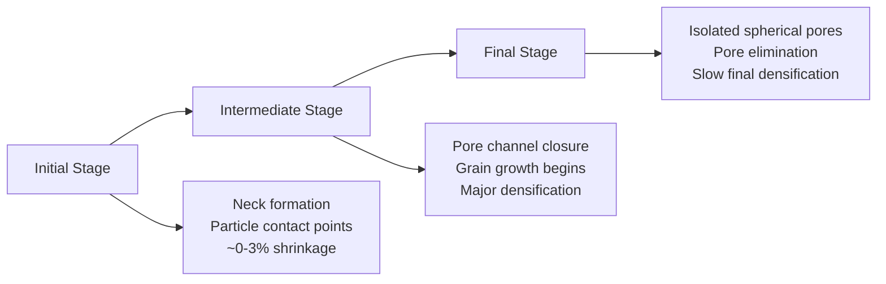
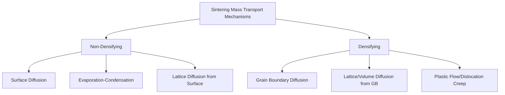

## Sintering Mechanisms and Stages

### Overview

Sintering is the thermal process by which a compacted powder ("green") body is consolidated into a coherent, dense solid through atomic diffusion, driven by the reduction of total surface free energy. It occurs below the melting point of the primary constituent (solid-state sintering) or involves a transient/persistent liquid phase (liquid-phase sintering).

### Driving Force

**Key Points**

- The thermodynamic driving force is the reduction in total interfacial (surface) energy as high-energy particle/vapor interfaces are replaced by lower-energy grain boundaries and consolidated solid
- Curvature gradients between convex particle surfaces and concave neck regions create a chemical potential (vacancy concentration) difference that drives atomic/vacancy flux

The excess vacancy concentration at a curved surface relative to a flat surface is described by the Gibbs-Thomson (Kelvin) relation:

$$\Delta C = C_0 \frac{2\gamma\Omega}{rkT}$$

where $C_0$ is equilibrium vacancy concentration at a flat surface, $\gamma$ is surface energy, $\Omega$ is atomic volume, $r$ is the radius of curvature, $k$ is Boltzmann's constant, and $T$ is absolute temperature.

---

### Stages of Sintering

#### Stage 1: Initial Stage (Neck Formation)

**Key Points**

- Interparticle necks form and grow rapidly at points of particle contact
- Neck radius ($x$) to particle radius ($a$) ratio typically reaches $x/a \approx 0.2$–0.3 by the end of this stage
- Individual particles are still largely distinguishable; total linear shrinkage is minimal (0–3%)
- Dominant transport mechanisms: surface diffusion, evaporation-condensation, and early-stage lattice/grain-boundary diffusion (mechanism dominance depends strongly on material and temperature)

**Neck Growth Kinetics**

A generalized neck growth law is expressed as:

$$\left(\frac{x}{a}\right)^n = \frac{B t}{a^m}$$

where $x$ is neck radius, $a$ is particle radius, $t$ is time, and $B$ is a temperature-dependent constant; the exponents $n$ and $m$ depend on the dominant diffusion mechanism (e.g., $n=5, m=2$ for volume diffusion; $n=7, m=3$ for grain-boundary diffusion). [Inference] These exponents represent idealized single-mechanism models; real sintering typically involves overlapping mechanisms, making mechanism identification from empirical shrinkage data non-trivial.

#### Stage 2: Intermediate Stage

**Key Points**

- Pore structure transitions from an open, interconnected channel network along three-grain edges to a more tortuous geometry as densification proceeds
- The majority of total densification (typically up to ~90% of theoretical density) occurs during this stage
- Grain growth becomes significant and competes with pore elimination — pore mobility must keep pace with grain boundary migration, or pores become trapped inside grains (undesirable, as intragranular pores are far harder to eliminate)
- Pore channels progressively pinch off into isolated, closed porosity as this stage concludes

#### Stage 3: Final Stage

**Key Points**

- Isolated, closed pores remain, generally located at grain boundaries or triple junctions
- Densification proceeds via vacancy diffusion from pores to grain boundaries (or surrounding matrix), a process that becomes progressively slower as pore size and pore/grain-boundary contact decrease
- Complete pore elimination is difficult in solid-state sintering; residual porosity of 1–5% commonly persists in conventionally sintered PM parts
- Excessive grain growth in this stage can detach pores from grain boundaries, trapping them and effectively halting further densification (pore-boundary separation)

---

### Mass Transport Mechanisms

**Key Points**

- **Non-densifying mechanisms** (surface diffusion, evaporation-condensation, surface-sourced lattice diffusion) grow necks and coarsen microstructure but redistribute mass from particle surfaces to necks without pulling particle centers together — no shrinkage results
- **Densifying mechanisms** (grain boundary diffusion, volume diffusion sourced from grain boundaries, plastic flow) transport mass from the grain boundary/particle interior into the neck/pore region, causing particle centers to approach each other — this produces measurable shrinkage and densification
- Because both mechanism types often operate concurrently, sintering practice aims to promote densifying mechanisms (via temperature, atmosphere, and additive selection) while limiting excessive surface diffusion-driven coarsening that reduces driving force without contributing to shrinkage

---

### Solid-State vs. Liquid-Phase Sintering

#### Solid-State Sintering

- All constituents remain solid throughout the process
- Governed entirely by diffusion mechanisms described above
- Typical for single-element or fully alloyed homogeneous powder systems (e.g., pure iron, pre-alloyed stainless steel)

#### Liquid-Phase Sintering (LPS)

**Key Points**

- A liquid phase forms (from a low-melting additive or eutectic composition) that wets and penetrates the solid particle network via capillary action
- Three stages: (1) rearrangement — solid particles reposition rapidly under capillary forces from the liquid; (2) solution-reprecipitation — solid dissolves at high-curvature contact points and reprecipitates at lower-energy sites, driving grain shape accommodation; (3) final-stage solid-state densification via the residual solid skeleton
- Capillary pressure exerted by the wetting liquid is described by:

$$P = \frac{2\gamma_{LV}\cos\theta}{r}$$

where $\gamma_{LV}$ is liquid-vapor surface tension, $\theta$ is the wetting (contact) angle, and $r$ is the effective pore/channel radius

- **Example**: WC-Co cemented carbides sinter via LPS, where cobalt melts (~1400°C) and infiltrates the rigid WC skeleton, enabling near-full density with minimal WC grain coarsening if held near the liquidus temperature

---

### Sintering Atmosphere

**Key Points**

- Reducing atmospheres (hydrogen, dissociated ammonia, endothermic gas) remove surface oxides that would otherwise impede neck formation and diffusion
- Inert atmospheres (argon, nitrogen) protect against oxidation without active reduction, used for materials where hydrogen embrittlement or nitride formation is a concern
- Vacuum sintering removes trapped gases from pores, particularly beneficial for achieving near-full density in reactive metals (Ti) and refractory systems

---

### Densification vs. Time-Temperature Behavior

Sintering shrinkage generally follows an approximately logarithmic-then-plateauing relationship with isothermal hold time, while densification rate increases strongly (often exponentially, per an Arrhenius-type temperature dependence) with sintering temperature due to the temperature dependence of diffusion coefficients:

$$D = D_0 \exp\left(-\frac{Q}{RT}\right)$$

where $D_0$ is a pre-exponential factor, $Q$ is activation energy for the dominant diffusion mechanism, $R$ is the gas constant, and $T$ is absolute temperature. [Inference] This general trend holds broadly across PM systems, though real densification curves are also strongly influenced by grain growth kinetics and pore-boundary interaction effects, which are material- and microstructure-specific.

**Related Topics**

- Liquid-Phase Sintering Systems (WC-Co, Bronze-Iron)
- Sintering Atmospheres and Furnace Design
- Grain Growth and Pore-Boundary Interaction
- Sintering Shrinkage and Dimensional Control
- Spark Plasma Sintering and Field-Assisted Techniques
- Post-Sintering Treatments (Sizing, Infiltration, Heat Treatment)