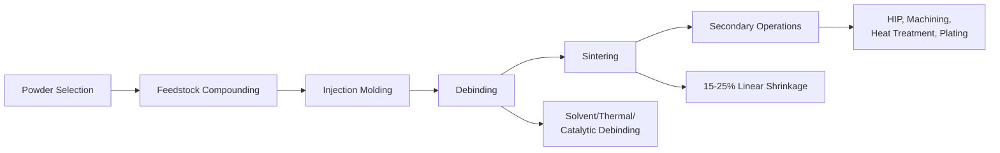

## Metal Injection Molding

### Overview

Metal Injection Molding (MIM) combines the shape-complexity capabilities of plastic injection molding with the material properties of powder metallurgy. Fine metal powder is compounded with a polymer binder system, injection molded into a "green" part, debound, and sintered to near-full density, enabling high-volume production of small, geometrically complex, net-shape metal components.

### MIM Process Flow

---

### 1. Feedstock: Powder and Binder Selection

#### 1.1 Powder Requirements

**Key Points**

- Fine particle size, typically 1–20 μm (D50 ~4–10 μm common), to promote sinterability and achieve smooth surface finish
- Spherical or near-spherical morphology preferred — produced via gas atomization, water atomization (for less demanding applications), or carbonyl decomposition
- High specific surface area increases sintering driving force but also increases binder demand and raises the risk of oxidation during processing

**Common MIM Materials**

- Stainless steels: 316L, 17-4PH (most common by volume)
- Low-alloy steels: Fe-Ni, Fe-2Ni systems
- Tool steels, tungsten heavy alloys, titanium (Ti-6Al-4V)
- Soft magnetic alloys (Fe-Si, Fe-Ni permalloys)
- Hardmetals and cemented carbides in some specialized applications

#### 1.2 Binder Systems

**Key Points**

- Binder functions as a temporary vehicle enabling flow during injection, then must be removed cleanly prior to sintering without disrupting particle packing
- Typical binder loading: 35–45 vol% of the feedstock

**Common Binder System Types**

- Wax-based: paraffin wax + polymer (e.g., polyethylene) + surfactant (e.g., stearic acid) — enables solvent debinding
- Polyacetal (POM)-based: catalytic debinding via acid vapor (nitric or oxalic acid), offering very fast debind cycles
- Water-soluble binders: agar or polyethylene glycol (PEG)-based systems enabling debinding in water

**Powder Loading Optimization**

- Critical powder volume concentration ($\phi_{crit}$) represents the theoretical maximum packing fraction; feedstock is formulated below this (typically 60–65 vol% powder) to retain sufficient binder for flow
- Feedstock rheology is evaluated via capillary rheometry to confirm shear-thinning behavior appropriate for injection molding

---

### 2. Injection Molding

**Key Points**

- Standard reciprocating-screw injection molding equipment is used, often with wear-resistant screw/barrel components due to the abrasive nature of metal-loaded feedstock
- Mold cavities are designed oversized to compensate for sintering shrinkage (typically 15–25% linear, isotropic if feedstock and process are well-controlled)
- Injection pressures typically 50–150 MPa; barrel temperatures set according to binder softening/melting range (commonly 150–200°C for wax/polymer systems)
- Gate design and wall thickness uniformity are critical — thick sections risk voids and sink marks; abrupt thickness transitions cause differential shrinkage and cracking during sintering

**Design Guidelines**

- Uniform wall thickness strongly preferred, generally under ~6–8 mm
- Draft angles required for part ejection, similar to standard plastic injection molding practice
- Sharp internal corners avoided to reduce stress concentration during debinding/sintering shrinkage

---

### 3. Debinding

Debinding removes the binder system while preserving the particle-packed shape of the green part, producing a fragile but handleable "brown" part.

#### 3.1 Solvent Debinding

- Green part immersed in a solvent (heptane, trichloroethylene, or water for water-soluble binders) that dissolves the primary/soluble binder component, leaving an interconnected pore network
- Backbone polymer remains to hold particles in place through subsequent thermal debinding

#### 3.2 Thermal Debinding

- Controlled heating (often following solvent debinding) pyrolyzes/evaporates remaining binder constituents
- Must be carefully ramped to avoid rapid gas evolution that could crack or blister the part; typically combined with a wicking powder bed or controlled atmosphere furnace

#### 3.3 Catalytic Debinding

- Used with POM-based binders; acid vapor (nitric or oxalic acid) catalytically depolymerizes the binder at moderate temperature (110–140°C), converting it directly to gaseous formaldehyde
- Offers significantly faster debind cycles (hours) compared to purely thermal approaches (which can take a day or more for larger parts)

**Key Points**

- Debinding is frequently the rate-limiting step in overall MIM cycle time
- Residual binder or carbon after debinding can cause sintering defects (blistering, carbon pickup affecting mechanical properties)

---

### 4. Sintering

**Key Points**

- Brown parts are sintered at high homologous temperature (typically 0.8–0.9 $T_m$) to achieve near-full density (often >96–99% theoretical density), significantly higher than conventional die-compacted PM parts
- Sintering shrinkage is substantial (15–25% linear) due to the high initial porosity of the loosely packed brown part relative to die-compacted green parts
- Because MIM parts begin from a powder compact with no applied compaction pressure (only binder-held packing), shrinkage is generally isotropic if particle packing and debinding are uniform — a key enabler of dimensional predictability in production
- Vacuum or reducing atmosphere sintering furnaces are standard, particularly for stainless steels and reactive alloys, to control oxygen pickup

**Example**: A 316L stainless steel MIM bracket may start as a green part with roughly 60 vol% powder loading and finish at greater than 96% of theoretical density after sintering, with a mechanical property profile approaching that of wrought stainless steel — significantly exceeding typical die-compacted PM stainless parts, which commonly plateau around 85–90% density.

---

### 5. Secondary Operations

**Key Points**

- **Hot Isostatic Pressing (HIP)**: applied to close residual porosity for high-performance applications (aerospace, medical implants)
- **Heat treatment**: carburizing, hardening, and tempering performed similarly to wrought/cast equivalents, since MIM parts approach full density
- **Machining**: light finishing machining for tight tolerances not achievable through net-shape sintering alone
- **Surface finishing**: plating, polishing, or coating applied as needed for corrosion resistance or aesthetics

---

### Advantages and Limitations

| Advantages | Limitations |
| --- | --- |
| High geometric complexity (comparable to plastic injection molding) | High tooling cost — economical mainly at high volumes |
| Excellent dimensional repeatability in production | Part size generally limited (typically <100–250 g) |
| Near-full density, isotropic mechanical properties | Shrinkage control requires tight process discipline |
| Good surface finish, minimal post-machining | Longer overall cycle time due to debind/sinter stages |
| Wide alloy compatibility | Wall thickness limitations (thick sections problematic) |

---

### Comparison: MIM vs. Conventional Die-Compacted PM

| Attribute | MIM | Conventional Die Compaction |
| --- | --- | --- |
| Achievable Density | 96–99%+ | 85–92% (typical) |
| Shape Complexity | Very high (3D features, undercuts via tooling) | Limited (uniaxial pressing constraints) |
| Particle Size | Fine (1–20 μm) | Coarser (typically 45–150 μm) |
| Shrinkage | High (15–25% linear) | Low (dimensional control via die) |
| Part Size Range | Small (<250 g typical) | Wide range, including large parts |
| Tooling Cost | High | Moderate |

**Related Topics**

- Powder Production Methods (Fine Powder via Atomization/Carbonyl)
- Sintering Mechanisms and Stages
- Feedstock Rheology and Powder Loading Optimization
- Hot Isostatic Pressing for Porosity Closure
- Debinding Process Design and Defect Prevention
- Design for Manufacturability in MIM Components