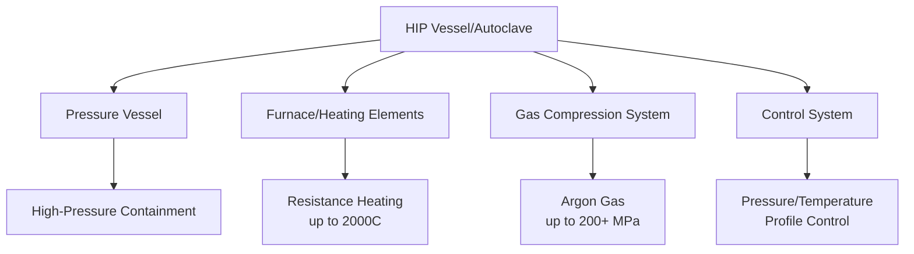

## Hot Isostatic Pressing

### Overview

Hot Isostatic Pressing (HIP) simultaneously applies elevated temperature and uniform isostatic gas pressure to a material, achieving near-full theoretical density through combined plastic deformation, creep, and diffusion bonding mechanisms. HIP is applied to consolidate powders directly into shapes, densify pre-sintered PM/MIM parts, and heal internal porosity/defects in castings.

### HIP System Architecture

---

### 1. Process Fundamentals

**Key Points**

- Inert gas (predominantly argon, occasionally nitrogen for specific applications) is pressurized within a sealed autoclave, applying equal pressure from all directions onto the workpiece
- Typical operating envelope: 100–200 MPa pressure, temperatures ranging from roughly 0.5–0.8 of the material's homologous melting temperature ($T/T_m$)
- Because pressure is applied isostatically (uniformly in all directions), no directional density gradient develops, unlike uniaxial hot pressing

**Densification Mechanisms**

1. Initial plastic yielding — particle/pore surfaces deform plastically under applied pressure, particularly at lower relative densities
2. Power-law creep — dominant intermediate mechanism as pressure and temperature drive dislocation climb-controlled deformation
3. Diffusional creep (Nabarro-Herring and Coble creep) — vacancy diffusion-mediated densification dominant at final-stage pore closure, particularly for fine residual porosity

A generalized densification rate expression combining these mechanisms takes the form:

$$\frac{d\rho}{dt} = f(\rho) \cdot \sigma_e^n \cdot D \cdot \frac{1}{d^m}$$

where $\rho$ is relative density, $\sigma_e$ is effective stress (related to applied pressure and pore geometry), $D$ is the relevant diffusion coefficient, $d$ is grain or pore size, and $n$, $m$ are mechanism-dependent exponents. [Inference] The specific form and dominant mechanism regime depend strongly on material system, pressure/temperature combination, and starting porosity — precise modeling typically requires material-specific calibration.

---

### 2. HIP Applications

#### 2.1 Powder Consolidation (HIP-to-Shape)

**Key Points**

- Loose or pre-compacted powder is sealed inside a deformable metal or glass capsule (can), evacuated to remove trapped gas, and subjected to HIP
- The can deforms plastically along with the densifying powder, transmitting isostatic pressure directly to the powder bed
- Enables production of large, near-net-shape components directly from powder without conventional die compaction or sintering — particularly valuable for materials difficult to cast or machine (nickel superalloys, titanium alloys)
- Can material must be compatible with the powder (no reaction) and removable post-HIP (via machining, chemical dissolution, or mechanical removal)

**Example**: Nickel-based superalloy turbine disks (e.g., IN100, René alloys) are commonly HIP-consolidated directly from pre-alloyed gas-atomized powder, avoiding the macrosegregation defects associated with conventional ingot casting of these highly alloyed compositions.

#### 2.2 Densification of Sintered PM/MIM Parts

**Key Points**

- Conventionally sintered parts (which typically retain some residual closed porosity, 1–5%) are subjected to HIP as a secondary operation to close remaining pores and achieve near-theoretical density
- Requires the part to have reached the closed-porosity stage during initial sintering (generally >92–95% density) since HIP gas pressure cannot penetrate open, interconnected porosity without a sealed can
- Commonly applied to MIM parts for aerospace and medical implant applications requiring maximum fatigue strength

#### 2.3 Defect Healing in Castings

**Key Points**

- HIP is widely used to close internal casting defects such as microporosity, shrinkage voids, and gas porosity in investment-cast and sand-cast components
- Effective only on internal, fully enclosed porosity not connected to the part's external surface — surface-connected defects cannot be sealed by gas pressure and remain unaffected
- Standard practice for critical aerospace castings (e.g., turbine blades, structural airframe castings) to improve fatigue life and reduce scatter in mechanical properties
- Typically followed by a solution heat treatment cycle, sometimes combined directly into the HIP cycle ("HIP + solution treat" combined cycles) to restore/optimize microstructure

---

### 3. Process Cycle Design

**Key Points**

- HIP cycles are defined by a pressure-temperature-time profile, typically involving simultaneous or near-simultaneous ramp-up of both pressure and temperature to the target hold conditions
- Hold time is selected based on required densification completion, generally ranging from 1–4 hours at peak conditions for most metallic systems
- Controlled cooling rates are critical, particularly for age-hardenable or transformation-hardening alloys, to avoid re-introducing residual stress or undesired phase transformations during cooling

**Typical HIP Parameters by Material Class**

| Material | Typical Temperature | Typical Pressure | Typical Hold Time |
| --- | --- | --- | --- |
| Nickel Superalloys | 1150–1250°C | 100–200 MPa | 2–4 hours |
| Titanium Alloys (Ti-6Al-4V) | 900–950°C | 100–150 MPa | 2–4 hours |
| Tool Steels | 1100–1200°C | 100–150 MPa | 2–3 hours |
| Stainless Steels (PM/MIM) | 1100–1250°C | 100–150 MPa | 1–3 hours |
| Aluminum Alloys | 480–520°C | 100 MPa | 2–4 hours |

[Inference] These ranges represent commonly cited industrial practice; exact parameters are proprietary/application-specific and optimized per component and specification.

---

### 4. Equipment Considerations

**Key Points**

- Pressure vessel design (typically a frame-wound or forged monobloc construction) must safely contain the combination of high pressure and high temperature over repeated cycling
- Internal furnace elements (molybdenum, graphite, or refractory metal resistance heaters depending on target temperature and atmosphere compatibility) must operate within the pressurized argon environment
- Rapid cooling capability ("rapid quench HIP") has become increasingly common in modern equipment, enabling combined HIP-plus-heat-treatment cycles that reduce total processing steps and associated thermal cycling costs

---

### Advantages and Limitations

| Advantages | Limitations |
| --- | --- |
| Achieves near-theoretical density (>99.5% typical) | High capital equipment cost |
| Uniform, isotropic densification (no directional gradient) | Batch process — lower throughput than continuous sintering |
| Effective for complex/large near-net shapes | Cannot heal surface-connected (open) porosity |
| Can combine densification with heat treatment | Requires canning for loose powder consolidation, adding process steps |
| Significantly improves fatigue life and property consistency | Long cycle times (hours) relative to some sintering alternatives |

**Related Topics**

- Powder Production Methods (Gas/Plasma Atomization for HIP Feedstock)
- Sintering Mechanisms and Stages
- Defect Characterization in Castings (Porosity, Shrinkage)
- Post-HIP Heat Treatment and Microstructure Control
- Canister/Can Design for Powder HIP Consolidation
- Fatigue Performance of HIP-Processed Components