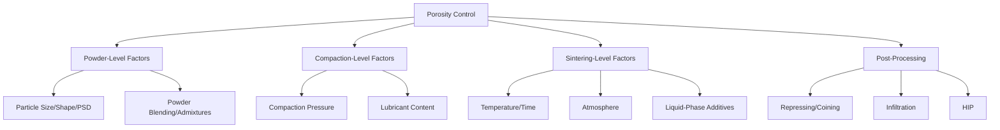

## Porosity Control in Powder Metallurgy Parts

### Overview

Porosity is an intrinsic characteristic of powder metallurgy (PM) parts, arising from incomplete densification during compaction and sintering. Rather than being uniformly undesirable, porosity is an engineered variable — controlled, characterized, and sometimes deliberately retained or eliminated depending on the application (structural strength vs. self-lubricating bearings vs. filtration media).

### Sources and Control Levers for Porosity

---

### 1. Classification of Porosity

**Key Points**

- **Open (interconnected) porosity**: pores connected to the part's external surface, permeable to fluids/gases — relevant for filters, self-lubricating bearings, and early-stage sintered parts before pore channel closure
- **Closed (isolated) porosity**: pores fully enclosed within the solid, no longer connected to the surface — characteristic of later-stage sintering and required before HIP can be effective
- Distinction matters directly for engineering response: open porosity governs permeability and oil retention; closed porosity governs residual density-limited mechanical properties

**Quantification**

Percent porosity is typically calculated from measured (apparent) density relative to theoretical (pore-free) density:

$$P(\%) = \left(1 - \frac{\rho_{measured}}{\rho_{theoretical}}\right) \times 100$$

Interconnected vs. total porosity is distinguished experimentally via oil/water impregnation methods (ASTM B328), where the mass gain upon fluid infiltration under vacuum quantifies interconnected pore volume specifically.

---

### 2. Powder-Level Control

**Key Points**

- Particle size distribution strongly influences green (as-pressed) porosity: a well-graded, bimodal or multimodal PSD allows finer particles to fill voids between coarser particles, increasing packing density and reducing initial porosity
- Irregular particle shapes (water-atomized, sponge/reduced powders) interlock mechanically, improving green strength but can trap porosity at contact points compared to smoother spherical powders
- Powder blending with sintering aids (e.g., copper or graphite additions in ferrous PM) can promote liquid-phase or enhanced diffusion sintering, accelerating pore closure

**Example**: In conventional ferrous PM (e.g., FC-0208 grade), admixed copper (approximately 2 wt%) melts during sintering and infiltrates the pore network via capillary action, partially filling porosity and improving strength — a controlled, intentional use of liquid-phase mechanisms to reduce effective porosity.

---

### 3. Compaction-Level Control

**Key Points**

- Compaction pressure is the primary lever controlling green density and, consequently, the baseline porosity entering the sintering stage
- Higher compaction pressure reduces initial (green) porosity but yields diminishing returns due to work hardening of the powder and increased die-wall friction at high pressures
- Density-pressure relationships are frequently described using the Heckel equation (see Compaction Techniques):

$$\ln\left(\frac{1}{1-D}\right) = KP + A$$

- Excessive lubricant content, while reducing die-wall friction and easing ejection, occupies volume that becomes residual porosity once burned off during early sintering — lubricant level is therefore a direct porosity trade-off variable
- Double-action or isostatic compaction (CIP) produces more uniform density distribution, reducing localized porosity gradients compared to single-action die pressing

---

### 4. Sintering-Level Control

**Key Points**

- Sintering temperature and time govern the extent of neck growth, pore channel closure, and final-stage pore elimination as described in the sintering stage model (initial, intermediate, final)
- Higher sintering temperature and longer hold time generally reduce residual porosity, but excessive time/temperature risks abnormal grain growth, which can detach pores from grain boundaries (pore-boundary separation) — trapping porosity and halting further densification
- Sintering atmosphere affects pore closure indirectly: reducing atmospheres remove surface oxides that otherwise impede diffusion-driven neck growth; vacuum sintering removes trapped gases within pores that would otherwise resist final-stage closure by generating internal back-pressure
- Liquid-phase sintering (e.g., WC-Co, bronze-iron systems) is a particularly effective mechanism for achieving very low residual porosity, since capillary-driven liquid flow rapidly fills pore space during the rearrangement stage

**Pore Filling with Trapped Gas**

For closed pores containing trapped insoluble gas (e.g., argon from atomization or sintering atmosphere), further densification is resisted by the gas back-pressure, following an approximate relation:

$$P_{gas} \cdot V_{pore} = \text{constant (per pore, isothermal)}$$

As the pore shrinks under sintering stress, trapped gas pressure rises correspondingly, eventually equilibrating with the driving force for further shrinkage — a key reason why fully sealed, gas-filled pores are difficult to eliminate through solid-state sintering alone and often require HIP (where external pressure exceeds internal gas pressure) for full closure.

---

### 5. Post-Processing Techniques for Porosity Reduction

#### 5.1 Repressing / Coining / Sizing

**Key Points**

- A sintered part is passed through a second die compaction cycle (repressing) to plastically deform and further densify the surface and near-surface regions, closing residual porosity and improving dimensional precision
- Sizing focuses primarily on dimensional correction with modest densification effect; coining applies higher pressure specifically to increase density and surface hardness

#### 5.2 Infiltration

**Key Points**

- A lower-melting-point metal (commonly copper for ferrous PM parts) is placed in contact with the sintered part and melted during a subsequent thermal cycle, drawing into open porosity via capillary action
- Fills interconnected porosity, improving strength, hardness, and (for some applications) pressure-tightness, while retaining the base material's primary characteristics
- Distinct from powder-level copper admixing in that infiltration occurs as a discrete post-sintering step with a separate infiltrant slug/insert

#### 5.3 Hot Isostatic Pressing (HIP)

**Key Points**

- Applied to sintered parts that have reached the closed-porosity stage (see Hot Isostatic Pressing topic), using combined temperature and isostatic gas pressure to collapse remaining closed pores via creep and diffusional mechanisms
- Achieves near-theoretical density (>99.5%), the most effective post-processing route for porosity elimination, but cannot address open/surface-connected porosity

#### 5.4 Resin/Polymer Impregnation

**Key Points**

- Low-viscosity resin is vacuum-impregnated into open porosity, primarily to seal interconnected pores against fluid/gas leakage (pressure-tightness) rather than to increase load-bearing density
- Common for PM parts requiring hydraulic or pneumatic sealing without the cost of full infiltration or HIP

---

### 6. Intentionally Retained Porosity (Functional Applications)

**Key Points**

- **Self-lubricating bearings**: controlled interconnected porosity (typically 20–30% by volume) is deliberately retained and impregnated with lubricating oil, which wicks to the bearing surface during operation via capillary action and thermal expansion
- **Filters**: PM filter elements rely entirely on a controlled, interconnected pore network with tailored pore size distribution to achieve target filtration ratings while maintaining adequate flow permeability
- In these applications, porosity is a primary design specification, not a defect — compaction pressure and sintering parameters are deliberately moderated (rather than maximized) to preserve the target pore structure

---

### Porosity-Property Relationships

**Key Points**

- Mechanical properties (tensile strength, fatigue strength, ductility, fracture toughness) generally degrade with increasing porosity, since pores act as stress concentrators and reduce effective load-bearing cross-section
- An empirical relationship commonly used to describe strength as a function of porosity is:

$$\sigma = \sigma_0 \exp(-bP)$$

where $\sigma$ is strength at porosity fraction $P$, $\sigma_0$ is the theoretical pore-free strength, and $b$ is a material-specific empirical constant. [Inference] The value of $b$ and the applicability of this exponential form vary by property (tensile vs. fatigue vs. impact) and by pore morphology (rounded vs. interconnected/irregular), so it should be treated as a general trend rather than a universal law.

- Fatigue strength is typically more sensitive to porosity than static tensile strength, since pores (particularly angular or interconnected ones near the surface) serve as crack initiation sites under cyclic loading

**Related Topics**

- Sintering Mechanisms and Stages
- Hot Isostatic Pressing
- Compaction Techniques
- Powder Characterization (Density Measurements)
- Self-Lubricating Bearing Design and Oil Impregnation
- Mechanical Property Testing of PM Materials