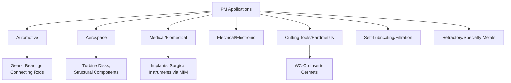

## Applications of Powder Metallurgy

### Overview

Powder metallurgy (PM) serves industries requiring net-shape or near-net-shape components with tailored composition, controlled porosity, or material combinations unachievable through conventional melting/casting/machining routes. Applications span automotive, aerospace, medical, electrical, and specialty/refractory sectors.

### Application Domains

---

### 1. Automotive Applications

**Key Points**

- Largest single market segment for conventional PM (die-compacted, sintered) parts by volume
- Favored for high-volume production of moderately loaded, complex-geometry components at low per-part cost relative to machining from wrought stock
- Typical parts: connecting rods, gears, sprockets, cam lobes, valve seat inserts, oil pump rotors, synchronizer hubs, shock absorber components

**Key Points**

- PM connecting rods use "fracture splitting" (cracked connecting rod technology), where a sintered rod/cap assembly is deliberately fractured along a designed weak plane rather than machined, producing a perfectly mating fracture surface that self-locates during reassembly — a process enabled specifically by the controlled microstructure of sintered PM steel
- Valve seat inserts commonly use infiltrated or alloyed PM steels for wear resistance under high-temperature combustion chamber conditions
- [Inference] Cost advantages of PM over machined/forged alternatives are generally most pronounced for complex geometries at medium-to-high production volumes; exact break-even volumes depend on part complexity and material.

---

### 2. Aerospace Applications

**Key Points**

- PM techniques (particularly HIP-consolidated powder and hot-isostatic-pressed castings) are used where extreme property consistency, fatigue performance, or compositional homogeneity is required
- Nickel-based superalloy turbine disks are frequently produced via powder metallurgy routes (gas-atomized pre-alloyed powder, HIP or extrusion-consolidated, then forged/machined) specifically to avoid macrosegregation defects inherent to conventional ingot casting of highly alloyed compositions
- Titanium alloy structural components (Ti-6Al-4V) produced via powder-based near-net-shape routes reduce the extremely high buy-to-fly ratio associated with machining titanium from wrought billet
- HIP is standard practice for closing internal porosity in critical aerospace castings (turbine blades, structural brackets) to improve fatigue life

**Example**: Powder metallurgy nickel superalloy disks (e.g., René 88DT, IN100) are used in jet engine turbine sections where fine, uniform grain structure achieved via powder consolidation directly improves fatigue crack initiation resistance compared to cast-and-wrought alternatives of the same composition.

---

### 3. Medical and Biomedical Applications

**Key Points**

- Metal Injection Molding (MIM) is extensively used for small, complex-geometry surgical instruments, orthodontic brackets, and implantable components where high-volume, precise, net-shape production is economically favorable
- Titanium and cobalt-chromium PM/MIM components are used for orthopedic and dental implants, leveraging biocompatibility along with the ability to engineer controlled surface porosity that promotes osseointegration (bone ingrowth)
- Porous PM/additively-manufactured titanium structures (trabecular-like architectures) are specifically engineered with controlled interconnected porosity to mimic bone stiffness and encourage biological fixation — an application where the porosity itself (rather than densification) is the functional design target

---

### 4. Electrical and Electronic Applications

**Key Points**

- Soft magnetic composites (SMCs) — insulated iron powder particles compacted and sintered/cured at relatively low temperature — enable three-dimensional magnetic flux paths not achievable with laminated electrical steel, used in some motor and inductor cores
- Copper and silver-based PM contacts are used in electrical switchgear, leveraging PM's ability to combine dissimilar-property constituents (e.g., silver-tungsten or copper-tungsten composites combining high conductivity with arc erosion resistance)
- Tungsten and molybdenum PM components (filaments, electrical contacts, heat sinks) rely on PM processing since these refractory metals have melting points impractical for conventional casting

---

### 5. Cutting Tools and Wear-Resistant Applications (Hardmetals/Cermets)

**Key Points**

- Tungsten carbide-cobalt (WC-Co) cemented carbides, produced via liquid-phase sintering, represent one of the most mechanically demanding and commercially significant PM product categories — used for cutting tool inserts, mining/drilling bits, and wear parts
- Cermets (ceramic-metal composites, e.g., TiC-Ni or TiCN-based systems) extend hardmetal concepts toward higher hot hardness and wear resistance for high-speed machining applications
- PM high-speed steels (HSS), produced via gas atomization followed by HIP or conventional sintering, achieve finer, more uniform carbide distribution than conventionally cast/wrought HSS, improving toughness and grindability

---

### 6. Self-Lubricating Bearings and Filtration

**Key Points**

- Bronze and iron-based PM bearings with controlled interconnected porosity (typically 20–30 vol%) are oil-impregnated, providing continuous self-lubrication as the bearing operates — a functional application entirely dependent on retained, engineered porosity
- PM filter elements (bronze, stainless steel, nickel-based) use controlled pore size distribution to achieve specified filtration ratings for fluid/gas filtration in hydraulic, chemical processing, and sparging applications
- These represent the clearest examples of porosity as a primary design specification rather than a defect to be minimized

---

### 7. Refractory and Specialty Metal Applications

**Key Points**

- Powder metallurgy is often the only practical production route for refractory metals (tungsten, molybdenum, tantalum, niobium) due to their extremely high melting points, which make conventional melting/casting impractical or uneconomical
- Reactive metals and metal matrix composites benefit from PM/MIM routes that avoid segregation and enable fine, controlled reinforcement distribution not achievable through casting

---

### Summary: PM Route Selection by Application Driver

| Application Driver | Representative PM Route | Example |
| --- | --- | --- |
| High-volume, moderate-complexity parts | Die compaction + sintering | Automotive gears, bearings |
| Extreme property consistency | HIP-consolidated powder | Turbine disks |
| Small, highly complex geometry | MIM | Surgical instruments, implants |
| Engineered/functional porosity | Controlled sintering, minimal densification | Self-lubricating bearings, filters |
| Melting point impractical for casting | Reduction/carbonyl powder + sintering | Tungsten, molybdenum components |
| Dissimilar-property composites | Liquid-phase sintering, infiltration | WC-Co cutting tools, Ag-W contacts |

**Related Topics**

- Powder Production Methods
- Compaction Techniques
- Liquid-Phase Sintering Systems (WC-Co, Bronze-Iron)
- Metal Injection Molding
- Porosity Control in Powder Metallurgy Parts
- Hot Isostatic Pressing