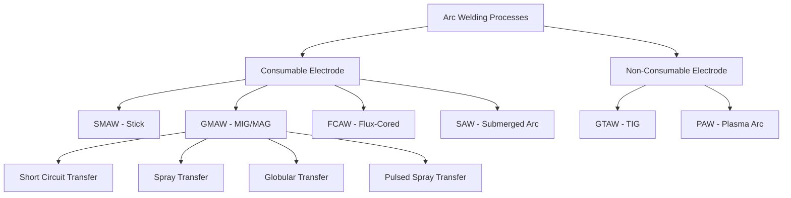

## Arc Welding Processes

### Overview

Arc welding encompasses a family of fusion welding processes that use an electric arc between an electrode and the workpiece to generate the heat required for melting and coalescence of base metals. Process selection depends on material type, thickness, required productivity, position, and shielding requirements.

### Classification of Arc Welding Processes

---

### 1. Shielded Metal Arc Welding (SMAW)

**Key Points**

- Also known as "stick" welding; a flux-coated consumable electrode is manually manipulated, with the arc struck between the electrode tip and workpiece
- Flux coating decomposes under arc heat, generating a shielding gas envelope (CO₂, water vapor) and forming a protective slag layer over the weld pool
- Highly portable, minimal equipment requirements, tolerant of outdoor/windy conditions since shielding is generated locally rather than relying on external gas flow
- Lower deposition rate and productivity compared to semi-automatic processes; requires slag removal between passes

**Electrode Classification (AWS A5.1, example)**

- E7018: "E" = electrode, "70" = 70 ksi minimum tensile strength, "1" = all-position capable, "8" = low-hydrogen iron-powder coating, DC or AC
- Low-hydrogen electrodes (e.g., E7018) require controlled storage/baking to prevent moisture pickup, which causes hydrogen-induced cracking in susceptible steels

---

### 2. Gas Metal Arc Welding (GMAW / MIG-MAG)

**Key Points**

- Continuously fed consumable wire electrode, shielded by an externally supplied gas (inert: argon/helium for MIG; active: CO₂ or argon-CO₂ mixtures for MAG)
- High productivity due to continuous wire feed, minimal slag (or none with pure inert gas), suited to semi-automatic and robotic automation
- Sensitive to wind/drafts due to reliance on external gas shielding — generally an indoor or shielded-environment process

#### 2.1 Metal Transfer Modes

**Short-Circuit Transfer**

- Wire tip repeatedly contacts the weld pool and short-circuits, causing pinch-off droplet detachment; low heat input, suited to thin sheet and out-of-position welding
- Characteristic current range: relatively low, with high short-circuit frequency

**Globular Transfer**

- Occurs at intermediate current with CO₂-rich shielding; large, irregular droplets detach under gravity, producing more spatter and less controlled bead geometry

**Spray Transfer**

- Above a critical current threshold (transition current), a fine stream of small droplets transfers axially across the arc; requires argon-rich shielding gas and produces a smooth, low-spatter, high-quality weld, but the requisite high heat input limits it to flat/horizontal thicker-section work

**Pulsed Spray Transfer**

- Current pulses between a low background level and a peak level exceeding the spray transition threshold, achieving spray-like droplet transfer at a lower average current — enables spray-quality welds in out-of-position and thinner-section applications

**Transfer Mode Selection Diagram (svg_diagram)**

<svg xmlns="http://www.w3.org/2000/svg" viewBox="0 0 520 220">
<text x="260" y="20" text-anchor="middle" font-size="14" font-weight="bold" fill="#222">GMAW Metal Transfer Modes vs Current (svg_diagram)</text>
<line x1="60" y1="180" x2="480" y2="180" stroke="#333" stroke-width="2" />
<line x1="60" y1="180" x2="60" y2="40" stroke="#333" stroke-width="2" />
<text x="470" y="200" font-size="11" fill="#333">Current →</text>
<text x="30" y="40" font-size="11" fill="#333">Heat</text>
<rect x="75" y="140" width="90" height="40" fill="#6baed6" />
<text x="120" y="165" text-anchor="middle" font-size="10" fill="#fff">Short-Circuit</text>
<rect x="175" y="110" width="90" height="70" fill="#3182bd" />
<text x="220" y="150" text-anchor="middle" font-size="10" fill="#fff">Globular</text>
<rect x="275" y="70" width="90" height="110" fill="#08519c" />
<text x="320" y="130" text-anchor="middle" font-size="10" fill="#fff">Spray</text>
<rect x="375" y="90" width="90" height="90" fill="#54278f" />
<text x="420" y="140" text-anchor="middle" font-size="10" fill="#fff">Pulsed Spray</text>
</svg>

---

### 3. Flux-Cored Arc Welding (FCAW)

**Key Points**

- Tubular consumable wire electrode filled with flux core; two variants — self-shielded (FCAW-S, flux generates its own shielding gas, no external gas needed) and gas-shielded (FCAW-G, external CO₂ or argon-CO₂ mixture supplements flux shielding)
- Higher deposition rates than SMAW and GMAW in many applications; self-shielded variant retains portability advantage of SMAW for field/outdoor construction work
- Produces slag requiring removal (similar to SMAW), unlike solid-wire GMAW
- Widely used in structural steel construction and shipbuilding due to high productivity and good out-of-position capability

---

### 4. Submerged Arc Welding (SAW)

**Key Points**

- Bare consumable wire electrode with the arc and weld pool fully submerged beneath a blanket of granular flux, which melts to form slag and shields the pool from atmospheric contamination
- No visible arc, minimal spatter, and no fume/radiation exposure at the point of welding — highly favorable from an operator exposure standpoint
- Extremely high deposition rates and welding speeds achievable, but limited to flat or horizontal-fillet positions since the flux blanket relies on gravity
- Common for heavy plate fabrication: pressure vessels, shipbuilding, large structural members, pipe longitudinal seams

---

### 5. Gas Tungsten Arc Welding (GTAW / TIG)

**Key Points**

- Non-consumable tungsten electrode sustains the arc; filler metal, if required, is added separately (manually or via cold/hot wire feed), independent of the arc current path
- Inert gas shielding (typically pure argon, sometimes argon-helium blends for increased heat input on thicker/higher-conductivity materials)
- Produces the highest weld quality and precision among common arc processes — minimal spatter, excellent bead appearance, precise heat control
- Lower deposition rate than consumable-electrode processes, making it comparatively slow for thick-section or high-volume work
- Widely used for root passes on critical pipe welds, thin-gauge material, and reactive/exotic metals (titanium, aluminum, stainless steel, nickel alloys) requiring high weld purity

**Polarity Effects**

- DCEN (electrode negative): deep penetration, narrow bead, used for most steels
- DCEP (electrode positive): shallow penetration, but provides beneficial "cleaning action" that removes the tenacious oxide layer on aluminum/magnesium — hence AC (which alternates between EN and EP) is standard for aluminum GTAW, balancing penetration with oxide-cleaning action

---

### 6. Plasma Arc Welding (PAW)

**Key Points**

- Similar non-consumable tungsten electrode configuration to GTAW, but the arc is constricted through a water-cooled orifice/nozzle, producing a collimated, higher-energy-density plasma jet
- Enables the "keyhole" welding mode at sufficient current, where the plasma jet fully penetrates the workpiece thickness, producing a keyhole that moves with the torch and results in a full-penetration weld in a single pass with a narrow heat-affected zone
- Higher equipment complexity and cost than GTAW, but offers greater penetration control, welding speed, and tolerance to minor torch-to-work distance variation
- Used in precision applications: aerospace components, thin-to-medium section stainless/nickel alloy welding

---

### Process Comparison

| Process | Electrode | Shielding | Productivity | Portability | Typical Use |
| --- | --- | --- | --- | --- | --- |
| SMAW | Consumable (coated) | Flux-generated | Low–moderate | Excellent | Field/repair, construction |
| GMAW | Consumable (solid wire) | External gas | High | Moderate | Automotive, general fabrication |
| FCAW | Consumable (tubular) | Flux ± external gas | High | Good (self-shielded) | Structural steel, shipbuilding |
| SAW | Consumable (bare wire) | Granular flux | Very high | Low (flat/horizontal only) | Heavy plate, pressure vessels |
| GTAW | Non-consumable (tungsten) | External inert gas | Low | Moderate | Precision, thin/reactive metals |
| PAW | Non-consumable (tungsten) | External inert gas | Moderate–high | Low | Aerospace, precision keyhole welds |

**Related Topics**

- Weld Metallurgy and Heat-Affected Zone Formation
- Welding Defects and Non-Destructive Testing
- Resistance Welding Processes
- Brazing and Soldering Fundamentals
- Welding Procedure Specifications and Qualification
- Shielding Gas Selection and Effects on Weld Properties