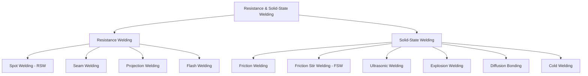

## Resistance and Solid State Welding

### Overview

Resistance welding and solid-state welding processes achieve coalescence without fully melting the base metal through an arc, instead relying on resistive Joule heating combined with applied pressure (resistance welding), or on plastic deformation, diffusion, and mechanical/thermal energy input below the melting point (solid-state welding). These processes avoid many fusion-welding defects (porosity, solidification cracking) since little or no melting occurs.

### Process Classification

---

### 1. Resistance Welding Fundamentals

**Key Points**

- Heat is generated by electrical resistance to current flow across the faying (contacting) surfaces of the workpieces, following Joule's law
- Applied electrode force simultaneously forges the heated interface, promoting coalescence as the material softens
- No filler metal or shielding gas required; process is fast, highly automatable, and well-suited to robotic production lines (notably automotive body assembly)

**Governing Heat Generation Relationship**

$$Q = I^2 R t$$

where $Q$ is heat generated, $I$ is welding current, $R$ is the effective resistance at the interface (dominated by contact resistance, which is influenced by surface condition, applied force, and material), and $t$ is weld time. [Inference] Contact resistance changes dynamically throughout the weld cycle as the interface heats and softens, so this relation is typically applied as an instantaneous/integrated model rather than a single static calculation in practice.

---

### 2. Resistance Spot Welding (RSW)

**Key Points**

- Two overlapping sheets are clamped between two opposing electrodes (typically copper alloy) that apply force and conduct current through a localized contact area, forming a discrete fused "nugget" at the interface
- Dominant joining method in automotive body-in-white assembly due to high speed and full automation compatibility
- Key process variables: welding current, electrode force, weld time (cycles), and electrode tip geometry/condition
- Nugget size and quality depend on achieving sufficient current density at the interface while avoiding expulsion (molten metal ejection due to excessive heat/insufficient force)

**Weld Lobe Diagram (svg_diagram)**

<svg xmlns="http://www.w3.org/2000/svg" viewBox="0 0 480 260">
<text x="240" y="20" text-anchor="middle" font-size="14" font-weight="bold" fill="#222">Resistance Spot Welding Lobe (svg_diagram)</text>
<line x1="60" y1="220" x2="440" y2="220" stroke="#333" stroke-width="2" />
<line x1="60" y1="220" x2="60" y2="40" stroke="#333" stroke-width="2" />
<text x="380" y="240" font-size="11" fill="#333">Weld Current →</text>
<text x="20" y="40" font-size="11" fill="#333">Weld Time</text>
<path d="M 100 200 Q 150 100 250 90 Q 350 100 400 200 Z" fill="#6baed6" opacity="0.7" stroke="#08519c" stroke-width="2" />
<text x="250" y="150" text-anchor="middle" font-size="11" fill="#08306b">Acceptable Weld Window</text>
<text x="90" y="215" font-size="9" fill="#333">Min (no fusion)</text>
<text x="370" y="215" font-size="9" fill="#333">Max (expulsion)</text>
</svg>

**Key Points**

- The "weld lobe" defines the acceptable current-time process window bounded by minimum current (insufficient fusion) and maximum current (expulsion); process control aims to operate well within this window
- Electrode wear/mushrooming over production runs increases contact area, reducing current density and requiring periodic current compensation or electrode dressing

---

### 3. Resistance Seam Welding

**Key Points**

- Similar principle to spot welding, but stationary electrodes are replaced with rotating wheel electrodes that continuously feed the workpiece, producing a series of overlapping nuggets that form a continuous, leak-tight seam
- Used for fluid/gas-tight vessels: fuel tanks, radiators, drums, and other sealed sheet-metal assemblies
- Current is typically pulsed synchronously with wheel rotation to control individual nugget overlap and spacing

---

### 4. Resistance Projection Welding

**Key Points**

- One workpiece contains pre-formed projections (embossed dimples or machined features) that concentrate current density and force at discrete points upon clamping, rather than relying on electrode geometry to localize the weld
- Enables multiple simultaneous welds in a single cycle (each projection forms its own nugget) and accommodates less precise electrode alignment than spot welding
- Common for welding nuts, studs, and brackets to sheet components in automotive and appliance manufacturing

---

### 5. Flash Welding

**Key Points**

- Two workpiece ends are brought into light contact under current flow, generating localized arcing/flashing that heats and melts a thin layer at the interface; the parts are then rapidly forged together under high axial pressure, expelling molten/oxidized material as flash
- Used for joining bar stock, rings, and tubular sections end-to-end (e.g., wheel rims, chain links, pipe sections)
- Produces a full cross-section weld with minimal heat-affected zone relative to fusion methods of similar joint area

---

### 6. Friction Welding

**Key Points**

- One workpiece is rotated at high speed while pressed against a stationary mating workpiece; frictional heating at the interface raises the material to a hot, plasticized (but not melted) state, at which point rotation stops and axial "forge" pressure completes the bond
- Variants: continuous-drive friction welding (constant rotational speed until forge) and inertia friction welding (energy stored in a rotating flywheel is dissipated into the weld, ending rotation naturally as energy depletes)
- Produces a characteristic flash/upset bulge at the joint, often removed by subsequent machining
- Effective for joining dissimilar metals (e.g., steel-to-aluminum shafts) that would be difficult or impossible to fusion weld due to incompatible melting points or intermetallic embrittlement

---

### 7. Friction Stir Welding (FSW)

**Key Points**

- A non-consumable rotating tool with a shoulder and profiled pin is plunged into the abutting edges of the workpieces and traversed along the joint line; frictional and severe plastic deformation heating softens the material without melting, while the tool geometry mechanically stirs and consolidates the joint
- Produces a fine-grained, recrystallized weld microstructure via dynamic recrystallization, generally with mechanical properties superior to fusion-welded joints in the same material, particularly for aluminum alloys prone to solidification cracking or porosity in arc welding
- No filler metal, shielding gas, or arc hazards (fumes, UV radiation, spatter); process is well suited to precision automated/robotic implementation
- Widely used for aluminum alloy structures in aerospace, shipbuilding, and rail; increasingly applied to dissimilar-metal joints (Al-steel, Al-Mg) and, with advanced tooling, to steel and titanium

**Key Points**

- Tool pin design (threaded, tapered, featured) and traverse/rotation speed ratio govern heat input, material flow pattern, and defect susceptibility (e.g., "wormhole" voids from insufficient material flow)
- A characteristic asymmetry exists between the "advancing side" (tool rotation and traverse direction aligned) and "retreating side" (opposed), which can produce asymmetric weld properties and requires process parameter optimization

---

### 8. Ultrasonic Welding

**Key Points**

- High-frequency (typically 20–40 kHz) vibratory energy is applied parallel to the interface under moderate clamping pressure, generating localized frictional and shear heating that disrupts surface oxides and promotes solid-state bonding
- Widely used for thin sheet/foil joining (battery tab welding, wire bonding in microelectronics), and for thermoplastic joining in a related but distinct application
- Low overall heat input makes it well suited to heat-sensitive assemblies and dissimilar thin-gauge metal combinations (e.g., copper-aluminum battery terminal welding)

---

### 9. Explosion Welding

**Key Points**

- A controlled detonation propels one plate (the "flyer plate") at high velocity into a stationary "base plate" at an oblique angle; the resulting extreme, localized pressure and jetting action strips surface oxides and creates a metallurgical bond, often exhibiting a characteristic wavy interface
- Enables cladding/bonding of dissimilar and otherwise metallurgically incompatible metal combinations over large plate areas (e.g., titanium-to-steel, copper-to-aluminum transition joints)
- Common application: bimetallic transition joints for pressure vessels, shipbuilding hull cladding, and electrical busbar transitions between dissimilar conductors

---

### 10. Diffusion Bonding

**Key Points**

- Faying surfaces are held in intimate contact under moderate pressure and elevated temperature (typically 0.5–0.8 $T_m$) for an extended time, allowing atomic diffusion across the interface to achieve bonding without bulk melting or significant macroscopic deformation
- Often performed in vacuum or inert atmosphere to prevent interfacial oxidation, and can be combined with HIP equipment (diffusion bonding under isostatic gas pressure) for improved interface conformity, particularly for complex geometries
- Enables joining of dissimilar and reactive/refractory metals (titanium, nickel superalloys) with minimal distortion and no melt-related defects; widely used in aerospace honeycomb/sandwich panel fabrication and superplastic-forming/diffusion-bonding (SPF/DB) titanium structures

---

### 11. Cold Welding

**Key Points**

- Bonding achieved through severe plastic deformation at room temperature (no external heat source), which disrupts surface oxide films and brings clean metal surfaces into sufficiently intimate atomic contact to bond
- Limited primarily to highly ductile metals (aluminum, copper, gold) in wire/foil/strip form; common in wire bonding for electronics and aluminum can-body/lid seam applications

---

### Process Comparison

| Process | Heat Source | Melting Occurs? | Typical Application |
| --- | --- | --- | --- |
| Spot/Seam/Projection Welding | Resistive (I²R) | Localized, yes | Automotive sheet assembly |
| Flash Welding | Arcing + resistive | Yes (thin layer) | Bar stock, rings, wheel rims |
| Friction Welding | Frictional | No (plasticized) | Dissimilar shafts, axisymmetric parts |
| Friction Stir Welding | Frictional + deformation | No | Aluminum aerospace/rail structures |
| Ultrasonic Welding | Vibratory friction | No | Battery tabs, wire bonding |
| Explosion Welding | Impact/detonation | No (localized jetting) | Bimetallic cladding, transition joints |
| Diffusion Bonding | Thermal + pressure/time | No | Titanium/superalloy aerospace structures |
| Cold Welding | Plastic deformation | No | Wire bonding, can seams |

**Related Topics**

- Arc Welding Processes
- Weld Metallurgy and Heat-Affected Zone Formation
- Welding Defects and Non-Destructive Testing
- Brazing and Soldering Fundamentals
- Superplastic Forming and Diffusion Bonding of Titanium
- Automotive Body-in-White Joining Technologies