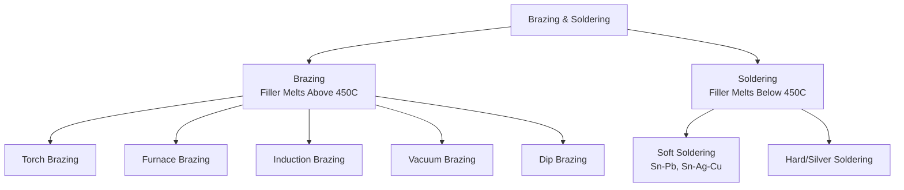

## Brazing and Soldering

### Overview

Brazing and soldering are joining processes that produce a metallurgical bond by melting and flowing a filler metal into a joint gap via capillary action, without melting the base materials. They are distinguished from each other primarily by the filler metal's melting temperature relative to a defined threshold (450°C / 840°F).

### Process Classification

---

### 1. Fundamental Distinction: Brazing vs. Soldering

**Key Points**

- Both processes join base metals without melting them, relying entirely on capillary flow of molten filler metal into a controlled joint clearance
- The dividing line is filler metal liquidus temperature: brazing filler metals melt above 450°C (840°F); soldering filler metals melt below this threshold
- Both require a fluxing agent (or controlled atmosphere) to remove/prevent oxide films on the faying surfaces, since oxides block wetting and capillary flow
- Neither process involves melting of the base metal, distinguishing them fundamentally from fusion welding — heat-affected zone effects and base-metal dilution concerns characteristic of welding are largely absent

---

### 2. Capillary Action and Joint Design

**Key Points**

- Capillary flow, not gravity, draws molten filler into the joint gap — the process therefore works effectively even against gravity (vertical or overhead joints) provided the gap is correctly sized
- Optimal joint clearance for capillary flow is narrow, typically 0.025–0.25 mm (0.001–0.010 in) for brazing, since capillary pressure is inversely related to gap width

The capillary rise/pressure relationship is described by:

$$h = \frac{2\gamma\cos\theta}{\rho g r}$$

where $h$ is capillary rise, $\gamma$ is the filler metal's surface tension, $\theta$ is the wetting (contact) angle, $\rho$ is filler metal density, $g$ is gravitational acceleration, and $r$ is the effective gap radius (half the joint clearance)

**Key Points**

- Excessively wide joint gaps reduce capillary pressure and can result in incomplete filling, voids, or filler metal pooling rather than uniform distribution
- Excessively tight gaps can restrict flux escape and filler flow, similarly causing incomplete joints
- Lap joints are strongly preferred over butt joints in brazing/soldering design, since they provide substantially greater bonded overlap area to compensate for the comparatively lower strength of the filler metal relative to the base metals

---

### 3. Flux and Atmosphere

**Key Points**

- Flux chemically dissolves and displaces surface oxides during heating, and its molten film also protects the cleaned surface from re-oxidation prior to filler metal flow
- Flux residues are frequently corrosive or unsightly and typically require post-joint cleaning (water rinse or solvent) unless a "no-clean" flux formulation is used
- Controlled-atmosphere or vacuum brazing eliminates the need for flux entirely by preventing oxide formation through an inert, reducing, or vacuum environment — preferred for high-integrity aerospace and reactive-metal (titanium, aluminum alloy) applications where flux residue or entrapment is unacceptable

---

### 4. Brazing Processes

#### 4.1 Torch Brazing

- Manual or automated oxy-fuel or air-fuel torch applies localized heat; filler metal (typically as a rod or pre-placed ring) is melted and drawn into the joint
- Flexible, low equipment cost, suited to repair work, low-volume production, and joints with variable geometry

#### 4.2 Furnace Brazing

- Assembled parts with pre-placed filler metal (typically as a foil, paste, or preform) are loaded into a furnace and heated to filler liquidus temperature in a controlled or protective atmosphere (hydrogen, dissociated ammonia, or inert gas)
- High production volume capability with excellent uniformity and repeatability; commonly used for automotive heat exchangers, honeycomb assemblies, and multi-joint components brazed simultaneously

#### 4.3 Induction Brazing

- Localized heating via electromagnetic induction in the workpiece; fast cycle times and precise, repeatable heat application to a specific joint zone without heating the entire assembly
- Well suited to high-volume production of consistent joint geometries (fittings, tube assemblies)

#### 4.4 Vacuum Brazing

- Performed in a vacuum furnace, eliminating oxidation without flux; particularly valuable for reactive metals (titanium, aluminum) and applications demanding maximum joint cleanliness (aerospace honeycomb structures, medical devices)
- Also enables simultaneous brazing and stress-relief or aging heat treatment cycles for some alloy systems

#### 4.5 Dip Brazing

- Assembly is immersed in a molten flux bath (chemical dip brazing) or molten filler metal bath (metal bath dip brazing), providing rapid, uniform heating
- Common for aluminum brazing (e.g., automotive heat exchangers), where the molten salt flux bath simultaneously provides heat and oxide removal

---

### 5. Common Brazing Filler Metals

| Filler System | Typical Liquidus | Common Base Metals |
| --- | --- | --- |
| BAg (Silver-based) | 620–800°C | Steel, stainless steel, copper alloys |
| BCuP (Copper-Phosphorus) | 710–800°C | Copper, copper alloys (self-fluxing on Cu) |
| BAlSi (Aluminum-Silicon) | 570–615°C | Aluminum alloys |
| BNi (Nickel-based) | 900–1135°C | Stainless steel, nickel superalloys |
| BCu (Copper) | ~1085°C | Steel, high-temperature furnace brazing |

**Key Points**

- BCuP filler metals are notably self-fluxing on copper-to-copper joints (the phosphorus content displaces copper oxides), often eliminating the need for separate flux in plumbing/HVAC copper tube brazing
- BNi filler metals are selected for high-temperature service (jet engine components, heat exchangers) due to superior elevated-temperature strength and oxidation resistance relative to silver-based fillers

---

### 6. Soldering Processes

**Key Points**

- Soldering filler metals ("solders") melt below 450°C, producing substantially lower joint strength than brazed joints — soldering is generally used for electrical/electronic connections, plumbing, and sealing applications rather than primary structural load-bearing joints

**Soft Soldering**

- Traditional Sn-Pb solders (e.g., 63Sn-37Pb eutectic, melting at 183°C) have been largely phased out for consumer electronics in regions with RoHS-type regulations, replaced by lead-free alloys such as SAC305 (Sn-Ag-Cu, approximately 96.5Sn-3Ag-0.5Cu, melting range ~217–220°C)
- Widely used in electronics assembly (through-hole and surface-mount soldering), sheet metal seaming, and copper plumbing joints
- Flux types range from mildly corrosive rosin-based fluxes (common in electronics) to more aggressive acid fluxes (used in plumbing, requiring thorough post-joint cleaning to prevent long-term corrosion)

**Hard/Silver Soldering**

- Higher-silver-content solder alloys occupying the upper end of the soldering temperature range, offering improved strength over conventional soft solders while remaining below the 450°C brazing threshold — used for some jewelry and specialty joining applications

---

### 7. Joint Strength Considerations

**Key Points**

- Brazed/soldered joint strength depends heavily on joint design (overlap area) rather than filler metal strength alone, since well-designed lap joints can achieve shear strengths exceeding the tensile strength of the filler metal itself due to the large bonded area relative to joint cross-section
- Excessive or insufficient filler metal fill, voids from trapped flux gases, and incomplete wetting (dewetting) are the primary defect modes affecting joint integrity
- Base metal and filler metal metallurgical compatibility must be considered — certain combinations (e.g., some brazing filler/base metal pairs) can form brittle intermetallic compounds at the interface if held at temperature excessively long, degrading joint ductility

---

### Comparison: Brazing vs. Soldering vs. Fusion Welding

| Attribute | Soldering | Brazing | Fusion Welding |
| --- | --- | --- | --- |
| Filler Melting Temp | <450°C | >450°C | N/A (base metal melts) |
| Base Metal Melting | No | No | Yes |
| Joint Strength | Low–moderate | Moderate–high | High (approaches base metal) |
| Heat-Affected Zone | Minimal | Minimal–moderate | Significant |
| Typical Application | Electronics, plumbing | Structural, HVAC, aerospace | Primary structural joints |

**Related Topics**

- Arc Welding Processes
- Resistance and Solid-State Welding
- Weld Metallurgy and Heat-Affected Zone Formation
- Flux Chemistry and Oxide Removal Mechanisms
- Aluminum Alloy Brazing (Dip and Vacuum Processes)
- Electronic Assembly Soldering and Lead-Free Alloy Transition