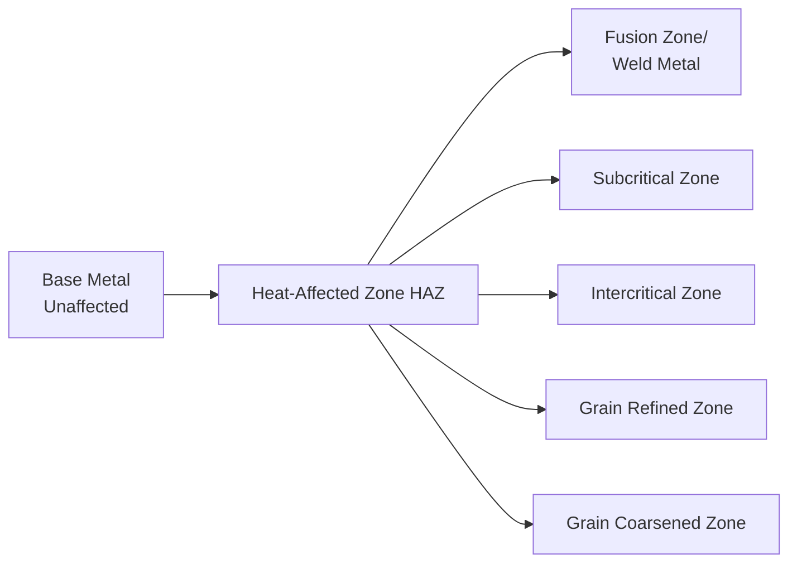

## Weld Metallurgy and the Heat Affected Zone

### Overview

Weld metallurgy describes the microstructural evolution occurring within and around a fusion weld as a result of localized melting, rapid solidification, and the severe, spatially varying thermal cycle experienced by the surrounding base metal. Understanding these transformations is essential for predicting weld mechanical properties, cracking susceptibility, and in-service performance.

### Zones of a Fusion Weld

**Weld Cross-Section Schematic (svg_diagram)**

<svg xmlns="http://www.w3.org/2000/svg" viewBox="0 0 500 220">
<text x="250" y="20" text-anchor="middle" font-size="14" font-weight="bold" fill="#222">Weld Zones Cross-Section (svg_diagram)</text>
<rect x="20" y="60" width="460" height="120" fill="#eff3ff" stroke="#333" stroke-width="1" />
<path d="M 200 60 L 300 60 L 260 180 L 240 180 Z" fill="#08519c" />
<text x="250" y="125" text-anchor="middle" font-size="10" fill="#fff">Fusion Zone</text>
<path d="M 160 60 L 200 60 L 240 180 L 210 180 Z" fill="#6baed6" />
<path d="M 300 60 L 340 60 L 290 180 L 260 180 Z" fill="#6baed6" />
<text x="175" y="125" text-anchor="middle" font-size="9" fill="#fff" transform="rotate(-10 175 125)">HAZ</text>
<text x="325" y="125" text-anchor="middle" font-size="9" fill="#fff" transform="rotate(10 325 125)">HAZ</text>
<rect x="20" y="60" width="140" height="120" fill="#bdd7e7" />
<rect x="340" y="60" width="140" height="120" fill="#bdd7e7" />
<text x="90" y="125" text-anchor="middle" font-size="10" fill="#08306b">Base Metal</text>
<text x="410" y="125" text-anchor="middle" font-size="10" fill="#08306b">Base Metal</text>
</svg>

---

### 1. Fusion Zone (Weld Metal) Solidification

**Key Points**

- Molten weld pool solidifies epitaxially from the partially melted base metal grains at the fusion boundary, growing competitively in the direction of maximum thermal gradient (typically toward the weld centerline)
- Rapid cooling rates characteristic of welding (often far higher than casting) produce fine, often columnar or cellular-dendritic solidification microstructures
- Weld metal composition differs from base metal due to filler metal dilution — the degree of base metal melting and mixing with filler metal, expressed as dilution percentage:

$$\%\,Dilution = \frac{\text{Base metal melted}}{\text{Total weld metal deposited}} \times 100$$

- Solidification mode (planar, cellular, columnar dendritic, or equiaxed dendritic) depends on the ratio of thermal gradient ($G$) to solidification growth rate ($R$); high $G/R$ favors planar/cellular growth, while low $G/R$ favors dendritic and eventually equiaxed structures

---

### 2. Heat-Affected Zone (HAZ) Subzones

The HAZ is the region of base metal that did not melt but experienced a thermal cycle sufficient to alter its microstructure. For hardenable steels, the HAZ is commonly subdivided by peak temperature reached:

#### 2.1 Grain-Coarsened Zone (Nearest Fusion Line)

- Peak temperature well above the upper critical transformation temperature ($A_{c3}$), often approaching the base metal solidus
- Extended time at high temperature promotes significant austenite grain growth prior to subsequent cooling/transformation
- Generally the most metallurgically vulnerable HAZ subzone — coarse prior-austenite grains favor hardenable, brittle transformation products (martensite, upper bainite) upon rapid cooling, and this zone is frequently the preferential site for hydrogen-induced cold cracking and reduced toughness

#### 2.2 Grain-Refined Zone

- Peak temperature just above $A_{c3}$, sufficient for full austenitization but insufficient time/temperature for significant grain growth
- Produces fine-grained, recrystallized microstructure on cooling — generally exhibits favorable strength and toughness, often comparable to or exceeding unaffected base metal

#### 2.3 Intercritical Zone

- Peak temperature between $A_{c1}$ and $A_{c3}$, producing only partial austenitization; original microstructure is partially transformed and partially retained
- Can develop localized hard/brittle constituents (martensite-austenite constituent, "MA") at former pearlite/carbide sites upon rapid cooling, contributing to localized embrittlement in some steels

#### 2.4 Subcritical (Tempered) Zone

- Peak temperature below $A_{c1}$, insufficient for austenitization but sufficient to temper any pre-existing hardened microstructure (relevant for welds on quenched-and-tempered steels)
- Can cause localized softening in previously hardened/tempered base metal, potentially creating a mechanically weaker band adjacent to the unaffected base metal

---

### 3. Cooling Rate and Its Governing Factors

**Key Points**

- HAZ microstructure and hardness are primarily governed by the cooling rate through the critical transformation temperature range, analogous to conventional heat-treatment CCT/TTT behavior
- Cooling rate depends on heat input, base metal thickness (thicker sections extract heat faster via conduction into surrounding mass), preheat temperature, and joint geometry

**Heat Input**

$$HI = \frac{E \cdot I \cdot 60}{v \cdot 1000} \quad \text{(kJ/mm, for arc welding)}$$

where $E$ is arc voltage (V), $I$ is welding current (A), and $v$ is travel speed (mm/min)

**Key Points**

- Higher heat input generally slows cooling rate, reducing HAZ hardness/martensite formation risk but increasing grain coarsening extent and overall HAZ width
- Lower heat input increases cooling rate, raising the risk of untempered martensite formation and associated hydrogen cracking susceptibility in hardenable steels, but limits grain growth and HAZ width
- Preheating raises the baseline temperature of the workpiece, directly reducing the effective cooling rate without changing heat input — a primary practical tool for controlling HAZ hardness in hardenable steels without altering welding parameters

---

### 4. Carbon Equivalent and Weldability

**Key Points**

- Carbon equivalent (CE) formulas estimate a steel's hardenability/crack susceptibility from its chemical composition, guiding preheat and heat input requirements
- A commonly used International Institute of Welding (IIW) formula:

$$CE_{IIW} = C + \frac{Mn}{6} + \frac{Cr+Mo+V}{5} + \frac{Ni+Cu}{15}$$

- Higher CE values indicate greater hardenability and generally require higher preheat temperatures and/or controlled heat input to avoid HAZ cracking; [Inference] specific preheat recommendations derived from CE also depend on hydrogen level, restraint, and section thickness, so CE alone is a screening tool rather than a complete weldability predictor.

---

### 5. Hydrogen-Induced (Cold) Cracking

**Key Points**

- Delayed cracking occurring after cooling to near room temperature (often hours to days post-weld), resulting from the combination of: (1) sufficient diffusible hydrogen in the weld/HAZ, (2) a susceptible (typically hard, martensitic) microstructure, and (3) sufficient tensile stress (residual or applied)
- Hydrogen sources include moisture in electrode coatings/flux, surface contamination (oil, rust), and atmospheric humidity — low-hydrogen electrodes and proper consumable storage/baking are primary preventive measures
- Preheat and controlled interpass temperature slow cooling rate (reducing martensite fraction) and promote hydrogen diffusion/escape before crack-critical conditions develop
- Post-weld hydrogen bake-out (holding the weldment at moderate temperature, e.g., 200–300°C, for an extended period after welding) is used for highly restrained or high-CE joints to allow residual hydrogen to diffuse out before it can cause delayed cracking

---

### 6. Solidification Cracking (Hot Cracking)

**Key Points**

- Occurs during solidification, within the fusion zone, when low-melting-point liquid films (segregated impurities such as sulfur and phosphorus in steels, or certain alloying element combinations) remain along grain boundaries and are unable to accommodate solidification shrinkage strain
- Distinguished from hydrogen cracking by timing (occurs at or near solidus temperature, during/immediately after solidification) and location (typically centerline of the weld bead, following the solidification grain boundary pattern)
- Controlled primarily through composition control (limiting sulfur/phosphorus, controlling Mn:S ratio to promote higher-melting manganese sulfide formation rather than low-melting iron sulfide films) and joint/bead geometry (avoiding excessively deep, narrow bead profiles that concentrate segregated liquid at the centerline)

---

### 7. Residual Stress and Distortion

**Key Points**

- Non-uniform heating and cooling produce differential thermal expansion/contraction, generating residual stresses that can approach the yield strength of the base metal, particularly near the weld
- Residual stresses contribute to distortion (angular, longitudinal, transverse) and can promote stress-corrosion cracking or fatigue crack initiation in service if not managed
- Mitigation approaches: welding sequence/technique control (balanced welding, back-step sequencing), pre-setting/pre-bending to counteract anticipated distortion, and post-weld heat treatment (stress relief annealing) for critical or highly restrained assemblies

---

### Summary: HAZ Subzone Characteristics (Hardenable Steel)

| Subzone | Peak Temperature | Typical Resulting Concern |
| --- | --- | --- |
| Grain-Coarsened | Near solidus, well above $A_{c3}$ | Coarse grains, martensite, cold cracking risk |
| Grain-Refined | Just above $A_{c3}$ | Generally favorable properties |
| Intercritical | Between $A_{c1}$ and $A_{c3}$ | Localized MA constituent, embrittlement risk |
| Subcritical | Below $A_{c1}$ | Softening in pre-hardened base metal |

**Related Topics**

- Arc Welding Processes
- Welding Defects and Non-Destructive Testing
- Carbon Equivalent and Preheat Calculation
- Post-Weld Heat Treatment and Stress Relief
- CCT/TTT Diagrams and Steel Hardenability
- Residual Stress Measurement and Distortion Control