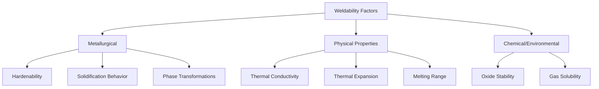

## Weldability of Metals and Alloys

### Overview

Weldability describes the relative ease with which a material can be welded into a structure that performs satisfactorily in service, encompassing metallurgical response to welding thermal cycles, susceptibility to defects, and the process/procedural controls required to achieve sound joints. Weldability varies substantially across alloy systems based on composition, microstructure, and physical properties.

### Factors Governing Weldability

---

### 1. Carbon and Low-Alloy Steels

**Key Points**

- Weldability governed primarily by carbon content and alloying element hardenability, quantified via carbon equivalent (CE) formulas (see Weld Metallurgy topic)
- Low-carbon steels (<0.15% C) exhibit excellent weldability with minimal preheat requirements under most conditions
- Medium-to-high carbon and low-alloy steels require increasing preheat/interpass temperature control and low-hydrogen practices as CE rises, to manage HAZ martensite formation and hydrogen-induced cold cracking risk
- Sulfur and phosphorus control (typically <0.03–0.05% each in quality steels) is important to limit solidification (hot) cracking susceptibility in the fusion zone

**Example**: AISI 4140 (a common medium-carbon low-alloy steel, ~0.40% C) requires substantial preheat (commonly 150–260°C depending on section thickness and restraint) plus low-hydrogen electrodes/processes and often post-weld heat treatment, in contrast to AISI 1018 (~0.18% C), which is readily weldable with minimal special precautions in most applications.

---

### 2. Stainless Steels

#### 2.1 Austenitic Stainless Steels (300 series)

- Generally excellent weldability due to absence of a hardening martensitic transformation (austenite is stable at room temperature)
- Primary concerns: sensitization (chromium carbide precipitation at grain boundaries in the 425–815°C range during welding, depleting adjacent chromium and reducing corrosion resistance) and solidification (hot) cracking
- Sensitization mitigated by using low-carbon grades (e.g., 304L, 316L) or stabilized grades (321, 347, containing titanium or niobium that preferentially form carbides, protecting chromium)
- Hot cracking mitigated by controlling ferrite content in the weld metal (typically 3–8% delta ferrite is targeted, since a fully austenitic solidification structure is more crack-susceptible than one containing some primary ferrite)
- High thermal expansion and low thermal conductivity relative to carbon steel promote greater distortion, requiring careful fixturing and welding sequence control

#### 2.2 Ferritic Stainless Steels (400 series)

- No austenite-to-martensite hardening concern, but susceptible to significant HAZ grain growth and associated toughness loss, along with 475°C embrittlement and sigma-phase formation in some compositions/thermal exposure ranges
- Generally more difficult to weld successfully than austenitic grades despite the absence of hardening transformation, due to these grain-growth and embrittlement concerns

#### 2.3 Martensitic Stainless Steels (410, 420, etc.)

- Hardenable, similar in principle to medium/high-carbon steels — HAZ forms hard, brittle martensite upon cooling, requiring preheat, controlled interpass temperature, and often post-weld tempering/heat treatment to restore adequate toughness
- Among the more challenging stainless families to weld without cracking, due to the combined hardenability and typically higher carbon content

#### 2.4 Duplex Stainless Steels

- Contain a controlled mixed ferrite-austenite microstructure (typically ~50/50); welding thermal cycles can shift the phase balance toward excess ferrite in the HAZ/fusion zone if cooling is too rapid, reducing corrosion resistance and toughness
- Heat input and cooling rate control (often via controlled interpass temperature limits) are critical to preserve the target phase balance

---

### 3. Aluminum Alloys

**Key Points**

- High thermal conductivity (roughly 3–5x that of steel) requires substantially higher heat input or preheat to achieve adequate fusion, since heat dissipates rapidly from the weld zone into the surrounding material
- Tenacious, high-melting-point native oxide layer (Al₂O₃, melting point ~2050°C vs. aluminum's ~660°C) must be removed prior to/during welding — addressed via AC GTAW (cleaning action) or mechanical/chemical cleaning immediately before welding
- Non-heat-treatable alloys (1xxx, 3xxx, 5xxx series, strengthened by solid-solution/strain hardening) generally weld well with minimal loss of properties in the HAZ beyond some softening from strain-hardening reversal
- Heat-treatable alloys (2xxx, 6xxx, 7xxx series, strengthened by precipitation hardening) experience significant HAZ softening as welding heat over-ages or dissolves strengthening precipitates; post-weld heat treatment (solution treat + age) may be required to restore properties, though this is often impractical for large structures
- 2xxx and 7xxx series alloys (particularly high-copper or high-zinc compositions) are generally considered to have poor fusion weldability due to hot cracking susceptibility, and are frequently joined instead via solid-state processes (friction stir welding) or mechanical fastening

---

### 4. Nickel-Based Superalloys

**Key Points**

- Weldability strongly depends on strengthening mechanism: solid-solution-strengthened alloys (e.g., Inconel 600, 625) generally weld well; precipitation-hardened alloys (strengthened by gamma-prime, $Ni_3(Al,Ti)$, e.g., Inconel 718, Waspaloy) are considerably more prone to strain-age cracking (a form of cracking occurring during post-weld aging heat treatment as precipitation-induced volumetric strain combines with residual stress)
- Susceptibility to strain-age cracking generally correlates with alloys containing higher aluminum plus titanium content, since these drive a larger volume fraction and faster kinetics of gamma-prime precipitation during aging
- Inconel 718 is a notable exception among high-strength superalloys, exhibiting comparatively good weldability due to its sluggish gamma-double-prime ($Ni_3Nb$) precipitation kinetics relative to gamma-prime-strengthened alloys, allowing time for stress relaxation before significant precipitation hardening occurs during post-weld heat treatment
- Liquation cracking (localized grain-boundary melting of low-melting constituents in the HAZ) is also a concern in several superalloy systems

---

### 5. Titanium Alloys

**Key Points**

- Extreme reactivity with oxygen, nitrogen, and hydrogen at elevated temperature requires comprehensive inert gas shielding (both primary torch shielding and often trailing/backing shielding) to prevent embrittling contamination, effective from roughly 425°C upward until the weld cools below this threshold
- Contamination manifests visibly as weld bead discoloration (straw/blue/gray progressively indicating increasing contamination severity), providing a practical visual quality indicator during and after welding
- Generally good fusion weldability for common grades (commercially pure Ti, Ti-6Al-4V) provided shielding is adequate; alpha-beta and beta alloys can be more sensitive to HAZ property changes depending on specific composition and prior processing

---

### 6. Cast Irons

**Key Points**

- Generally poor fusion weldability due to high carbon content (typically 2–4%), which promotes brittle, crack-susceptible HAZ microstructures and makes the material highly sensitive to thermal shock cracking
- Gray cast iron is particularly prone to HAZ cracking; ductile (nodular) cast iron offers somewhat improved but still limited weldability
- Repair welding of cast iron typically requires substantial preheat (commonly 260–650°C depending on section size and iron type), specialized nickel-based filler metals (which remain relatively soft and ductile, accommodating stress without cracking), and slow, controlled post-weld cooling

---

### Physical Property Effects on Weldability

| Property | Effect on Weldability |
| --- | --- |
| High thermal conductivity | Requires higher heat input (e.g., aluminum, copper) |
| High thermal expansion coefficient | Increases distortion and residual stress |
| Narrow melting range | Reduces solidification cracking susceptibility |
| Wide (long) solidification range | Increases hot cracking susceptibility |
| Stable, high-melting oxide film | Requires aggressive cleaning/shielding (aluminum, titanium) |
| High hydrogen solubility differential (liquid vs. solid) | Promotes porosity from gas rejection during solidification (aluminum) |

---

### Weldability Summary by Material Class

| Material | General Weldability | Primary Concern |
| --- | --- | --- |
| Low-carbon steel | Excellent | Minimal special requirements |
| Medium/high-carbon & low-alloy steel | Good with controls | Hydrogen cracking (preheat required) |
| Austenitic stainless | Good | Sensitization, hot cracking |
| Martensitic stainless | Fair to poor | HAZ hardening/cracking |
| Non-heat-treatable aluminum | Good | Oxide removal, high heat input |
| Heat-treatable aluminum (2xxx/7xxx) | Fair to poor | Hot cracking, HAZ softening |
| Solid-solution Ni superalloys | Good | Minimal special concern |
| Precipitation-hardened Ni superalloys | Fair to poor | Strain-age cracking |
| Titanium alloys | Good (with shielding) | Atmospheric contamination |
| Cast iron | Poor | HAZ cracking, thermal shock |

**Related Topics**

- Weld Metallurgy and the Heat-Affected Zone
- Arc Welding Processes
- Resistance and Solid-State Welding (Friction Stir Welding for Difficult-to-Weld Alloys)
- Carbon Equivalent and Preheat Calculation
- Post-Weld Heat Treatment Strategies
- Precipitation Hardening Mechanisms in Superalloys and Aluminum