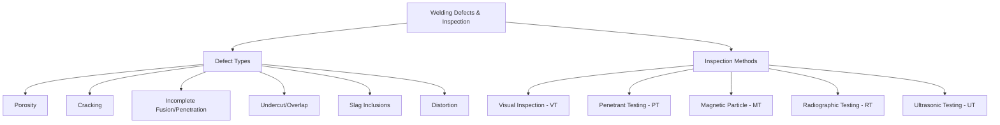

## Welding Defects and Inspection

### Overview

Weld defects arise from deviations in process parameters, material condition, joint design, or operator technique, and range from surface-visible irregularities to subsurface discontinuities requiring specialized detection methods. Inspection combines visual assessment with non-destructive testing (NDT) techniques selected according to defect type, joint geometry, and criticality of the application.

### Defect and Inspection Framework

---

### 1. Common Weld Defects

#### 1.1 Porosity

**Key Points**

- Discrete gas pockets trapped within the solidifying weld metal, caused by gas evolution (from moisture, contamination, or shielding gas issues) exceeding the rate at which gas can escape before solidification
- Common causes: inadequate shielding gas coverage (wind drafts, incorrect flow rate, contaminated gas), moisture on base metal or in electrode coatings, surface contamination (oil, rust, mill scale), excessive arc length
- Classified by distribution: uniformly scattered porosity, clustered porosity, and "wormhole" (elongated, aligned) porosity — each pointing toward somewhat different root causes

#### 1.2 Cracking

**Key Points**

- Solidification (hot) cracking: occurs within the fusion zone during/immediately after solidification, typically along the centerline, driven by low-melting liquid films at grain boundaries unable to accommodate shrinkage strain (see Weld Metallurgy topic)
- Hydrogen-induced (cold) cracking: delayed cracking in the HAZ or weld metal, driven by diffusible hydrogen combined with a hard/brittle microstructure and tensile stress
- Lamellar tearing: occurs in the base metal beneath the weld (not in the weld metal itself), caused by through-thickness tensile strain acting on a base plate containing elongated non-metallic inclusions (typically manganese sulfides) from the rolling process — most common in restrained T- and corner-joint configurations in thick rolled plate
- Crater cracking: star-shaped cracks at the termination point of a weld bead, resulting from shrinkage stress concentration at the crater without adequate fill; mitigated by proper crater-fill technique (e.g., back-stepping at the end of a pass)

#### 1.3 Incomplete Fusion and Incomplete Penetration

**Key Points**

- Incomplete (lack of) fusion: failure of the weld metal to fuse completely with the base metal or with a previous weld pass, typically caused by insufficient heat input, incorrect travel speed/angle, or contaminated surfaces
- Incomplete (lack of) penetration: weld metal fails to extend through the full required joint thickness, commonly from insufficient current, excessive travel speed, incorrect joint preparation (root gap/land too small), or misaligned electrode positioning
- Both defect types create sharp, planar discontinuities that act as severe stress concentrators, generally regarded as more critical to structural integrity than comparably sized rounded defects (e.g., porosity)

#### 1.4 Undercut and Overlap

**Key Points**

- Undercut: a groove melted into the base metal adjacent to the weld toe, left unfilled by weld metal, resulting from excessive current, excessive travel speed, or incorrect electrode angle — creates a stress concentration at the weld toe, a common fatigue crack initiation site
- Overlap: weld metal flows over the base metal surface without properly fusing to it, typically from excessive filler deposition combined with insufficient heat input — creates a mechanical notch without true fusion, similarly detrimental to fatigue performance

#### 1.5 Slag Inclusions

**Key Points**

- Non-metallic slag (from flux-generating processes: SMAW, FCAW, SAW) trapped within the weld metal, usually resulting from inadequate slag removal between multi-pass welds, incorrect welding technique, or excessively low current allowing slag to flow ahead of the arc
- Elongated or planar slag inclusions are of greater structural concern than small, rounded, isolated inclusions due to their stress-concentration geometry

#### 1.6 Distortion

**Key Points**

- Dimensional/shape deviation resulting from non-uniform thermal expansion and contraction during welding (see Weld Metallurgy topic for residual stress discussion)
- Not always classified as a "defect" in the strict discontinuity sense, but a quality concern requiring management through joint design, welding sequence, and fixturing

---

### 2. Visual Inspection (VT)

**Key Points**

- The most fundamental and universally applied NDT method — performed before, during, and after welding to catch surface-visible defects (undercut, overlap, surface porosity, cracking, misalignment, dimensional non-conformance) at minimal cost
- Governed by defined acceptance criteria (e.g., AWS D1.1 visual acceptance criteria for structural steel), often supplemented with basic tools (weld gauges, straightedges, magnification) for quantitative assessment
- Cannot detect subsurface defects, making it a necessary but generally insufficient sole inspection method for critical structural or pressure-retaining welds

---

### 3. Liquid Penetrant Testing (PT)

**Key Points**

- A low-viscosity dye penetrant is applied to the cleaned weld surface, allowed to seep into surface-breaking discontinuities via capillary action, then removed from the surface (excess wiped away) before a developer is applied to draw the trapped penetrant back out, revealing the defect as a visible indication
- Detects only surface-breaking discontinuities (cracks, porosity open to the surface, incomplete fusion at the surface); cannot detect subsurface defects
- Effective on both ferromagnetic and non-ferromagnetic materials, unlike magnetic particle testing, making it broadly applicable across material types (stainless steel, aluminum, non-ferrous alloys)
- Visible-dye (red dye, ambient light) and fluorescent-dye (requires UV/black light) variants exist, with fluorescent penetrant generally offering higher sensitivity

---

### 4. Magnetic Particle Testing (MT)

**Key Points**

- A magnetic field is induced in the ferromagnetic test piece; fine ferromagnetic particles (dry powder or wet suspension, often fluorescent) are applied to the surface, and magnetic flux leakage at surface or near-surface discontinuities attracts and concentrates the particles, forming a visible indication
- Detects surface and near-surface (shallow subsurface) discontinuities; most sensitive to defects oriented perpendicular to the magnetic field direction, so testing is typically performed in two field orientations (roughly 90° apart) to ensure detection regardless of defect orientation
- Limited to ferromagnetic materials only (carbon/low-alloy steels, some stainless grades) — not applicable to austenitic stainless steel, aluminum, or other non-ferromagnetic materials

---

### 5. Radiographic Testing (RT)

**Key Points**

- X-ray or gamma-ray radiation is passed through the weld onto film or a digital detector; internal discontinuities (porosity, slag inclusions, incomplete penetration, some crack orientations) appear as density variations on the resulting radiograph due to differential radiation absorption
- Capable of detecting volumetric (rounded) defects effectively; planar defects (cracks, incomplete fusion) are detected reliably only when oriented favorably relative to the radiation beam direction — an important limitation, since unfavorably oriented planar defects can be missed
- Provides a permanent, reviewable record (the radiograph/film) valuable for documentation and later reference, a distinct advantage over some other volumetric methods
- Requires radiation safety controls (exclusion zones, shielding, dosimetry) due to ionizing radiation hazard, and generally involves higher cost and longer per-joint inspection time than ultrasonic testing

---

### 6. Ultrasonic Testing (UT)

**Key Points**

- High-frequency sound waves are transmitted into the weld via a transducer/probe (typically coupled to the surface with a gel couplant); reflections from internal discontinuities and the far surface are analyzed (time-of-flight and amplitude) to detect and characterize defects
- Highly effective for detecting planar defects (cracks, incomplete fusion) regardless of orientation relative to the scan direction when appropriately angled probes are used — often preferred over RT specifically for planar defect detection
- No ionizing radiation hazard, generally faster per-joint inspection, and portable equipment enables field use; results depend significantly on operator skill/technique and probe/angle selection
- Advanced variants — Phased Array Ultrasonic Testing (PAUT) and Time-of-Flight Diffraction (TOFD) — provide improved defect sizing, characterization, and often permanent digital records, increasingly favored over traditional RT in modern structural and pipeline inspection codes

---

### 7. NDT Method Selection Summary

| Method | Detects | Material Limitation | Key Advantage | Key Limitation |
| --- | --- | --- | --- | --- |
| VT | Surface only | None | Fast, low cost | Surface only |
| PT | Surface-breaking only | None (ferromagnetic or not) | Simple, sensitive to fine surface cracks | Surface only, requires clean surface |
| MT | Surface/near-surface | Ferromagnetic only | Good for surface/shallow cracks | Not usable on non-ferromagnetic metals |
| RT | Internal (volumetric) | None | Permanent record, good for rounded defects | Radiation hazard, orientation-sensitive for planar defects |
| UT | Internal (volumetric & planar) | None (couplant-dependent) | Excellent for planar defects, no radiation | Operator-dependent, requires surface access/coupling |

---

### 8. Defect Criticality and Acceptance Criteria

**Key Points**

- Acceptance criteria (dimensional limits on defect size, type, and distribution) are defined by governing codes/standards relevant to the application (e.g., AWS D1.1 for structural steel, ASME Boiler and Pressure Vessel Code Section IX for pressure vessels, API 1104 for pipelines)
- Planar defects (cracks, incomplete fusion/penetration, lamellar tears) are generally subject to more stringent (often zero-tolerance) acceptance criteria than volumetric/rounded defects (porosity, isolated slag inclusions), reflecting their disproportionately greater effect on fracture and fatigue behavior
- Fitness-for-service (FFS) assessment (e.g., using engineering critical assessment methodologies) may be applied for defects exceeding standard code acceptance limits, evaluating whether a specific defect is acceptable for continued safe service based on fracture mechanics analysis rather than blanket rejection

**Related Topics**

- Weld Metallurgy and the Heat-Affected Zone
- Arc Welding Processes
- Weldability of Metals and Alloys
- Welding Procedure Specifications and Qualification
- Fracture Mechanics and Fitness-for-Service Assessment
- Post-Weld Heat Treatment and Residual Stress Management