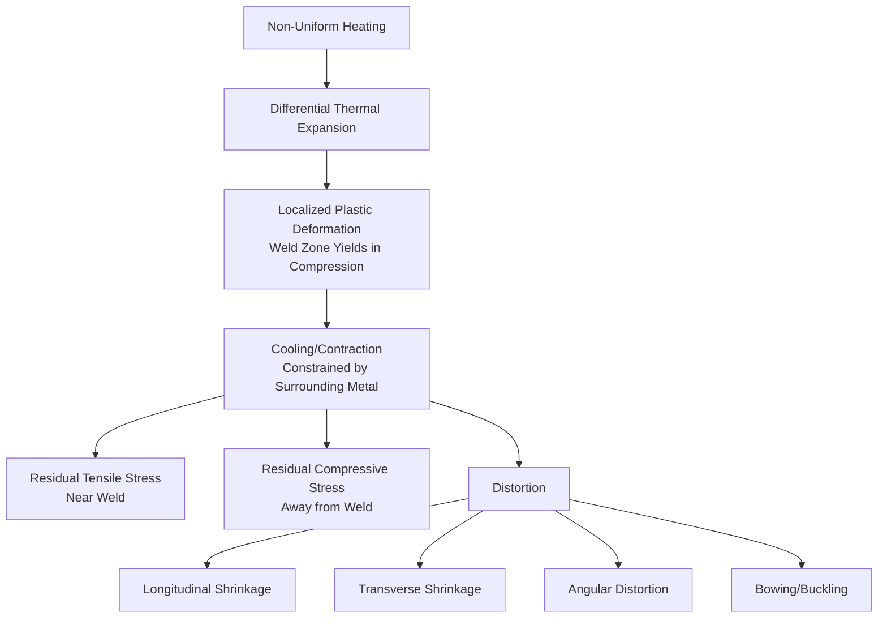

## Residual Stress and Distortion in Welding

### Overview

Residual stress and distortion arise from the highly localized, non-uniform thermal cycle inherent to welding: a small volume of material is rapidly heated to melting while the surrounding mass remains comparatively cool, and this constrained differential expansion and contraction leaves behind both permanent stresses and dimensional/shape changes even after the weldment returns to ambient temperature.

### Mechanism Overview

---

### 1. Fundamental Mechanism

**Key Points**

- During heating, the weld zone attempts to expand but is mechanically restrained by the surrounding cooler base metal, generating compressive stress in the heated region that can exceed the (temperature-reduced) yield strength, causing localized plastic (compressive) upsetting
- Upon cooling, this plastically upset material attempts to contract back to its original volume but is again restrained by the surrounding metal, this time generating residual tensile stress in and near the weld, balanced by residual compressive stress in the surrounding base metal further from the joint
- The characteristic residual stress distribution across a transverse section typically shows peak tensile stress (often approaching base metal yield strength) at the weld centerline, transitioning to compressive stress at some distance away, self-equilibrating across the cross-section (net internal force and moment must sum to zero in an unconstrained body)

**Residual Stress Distribution Profile (svg_diagram)**

<svg xmlns="http://www.w3.org/2000/svg" viewBox="0 0 480 240">
<text x="240" y="20" text-anchor="middle" font-size="13" font-weight="bold" fill="#222">Transverse Residual Stress Distribution (svg_diagram)</text>
<line x1="40" y1="130" x2="440" y2="130" stroke="#333" stroke-width="1.5" />
<line x1="240" y1="40" x2="240" y2="220" stroke="#333" stroke-width="1.5" stroke-dasharray="4" />
<text x="240" y="235" text-anchor="middle" font-size="10" fill="#333">Weld Centerline</text>
<text x="20" y="50" font-size="10" fill="#333">Tension +</text>
<text x="20" y="210" font-size="10" fill="#333">Compression -</text>
<path d="M 60 130 Q 150 130 200 50 L 240 45 L 280 50 Q 330 130 420 130 Q 380 170 320 165 Q 260 150 240 145 Q 220 150 160 165 Q 100 170 60 130 Z" fill="#3182bd" opacity="0.6" stroke="#08519c" stroke-width="1.5" />
<text x="240" y="70" text-anchor="middle" font-size="9" fill="#08306b">Peak Tensile (~Yield)</text>
<text x="120" y="155" text-anchor="middle" font-size="9" fill="#08306b">Compressive</text>
<text x="360" y="155" text-anchor="middle" font-size="9" fill="#08306b">Compressive</text>
</svg>

---

### 2. Types of Distortion

#### 2.1 Longitudinal Shrinkage

- Contraction along the length of the weld bead, resulting in overall shortening of the welded member in the direction parallel to the weld
- Generally the smallest-magnitude distortion mode for typical butt/fillet joints but can accumulate significantly in long structural members with multiple welds

#### 2.2 Transverse Shrinkage

- Contraction perpendicular to the weld length, across the joint width
- Magnitude increases with weld cross-sectional area (more weld metal deposited, greater volumetric shrinkage) and joint restraint conditions
- Approximate transverse shrinkage for many arc-welded steel joints is often estimated using simplified empirical relationships incorporating plate thickness and number of passes, though [Inference] such estimates are generally treated as first-order approximations requiring validation for specific joint configurations and welding procedures.

#### 2.3 Angular Distortion

- Rotation of the plates about the weld axis, commonly resulting from a non-uniform through-thickness temperature distribution — more pronounced when weld metal is concentrated near one face of the joint (common in single-V groove welds) versus symmetrically distributed (double-V groove welds, which balance shrinkage from both sides)
- One of the most visually apparent and commonly encountered distortion modes in groove-welded plate structures

#### 2.4 Bowing and Buckling

- Bowing: overall curvature of a welded assembly resulting from asymmetric weld placement relative to the neutral axis of the structure (e.g., welds placed off-center on a beam or stiffened panel)
- Buckling: localized out-of-plane instability, particularly in thin-gauge sheet metal structures, where compressive residual stresses generated away from the weld exceed the local elastic buckling stress of the thin section

---

### 3. Factors Influencing Magnitude

**Key Points**

- Heat input: higher heat input generally increases both peak temperature and the volume of material heated, increasing overall distortion and residual stress magnitude, though the relationship is influenced by joint restraint and geometry
- Joint restraint: highly restrained joints (thick sections, complex fabricated structures, rigid fixturing) develop higher residual stress magnitude (since deformation is prevented, forcing higher internal stress) but correspondingly less visible distortion (since the restraint physically prevents shape change) — restraint effectively trades distortion for stress
- Welding sequence: the order in which weld passes/joints are completed significantly affects both magnitude and pattern of resulting distortion and stress
- Number of passes and bead placement: multi-pass welds redistribute and partially relieve stress from earlier passes through the thermal cycling of subsequent passes, generally producing different (often somewhat reduced) net residual stress compared to a single large pass of equivalent total deposited volume

---

### 4. Distortion Control Strategies

#### 4.1 Design-Stage Mitigation

- Minimize weld volume: use the smallest weld size/groove angle that satisfies design strength requirements, since distortion scales with deposited weld metal volume
- Balance welds about the neutral axis: symmetric joint placement (e.g., double-V grooves instead of single-V) balances shrinkage forces from both sides, reducing angular distortion
- Minimize number of welds and total weld length where design allows

#### 4.2 Fixturing and Restraint

- Rigid fixturing physically constrains the assembly during welding, converting potential distortion into residual stress instead (as noted above) — effective for dimensional control but requires the resulting stress state to be acceptable for the application, or subsequently relieved

#### 4.3 Pre-Setting and Pre-Bending

- Parts are intentionally positioned or pre-bent in the direction opposite to anticipated distortion before welding, such that shrinkage brings the assembly into the desired final shape
- Requires accurate prediction of expected distortion magnitude, often developed empirically through trial welds on representative joint configurations

#### 4.4 Welding Sequence Techniques

- **Back-step welding**: short weld segments are deposited in a direction opposite to the overall progression direction, distributing shrinkage more symmetrically along the joint length
- **Balanced (symmetric) welding**: alternating weld passes on opposite sides of a joint (particularly relevant for double-groove joints) to balance angular distortion as it develops
- **Skip/block sequencing**: welding is performed in a planned non-sequential pattern across multiple joints in a structure, distributing heat input and allowing intermediate cooling, reducing cumulative distortion buildup compared to sequential completion of adjacent joints

#### 4.5 Heat Sink and Cooling Control

- Copper backing bars or chill blocks placed near the joint increase local heat extraction, reducing the volume of material reaching high temperature and thereby reducing distortion, though at the cost of potentially increased cooling rate (relevant to HAZ hardness in hardenable steels — a trade-off requiring joint consideration of both distortion and metallurgical concerns)

---

### 5. Post-Weld Stress Relief

#### 5.1 Thermal Stress Relief (Post-Weld Heat Treatment, PWHT)

- The weldment is heated to an elevated temperature (typically below the transformation/tempering-sensitive range for the specific alloy, e.g., roughly 550–650°C for carbon/low-alloy steels), held for a time proportional to thickness, then slowly cooled
- Elevated temperature reduces material yield strength, allowing locked-in residual stresses to relax through localized creep/plastic flow without applied external load; slow, controlled cooling prevents reintroduction of new thermal stresses
- Required by many codes (e.g., ASME Boiler and Pressure Vessel Code) for thick-section or high-restraint welds in specific service applications, particularly where stress-corrosion cracking susceptibility or dimensional stability is critical

#### 5.2 Mechanical Stress Relief

- **Vibratory stress relief (VSR)**: controlled mechanical vibration at or near a resonant frequency of the structure is applied for a defined duration, providing some degree of residual stress redistribution without the thermal distortion risk or energy cost of furnace PWHT; [Unverified] the magnitude of stress relief achieved via VSR relative to thermal PWHT remains a topic of ongoing debate in the engineering literature, with results reported as variable across studies and structure types.
- **Peening**: mechanical impact (hammer peening, shot peening, or ultrasonic impact treatment) applied to the weld surface introduces beneficial local compressive residual stress at the surface, primarily used to improve fatigue performance at weld toes rather than to relieve bulk residual stress throughout the section

---

### 6. Consequences of Uncontrolled Residual Stress and Distortion

**Key Points**

- Dimensional non-conformance requiring rework, additional machining allowance, or in severe cases part rejection
- Reduced fatigue life, since tensile residual stress at weld toes (a common fatigue crack initiation site) effectively raises the local mean stress experienced during cyclic loading
- Increased susceptibility to stress-corrosion cracking in environments/alloy combinations sensitive to this mechanism (e.g., austenitic stainless steel in chloride-containing environments), since near-yield tensile residual stress can be sufficient to drive crack initiation and growth even without significant applied service load
- Reduced buckling resistance in thin-walled structures due to superimposed compressive residual stress fields

**Related Topics**

- Weld Metallurgy and the Heat-Affected Zone
- Welding Defects and Inspection
- Weldability of Metals and Alloys
- Post-Weld Heat Treatment Codes and Requirements
- Fatigue Design of Welded Structures
- Stress-Corrosion Cracking Mechanisms