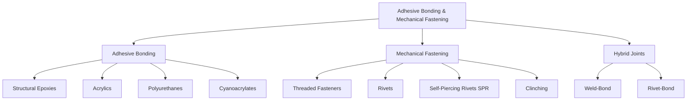

## Adhesive Bonding and Mechanical Fastening

### Overview

Adhesive bonding and mechanical fastening represent joining alternatives to fusion/solid-state welding and brazing/soldering, each offering distinct advantages for dissimilar material combinations, thin-gauge sheet, disassembly requirements, or applications where thermal input must be avoided. Modern structural design frequently combines these methods (hybrid joints) to leverage complementary strengths.

### Joining Method Classification

---

### 1. Adhesive Bonding Fundamentals

**Key Points**

- Adhesives join surfaces through a combination of mechanical interlocking (micro-scale surface roughness penetration) and chemical/physical bonding (van der Waals forces, hydrogen bonding, and in some systems covalent bonding to the substrate)
- Distributes load over the entire bonded area rather than concentrating it at discrete points (as with fasteners/spot welds), generally producing more favorable, lower-stress-concentration load transfer and improved fatigue performance in well-designed joints
- No thermal input to the base material (curing may involve elevated temperature, but substantially lower than welding/brazing), avoiding HAZ effects, distortion, and metallurgical changes entirely
- Enables joining of dissimilar materials (metal-to-composite, metal-to-plastic, dissimilar metals) without galvanic corrosion concerns at the joint interface itself, since the adhesive layer electrically isolates the substrates

#### 1.1 Common Structural Adhesive Types

**Epoxies**

- Two-part (resin + hardener) or heat-cured one-part systems; high strength, good chemical/environmental resistance, widely used in aerospace and automotive structural bonding
- Generally require careful surface preparation (degreasing, abrasion, or chemical etching/priming) to achieve reliable long-term bond strength

**Acrylics (including modified/toughened variants)**

- Faster curing than typical epoxies, more tolerant of less-than-ideal surface preparation, good impact resistance — commonly used in automotive and general industrial assembly

**Polyurethanes**

- Good flexibility and impact/vibration damping characteristics, commonly used for automotive windshield bonding and applications requiring some joint compliance rather than maximum rigidity

**Cyanoacrylates ("super glues")**

- Very fast curing (seconds) via moisture-initiated polymerization, but generally limited to small parts/light loads and less suited to large structural bonding due to brittleness and limited gap-filling capability

#### 1.2 Surface Preparation

**Key Points**

- Bond strength and, critically, long-term durability are highly sensitive to surface condition — contamination (oils, mold-release agents, oxide layers) can dramatically reduce effective adhesion even when initial bond strength appears adequate
- Common preparation methods: solvent degreasing, mechanical abrasion (grit blasting, sanding), chemical etching, and plasma/corona treatment (increasingly used for polymer and composite substrates to increase surface energy and improve wetting)
- Primers are frequently applied to promote adhesion and/or provide corrosion protection at the bondline, particularly for metal substrates in moisture-exposed applications

#### 1.3 Joint Design for Adhesive Bonding

**Key Points**

- Adhesive joints perform best under shear and tensile (through-thickness peel-resistant) loading; they perform poorly under peel and cleavage loading, where stress concentrates at a joint edge and propagates progressively — joint geometry should be designed to minimize peel/cleavage loading in service
- Lap joints (single-lap, double-lap) are the most common structural adhesive joint configuration, maximizing bonded overlap area to distribute shear load
- Stress distribution across a lap joint is non-uniform, with peak shear stress concentrated at the joint ends rather than uniformly distributed across the overlap — a key consideration limiting the effective strength gain from simply increasing overlap length beyond a certain point

**Adhesive Shear Stress Distribution (svg_diagram)**

<svg xmlns="http://www.w3.org/2000/svg" viewBox="0 0 480 200">
<text x="240" y="20" text-anchor="middle" font-size="13" font-weight="bold" fill="#222">Lap Joint Shear Stress Distribution (svg_diagram)</text>
<rect x="60" y="80" width="360" height="20" fill="#bdd7e7" stroke="#333" />
<text x="240" y="94" text-anchor="middle" font-size="9" fill="#08306b">Adhesive Bondline</text>
<line x1="60" y1="140" x2="420" y2="140" stroke="#333" stroke-width="1" />
<path d="M 60 140 Q 90 60 130 60 L 350 60 Q 390 60 420 140 Z" fill="#3182bd" opacity="0.6" stroke="#08519c" stroke-width="1.5" />
<text x="100" y="55" font-size="9" fill="#08306b">Peak Stress</text>
<text x="360" y="55" font-size="9" fill="#08306b">Peak Stress</text>
<text x="240" y="115" text-anchor="middle" font-size="9" fill="#333">Low stress at center of overlap</text>
</svg>

---

### 2. Mechanical Fastening Fundamentals

**Key Points**

- Joins parts through discrete, localized mechanical interlocking elements, providing joints that are typically disassemblable/serviceable (threaded fasteners) or, for permanent methods (rivets), at least readily inspectable at each discrete fastening point
- Load transfer is concentrated at each fastener location, creating stress concentrations (particularly at fastener holes) that are a primary consideration in fatigue-critical design
- No thermal effects on base material, making mechanical fastening well suited to heat-treated, coated, or dissimilar materials where welding/brazing would be metallurgically problematic

#### 2.1 Threaded Fasteners

**Key Points**

- Bolts, screws, and nuts provide a readily disassemblable joint, essential for maintenance, inspection, and replacement in many structural and mechanical assemblies
- Preload (clamping force established by torquing the fastener) is critical to joint performance — adequate preload keeps the joint faces in compression under service loads, preventing fastener fatigue by ensuring the fastener itself experiences reduced cyclic load variation relative to an underpreloaded joint
- Torque-tension relationship is commonly approximated as:

$$T = K \cdot F \cdot d$$

where $T$ is applied torque, $K$ is the nut factor (accounting for friction under the head, in the threads, and thread geometry, typically 0.15–0.20 for standard lubricated steel fasteners), $F$ is achieved clamping force (preload), and $d$ is nominal fastener diameter. [Inference] The nut factor $K$ is highly sensitive to friction condition (lubrication, surface finish, coating) and is often determined experimentally for critical applications rather than assumed from generic tables.

#### 2.2 Rivets

**Key Points**

- Permanent mechanical fasteners installed by deforming (upsetting) one end of the rivet shank to create a second head, clamping the joined materials
- Solid rivets: traditional form, typically installed with access to both sides of the joint (bucking bar/hammer or press installation) — historically dominant in aircraft structures, though largely superseded by other joining methods in many modern applications while remaining significant in aerospace assembly
- Blind rivets (pop rivets): installable from one side only, using a mandrel that is pulled through the rivet body to form the second head and then snaps off — valued for accessibility-limited assembly situations, generally lower strength than solid rivets

#### 2.3 Self-Piercing Rivets (SPR)

**Key Points**

- A specially shaped semi-tubular rivet is driven through the top sheet(s) and partially into (but not through) the bottom sheet under high force, with the rivet leg flaring outward within the bottom sheet to form a mechanical interlock — no pre-drilled hole required
- Does not require access to both sides of the joint during installation in the same way solid rivets do (single-sided tool access), and creates no thermal effects
- Increasingly used in automotive body structures for joining dissimilar materials (aluminum-to-steel, aluminum-to-aluminum) where resistance spot welding is metallurgically problematic (e.g., aluminum's high electrical/thermal conductivity and oxide layer complicate RSW) or galvanic/dissimilar-metal concerns favor a joining method that can incorporate a sealant/adhesive layer

#### 2.4 Clinching

**Key Points**

- A localized mechanical interlock is formed by punching and forming (without piercing through) the sheet metal layers together using shaped punch and die tooling, creating a button-like interlocked joint without any separate fastener element
- No consumable required (unlike riveting), reducing material cost and simplifying automated production line logistics, but generally provides lower joint strength than SPR or resistance spot welding for a given sheet thickness
- Used in automotive and appliance sheet metal assembly, particularly for lower-load, cosmetic, or secondary structural joints

---

### 3. Hybrid Joining (Weld-Bonding, Rivet-Bonding)

**Key Points**

- Combines adhesive bonding with a mechanical or welded fastening method applied at discrete points along the same joint, leveraging adhesive's distributed load transfer and superior fatigue/sealing performance together with the immediate handling strength and process robustness of the mechanical/welded fastening points
- Weld-bonding: adhesive is applied across the joint interface before spot welding; the weld provides immediate fixturing strength (holding parts in position without clamps during cure) while the surrounding adhesive carries the majority of the distributed service load and provides sealing against moisture ingress at the faying surface (which also helps mitigate crevice corrosion at spot-welded joints)
- Rivet-bonding: similarly combines adhesive with rivets (solid, blind, or SPR) for immediate mechanical strength plus long-term distributed load transfer and sealing
- Common in automotive body structures (particularly for multi-material designs combining steel, aluminum, and composites) and in some aerospace applications

---

### Comparison of Joining Approaches

| Attribute | Adhesive Bonding | Mechanical Fastening | Welding/Brazing |
| --- | --- | --- | --- |
| Load Distribution | Uniform over bond area | Concentrated at fastener points | Concentrated at weld/joint |
| Dissimilar Materials | Excellent | Good | Limited (galvanic/metallurgical concerns) |
| Thermal Effects on Base Metal | None (minimal cure heat) | None | Significant (HAZ, distortion) |
| Disassembly | Difficult/impossible (permanent) | Easy (threaded); difficult (rivets) | Difficult/impossible |
| Fatigue Performance | Generally good (distributed load) | Fair (stress concentration at holes) | Variable (toe stress concentration) |
| Sealing/Corrosion Barrier | Excellent (also seals faying surface) | Poor (crevice corrosion risk at interface) | Good (fusion closes gap) |
| Process Speed/Inspection | Cure time can be lengthy; hard to NDT | Fast; readily inspectable per fastener | Fast; established NDT methods |

**Related Topics**

- Resistance and Solid-State Welding (Self-Piercing Rivets vs. Spot Welding for Dissimilar Metals)
- Weldability of Metals and Alloys (Dissimilar Material Joining Challenges)
- Composite-Metal Hybrid Structure Joining
- Fatigue Design of Mechanically Fastened Joints
- Surface Preparation and Adhesion Science
- Automotive Multi-Material Body Structure Design