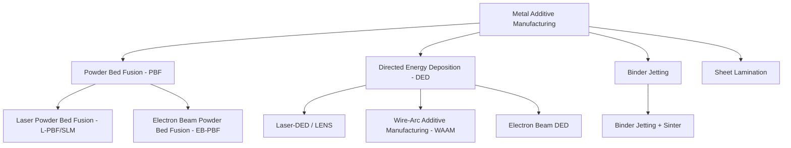

## Overview of Metal Additive Manufacturing Processes

### Overview

Metal additive manufacturing (AM) builds components layer-by-layer directly from digital models, using powder or wire feedstock consolidated via thermal, chemical, or mechanical energy sources. Unlike subtractive manufacturing, AM adds material only where required, enabling complex geometries (internal lattices, conformal cooling channels, topology-optimized structures) unachievable through conventional processes.

### AM Process Classification (ASTM/ISO 52900)

---

### 1. Powder Bed Fusion (PBF)

**Key Points**

- A thin layer of metal powder is spread across a build platform; an energy source (laser or electron beam) selectively melts/fuses the powder according to the sliced digital model; the platform lowers, a new powder layer is spread, and the process repeats
- Offers the highest achievable geometric resolution and surface finish among metal AM processes, enabling fine features, thin walls, and complex internal lattice structures
- Generally limited to comparatively smaller build volumes and slower build rates than directed energy deposition, due to the layer-by-layer, full-bed powder spreading approach

#### 1.1 Laser Powder Bed Fusion (L-PBF / SLM / DMLS)

**Key Points**

- A fiber laser (typically 200–1000 W) selectively scans and melts powder layers (typically 20–60 μm thick) within an inert gas atmosphere (argon or nitrogen) to prevent oxidation
- Rapid, localized melting and solidification (cooling rates often $10^3$–$10^6$ K/s) produce fine, often columnar-dendritic microstructures distinct from conventionally cast or wrought equivalents, frequently requiring tailored post-process heat treatment to achieve target properties
- Common materials: Ti-6Al-4V, Inconel 625/718, 316L/17-4PH stainless steel, AlSi10Mg, CoCr alloys
- Widely adopted for aerospace, medical implant, and tooling applications requiring fine feature resolution and good surface finish (though as-built surface roughness still typically requires post-processing for critical surfaces)

#### 1.2 Electron Beam Powder Bed Fusion (EB-PBF)

**Key Points**

- An electron beam, operating within a vacuum chamber, selectively melts powder layers; the build platform and powder bed are maintained at an elevated preheat temperature (typically several hundred degrees Celsius, material-dependent) between layers
- Elevated build temperature substantially reduces residual stress and eliminates the need for extensive support structures for many geometries, since the powder bed itself (lightly sintered by the preheat step) provides some support and thermal gradients are reduced relative to L-PBF
- Vacuum environment is particularly favorable for reactive materials (titanium alloys) by minimizing oxidation/contamination
- Generally faster build rates but coarser resolution and rougher surface finish than L-PBF, due to larger beam spot size and thicker practical layer thickness
- Predominant application: Ti-6Al-4V orthopedic implants (leveraging the naturally rough, partially-sintered surface texture for osseointegration) and some nickel superalloy components

---

### 2. Directed Energy Deposition (DED)

**Key Points**

- Feedstock (powder or wire) is fed directly into a focused energy source (laser, electron beam, or arc) at the point of deposition, melting and fusing material onto an existing substrate or previously deposited layer, typically via a moving deposition head rather than a static build chamber with powder bed
- Higher deposition rates than powder bed fusion, but generally coarser resolution and rougher as-built surface finish, making DED better suited to larger, simpler-geometry builds, feature addition/repair on existing components, and functionally graded material builds
- Multi-axis (often 5-axis or robotic arm-mounted) deposition heads enable near-net-shape building on complex, non-planar substrates — a capability particularly valuable for repair applications where material is added onto a worn or damaged existing part

#### 2.1 Laser-DED (Laser Engineered Net Shaping, LENS, and similar)

**Key Points**

- Metal powder is delivered coaxially or laterally through nozzles into a laser-generated melt pool on the substrate surface
- Enables functionally graded materials by blending powder feed rates from multiple hoppers in real time, transitioning composition gradually within a single build — a capability largely unique to DED among AM processes
- Common applications: turbine blade tip repair, cladding for wear/corrosion resistance, and direct part production for larger, structurally simpler components

#### 2.2 Wire-Arc Additive Manufacturing (WAAM)

**Key Points**

- Uses conventional arc welding equipment (GMAW, GTAW, or plasma arc) with wire feedstock instead of powder, depositing material via a robotic or CNC-controlled torch following a path derived from the sliced model
- Highest deposition rates among common metal AM processes (often several kg/hour), leveraging mature, low-cost arc welding equipment and wire feedstock (generally substantially less expensive than AM-grade powder)
- Coarsest resolution and surface finish among mainstream metal AM processes, generally requiring substantial post-build machining to achieve final dimensions and surface quality — WAAM parts are typically produced as a near-net-shape preform for large structural components (aerospace spars, large industrial parts) rather than finished parts
- Susceptible to the same weld metallurgy considerations (residual stress, distortion, HAZ-analogous microstructural gradients) discussed in fusion welding, given its fundamentally arc-welding-based deposition mechanism

---

### 3. Binder Jetting

**Key Points**

- A liquid binder is selectively deposited (inkjet-print-head style) onto successive layers of metal powder, binding particles together to form a "green" part without any melting during the build itself
- The green part is subsequently sintered (and often infiltrated, e.g., with bronze for steel-bronze composite parts, similar in principle to conventional PM infiltration) to achieve final density and strength — placing binder jetting conceptually at the intersection of AM and conventional powder metallurgy
- No thermal distortion or residual stress during the build phase itself (since no melting occurs), enabling larger build volumes and generally faster build rates than powder bed fusion processes, though the part experiences the same sintering shrinkage and potential distortion considerations as conventional PM/MIM parts during the post-build sintering step
- Achievable final density depends heavily on sintering cycle optimization and is generally somewhat lower than L-PBF as-built density unless combined with HIP as a secondary densification step

---

### 4. Sheet Lamination (Ultrasonic Additive Manufacturing)

**Key Points**

- Thin metal sheets or foils are successively bonded together (typically via ultrasonic welding, see Resistance and Solid-State Welding) and periodically machined (via integrated CNC milling) to achieve the desired part geometry within and between layers
- Low-temperature solid-state bonding mechanism enables embedding of dissimilar materials, sensors, or electronics within the build — a distinctive capability not readily achievable with fusion-based AM processes
- Niche application relative to powder bed fusion and DED, generally used for specialized embedded-sensor or dissimilar-material structural applications

---

### Process Comparison

| Process | Feedstock | Resolution | Build Rate | Typical Build Size | Key Application |
| --- | --- | --- | --- | --- | --- |
| L-PBF | Powder | High | Low–moderate | Small–medium | Aerospace/medical complex parts |
| EB-PBF | Powder | Moderate | Moderate | Small–medium | Titanium orthopedic implants |
| Laser-DED | Powder/wire | Moderate | Moderate–high | Medium | Repair, cladding, graded materials |
| WAAM | Wire | Low | Very high | Large | Large structural preforms |
| Binder Jetting | Powder | Moderate | High | Medium–large | High-volume, PM-equivalent parts |
| Sheet Lamination | Sheet/foil | Moderate | Moderate | Small–medium | Embedded sensor/dissimilar-material structures |

---

### Key Cross-Cutting Considerations

**Key Points**

- Thermal history (rapid, repeated heating/cooling cycles inherent to layer-by-layer building) produces microstructures and residual stress states distinct from both conventional wrought and cast material, generally requiring dedicated post-process heat treatment (stress relief, HIP, solution treat/age) rather than direct application of conventional wrought-alloy heat treatment schedules
- Anisotropy — mechanical properties frequently differ between the build direction (Z-axis) and in-plane directions, reflecting the columnar/directional solidification microstructure and layer-interface characteristics inherent to layer-by-layer fusion processes — a critical design and qualification consideration distinguishing AM from conventional wrought material
- Support structures are required in fusion-based processes (particularly L-PBF) for overhanging features and thermal management during the build, adding post-processing removal effort and material cost

**Related Topics**

- Powder Production Methods (AM-Grade Powder Requirements)
- Hot Isostatic Pressing (Post-AM Densification)
- Weld Metallurgy and the Heat-Affected Zone (WAAM Parallels)
- Design for Additive Manufacturing (DfAM)
- AM Process Parameters and Melt Pool Dynamics
- Post-Processing and Qualification of AM Parts