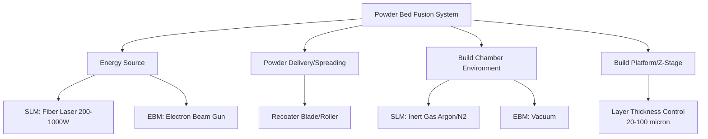

## Powder Bed Fusion: Selective Laser Melting and Electron Beam Melting

### Overview

Powder Bed Fusion (PBF) is the most widely adopted metal additive manufacturing category for producing fine-featured, complex-geometry components. Two dominant energy sources define the two principal PBF sub-processes: laser-based (Selective Laser Melting, SLM, also termed L-PBF or DMLS) and electron-beam-based (Electron Beam Melting, EBM, also termed EB-PBF). Both build parts layer-by-layer from a spread powder bed, but differ substantially in energy source physics, thermal environment, and resulting part characteristics.

### PBF System Architecture

---

### 1. Selective Laser Melting (SLM / L-PBF)

#### 1.1 Process Mechanics

**Key Points**

- A fiber laser (Nd:YAG or Yb-fiber, typically 200–1000 W) is directed via a galvanometer scanning system onto the powder bed surface, selectively melting powder according to the sliced CAD geometry for each layer
- Operates within an inert gas atmosphere (argon most common; nitrogen used for some steel grades) with continuous gas flow across the build area to remove spatter and condensate ("soot") that would otherwise degrade subsequent layer quality
- Layer thickness typically 20–60 μm; after each layer's melting, the build platform lowers by this increment and a recoater (blade or roller) spreads a fresh powder layer

#### 1.2 Melt Pool and Scan Strategy

**Key Points**

- Melt pool dimensions and thermal behavior are governed by laser power, scan speed, hatch spacing (distance between adjacent scan lines), and layer thickness — collectively determining volumetric energy density:

$$E_v = \frac{P}{v \cdot h \cdot t}$$

where $E_v$ is volumetric energy density, $P$ is laser power, $v$ is scan speed, $h$ is hatch spacing, and $t$ is layer thickness

- Insufficient energy density produces lack-of-fusion porosity (irregular, often interlayer voids from incomplete melting); excessive energy density can produce keyhole porosity (spherical voids from vapor cavity collapse during deep-penetration, unstable melt pool behavior) — process parameter optimization targets an intermediate "process window" balancing these failure modes
- Scan strategies (e.g., alternating "island" or "checkerboard" patterns, rotating scan angle between layers by a fixed increment such as 67°) are used to manage residual stress accumulation and reduce anisotropic thermal gradient effects compared to simple unidirectional raster scanning

#### 1.3 Thermal Behavior and Microstructure

**Key Points**

- Extremely high cooling rates (often $10^3$–$10^6$ K/s) relative to conventional casting produce fine, frequently columnar or cellular microstructures aligned with the dominant thermal gradient direction (generally along the build/Z-axis), distinct from wrought or cast equivalents of the same alloy
- Repeated thermal cycling from successive layer deposition (each new layer reheats and partially anneals underlying material) creates a complex, spatially varying thermal history analogous in principle to multi-pass weld HAZ effects, though occurring throughout the bulk of the part rather than confined to a joint region
- Resulting as-built properties frequently show anisotropy between build (Z) direction and in-plane (XY) directions, requiring characterization and, for critical applications, post-process heat treatment to homogenize microstructure and reduce anisotropy

#### 1.4 Support Structures

**Key Points**

- Overhanging features (typically below a critical self-supporting angle, often cited around 45° from horizontal, though material- and parameter-dependent) require support structures to anchor the geometry, conduct heat away to prevent warping/distortion, and resist recoater blade collision forces during powder spreading
- Support removal is a significant post-processing consideration, particularly for internal or hard-to-access supported features, and support-contacted surfaces typically require additional finishing to meet surface finish requirements

---

### 2. Electron Beam Melting (EBM / EB-PBF)

#### 2.1 Process Mechanics

**Key Points**

- An electron beam, generated by a tungsten or lanthanum hexaboride (LaB₆) filament cathode and focused/deflected electromagnetically, selectively melts powder within a high-vacuum build chamber (typically on the order of $10^{-4}$–$10^{-5}$ mbar)
- The vacuum environment eliminates oxidation and contamination concerns for reactive metals, making EBM particularly favorable for titanium alloy processing
- A defining characteristic of EBM is a preheating step performed before melting each layer: the electron beam rapidly scans the entire powder bed at reduced power/higher speed, raising it to an elevated temperature (material-dependent, often several hundred degrees Celsius) that lightly sinters the loose powder

#### 2.2 Preheat and Thermal Management

**Key Points**

- Elevated, maintained build chamber temperature substantially reduces the thermal gradient between the melt pool and surrounding material compared to SLM, which correspondingly reduces residual stress accumulation throughout the build
- The lightly sintered powder bed (from preheating) provides mechanical support to overhanging features, meaning EBM builds often require substantially fewer dedicated support structures than equivalent SLM geometries — a notable process advantage for complex lattice or organic geometries
- Reduced residual stress generally translates to reduced need for stress-relief heat treatment prior to part removal from the build plate, compared to SLM parts, which frequently exhibit high enough residual stress to risk cracking or plate detachment if removed before stress relief

#### 2.3 Resolution and Surface Characteristics

**Key Points**

- Larger electron beam spot size (relative to laser spot size in SLM) and typically thicker practical layer thickness (50–100 μm common) generally produce coarser feature resolution than SLM
- As-built surface roughness is generally higher than SLM, partly due to partially sintered/attached powder particles adhering to external surfaces from the preheat sintering effect — a characteristic that is actually leveraged as a benefit in porous/rough-surfaced orthopedic implant applications (promoting bone ingrowth) but requires post-processing for surfaces demanding smooth finish

---

### 3. Materials and Applications

**Key Points**

- **SLM common materials**: Ti-6Al-4V, Inconel 625/718, 316L and 17-4PH stainless steel, CoCrMo alloys, AlSi10Mg, maraging tool steels — broad alloy compatibility due to fine, controllable laser energy input
- **EBM common materials**: predominantly Ti-6Al-4V (by substantial volume, for orthopedic and aerospace applications) and CoCrMo alloys, with a narrower commercially established materials portfolio than SLM, [Inference] reflecting both the vacuum/preheat process constraints and a smaller installed equipment base relative to SLM systems.

**Application Differentiation**

- SLM favored where fine feature resolution, smooth surface finish, and broad material flexibility are priorities: dental/medical devices requiring intricate geometry, aerospace brackets with fine internal features, tooling with conformal cooling channels
- EBM favored where reduced residual stress, minimal support requirements for complex lattice geometries, and porous/rough surface characteristics are advantageous: orthopedic implant structures (acetabular cups, spinal cages) leveraging the naturally textured surface for osseointegration, and some aerospace titanium structural components

---

### 4. Comparison: SLM vs. EBM

| Attribute | SLM (L-PBF) | EBM (EB-PBF) |
| --- | --- | --- |
| Energy Source | Fiber laser | Electron beam |
| Atmosphere | Inert gas (argon/N₂) | Vacuum |
| Build Temperature | Near ambient to moderate | Elevated (preheated, material-dependent) |
| Residual Stress | Higher | Lower |
| Support Structure Needs | Extensive | Reduced (powder bed self-supports) |
| Resolution/Surface Finish | Finer, smoother | Coarser, rougher |
| Layer Thickness | 20–60 μm typical | 50–100 μm typical |
| Build Rate | Lower | Moderate (faster than SLM generally) |
| Material Portfolio | Broad | Narrower (Ti/CoCr-focused) |
| Reactive Metal Suitability | Good (with inert gas control) | Excellent (vacuum environment) |

---

### 5. Common Post-Processing Requirements (Both Processes)

**Key Points**

- Stress relief heat treatment: typically required, particularly for SLM parts, before removal from the build plate to prevent distortion or cracking upon release of residual stress
- Hot Isostatic Pressing (HIP): frequently applied to close residual internal porosity (both lack-of-fusion and gas/keyhole porosity), improving fatigue performance for critical aerospace and medical applications
- Support removal and surface finishing: mechanical or chemical removal of support structures, followed by surface treatments (machining, polishing, media blasting) as required for functional surfaces and dimensional tolerances
- Solution treatment and aging: applied to precipitation-hardenable alloys to homogenize the as-built microstructure and achieve target mechanical properties, analogous to conventional wrought-alloy heat treatment but often requiring AM-specific schedule adaptation due to the distinct as-built starting microstructure

**Related Topics**

- Overview of Metal Additive Manufacturing Processes
- Powder Production Methods (AM-Grade Powder Specifications)
- Hot Isostatic Pressing
- Weld Metallurgy and the Heat-Affected Zone (Thermal History Parallels)
- Design for Additive Manufacturing (DfAM)
- Post-Processing and Qualification of AM Parts