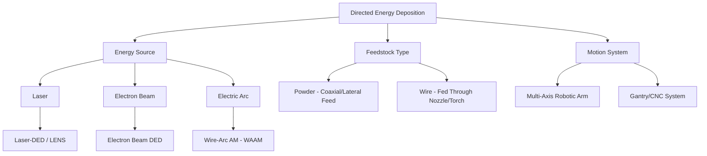

## Directed Energy Deposition

### Overview

Directed Energy Deposition (DED) is a metal additive manufacturing category in which focused thermal energy (laser, electron beam, or electric arc) melts feedstock — powder or wire — as it is simultaneously deposited onto a substrate or existing part. Unlike powder bed fusion, DED does not rely on a pre-spread powder bed; instead, a moving deposition head delivers feedstock directly into the melt pool, enabling larger builds, higher deposition rates, and direct repair/feature-addition on existing components.

### DED Process Architecture

---

### 1. Process Fundamentals

**Key Points**

- A focused energy source creates a melt pool on the substrate or previously deposited layer; feedstock is introduced directly into this melt pool, fuses, and solidifies as the deposition head traverses the programmed toolpath
- Deposition occurs layer-by-layer (or, for simple geometries, as a continuous 3D toolpath), building up the part incrementally, with each new layer partially remelting the underlying layer to ensure metallurgical bonding — mechanistically analogous to multi-pass welding
- Multi-axis motion systems (5-axis CNC, robotic arms, or hybrid CNC-mill/DED machines) enable deposition onto non-planar and complex existing substrate geometries, a capability central to repair applications
- Generally coarser resolution, thicker deposited layers, and rougher as-built surface finish than powder bed fusion, positioning DED for larger, structurally simpler geometries, feature addition, and repair rather than fine-detail net-shape production

---

### 2. Laser-DED (Laser Engineered Net Shaping / LENS and Similar Systems)

**Key Points**

- Metal powder is delivered through coaxial or lateral nozzles into a laser-generated melt pool; the powder stream and laser are aligned so melting and deposition occur simultaneously at the same location as the head traverses
- Powder feed rate, laser power, and traverse speed collectively determine bead geometry (width, height) and dilution with the substrate, analogous to weld bead geometry control in arc welding
- Enables multi-material and functionally graded material (FGM) builds by blending feed rates from multiple powder hoppers in real time, gradually transitioning composition across a build — a capability largely unique to DED among metal AM processes, since powder bed fusion processes typically use a single, homogeneous powder bed per build

**Example**: A functionally graded component transitioning from stainless steel at the base to a nickel-based superalloy at the working surface can be built by progressively increasing the superalloy powder feed fraction while decreasing the stainless steel fraction over successive layers, producing a metallurgically bonded compositional gradient rather than a discrete interface.

**Key Points**

- Cladding and repair applications are a major use case: laser-DED can deposit wear-resistant, corrosion-resistant, or dimensionally restorative material directly onto worn or damaged regions of existing high-value components (turbine blade tips, die/mold surfaces, shafts), often at substantially lower cost than full component replacement

---

### 3. Wire-Arc Additive Manufacturing (WAAM)

**Key Points**

- Uses conventional arc welding processes (most commonly GMAW, also GTAW and plasma arc variants) with wire feedstock fed through the torch, deposited via robotic or CNC-guided motion following a toolpath derived from the sliced digital model
- Leverages mature, widely available, and comparatively low-cost arc welding equipment and wire consumables — wire feedstock is generally substantially less expensive per kilogram than AM-grade powder, and wire production involves fewer specialized quality-control steps than gas/plasma atomization for AM powder
- Achieves the highest deposition rates among common metal AM processes, often several kilograms per hour, making it well suited to large-scale structural preforms (aerospace spars, large marine or industrial components) where material efficiency and build speed matter more than fine surface finish

**Key Points**

- Coarsest resolution and surface finish among mainstream metal AM processes; WAAM parts are typically produced as oversized near-net-shape preforms requiring substantial subsequent CNC machining to achieve final dimensional tolerances and surface quality
- Because the deposition mechanism is fundamentally arc welding, WAAM builds are subject to the same weld metallurgy considerations discussed for multi-pass arc welding: residual stress accumulation, distortion, and a repeatedly reheated, HAZ-analogous thermal history throughout the build, requiring similar mitigation strategies (interpass temperature control, deposition sequencing, and often interlayer cold rolling/peening in advanced implementations to manage residual stress)
- Increasingly implemented in hybrid manufacturing cells combining WAAM deposition with in-process or post-process CNC machining on the same platform, enabling near-net-shape build followed immediately by finish machining without part transfer

---

### 4. Electron Beam DED

**Key Points**

- Combines electron beam energy delivery (typically wire-fed rather than powder-fed, given the vacuum chamber environment where loose powder handling is comparatively more complex) with direct deposition onto the substrate
- Operates within a vacuum chamber, offering the same reactive-metal contamination-avoidance benefits discussed for EB-PBF, making it well suited to titanium and other reactive alloy structural builds
- Less commercially widespread than laser-DED or WAAM, occupying a narrower niche where vacuum-environment purity requirements outweigh the practical constraints of vacuum chamber build volume limitations

---

### 5. Process Parameters and Melt Pool Control

**Key Points**

- Key controllable parameters: energy source power, feed rate (powder mass flow or wire feed speed), traverse/travel speed, and (for powder-fed systems) powder stream focus and standoff distance
- Melt pool size and stability directly govern bead geometry, dilution with the substrate/prior layer, and defect susceptibility (lack of fusion from insufficient energy, or excessive dilution/distortion from excessive energy input)
- Closed-loop melt pool monitoring (via coaxial cameras, pyrometers, or thermal imaging) is increasingly implemented in commercial DED systems to provide real-time feedback control of energy input, improving build consistency, particularly important given DED's larger per-layer volume relative to powder bed fusion where any single-layer defect represents a larger fraction of total build volume

---

### 6. Repair and Hybrid Manufacturing Applications

**Key Points**

- DED's ability to deposit onto existing, non-planar substrate geometry (rather than requiring a flat build plate as in powder bed fusion) makes it particularly suited to component repair: restoring worn dimensions, repairing localized damage, and adding features to existing parts without full replacement
- Hybrid manufacturing systems integrate DED deposition heads with conventional CNC milling on a single machine platform, enabling alternating deposition and machining operations — depositing near-net material, then machining critical features to final tolerance, potentially repeated across multiple build stages for complex geometries
- [Inference] Repair applications generally require careful metallurgical qualification (dilution zone characterization, HAZ effects on the parent material, and bond integrity testing) given the safety-critical nature of many repair candidates (turbine components, high-value tooling), though specific qualification requirements vary substantially by industry and governing standard.

---

### 7. Materials

**Key Points**

- Broad alloy compatibility across laser-DED and WAAM: titanium alloys (Ti-6Al-4V), nickel superalloys (Inconel 625/718), stainless steels, and increasingly aluminum alloys and some copper alloys (particularly for WAAM given arc welding's established compatibility with these material families)
- Wire feedstock availability (leveraging existing welding wire supply chains) gives WAAM particularly broad and cost-effective material access compared to powder-based processes, which depend on specialized AM-grade atomized powder supply

---

### Comparison: DED Sub-Processes

| Attribute | Laser-DED (LENS) | WAAM | Electron Beam DED |
| --- | --- | --- | --- |
| Feedstock | Powder | Wire | Wire (typically) |
| Energy Source | Laser | Electric arc | Electron beam |
| Deposition Rate | Moderate | Very high | Moderate–high |
| Resolution | Moderate | Low (coarse) | Moderate |
| Build Environment | Inert gas/open | Open (shielding gas local) | Vacuum |
| Key Strength | Repair, functionally graded materials | Large structural preforms, cost efficiency | Reactive metal purity |
| Typical Post-Processing | Machining, stress relief | Extensive machining | Machining |

---

### DED vs. Powder Bed Fusion (Summary Positioning)

| Attribute | DED | Powder Bed Fusion |
| --- | --- | --- |
| Resolution/Surface Finish | Lower | Higher |
| Deposition/Build Rate | Higher | Lower |
| Build Volume | Larger (motion-system dependent) | Constrained by build chamber |
| Repair Capability | Excellent (deposits on existing parts) | Poor (requires flat build plate) |
| Functionally Graded Materials | Achievable (multi-hopper powder blending) | Not typically achievable |
| Typical Role | Large parts, repair, cladding | Fine-featured net-shape parts |

**Related Topics**

- Overview of Metal Additive Manufacturing Processes
- Powder Bed Fusion: Selective Laser Melting and Electron Beam Melting
- Arc Welding Processes (WAAM Process Basis)
- Weld Metallurgy and the Heat-Affected Zone
- Hot Isostatic Pressing (Post-DED Densification)
- Hybrid Manufacturing and Repair Qualification Standards