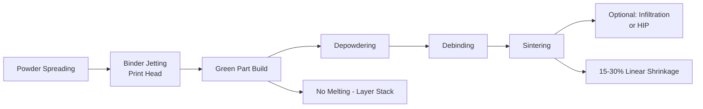

## Binder Jetting for Metals

### Overview

Binder Jetting is a metal additive manufacturing process in which a liquid binding agent is selectively deposited onto successive layers of metal powder to form a "green" part, without any melting occurring during the build itself. The green part is subsequently processed through debinding and sintering — placing binder jetting conceptually at the intersection of additive manufacturing and conventional powder metallurgy.

### Binder Jetting Process Flow

---

### 1. Process Mechanics

**Key Points**

- A thin layer of metal powder is spread across the build platform (mechanically analogous to powder bed fusion's recoating step); an inkjet-style print head selectively deposits liquid binder onto the powder in the pattern of the current layer's cross-section, binding particles together at the binder-wetted locations
- The build platform lowers, a new powder layer is spread, and the process repeats, with the binder anchoring particles to the previous layer at the print head's discretion — no melting, fusion, or thermal energy input occurs during the build phase itself
- Unbound (loose) powder within the build volume remains in place, physically supporting overhanging and complex features throughout the build without requiring dedicated support structures, unlike fusion-based AM processes
- After the build completes, the green part is carefully removed from the surrounding loose powder ("depowdering"), typically via gentle brushing, air jetting, or vacuum extraction given the green part's fragile, lightly bound state

---

### 2. Absence of Thermal Distortion During Build

**Key Points**

- Because no melting occurs during the build, binder jetting avoids the residual stress, distortion, and rapid solidification microstructure effects characteristic of fusion-based AM processes (powder bed fusion, DED)
- This absence of thermal effects during the build phase enables faster build rates and, in principle, larger build volumes than laser/electron-beam fusion processes, since the print head deposition speed is not constrained by melt pool physics or thermal management requirements
- However, the green part is mechanically weak (held together only by binder), requiring careful handling, and all shrinkage/distortion risk is deferred to the subsequent sintering step rather than eliminated altogether

---

### 3. Post-Build Processing

#### 3.1 Debinding

**Key Points**

- Thermal or chemical debinding removes the binder material prior to (or as an initial ramp stage of) the sintering cycle, analogous to the debinding step in Metal Injection Molding (MIM)
- Binder removal must be controlled to avoid rapid gas evolution that could crack or distort the fragile green/brown part, generally following a carefully ramped thermal profile

#### 3.2 Sintering

**Key Points**

- The debound ("brown") part is sintered at high homologous temperature, driving densification through the same diffusion-based mechanisms described in conventional sintering (neck growth, pore channel closure, final-stage pore elimination)
- Sintering shrinkage is substantial, typically 15–30% linear, since the green part begins as a loosely bound powder compact with significantly higher initial porosity than a die-compacted PM green part — shrinkage magnitude and anisotropy must be accurately characterized and compensated for in the original digital model to achieve target final dimensions
- Achieving full theoretical density via sintering alone is challenging; as-sintered density is commonly in the range of 90–96% for many binder-jetted metal systems, generally lower than as-built powder bed fusion density, unless supplemented by additional densification steps

#### 3.3 Secondary Densification: Infiltration and HIP

**Key Points**

- **Infiltration**: for some material systems (notably steel-bronze combinations, directly analogous to conventional PM infiltration practice), a lower-melting infiltrant metal is drawn into residual open porosity during or after the primary sintering cycle via capillary action, improving density and mechanical properties without requiring the base sintering cycle alone to reach full density
- **Hot Isostatic Pressing (HIP)**: applied as a secondary step to close residual porosity and approach full theoretical density, following the same principles described for HIP of conventional sintered PM/MIM parts — generally necessary for higher-performance structural applications where the as-sintered density is insufficient

---

### 4. Shrinkage Compensation and Dimensional Control

**Key Points**

- Because sintering shrinkage is substantial and can vary directionally (particularly for parts with thin sections, unsupported spans, or gravity-affected sagging during the debind/sinter thermal cycle), the digital model must be scaled and, in advanced implementations, locally compensated to predict and offset anticipated distortion
- Support structures or setter fixtures are often used during sintering (distinct from build-phase supports, which are unnecessary given the self-supporting loose powder bed) to control part geometry and prevent gravity-induced sag or distortion at elevated sintering temperature
- [Inference] Achieving tight dimensional tolerances with binder jetting generally requires iterative process characterization specific to each part geometry and material system, since sintering shrinkage behavior is influenced by local mass distribution, support conditions, and green density variation across the part — a more complex prediction problem than the comparatively more geometrically stable fusion-based AM processes.

---

### 5. Materials

**Key Points**

- Broad material compatibility, since the process does not require melting during the build: stainless steels (316L, 17-4PH), tool steels, tungsten, copper, and various other PM-compatible alloy systems
- Material selection is generally governed by established powder metallurgy sinterability considerations (see Sintering Mechanisms and Stages, Powder Characterization) rather than melt-pool weldability concerns relevant to fusion-based AM processes
- Full-color and multi-material binder jetting variants exist for non-metal applications (sand casting molds, polymers, ceramics), though metal binder jetting for functional parts is generally single-material per build

---

### 6. Advantages and Limitations

| Advantages | Limitations |
| --- | --- |
| No support structures needed (powder bed self-supports) | Significant, sometimes complex sintering shrinkage to compensate |
| Faster build rates, larger build volumes achievable | Fragile green/brown parts require careful handling |
| No residual stress/distortion during build phase | Achieving full density requires secondary processing (HIP/infiltration) |
| Lower equipment energy consumption than fusion-based AM (no laser/e-beam) | As-sintered density generally lower than as-built fusion AM density |
| Broad material compatibility (PM-based sinterability) | Dimensional tolerance control more complex than fusion AM |
| No melt-pool-related defects (keyholing, lack-of-fusion porosity during build) | Requires full PM-style furnace infrastructure (debind/sinter/possibly HIP) |

---

### 7. Application Niche

**Key Points**

- Well suited to medium-to-high-volume production of moderately complex parts where PM-equivalent mechanical properties are acceptable and the geometric freedom of AM (versus conventional die compaction) is needed — positioning binder jetting as a potential bridge between prototype-oriented fusion AM and high-volume conventional PM/MIM production
- Particularly attractive where support-structure-free, high packing-density builds enable batch production of many parts simultaneously within a single build volume, improving overall throughput economics relative to fusion-based AM processes that must manage thermal effects across a densely packed build

**Related Topics**

- Overview of Metal Additive Manufacturing Processes
- Sintering Mechanisms and Stages
- Metal Injection Molding
- Porosity Control in Powder Metallurgy Parts
- Hot Isostatic Pressing
- Powder Characterization