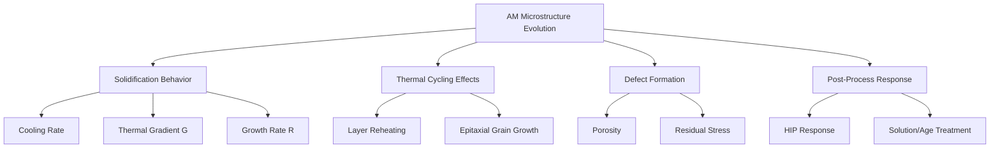

## Microstructure Evolution in Additive Manufacturing

### Overview

Metal additive manufacturing subjects material to a fundamentally distinct thermal history compared to conventional casting or wrought processing: highly localized melting, extremely rapid cooling rates, and repeated reheating from successive layer deposition. These conditions produce characteristic non-equilibrium microstructures — fine cellular/dendritic solidification structures, directional grain morphology, and distinctive residual stress and phase distributions — that govern the mechanical performance and anisotropy of AM parts.

### Microstructure-Governing Factors in AM

---

### 1. Rapid Solidification Fundamentals

**Key Points**

- AM melt pools solidify under cooling rates typically ranging from $10^3$ to $10^6$ K/s, dramatically faster than conventional casting (often $10^0$–$10^2$ K/s) and even faster than many rapid-solidification processing routes used historically for specialized alloy development
- Solidification morphology (planar, cellular, columnar dendritic, or equiaxed dendritic) is governed by the ratio of thermal gradient ($G$) to solidification growth rate ($R$) at the solid-liquid interface, combined with the product $G \times R$ (which relates to cooling rate) and alloy constitutional supercooling behavior
- High $G/R$ ratios (typical near the melt pool boundary, where thermal gradients are steepest) favor planar or cellular growth; lower $G/R$ ratios (typical toward the melt pool center) favor columnar and eventually equiaxed dendritic growth — producing a characteristic morphological gradient across a single melt pool cross-section

**Solidification Structure vs. G/R Diagram (svg_diagram)**

<svg xmlns="http://www.w3.org/2000/svg" viewBox="0 0 480 240">
<text x="240" y="20" text-anchor="middle" font-size="13" font-weight="bold" fill="#222">Solidification Mode vs. G/R Ratio (svg_diagram)</text>
<line x1="60" y1="200" x2="440" y2="200" stroke="#333" stroke-width="1.5" />
<line x1="60" y1="200" x2="60" y2="40" stroke="#333" stroke-width="1.5" />
<text x="380" y="220" font-size="10" fill="#333">Decreasing G/R →</text>
<text x="20" y="120" font-size="10" fill="#333" transform="rotate(-90 20 120)">Cooling Rate</text>
<rect x="70" y="60" width="80" height="140" fill="#08519c" opacity="0.7" />
<text x="110" y="210" text-anchor="middle" font-size="9" fill="#333">Planar</text>
<rect x="150" y="60" width="80" height="140" fill="#3182bd" opacity="0.7" />
<text x="190" y="210" text-anchor="middle" font-size="9" fill="#333">Cellular</text>
<rect x="230" y="60" width="100" height="140" fill="#6baed6" opacity="0.7" />
<text x="280" y="210" text-anchor="middle" font-size="9" fill="#333">Columnar Dendritic</text>
<rect x="330" y="60" width="90" height="140" fill="#bdd7e7" opacity="0.7" />
<text x="375" y="210" text-anchor="middle" font-size="9" fill="#333">Equiaxed</text>
</svg>

---

### 2. Epitaxial and Columnar Grain Growth

**Key Points**

- New melt pool solidification typically nucleates epitaxially from the partially melted grains of the underlying, previously deposited layer, rather than requiring new heterogeneous nucleation — this epitaxial continuity, repeated across many successive layers, promotes the growth of long, columnar grains that can span multiple deposited layers, oriented along the dominant heat flow direction (generally the build/Z-axis in powder bed fusion)
- This columnar, texture-favoring grain growth is a primary source of the mechanical anisotropy frequently observed in as-built AM parts, since grain boundary density, crystallographic texture, and associated slip/deformation behavior differ substantially between the build direction and in-plane directions
- Scan strategy (e.g., rotating the scan vector angle by a fixed increment between successive layers, such as 67°, in powder bed fusion) is used specifically to disrupt this columnar growth tendency, promoting a more equiaxed, less texture-dominated grain structure and correspondingly more isotropic mechanical response

---

### 3. Repeated Thermal Cycling ("In-Situ Heat Treatment")

**Key Points**

- Each new layer's deposition reheats a substantial volume of previously solidified material beneath it, producing a complex, spatially and temporally varying thermal history throughout the part — conceptually analogous to the repeated reheating experienced in multi-pass welding, but distributed throughout the part bulk rather than confined to a single joint
- This repeated reheating can promote partial tempering, recovery, or even localized reprecipitation/dissolution of secondary phases in already-solidified material beneath the active melt pool, sometimes described as an unintentional "in-situ heat treatment" effect
- [Inference] The practical significance of this in-situ thermal cycling effect on final properties varies considerably by alloy system and specific process parameters, and is an active area of characterization research; it is generally not considered a substitute for deliberate, controlled post-build heat treatment.

---

### 4. Characteristic Defects Influencing Microstructure

**Key Points**

- **Lack-of-fusion porosity**: irregular, often interlayer-oriented voids resulting from insufficient volumetric energy density, frequently containing unmelted or partially melted powder particles — acts as a stress concentrator and a preferential fatigue crack initiation site
- **Keyhole porosity**: spherical voids resulting from unstable, deep-penetration melt pool behavior (vapor cavity formation and collapse) under excessive energy density — generally smaller and more rounded than lack-of-fusion defects, but still detrimental to fatigue performance
- **Gas porosity**: spherical porosity from entrapped gas (argon from gas-atomized powder, or dissolved gas exceeding solubility limits upon rapid solidification), similar in principle to gas porosity discussed in conventional casting and welding
- Balancing process parameters (power, speed, hatch spacing, layer thickness) to avoid both lack-of-fusion and keyhole regimes is a central objective of AM process parameter development, generally characterized through a defined "process window"

---

### 5. Residual Stress and Its Microstructural Consequences

**Key Points**

- The same fundamental mechanism described for welding (localized heating/cooling against surrounding restraint, see Residual Stress and Distortion in Welding) operates throughout AM builds, but compounded across many successive layers, often producing residual stress magnitudes comparable to or exceeding those in single-pass welds
- High residual stress can cause part distortion, cracking during the build, or detachment from the build plate — particularly significant in laser powder bed fusion, where thermal gradients are steep due to the localized, rapidly moving melt pool and relatively cool surrounding powder bed
- Build plate preheating (where available), scan strategy optimization, and post-build stress relief heat treatment are the primary mitigation approaches, paralleling strategies used in welding

---

### 6. Post-Process Microstructural Modification

#### 6.1 Stress Relief and Homogenization Heat Treatment

- Applied to reduce residual stress and begin homogenizing the as-built, often chemically segregated (microsegregation from rapid solidification) and texture-dominated microstructure
- Schedule selection generally requires AM-specific adaptation rather than direct application of conventional wrought-alloy heat treatment schedules, since the as-built starting microstructure (fine, cellular, segregated) differs substantially from conventional wrought or cast starting conditions

#### 6.2 Hot Isostatic Pressing (HIP)

- Closes internal porosity (lack-of-fusion, keyhole, and gas porosity) via the same creep and diffusion-based mechanisms described for HIP of PM/MIM/casting applications
- Frequently combined with, or immediately followed by, solution treatment within the same or a subsequent thermal cycle, particularly for precipitation-hardenable alloys, to simultaneously achieve density and target microstructure/properties

#### 6.3 Solution Treatment and Aging

- For precipitation-hardenable alloys (e.g., Inconel 718, some aluminum and titanium alloys), solution treatment dissolves as-built segregation and non-equilibrium phases, followed by controlled aging to precipitate the desired strengthening phase distribution
- AM-specific solution/age schedules sometimes differ from conventional wrought schedules for the same nominal alloy, reflecting the distinct as-built starting condition and, in some cases, the need to balance grain growth control against homogenization completeness

---

### 7. Anisotropy: Practical Consequences

**Key Points**

- Mechanical properties (tensile strength, ductility, fatigue life) frequently differ measurably between specimens tested with their loading axis parallel versus perpendicular to the build direction, reflecting the combined effects of columnar grain morphology, crystallographic texture, and layer-interface characteristics
- Fatigue performance is often more sensitive to build-direction anisotropy than static tensile properties, since fatigue crack initiation is strongly influenced by near-surface porosity distribution and local microstructural features that vary directionally in as-built material
- Design and qualification of AM parts for critical applications (aerospace, medical) typically requires characterizing properties across multiple build orientations rather than assuming isotropic behavior consistent with conventional wrought material — a fundamental distinction in AM part qualification methodology compared to traditional manufacturing processes

---

### Summary: Microstructure Comparison — AM vs. Conventional Processing

| Characteristic | Additive Manufacturing (as-built) | Conventional Casting | Conventional Wrought |
| --- | --- | --- | --- |
| Cooling Rate | Very high ($10^3$–$10^6$ K/s) | Low–moderate | N/A (solid-state process) |
| Grain Structure | Fine, columnar, directional | Coarser, often equiaxed or columnar | Recrystallized, often equiaxed |
| Segregation | Microsegregation (fine-scale) | Macrosegregation possible | Minimal (homogenized by processing) |
| Porosity | Lack-of-fusion, keyhole, gas | Shrinkage, gas | Minimal (typically fully dense) |
| Anisotropy | Often significant (build direction) | Generally low (unless directionally solidified) | Moderate (rolling/forging texture) |
| Residual Stress | Often high | Generally lower (bulk cooling) | Low (stress-relieved/annealed typically) |

**Related Topics**

- Overview of Metal Additive Manufacturing Processes
- Powder Bed Fusion: Selective Laser Melting and Electron Beam Melting
- Weld Metallurgy and the Heat-Affected Zone
- Hot Isostatic Pressing
- Residual Stress and Distortion in Welding
- Post-Processing and Qualification of AM Parts