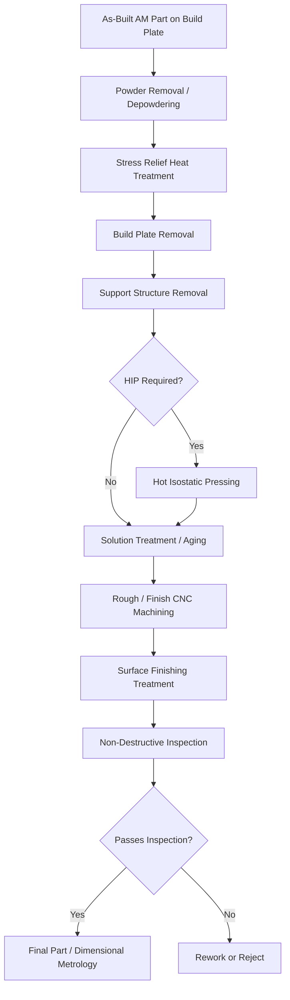

## Post Processing of Additively Manufactured Parts

### Overview and Rationale

Metal additively manufactured (AM) parts, in almost all cases, cannot be used directly in the as-built condition for load-bearing or precision applications. The layer-wise deposition/melting process inherent to AM techniques (powder bed fusion, directed energy deposition, binder jetting, etc.) produces characteristic defects, residual stresses, surface conditions, and microstructures that differ substantially from wrought or cast counterparts, necessitating a structured post-processing sequence.

**Key Points**

- Post-processing is not optional for most engineering applications; it is an integral part of the AM process chain, often consuming comparable or greater time/cost than the build itself.
- The specific sequence and techniques required depend heavily on the AM process used (laser powder bed fusion (L-PBF), electron beam powder bed fusion (EB-PBF), directed energy deposition (DED), binder jetting), the alloy system, and the application's functional requirements.
- Failure to properly post-process AM parts is a leading contributor to inconsistent mechanical properties and premature service failures reported in AM component qualification programs.

### Stress Relief and Heat Treatment

#### Stress Relief

Rapid, localized melting and solidification in processes like L-PBF and DED generate steep thermal gradients, producing substantial residual stresses within the as-built part. These stresses can cause:

- **Distortion** upon removal from the build plate (since the build plate constrains the part during build)
- **Cracking**, particularly in crack-susceptible alloys (certain nickel superalloys, some aluminum alloys, and hardenable steels)
- **Reduced fatigue performance** due to tensile residual stresses at critical surfaces

Stress relief is typically performed **before removal from the build plate**, using a moderate-temperature furnace treatment (alloy-dependent, e.g., approximately 550–650°C for many nickel superalloys and steels processed by L-PBF, though [Unverified] exact parameters vary significantly by alloy and should be sourced from process-specific qualification data rather than treated as universal).

#### Hot Isostatic Pressing (HIP)

HIP applies simultaneous high temperature and high isostatic (all-directional) gas pressure (typically argon) to the part, serving two primary functions in AM post-processing:

1. **Closing internal porosity**: Gas-entrapment porosity and lack-of-fusion voids common in AM parts are collapsed and diffusion-bonded closed under the combined effect of temperature-driven plasticity/creep and applied pressure, provided the porosity is not open to the surface (surface-connected porosity generally cannot be closed by HIP since the gas pressure equalizes through the void).
2. **Homogenizing microstructure**: The elevated temperature promotes diffusion-driven microstructural homogenization, reducing the as-built columnar/dendritic segregation and residual stress simultaneously.

**Typical HIP parameters** (highly alloy-dependent): pressures in the range of 100–200 MPa, temperatures typically 0.7–0.8 times the alloy's absolute melting temperature, held for durations of 2–4 hours.

[Inference] Because HIP cannot close porosity connected to the free surface, and because AM lack-of-fusion defects can sometimes form near-surface, some qualification programs apply HIP specifically after any machining step that might expose subsurface porosity, or use non-destructive inspection (CT scanning) to verify porosity closure post-HIP, though the specific inspection strategy is program- and criticality-dependent rather than a universal fixed rule.

#### Solution Treatment and Aging

For precipitation-hardenable alloys (e.g., AlSi10Mg, Inconel 718, Ti-6Al-4V in certain conditions, 17-4PH stainless steel), conventional wrought-alloy solution treatment and aging heat treatments are generally applied after HIP (or after stress relief, if HIP is not used) to develop the target strengthening precipitate distribution and final mechanical properties.

[Inference] Standard wrought-alloy heat treatment schedules are frequently used as a starting point for AM parts of the same nominal composition, but the as-built AM microstructure (fine columnar grains, high dislocation density, non-equilibrium segregation) can respond differently to a given time-temperature schedule than the wrought/cast counterpart, so many AM qualification programs modify standard heat treatment parameters (e.g., adjusted solution temperature or time) specifically for the AM condition rather than applying wrought schedules unmodified.

### Support Structure and Build Plate Removal

#### Support Removal

Overhanging and unsupported features in powder bed fusion processes require sacrificial support structures during the build to anchor the part, conduct heat away to control thermal gradients, and resist distortion. Support removal methods include:

- **Manual removal**: Cutting, grinding, or breaking away supports designed with a defined breakaway feature (common for smaller or less critical supports)
- **Wire EDM (electrical discharge machining)**: Precisely separates the part from the build plate and can remove certain support geometries with high dimensional control
- **CNC machining**: Removes supports and machines contact points to final surface condition, particularly for supports in accessible locations

Support removal is complicated by internal or hard-to-reach supports (e.g., in complex internal channels or lattice structures unique to AM-enabled geometries), which may require specialized approaches or may fundamentally limit design freedom if removal access is not considered during design for additive manufacturing (DfAM).

#### Build Plate Removal

The part is separated from the build plate typically via wire EDM, band saw, or manual cutting, after stress relief has been performed (removing before stress relief risks distortion or cracking due to the release of residual stress without a controlled thermal treatment).

### Surface Finishing

As-built AM surfaces (particularly powder bed fusion) exhibit characteristic high roughness ($R_a$ often in the range of 5–20+ μm depending on process, orientation, and parameters) due to partially melted powder particles adhering to the surface, the layer-wise "staircase effect" on angled surfaces, and process-specific surface phenomena.

**Common surface finishing techniques:**

| Technique | Mechanism | Typical Application |
| --- | --- | --- |
| Abrasive blasting (bead/sand) | Mechanical impact removes loose particles, moderate roughness reduction | General surface cleanup, light roughness reduction |
| Tumbling / vibratory finishing | Mechanical abrasion via media in a rotating/vibrating chamber | Batch processing of smaller parts |
| CNC machining | Subtractive removal to precise dimensions and low roughness | Critical mating surfaces, tight tolerances |
| Electropolishing | Electrochemical dissolution, preferentially removes surface peaks | Complex geometries, improved fatigue surface condition |
| Chemical/electrochemical machining | Controlled chemical or electrochemical material removal | Internal channels inaccessible to mechanical tools |
| Laser polishing | Localized remelting smooths surface via surface tension | Selective areas requiring low roughness without material removal |

**Key Points**

- Surface roughness is a first-order driver of fatigue performance in AM parts; unfinished as-built surfaces typically show substantially reduced fatigue strength compared to machined/polished surfaces of the same alloy and bulk microstructure, due to the surface acting as a distributed field of crack initiation sites.
- Internal features (cooling channels, lattice structures) unique to AM designs often cannot be accessed by conventional mechanical finishing, driving interest in chemical, electrochemical, and abrasive flow machining methods specifically for internal surface improvement.

### Machining and Dimensional Finishing

Critical functional surfaces (bearing seats, sealing faces, threaded features, mating interfaces) typically require CNC machining to achieve final dimensional tolerances and surface finish beyond what the AM process alone can provide. Considerations specific to AM parts include:

- **Residual stress redistribution during machining**: Removing material can release locked-in residual stresses, causing distortion during or after machining if stress relief was insufficient or if machining sequence is not carefully planned (often requiring stress relief prior to machining, and sometimes multiple stress-relief/machining cycles for highly stressed geometries)
- **Machining allowance in the build**: Parts are frequently designed with additional stock material on critical surfaces specifically to be removed during finish machining, requiring this to be accounted for during the build orientation and support strategy planning
- **Fixturing challenges**: Complex, organic AM geometries (enabled by design freedom not achievable in conventional manufacturing) can present unique fixturing challenges for CNC machining compared to conventional prismatic stock

### Non-Destructive Inspection (NDI/NDT)

Post-processing verification is essential to confirm defect closure, dimensional conformance, and absence of critical flaws:

- **Computed Tomography (CT) scanning**: Provides 3D internal defect characterization (porosity, lack-of-fusion voids, inclusions), particularly valuable for verifying HIP effectiveness and detecting internal defects inaccessible to surface inspection methods
- **Dye penetrant inspection**: Detects surface-breaking defects (cracks, surface-connected porosity)
- **Radiography**: 2D internal defect detection, useful for simpler geometries or as a lower-cost alternative to CT for certain inspection requirements
- **Dimensional metrology**: Coordinate measuring machine (CMM) or 3D scanning to verify as-built/as-finished dimensions against design tolerances, particularly important given the dimensional variability inherent in AM processes relative to conventional machining

### Powder Removal (Process-Specific)

For processes involving loose powder (powder bed fusion, binder jetting), thorough removal of unfused/unbound powder from internal cavities and channels is a distinct and critical post-processing step:

- **Depowdering**: Mechanical agitation, vibration, compressed air, or specialized depowdering stations remove loose powder from internal passages, particularly critical for complex internal geometries (e.g., conformal cooling channels) where trapped powder can obstruct function or, in the case of reactive metal powders (titanium, aluminum), present a safety/handling hazard if not properly managed
- **Binder removal (binder jetting specific)**: For binder jetting processes, a distinct debinding step (thermal or chemical) removes the polymeric binder prior to sintering, analogous to metal injection molding (MIM) debinding practices

### Process Flow Summary

### Process-Specific Considerations

#### Laser Powder Bed Fusion (L-PBF)

Highest residual stress levels among common metal AM processes due to rapid, highly localized melting; typically requires stress relief before build plate removal and often benefits significantly from HIP for critical/fatigue-loaded applications, given the process's characteristic porosity levels (gas porosity from atomization, occasional lack-of-fusion).

#### Electron Beam Powder Bed Fusion (EB-PBF)

Operates at elevated build chamber temperature (preheated powder bed, often several hundred °C, alloy-dependent) under vacuum, resulting in substantially lower as-built residual stress compared to L-PBF, which can reduce (though not necessarily eliminate) the criticality of the stress relief step, though HIP is still commonly applied for critical aerospace/medical applications to close porosity and improve fatigue performance.

#### Directed Energy Deposition (DED)

Generally produces larger grain structures and different porosity/defect characteristics than powder bed processes; post-processing often emphasizes machining (given typically rougher as-built surfaces and near-net rather than net-shape build strategy) alongside stress relief and, where applicable, HIP.

#### Binder Jetting

Requires a fundamentally distinct post-processing path: debinding followed by **sintering** (a high-temperature diffusion-driven densification step, often to 90-99%+ theoretical density depending on process maturity and alloy) replaces the melt-based consolidation used in fusion-based AM processes, and may be followed by secondary infiltration (e.g., bronze infiltration in some steel binder jetting applications) or HIP to further close residual porosity.

### Qualification and Standards Context

Post-processing parameters for critical applications (aerospace, medical implants) are typically established and locked as part of a formal process qualification program, since variation in any post-processing step (HIP cycle, heat treatment schedule, surface finish method) can significantly affect final mechanical properties. Relevant standards bodies (ASTM F42/ISO TC 261 committees) have developed and continue to develop AM-specific standards covering post-processing requirements, including HIP parameters for specific alloy/process combinations and surface finish/NDT acceptance criteria.

**Related Topics**

- Residual stress measurement in AM parts (X-ray diffraction, neutron diffraction, contour method)
- Design for Additive Manufacturing (DfAM) and support strategy optimization
- Powder bed fusion process parameter optimization (laser/beam power, scan speed, hatch spacing)
- Fatigue performance of AM metals: as-built vs. post-processed surface condition studies
- Metal injection molding (MIM) debinding and sintering, as a process analog to binder jetting
- CT scanning and defect characterization methodology for AM qualification
- ASTM F42 / ISO TC 261 additive manufacturing standards framework
- Microstructural anisotropy in AM parts (build orientation effects on properties)