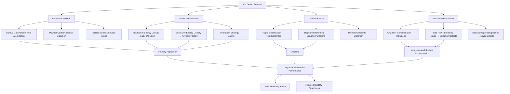

## Defects and Qualification in Additive Manufacturing

### Overview

Metal additive manufacturing (AM) processes introduce characteristic defect populations distinct from those found in cast or wrought materials, arising from the layer-wise melting/solidification physics unique to AM. Because these defects directly govern mechanical performance — particularly fatigue life, which is exceptionally sensitive to internal and surface discontinuities — defect characterization and formal process qualification form an integral and inseparable part of AM technology deployment in engineering-critical applications.

### Classification of AM Defects

#### Porosity

**Gas (entrapment) porosity**: Spherical or near-spherical pores resulting from trapped gas, most commonly from:

- Argon or other shielding/process gas entrapped in the melt pool during rapid solidification
- Pre-existing gas porosity within the feedstock powder itself, originating from the gas atomization process used to produce most AM metal powders (dissolved/entrapped argon bubbles in the atomized droplet)

**Lack-of-fusion (LOF) porosity**: Irregular, often planar or elongated voids resulting from incomplete melting/fusion between adjacent scan tracks or between successive layers, typically arising from insufficient energy density (too high scan speed, too low power, excessive hatch spacing, or excessive layer thickness relative to the melt pool depth achieved).

**Key distinction**: Gas porosity is generally spherical and relatively benign at low volume fractions (and closeable via HIP since it is typically not surface-connected), whereas lack-of-fusion porosity is irregular, often contains unmelted powder particles, presents sharper crack-like geometry, and is substantially more detrimental to fatigue performance due to its higher effective stress concentration — LOF defects act as much more severe fatigue crack initiation sites than equivalent-size spherical gas pores.

#### Keyhole Porosity

At excessively high energy density (high power, low scan speed), the melt pool can transition to keyhole mode, where vapor recoil pressure creates a deep, narrow depression in the melt pool; instability of this keyhole can trap gas bubbles as the keyhole collapses, producing porosity distinct from both simple gas entrapment and lack-of-fusion, generally spherical to slightly irregular and located at characteristic depths related to the keyhole geometry.

#### Cracking

- **Solidification (hot) cracking**: Occurs during solidification when residual liquid film along grain boundaries cannot accommodate the thermal contraction strain, particularly problematic in alloys with wide solidification ranges or specific eutectic-forming solute segregation (certain nickel superalloys and high-strength aluminum alloys are notably crack-susceptible)
- **Liquation cracking**: Occurs in the heat-affected zone of previously solidified layers when reheating causes localized liquation of low-melting-point constituents at grain boundaries
- **Cold cracking / delayed cracking**: Driven by residual stress in combination with hydrogen embrittlement or brittle microstructural constituents, can occur after the build during cooling or even after removal from the build

#### Surface and Near-Surface Defects

- **Surface roughness**: As-built surfaces contain partially melted/adhered powder particles, creating a rough, irregular topology that acts as a distributed array of stress concentrators
- **Near-surface porosity**: Porosity close to but not necessarily open to the surface, which surface finishing operations may expose, converting sub-surface defects into surface-connected (and thus more fatigue-critical, and non-HIP-closeable) defects

#### Inclusions

Non-metallic inclusions can originate from:

- Contamination in the feedstock powder (oxide films, entrapped ceramic particles from atomization or handling)
- Powder degradation from repeated reuse cycles (oxidation of powder surface with each reuse cycle in powder bed fusion, particularly relevant for reactive metals like titanium and aluminum alloys)
- Process chamber contamination (spatter redeposition, condensate)

#### Geometric and Dimensional Defects

- **Distortion**: Residual-stress-driven warping, particularly at overhangs, thin sections, and following support/build-plate removal
- **Dimensional deviation**: Departure from nominal CAD geometry due to thermal shrinkage, the staircase effect on angled surfaces, and process-specific systematic offsets
- **Balling**: Discontinuous, spheroidized melt tracks resulting from poor wetting between the melt pool and substrate, typically from insufficient energy density or excessive scan speed, disrupting layer continuity and promoting subsequent lack-of-fusion in following layers

### Defect Origin Mapping

### Defect Detection and Characterization Methods

| Method | Detects | Notes |
| --- | --- | --- |
| X-ray Computed Tomography (CT) | Internal porosity, LOF, inclusions, cracks (3D) | Gold standard for internal defect characterization; resolution vs. part size trade-off |
| Radiography | Internal defects (2D projection) | Lower cost/faster than CT, less complete information |
| Dye penetrant inspection | Surface-breaking defects only | Cannot detect subsurface defects |
| Optical/laser surface profilometry | Surface roughness, topology | Quantifies $R_a$, $R_z$ and related parameters |
| Metallographic sectioning | Porosity, microstructure, defect morphology (destructive) | Ground truth for correlating in-situ monitoring with actual defects; destructive |
| In-situ process monitoring (melt pool monitoring, thermal imaging, acoustic emission) | Process signatures correlated with defect formation | Enables real-time/near-real-time detection, increasingly integrated into qualification frameworks |

### Process-Structure-Property Relationships and Qualification Approach

AM qualification fundamentally differs from qualification of conventional (wrought/cast) processes because the "process" in AM encompasses far more interdependent variables (laser/beam power, scan speed, hatch spacing, layer thickness, scan strategy, build orientation, part-to-part thermal history, machine-to-machine variation) that collectively determine final part quality, requiring a **process-structure-property** qualification philosophy rather than qualification based on final material specification alone (as is more typical for wrought products).

#### Qualification Approaches

**Part qualification** (traditional approach): Each part or part family is individually qualified through destructive testing of witness coupons built alongside the production part, verifying mechanical properties meet specification for that specific build.

**Machine qualification**: Establishes that a specific machine, operating with locked process parameters, reliably and repeatably produces material meeting specification, reducing (though not eliminating) the need for per-build witness coupon testing.

**Process qualification / statistical process control**: Establishes control limits on process parameters and in-situ monitoring signatures correlated with acceptable part quality, moving toward a "process signature equals part quality" qualification philosophy that is a significant focus of ongoing standards development, though [Speculation] the degree to which purely process-signature-based qualification (without destructive coupon testing or CT inspection) will be broadly accepted for the most safety-critical applications (e.g., primary aerospace structure) remains an evolving area of the field rather than settled practice, given the relative immaturity of statistical correlation databases compared to decades of accumulated wrought-alloy qualification experience.

#### Key Qualification Elements

1. **Material/feedstock qualification**: Powder chemistry, particle size distribution, morphology, flowability, and reuse/recycling protocols (tracking powder degradation across reuse cycles)
2. **Process parameter qualification**: Locked, validated parameter sets (power, speed, hatch spacing, layer thickness, scan strategy) for a given machine/alloy combination, typically established via design-of-experiments (DoE) studies correlating parameters to density, defect population, and mechanical properties
3. **Machine qualification**: Machine-to-machine and build-to-build repeatability verification, often via standardized witness coupon testing across multiple builds/machines
4. **Post-processing qualification**: Locked heat treatment, HIP, and surface finish parameters (see related post-processing topic), since these significantly affect final defect population and properties
5. **Non-destructive inspection (NDI) qualification**: Established acceptance criteria (maximum allowable porosity size/density, CT detection threshold validation) tied to the specific application's criticality
6. **Allowables development**: Statistical mechanical property databases (analogous to MMPDS-style allowables for wrought/cast metals) built from qualification testing, accounting for AM-specific scatter sources (build orientation anisotropy, location-within-build effects, machine-to-machine variation)

### Defect-Property Relationships

#### Fatigue Sensitivity

Because fatigue crack initiation is highly sensitive to the largest defect present in a stressed volume (rather than average defect population), fatigue life prediction models increasingly apply defect-based approaches:

$$\Delta K_{th} \text{ (fatigue threshold)} \text{ relates to defect size via the Murakami } \sqrt{\text{area}} \text{ parameter}$$

The **Murakami model** relates fatigue strength to the square root of the projected area of the critical defect (typically the largest surface or near-surface defect):

$$\sigma_w \approx \frac{C \cdot (HV + 120)}{(\sqrt{\text{area}})^{1/6}}$$

where $\sigma_w$ is fatigue limit, $HV$ is Vickers hardness, and $\sqrt{\text{area}}$ is the square root of the projected defect area on the plane perpendicular to the maximum principal stress. This defect-based approach is widely applied in AM fatigue analysis precisely because AM's characteristic internal porosity/LOF population makes classical smooth-specimen S-N approaches (which implicitly assume defect-free material) poorly representative of actual AM part behavior.

#### Static Property Sensitivity

Tensile ductility (elongation, reduction of area) is generally more sensitive to defect population than tensile strength, since defects primarily provide crack initiation/void coalescence sites during necking rather than substantially altering the underlying deformation resistance of the matrix material — this is a commonly observed pattern in porosity-affected metals generally, not unique to AM. [Inference] Consequently, ductility and fracture toughness properties are frequently the most discriminating indicators of AM part quality in qualification testing, more so than yield or ultimate tensile strength alone, though the specific relative sensitivity depends on defect type, size, and distribution for the alloy/process in question.

### Standards Landscape

Formal AM qualification is supported by an evolving standards framework, with key bodies and documents including ASTM F42 / ISO TC 261 (joint AM standards committee) covering terminology, powder feedstock specifications, process-specific standards (e.g., for L-PBF, EB-PBF, DED), mechanical testing methods adapted for AM specimens, and NDT/qualification guidance documents. [Unverified] The specific standard designations and their scope continue to be actively developed and revised as the field matures; current, authoritative standard numbers and content should be verified directly against ASTM/ISO published documents rather than assumed static, given the pace of standards development in this field.

**Key Points**

- Lack-of-fusion porosity is generally more detrimental to fatigue performance than equivalent-size spherical gas porosity due to its irregular, crack-like geometry and higher local stress concentration.
- AM qualification requires a process-structure-property philosophy addressing feedstock, process parameters, machine repeatability, post-processing, and NDI acceptance criteria as an interlocking system, rather than final-material specification testing alone.
- Defect-based fatigue models (e.g., Murakami √area approach) are increasingly favored over traditional smooth-specimen S-N curves for AM parts precisely because AM's characteristic defect population is not adequately represented by defect-free material assumptions.
- The maturity of AM qualification methodology varies significantly by industry and application criticality; aerospace and medical implant qualification frameworks are generally the most rigorous and well-developed, reflecting the criticality and regulatory oversight of those sectors.

**Related Topics**

- Post-processing techniques (HIP, heat treatment) and their role in defect mitigation
- Melt pool physics and process parameter optimization (energy density, scan strategy)
- Powder feedstock characterization and reuse/degradation tracking
- Murakami √area model and defect-based fatigue life prediction
- In-situ process monitoring and machine learning-based defect detection
- Build orientation effects on anisotropic mechanical properties
- MMPDS-style statistical allowables development for AM materials
- ASTM F42 / ISO TC 261 standards framework