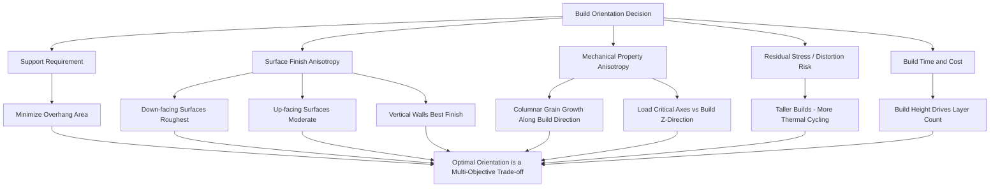

## Design for Additive Manufacturing

### Overview and Design Philosophy

Design for Additive Manufacturing (DfAM) refers to design methodologies that exploit the unique capabilities of layer-wise metal fabrication while systematically accounting for its process-specific constraints. DfAM represents a fundamental departure from Design for Manufacturing (DFM) principles developed for subtractive and formative processes, since AM removes many geometric constraints inherent to machining, casting, and forging (e.g., tool access, draft angles, parting lines) while introducing distinct new constraints (overhang angles, thermal management, support accessibility, powder removal).

**Key Points**

- DfAM is best understood as two complementary disciplines: **opportunistic DfAM** (exploiting AM-enabled geometric freedom for functional improvement — topology optimization, lattice structures, part consolidation) and **restrictive DfAM** (designing within AM process constraints to ensure manufacturability — overhang limits, support strategy, thermal management).
- Effective DfAM requires simultaneous consideration of build orientation, support strategy, thermal behavior, and post-processing access, since these factors are deeply interdependent rather than sequential design decisions.
- A design that is geometrically valid in CAD may be unbuildable, distortion-prone, or unfinishable in practice if these interdependencies are not addressed during design.

### Geometric Design Constraints

#### Overhang Angles and Self-Supporting Geometry

In powder bed fusion processes, surfaces angled shallowly relative to the build plate (measured from horizontal) require support structures below a critical overhang angle, typically in the range of 35–45° from horizontal depending on alloy, process parameters, and machine, below which the unsupported region experiences insufficient thermal conduction to the underlying solid material, leading to poor surface quality, dross formation, or outright build failure.

**Design strategies to minimize support dependency:**

- Orienting features to align with the self-supporting angle range wherever functionally permissible
- Chamfering or filleting transitions rather than abrupt horizontal overhangs
- Designing internal channels with diamond or teardrop cross-sections rather than circular, since a circular channel's top surface is inherently a worst-case unsupported horizontal overhang, while a teardrop shape's pointed top is inherently self-supporting

#### Minimum Feature Size and Wall Thickness

AM processes have characteristic minimum resolvable feature sizes governed by the melt pool/beam spot size (L-PBF typically achieves finer minimum features than EB-PBF, which uses a larger beam spot and higher layer thickness) and powder particle size distribution. Minimum wall thickness, minimum hole diameter, and minimum feature spacing must be respected to ensure structural integrity and dimensional fidelity — features below the process-specific minimum may build with poor definition, excessive porosity, or fail to build entirely.

[Unverified] Specific minimum feature dimensions vary substantially across machine models, alloy systems, and parameter sets; designers should validate against process-specific capability data (typically provided by the machine manufacturer or established through internal process qualification) rather than relying on generic published figures, since these values are not universally standardized across the industry.

#### Horizontal Hole and Bridge Considerations

Unsupported horizontal bridges and hole ceilings represent a specific overhang case: bridges below a certain span length can self-support without additional support structures (relying on the stiffness of the partially-solidified material and short unsupported span), while longer spans require support or design modification (arching, chamfering the hole ceiling).

### Build Orientation Strategy

Build orientation is arguably the single most consequential DfAM decision, since it simultaneously affects:

1. **Support requirement and volume**: Orientations minimizing overhang area reduce support material, build time, and post-processing labor
2. **Surface finish anisotropy**: Up-facing, down-facing, and vertical surfaces exhibit distinctly different as-built roughness; down-facing (support-contacting) surfaces are typically the roughest
3. **Mechanical property anisotropy**: Columnar grain growth typically follows the build direction (particularly pronounced in powder bed fusion), producing anisotropic mechanical properties (often lower ductility and fatigue strength in the build (Z) direction compared to in-plane (XY) directions) — critical loading directions should ideally align with the more favorable in-plane property direction where possible
4. **Thermal history and residual stress**: Taller build orientations generally experience more thermal cycling per unit height and can develop different residual stress distributions than shorter, wider orientations
5. **Build time and cost**: Orientation affects the number of layers required (build height is the dominant driver of build time in most powder bed processes) and thus directly impacts cost

### Support Structure Design

Supports in metal powder bed fusion serve three distinct functions, which must all be satisfied simultaneously by support design:

1. **Mechanical anchoring**: Preventing part movement/recoater collision during the build
2. **Thermal management**: Conducting heat away from overhanging regions to control local thermal gradients and prevent excessive distortion or poor fusion
3. **Distortion resistance**: Resisting the residual-stress-driven curling/warping tendency of the part during the build

**Common support types:**

- **Block/solid supports**: High strength and thermal conductivity, but material-intensive and time-consuming to remove
- **Lattice/lightweight supports**: Reduced material consumption and faster removal, at some cost to mechanical/thermal robustness
- **Tree/point supports**: Minimal contact area for reduced surface marking and easier removal, suited to lower-load, cosmetically sensitive regions
- **Line/wall supports**: Used for larger overhanging or thermally demanding regions requiring more robust anchoring

Support design must also account for **removability**: internal or hard-to-reach supports may be effectively unremovable, making support accessibility (or eliminating the need for supports through orientation/geometry design) a first-order DfAM consideration, particularly for internal channels and lattice structures.

### Topology Optimization

Topology optimization is a computational design methodology that determines optimal material distribution within a defined design space, subject to load cases, boundary conditions, and constraints (volume fraction, stress limits, manufacturing constraints), typically minimizing mass or compliance for a given performance target.

**Relevance to AM**: Topology-optimized geometries frequently produce complex, organic shapes (curved load paths, non-prismatic cross-sections, internal voids) that are difficult or impossible to manufacture via conventional subtractive/formative methods but are directly realizable via AM's layer-wise freedom, making topology optimization and AM a natural and frequently paired combination in DfAM practice.

**Practical considerations:**

- Manufacturing constraints (minimum feature size, overhang angle, support accessibility) should ideally be incorporated directly into the topology optimization formulation ("manufacturing-constrained topology optimization") rather than applied as a post-optimization geometric cleanup, since retrofitting AM constraints onto an unconstrained optimization result can compromise the achieved performance benefit
- Resulting geometries typically require smoothing/reconstruction into a manufacturable CAD or mesh-based representation before build preparation

### Lattice and Cellular Structures

AM's layer-wise fabrication enables direct production of lattice and cellular internal structures not producible by conventional methods, used for:

- **Mass reduction**: Replacing solid material with a lattice infill of controlled relative density, reducing part weight while retaining structural function
- **Energy absorption**: Engineered lattice topologies (e.g., stochastic foams, strut-based lattices such as BCC, FCC-derivatives, or triply periodic minimal surfaces (TPMS) like gyroid structures) tailored for specific crush/energy-absorption response
- **Thermal management**: High surface-area-to-volume lattice or TPMS structures for heat exchanger applications, exploiting AM's ability to produce complex internal flow geometries unachievable by casting or machining
- **Bone ingrowth scaffolds**: In medical implants, controlled-porosity lattice structures designed to promote osseointegration

**Design considerations specific to lattice structures:**

- Strut/wall thickness must respect the process minimum feature size to avoid incomplete melting or excessive porosity in thin lattice members
- Powder removal from internal lattice cavities is a critical, often challenging post-processing consideration (see related post-processing topic) — closed-cell or poorly-connected lattice topologies can trap powder that cannot be removed
- Effective mechanical properties of lattice structures depend on both the base material properties and the lattice topology/relative density, typically characterized via homogenization approaches (effective stiffness/strength as a function of relative density, often following power-law (Gibson-Ashby type) relationships)

### Part Consolidation

AM's design freedom enables **part consolidation**: redesigning a multi-component assembly as a single, more complex AM-built part, eliminating fasteners, joints, and associated failure modes. Notable benefits include:

- Reduced part count, assembly labor, and associated supply chain complexity
- Elimination of joint-related failure modes (fastener fatigue, weld defects, joint leakage)
- Potential weight reduction through elimination of flanges, fastener bosses, and joint-related structural margin

[Inference] Part consolidation decisions generally require careful evaluation of the trade-off between assembly simplification benefits and the increased consequence of a single-part failure (since a consolidated part typically has no redundant load path that separate fastened components might otherwise provide), though the specific risk/benefit balance is highly application- and criticality-dependent rather than a fixed rule.

### Thermal Design Considerations

Because AM processes involve steep, spatially non-uniform thermal gradients during build, DfAM must consider:

- **Thermal mass distribution**: Large, abrupt changes in cross-sectional area create differential cooling rates that drive residual stress concentration and distortion risk
- **Heat sink pathways**: Ensuring adequate conductive pathways to the build plate (via the part geometry itself or supports) for regions prone to overheating (which can cause poor surface quality, excessive melt pool size, or keyhole porosity)
- **Conformal cooling channels**: A signature AM-enabled application in tooling (injection mold inserts, die casting tooling), where internal cooling channels follow the part's functional surface contour rather than being limited to straight-line machined passages, improving cooling uniformity and cycle time in the end-use tooling application

### Design for Post-Processing Access

DfAM must anticipate downstream post-processing requirements during the initial design phase:

- **Machining stock allowance**: Critical functional surfaces requiring tight tolerances should include extra material in the AM design to be removed by finish machining
- **Support and powder removal access**: Internal channels and cavities must provide sufficient access for support removal tools and powder evacuation, or must be designed to be entirely self-supporting and powder-free by geometry alone
- **Inspection access**: Critical internal features may require accessible geometry for NDI methods (e.g., CT scan penetration depth/resolution limits for very dense or large parts) to be factored into design decisions

### Design Rule Summary Table

| Design Element | Constraint Type | Typical Mitigation |
| --- | --- | --- |
| Overhang angle | Process (thermal/support) | Orient >35-45° from horizontal or add supports |
| Minimum wall thickness | Process (melt pool/powder size) | Respect machine-specific minimum, avoid sub-minimum features |
| Horizontal holes | Process (overhang at ceiling) | Teardrop/diamond cross-section, chamfered ceiling |
| Internal channels | Post-processing (powder removal) | Escape holes, avoid fully enclosed powder traps |
| Large flat down-facing surfaces | Process (support/distortion) | Reorient, add ribs/lattice support, or accept support cost |
| Sharp internal corners | Stress concentration + thermal | Fillet transitions |
| Critical mating surfaces | Dimensional/surface finish | Add machining stock allowance |

### Software and Computational Tools Context

DfAM practice is supported by an ecosystem of computational tools spanning topology optimization (often integrated into major CAD/CAE platforms), lattice generation, build simulation (thermal/distortion prediction), and support generation/optimization software. [Unverified] The specific capability and market positioning of individual commercial DfAM software tools evolves rapidly; designers should consult current vendor documentation and independent benchmarking rather than relying on potentially outdated tool comparisons, given the pace of development in this software segment.

**Related Topics**

- Topology optimization mathematical formulations and manufacturing constraints
- Lattice structure homogenization and Gibson-Ashby scaling relationships
- Build orientation optimization algorithms and multi-objective trade-off methods
- Post-processing of additively manufactured parts (support removal, powder removal, surface finishing)
- Defects and qualification in additive manufacturing (as constrained by design decisions)
- Conformal cooling tooling design for injection molding and die casting
- Melt pool thermal simulation and distortion prediction software
- Anisotropic mechanical property characterization for AM alloys by build orientation