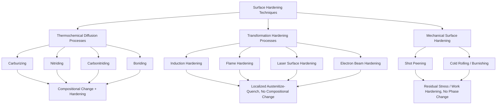

## Surface Hardening Techniques

### Overview and Classification

Surface hardening encompasses a family of processes that produce a hardened surface layer (case) on a component while retaining a softer, tougher core, achieving a combination of properties (wear resistance, fatigue resistance, contact strength at the surface; toughness and shock resistance in the core) not achievable by through-hardening alone. Surface hardening techniques are broadly classified into two categories based on their operating mechanism:

1. **Thermochemical diffusion processes**: Alter surface chemistry by diffusing interstitial or substitutional elements into the surface, followed by (or combined with) a phase transformation to develop hardness
2. **Transformation hardening processes**: Alter only the local thermal history (not chemistry) to selectively harden the surface via rapid austenitize-and-quench of a shallow layer, relying on the base material's existing hardenability

### Carburizing

Carburizing introduces carbon into the surface of a low-carbon steel (typically 0.1–0.25 wt% C base composition) by diffusion at elevated temperature (typically 850–950°C, within the austenite phase field where carbon solubility is substantially higher than in ferrite), followed by quenching to transform the now carbon-enriched surface into martensite while the low-carbon core remains relatively soft and tough.

#### Process Variants

**Gas carburizing**: The workpiece is heated in a carbon-rich atmosphere (typically generated from hydrocarbon gases such as methane or propane, often combined with an endothermic carrier gas), where the atmosphere's carbon potential is controlled to achieve the target surface carbon content (typically 0.8–1.0 wt% C at the immediate surface, tapering through the case depth).

**Pack carburizing**: The workpiece is packed in a carbon-rich solid compound (charcoal with an energizer such as barium carbonate) within a sealed container and heated; largely a legacy process, superseded in most modern production by gas or vacuum carburizing due to better process control.

**Liquid (salt bath) carburizing**: Uses molten cyanide-based salts as the carbon (and often nitrogen) source; largely phased out in many jurisdictions due to the toxicity and disposal hazards of cyanide-bearing salts.

**Vacuum carburizing (low-pressure carburizing, LPC)**: Performed under vacuum/low-pressure conditions using a hydrocarbon gas (typically acetylene) pulsed into the furnace, offering excellent process control, minimal intergranular oxidation (a defect common in atmospheric gas carburizing where oxygen diffuses in ahead of carbon and selectively oxidizes grain-boundary alloying elements), and compatibility with subsequent high-pressure gas quenching for reduced distortion.

#### Case Depth and Carbon Gradient

Case depth (typically defined by a specified hardness threshold, e.g., 50 HRC effective case depth) follows approximately parabolic diffusion kinetics, governed by Fick's second law:

$$x \approx K\sqrt{Dt}$$

where $x$ is case depth, $D$ is the temperature-dependent diffusion coefficient of carbon in austenite, and $t$ is carburizing time — meaning case depth increases with the square root of time, so doubling case depth requires approximately quadrupling process time at fixed temperature.

**Key Points**

- Carburizing produces the deepest achievable hardened case among common thermochemical processes, typically 0.5–2 mm, well suited to applications requiring substantial subsurface load-bearing capacity (gear teeth, bearing races).
- Requires a subsequent quench (direct or reheat) to develop the hardened martensitic case, introducing distortion risk that must be managed through fixturing, quench media selection, or press quenching for precision components.
- Case hardness is governed primarily by carbon content and quench severity, typically achieving 58–64 HRC in the as-quenched, unfinished condition for common carburizing steels.

### Nitriding

Nitriding introduces nitrogen into the surface at temperatures below the austenite transformation temperature (typically 500–550°C), forming hard iron nitrides and, in alloyed nitriding steels, alloy nitrides (particularly $\text{AlN}$, $\text{CrN}$, $\text{VN}$, $\text{MoN}$) that provide substantially higher achievable surface hardness than carburizing, without requiring a subsequent quench.

#### Process Variants

**Gas nitriding**: The workpiece is exposed to a nitrogen-rich atmosphere, classically dissociated ammonia ($\text{NH}_3 \rightarrow \text{N} + 3\text{H}$ at the surface), with nitrogen potential controlled via the dissociation ratio.

**Plasma (ion) nitriding**: Uses a glow-discharge plasma of nitrogen-bearing gas to accelerate nitrogen ions toward the workpiece surface, providing excellent process control, more uniform case formation, and reduced or eliminated brittle white layer (compound layer) formation compared to gas nitriding, along with faster processing in many cases.

**Salt bath (liquid) nitriding**: Uses molten cyanide/cyanate salts; similar toxicity/disposal concerns as liquid carburizing have reduced its use in many jurisdictions in favor of gas and plasma methods.

#### Nitriding Steels

Because achieving high nitride-forming hardness relies on specific alloy chemistry, dedicated nitriding steel grades (e.g., alloys containing chromium, molybdenum, and particularly aluminum, such as the Nitralloy family) are commonly specified, since aluminum in particular forms very hard, finely dispersed $\text{AlN}$ precipitates that produce the highest achievable nitrided surface hardness among common alloy systems.

**Key Points**

- Nitriding produces very high surface hardness (often exceeding 65–70 HRC equivalent on the Vickers scale for aluminum-bearing nitriding steels) but shallower case depth (typically 0.1–0.5 mm) compared to carburizing.
- No quench is required, since the process temperature is below the transformation temperature — this dramatically reduces distortion compared to carburizing, making nitriding well suited to precision components (fuel injection components, precision gears) where minimal post-process finishing is desired.
- The brittle compound (white) layer formed at the immediate surface in some nitriding processes may require controlled removal or process adjustment (plasma nitriding process control, or a subsequent light grinding/lapping step) depending on the application's tolerance for this layer.

### Carbonitriding

Carbonitriding is a hybrid diffusion process that introduces both carbon and nitrogen simultaneously, typically performed at a lower temperature than pure carburizing (approximately 800–870°C) in a carburizing atmosphere enriched with a small addition of ammonia.

**Characteristics:**

- Nitrogen addition increases hardenability of the case, allowing effective hardening of lower-hardenability (often lower-cost) steels than would be suitable for carburizing alone
- Typically produces shallower case depth than carburizing (commonly 0.1–0.75 mm), positioning it as an intermediate process in both case depth and processing temperature between carburizing and nitriding
- Lower process temperature than carburizing reduces distortion relative to conventional carburizing, though generally more distortion-prone than true (sub-critical) nitriding since carbonitriding still requires a quench

### Boriding (Boronizing)

Boriding diffuses boron into the surface (typically via pack, paste, gas, or plasma boriding methods) at temperatures typically in the 800–1050°C range, forming extremely hard iron boride compounds ($\text{FeB}$, $\text{Fe}_2\text{B}$) at the surface.

**Characteristics:**

- Produces exceptionally high surface hardness, often exceeding 1400–2000 HV (substantially harder than carburized or nitrided cases), making boriding particularly effective for severe abrasive wear applications
- The boride layer has a characteristic sawtooth-shaped interface with the substrate (rather than a smooth compositional gradient), which can influence spallation resistance under certain loading conditions
- Applicable to a broader range of base metals than carburizing/nitriding, including certain cast irons and non-ferrous alloys, extending its applicability beyond conventional case-hardening steels

### Induction Hardening

Induction hardening uses electromagnetic induction to rapidly heat a controlled surface layer above the austenitizing temperature, followed by immediate quenching (often via integrated spray quench), hardening only the heated zone while the unheated core remains unaffected — this is a transformation hardening process, altering local thermal history rather than chemistry, and therefore requires a base material with sufficient inherent carbon content (typically medium-carbon steels, 0.4–0.6 wt% C) to achieve martensitic hardening upon quench.

**Process characteristics:**

- An induction coil, carrying high-frequency alternating current, is positioned near (but not contacting) the workpiece surface; eddy currents induced in the workpiece surface (concentrated near the surface due to the skin effect) rapidly heat the local region
- **Case depth is controlled primarily by frequency**: higher frequencies concentrate heating in a shallower surface layer (smaller skin depth), while lower frequencies penetrate more deeply, allowing case depth to be tailored by frequency selection (along with power density and heating time)
- Heating cycles are typically very short (seconds), providing high process throughput and minimal thermal effect on the bulk component, making induction hardening well suited to high-volume production of components such as crankshaft journals, axle shafts, and gear teeth

**Key Points**

- No compositional change occurs; the base material must already contain sufficient carbon for martensitic transformation upon quenching.
- Highly localized and rapid, enabling selective hardening of specific features (e.g., only the bearing journals of a crankshaft) while leaving adjacent regions unaffected.
- Distortion is generally lower than furnace-based case hardening methods due to the short heating cycle and localized thermal input, though quench-induced distortion is still a design and process consideration.

### Flame Hardening

Flame hardening uses an oxy-fuel torch (or torch array) to rapidly heat the surface above the austenitizing temperature, followed by quenching (spray, immersion, or self-quench via conduction to the cooler core mass), operating on the same transformation-hardening principle as induction hardening but using direct flame heating rather than electromagnetic induction.

**Comparison to induction hardening:**

- Generally lower equipment cost and greater flexibility for large, irregular, or low-volume components where a dedicated induction coil would be impractical or uneconomical
- Less precise case depth control compared to induction hardening, since flame heating lacks the frequency-based depth control mechanism available in induction
- Commonly applied to large components such as gear teeth on large industrial gears, machine tool ways, and large shafts where induction tooling would be impractical

### Laser and Electron Beam Surface Hardening

Both processes use a high-energy-density beam (laser or electron beam) to rapidly austenitize a thin surface layer, relying on self-quenching via conduction into the cooler bulk material (no external quench medium is typically required, since the heated volume is small relative to the surrounding thermal mass, which acts as an internal heat sink).

**Characteristics:**

- Extremely precise, localized heating with minimal thermal distortion, well suited to complex geometries and selective hardening of small, precisely defined areas (e.g., specific wear zones on complex tooling or precision components)
- No quench medium handling required, simplifying process integration and eliminating quench-media-related environmental/disposal considerations
- Case depths are typically shallower than induction or flame hardening (often well under 1 mm), reflecting the highly localized nature of the energy input
- Electron beam hardening requires a vacuum (or reduced-pressure) environment, while laser hardening can typically be performed in open atmosphere, giving laser hardening an integration advantage for many production environments

### Comparative Summary

| Process | Mechanism | Typical Case Depth | Typical Surface Hardness | Distortion Risk | Base Material Requirement |
| --- | --- | --- | --- | --- | --- |
| Carburizing | Diffusion + quench | 0.5-2 mm | 58-64 HRC | Moderate-High | Low-carbon steel |
| Nitriding | Diffusion, no quench | 0.1-0.5 mm | 65-70+ HRC equiv. | Low | Alloy (nitriding) steel |
| Carbonitriding | Diffusion + quench | 0.1-0.75 mm | 58-64 HRC | Moderate | Low-carbon steel |
| Boriding | Diffusion, quench optional | 0.05-0.25 mm | 1400-2000 HV | Low-Moderate | Steel, some cast iron/non-ferrous |
| Induction hardening | Localized transformation | 0.5-6+ mm (frequency dependent) | 50-60+ HRC | Low-Moderate | Medium-carbon steel |
| Flame hardening | Localized transformation | 1.5-6+ mm | 50-60 HRC | Low-Moderate | Medium-carbon steel |
| Laser/EB hardening | Localized transformation, self-quench | <0.5-1 mm | 55-65 HRC | Very Low | Medium-carbon steel |

### Selection Considerations

**Key Points**

- **Base material carbon content** is a primary selection driver: low-carbon steels are suited to carburizing/carbonitriding (which add carbon); medium-carbon steels are suited to transformation hardening methods (induction, flame, laser/EB) that rely on existing base carbon.
- **Required case depth and load-bearing requirement**: Applications with high subsurface (Hertzian contact) stress, such as gear teeth and bearing races, generally favor deeper-case processes (carburizing, induction hardening at appropriate frequency); applications requiring only thin wear resistance favor nitriding or boriding.
- **Distortion tolerance and precision requirements**: Precision components with tight post-hardening tolerances favor nitriding, laser/EB hardening, or vacuum carburizing with press/gas quenching, given their comparatively lower distortion.
- **Production volume and geometry**: High-volume, geometrically simple features (crankshaft journals) favor induction hardening; large or irregular low-volume components favor flame hardening; complex geometries with localized wear zones may favor laser hardening.
- **Behavior may vary** significantly with specific alloy composition, prior microstructure, and process parameter control; selection between candidate processes for a specific application is typically validated through component-level testing rather than selected from generic guidance alone.

**Related Topics**

- Fatigue life improvement techniques (residual stress effects of surface hardening)
- Hardenability and the Jominy end-quench test
- Case depth measurement methods (microhardness traverse, effective case depth definitions)
- Quench media selection and quench distortion control
- Gear tooth contact fatigue (pitting) and case-core property requirements
- Thin hard coatings (PVD/CVD) as complementary or alternative surface engineering approaches
- White layer formation and control in nitriding processes
- Residual stress profiling of hardened cases (X-ray diffraction methods)