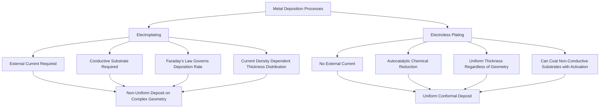

## Electroplating and Electroless Plating

### Overview and Fundamental Distinction

Electroplating and electroless plating are both wet-chemical metal deposition processes used to apply thin metallic coatings for corrosion protection, wear resistance, decorative finish, or functional properties (electrical conductivity, solderability, magnetic properties). The two processes are fundamentally distinguished by their deposition mechanism:

- **Electroplating**: Deposition driven by an externally applied electrical current, requiring the workpiece to be electrically conductive and connected as the cathode in an electrolytic cell
- **Electroless plating**: Deposition driven by autocatalytic chemical reduction, requiring no external current source, and capable of depositing on non-conductive substrates (with appropriate surface activation)

### Electroplating

#### Process Fundamentals

Electroplating occurs in an electrolytic cell where the workpiece (cathode) and typically a metal anode (either the coating metal itself, "soluble anode," or an inert anode with metal ions supplied from the bath, "insoluble anode") are immersed in an electrolyte solution containing dissolved ions of the metal to be deposited. Application of direct current drives reduction of metal ions at the cathode surface:

$$M^{n+} + ne^- \rightarrow M \text{ (deposited)}$$

**Faraday's Law** governs the theoretical deposition rate:

$$m = \frac{ItM}{nF}$$

where $m$ is mass deposited, $I$ is current, $t$ is time, $M$ is atomic mass of the depositing metal, $n$ is the number of electrons transferred per ion, and $F$ is Faraday's constant (96,485 C/mol).

**Current efficiency** (typically below 100%) accounts for competing reactions (most commonly hydrogen evolution at the cathode) that consume applied current without contributing to metal deposition:

$$\text{Current Efficiency} = \frac{\text{actual mass deposited}}{\text{theoretical mass from Faraday's Law}} \times 100\%$$

#### Throwing Power and Current Distribution

A central practical challenge in electroplating is **non-uniform current density distribution** across complex geometries: regions closer to the anode or at sharp edges/corners (high field concentration points) receive disproportionately higher current density than recessed areas, blind holes, or internal corners, producing non-uniform coating thickness.

**Throwing power** describes a plating bath's ability to deposit relatively uniform thickness despite this inherent current density variation, influenced by:

- Electrolyte conductivity (higher conductivity generally improves throwing power by reducing the relative influence of geometric resistance variation)
- Bath additives (leveling and brightening agents that locally modify deposition kinetics)
- Cell geometry and anode-to-cathode distance/arrangement
- Current density range used relative to the bath's optimal operating window

#### Common Electroplated Metals and Applications

| Metal | Primary Function | Typical Applications |
| --- | --- | --- |
| Zinc | Sacrificial corrosion protection (anodic to steel) | Fasteners, automotive body components, general steel hardware |
| Nickel | Corrosion resistance, decorative base layer, wear resistance | Decorative chrome undercoat, engineering nickel for wear/corrosion |
| Chromium | Hard wear-resistant surface (hard chrome) or decorative bright finish | Hydraulic cylinder rods, decorative automotive trim, cutting tool coatings |
| Copper | Conductivity, diffusion barrier, undercoat for subsequent plating | Printed circuit boards, undercoat before nickel/chrome |
| Gold | Corrosion resistance, electrical contact reliability, decorative | Electrical connectors, semiconductor packaging, jewelry |
| Silver | High electrical/thermal conductivity, low contact resistance | Electrical contacts, RF/microwave components, bearings |
| Tin | Solderability, corrosion protection, non-toxic food-contact barrier | Electronic component leads, food packaging (tinplate) |
| Cadmium | Corrosion protection with good lubricity/low galling (aerospace legacy) | Aerospace fasteners (declining use due to toxicity regulation) |

**Key Points**

- Zinc and cadmium plating provide **sacrificial (galvanic) protection**: since both metals are anodic relative to steel, they corrode preferentially, protecting the underlying steel substrate even where the coating is locally damaged or porous.
- Nickel and chromium plating provide primarily **barrier protection**: since both are cathodic relative to steel, a breach in the coating can accelerate localized corrosion of the exposed steel (galvanic corrosion at the defect site) rather than providing sacrificial protection.
- Hard chrome plating (distinct from thin decorative chrome) is applied at greater thickness specifically for wear resistance and low friction on components such as hydraulic rods, mold surfaces, and cutting tools, exploiting chromium's high hardness (typically 800-1000+ HV as-plated).

#### Electroplating Bath Types and Additives

Plating baths are formulated with the base metal salt, supporting electrolyte (for conductivity), and functional additives:

- **Brighteners**: Organic additives that promote a smooth, reflective deposit by influencing nucleation and grain growth kinetics
- **Levelers**: Additives that preferentially inhibit deposition at high-current-density peaks (edges, protrusions), promoting more uniform thickness distribution
- **Wetting agents/surfactants**: Reduce surface tension to minimize gas bubble (hydrogen) entrapment (pitting defects)
- **Stress relievers**: Reduce internal stress in the deposit that could otherwise cause cracking or poor adhesion, particularly relevant for higher-hardness, higher-stress deposits like hard chrome

#### Pulse Plating and Advanced Current Waveforms

[Inference] Pulse plating (using periodic current interruption or reversal rather than constant DC) is used in some applications to improve deposit uniformity, grain refinement, and throwing power compared to conventional DC plating, since the current-off (or reverse) periods allow ion concentration gradients near the cathode surface to partially relax between pulses, though the specific benefit magnitude is bath-chemistry- and geometry-dependent and should be evaluated for the specific application rather than assumed universally beneficial.

### Electroless Plating

#### Process Fundamentals

Electroless plating deposits metal via a **autocatalytic chemical reduction reaction**, where a chemical reducing agent in the bath (rather than an external current) supplies the electrons for metal ion reduction at the substrate surface. Once initiated (typically via a catalytic surface activation step, particularly critical for non-conductive substrates), the deposited metal itself catalyzes continued reduction, allowing the coating to grow autocatalytically as long as the part remains immersed in fresh bath solution.

**Key distinguishing characteristic**: Because deposition is driven by a uniform chemical reaction occurring everywhere the bath contacts the surface (rather than by electric field-driven current density, which varies with part geometry), electroless plating produces **highly uniform, conformal thickness** regardless of part geometry — a decisive advantage for complex geometries, recessed features, blind holes, and internal passages where electroplating's current-density-driven non-uniformity would be problematic.

#### Electroless Nickel Plating

The most widely used electroless plating process is **electroless nickel (EN)**, typically using sodium hypophosphite as the reducing agent, which co-deposits phosphorus along with nickel:

$$\text{Ni}^{2+} + \text{H}_2\text{PO}_2^- + \text{H}_2\text{O} \rightarrow \text{Ni} + \text{H}_2\text{PO}_3^- + 2\text{H}^+$$

The resulting nickel-phosphorus (Ni-P) deposit's properties depend strongly on phosphorus content, which is classified into distinct categories:

| EN Type | Phosphorus Content | Characteristics |
| --- | --- | --- |
| Low phosphorus | ~1-4 wt% P | Higher as-deposited hardness, more crystalline structure, better solderability, lower corrosion resistance in acidic environments |
| Medium phosphorus | ~5-9 wt% P | Balanced properties, most common general-purpose grade |
| High phosphorus | ~10-13 wt% P | Amorphous structure, superior corrosion resistance (particularly in acidic/chloride environments), non-magnetic, lower as-deposited hardness |

**Heat treatment of electroless nickel**: As-deposited EN coatings can be significantly hardened by subsequent heat treatment (typically 260–400°C), which precipitates hard nickel phosphide ($\text{Ni}_3\text{P}$) from the metastable as-deposited structure, substantially increasing hardness (often from approximately 500-600 HV as-deposited to 900-1000+ HV after optimized heat treatment) at the cost of some ductility and, for high-phosphorus grades, some reduction in corrosion resistance due to the transition from amorphous to crystalline structure.

#### Electroless Copper and Other Systems

**Electroless copper** is widely used in printed circuit board manufacturing to metallize through-holes and via walls (which are non-conductive substrate material prior to metallization), typically using formaldehyde as the reducing agent in an alkaline bath, providing the initial conductive seed layer that is subsequently built up by electroplating.

**Other electroless systems** (electroless cobalt, electroless palladium, electroless gold) serve specialized applications, particularly in electronics finishing stacks (e.g., electroless nickel/electroless palladium/immersion gold, "ENEPIG," a common circuit board surface finish providing solderability, wire-bondability, and corrosion resistance in a single finish system).

#### Surface Activation for Non-Conductive Substrates

Plating on non-conductive substrates (plastics, ceramics) for electroless (and subsequent electroplating build-up) requires a surface activation sequence:

1. **Etching/roughening**: Chemical or mechanical surface treatment to create mechanical anchor points for coating adhesion
2. **Catalytic activation**: Typically a palladium-tin colloid or sequential sensitization (tin chloride) and activation (palladium chloride) treatment, depositing catalytic palladium nuclei on the surface
3. **Electroless deposition**: The catalytic palladium nuclei initiate autocatalytic metal deposition, which then self-propagates across the activated surface
4. **Electroplating build-up** (optional): Once a continuous, conductive electroless layer is established, further thickness can be economically added via conventional electroplating

This sequence underlies the "plating on plastics" (PoP) processes widely used for decorative chrome-plated plastic automotive trim and similar applications.

### Comparative Analysis

| Characteristic | Electroplating | Electroless Plating |
| --- | --- | --- |
| Deposition driver | External electrical current | Autocatalytic chemical reduction |
| Thickness uniformity on complex geometry | Non-uniform (current density dependent) | Highly uniform/conformal |
| Substrate conductivity requirement | Required (or requires conductive seed layer) | Not required (with activation) |
| Typical deposition rate | Generally faster, tunable via current density | Generally slower, governed by bath chemistry/temperature |
| Bath stability/maintenance | Generally more stable, longer bath life | More sensitive to contamination, requires more frequent bath replenishment/analysis |
| Relative cost | Generally lower cost per unit area for simple geometry | Generally higher cost (chemistry, slower rate) but justified for complex/critical geometry |
| Typical coating hardness (as-deposited) | Varies by metal (e.g., hard chrome 800-1000 HV) | EN-P alloys 500-600 HV as-deposited, 900-1000+ HV after heat treatment |

**Key Points**

- Electroless nickel's conformal thickness capability makes it the preferred choice for coating complex internal geometries (hydraulic valve bodies, downhole oil-and-gas components, complex mold cavities) where electroplating's inherent current-density non-uniformity would be unacceptable.
- Electroplating remains generally more economical for high-volume, relatively simple geometries where thickness uniformity requirements are less stringent (fasteners, sheet components, simple rotationally symmetric parts).
- Behavior may vary significantly with specific bath chemistry, substrate material, surface preparation quality, and process control; adhesion and coating performance should be validated through appropriate testing (adhesion testing per relevant standards, salt spray corrosion testing, hardness/wear testing) for the specific application rather than assumed from generic process characteristics alone.

### Pre-Treatment and Adhesion Considerations

Both processes require rigorous substrate surface preparation to achieve adequate coating adhesion:

- **Degreasing/cleaning**: Removal of oils, contaminants, and oxide layers via alkaline cleaning, solvent degreasing, or ultrasonic cleaning
- **Activation/etching**: Light acid etch or electrolytic activation to remove residual oxide and provide a chemically active surface for initial nucleation
- **Rinse control**: Thorough rinsing between process steps to prevent bath cross-contamination, a particularly critical control point given the sensitivity of both process types (especially electroless baths) to contamination-driven instability or deposit defects

### Environmental and Regulatory Context

Both electroplating and electroless plating processes involve chemistries subject to significant environmental regulation (wastewater treatment, heavy metal discharge limits, and specific restrictions or phase-outs for certain chemistries such as hexavalent chromium and cadmium in many jurisdictions), driving ongoing development of alternative chemistries (trivalent chromium plating as a hexavalent chromium alternative, zinc-nickel alloy plating as a cadmium alternative) and increased emphasis on closed-loop rinse water recovery and waste treatment systems in modern plating operations.

**Related Topics**

- Galvanic corrosion and sacrificial vs. barrier coating protection mechanisms
- Hard chrome plating vs. thermal spray hard coatings for wear applications
- Electroless nickel heat treatment and Ni-P phase transformation kinetics
- Plating on plastics (PoP) process sequences
- Printed circuit board surface finishes (ENEPIG, immersion silver, HASL)
- Trivalent chromium and zinc-nickel alloy plating as regulatory-driven alternative chemistries
- Coating thickness and adhesion testing standards (ASTM B571, B487, and related methods)
- PVD/CVD thin film coatings as complementary surface engineering approaches