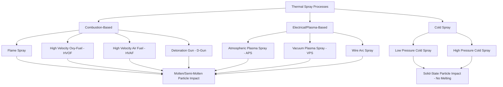

## Thermal Spray Coatings

### Overview and Fundamental Mechanism

Thermal spray encompasses a family of coating processes in which feedstock material (powder, wire, or rod) is heated to a molten or semi-molten state and propelled at high velocity toward a substrate, where the impacting particles flatten (forming "splats"), rapidly solidify, and mechanically interlock/metallurgically bond to build up a lamellar coating structure layer by layer. This splat-based buildup mechanism fundamentally distinguishes thermal spray from diffusion-based (carburizing, nitriding) or electrochemical (electroplating) surface treatments, and produces a characteristically lamellar, somewhat porous microstructure distinct from wrought, cast, or vapor-deposited coatings.

**Key Points**

- All thermal spray processes share the same basic sequence: feedstock heating → acceleration → impact/flattening → solidification → buildup, but differ substantially in heat source, particle velocity, and resulting coating characteristics (porosity, bond strength, oxide content).
- Because bonding is primarily mechanical interlocking (with varying degrees of localized metallurgical bonding depending on process and materials), substrate surface preparation (typically grit blasting to roughen and clean the surface) is critical to coating adhesion across all thermal spray variants.
- The resulting coating is generally not fully dense; porosity content varies significantly by process (from under 1% in high-velocity processes to 10-20%+ in lower-energy processes), directly influencing coating properties such as corrosion resistance, wear behavior, and mechanical strength.

### Process Classification by Heat Source

### Flame Spray

The original and simplest thermal spray process, using an oxy-fuel combustion flame (typically oxy-acetylene) to melt feedstock (wire, rod, or powder), which is then propelled by the combustion gas stream (and often an auxiliary compressed air jet) onto the substrate.

**Characteristics:**

- Relatively low particle velocity and flame temperature compared to more advanced processes, resulting in higher porosity (typically 10-15%+) and lower bond strength coatings
- Low equipment cost and high portability, making it suitable for field repair applications and less demanding coating requirements (build-up for dimensional restoration, basic wear/corrosion coatings)
- Wide feedstock compatibility including metals, self-fluxing alloys (which can be subsequently fused via torch or furnace to achieve a fully dense, metallurgically bonded coating), and some ceramics

### Wire Arc Spray

Uses an electric arc struck between two continuously fed consumable wire electrodes (of the coating material) to melt the wire tips, with the molten material atomized and propelled onto the substrate by a compressed air (or inert gas) jet.

**Characteristics:**

- High deposition rate and relatively low cost per unit mass deposited, making it economical for large-area coating applications (structural steel corrosion protection, large component build-up)
- Requires electrically conductive wire feedstock, limiting material selection compared to powder-based processes
- Commonly used for zinc and aluminum corrosion-protective coatings on large steel structures (bridges, offshore platforms) as a metallizing alternative/complement to paint systems

### High Velocity Oxy-Fuel (HVOF) Spray

HVOF combusts a fuel (typically kerosene, hydrogen, propylene, or similar) with oxygen at high pressure within a specially designed combustion chamber/nozzle, generating a very high-velocity gas stream (particle velocities often 500-800+ m/s, substantially higher than flame or plasma spray) that both melts and accelerates powder feedstock.

**Characteristics:**

- The combination of high particle velocity and relatively controlled (moderate, compared to plasma) flame temperature produces coatings with low porosity (often under 1-2%), high bond strength, and reduced decomposition/oxidation of sensitive feedstock materials (particularly important for carbide-based cermets, where excessive heat can decompose the carbide phase)
- Widely used for wear-resistant coatings, particularly tungsten carbide-cobalt (WC-Co) and chromium carbide-nickel chromium (Cr3C2-NiCr) cermet coatings, exploiting the high-velocity impact to achieve dense, well-bonded carbide coatings with minimal carbide decarburization
- Also used for corrosion-resistant metallic and alloy coatings (stainless steels, nickel-based alloys) where dense, low-porosity coating structure is important for corrosion barrier performance

### High Velocity Air Fuel (HVAF) Spray

A variant of HVOF using compressed air rather than pure oxygen as the oxidizer, operating at somewhat lower flame temperature but comparable or higher particle velocity than HVOF.

**Characteristics:**

- Lower process temperature reduces thermal degradation of heat-sensitive feedstock (further reducing carbide decomposition in cermet coatings compared to HVOF)
- [Inference] Generally reported to produce coatings with lower oxide content and comparable or improved density relative to HVOF for carbide-based coatings, though the specific comparative advantage depends on the exact feedstock and equipment configuration and should be evaluated for the specific application.

### Detonation Gun (D-Gun) Spray

Uses controlled, repetitive detonation of an oxygen-fuel gas mixture within a barrel to generate a very high-velocity, high-temperature pulse that melts and propels powder feedstock, achieving among the highest particle velocities of any thermal spray process (approaching or exceeding 800 m/s).

**Characteristics:**

- Produces very dense, high-bond-strength coatings, historically a benchmark process for demanding aerospace wear-coating applications, though HVOF has captured much of this application space with generally lower equipment/operating cost
- Higher equipment complexity and lower deposition rate compared to HVOF, generally reserving D-Gun for highest-criticality applications where its specific performance characteristics are justified

### Atmospheric Plasma Spray (APS)

Uses a DC electric arc struck within a nozzle to ionize a plasma-forming gas (commonly argon, often with hydrogen, helium, or nitrogen additions), generating an extremely high-temperature plasma plume (core temperatures can exceed 10,000-15,000 K) into which powder feedstock is injected, melted, and propelled onto the substrate.

**Characteristics:**

- The very high plasma temperature enables spraying of high-melting-point materials not practically sprayed by combustion-based processes, particularly ceramics (alumina, zirconia, chromia) and refractory metals
- Operates in open atmosphere, meaning sprayed particles are exposed to ambient air during flight, which can cause oxidation of metallic feedstock (a consideration for reactive metal coatings) — this is specifically mitigated in vacuum plasma spray
- Widely used for thermal barrier coatings (TBCs, typically yttria-stabilized zirconia, YSZ) on gas turbine hot-section components, wear-resistant ceramic coatings, and electrically insulating coatings

### Vacuum Plasma Spray (VPS) / Low Pressure Plasma Spray (LPPS)

Performs plasma spraying within a controlled low-pressure or vacuum chamber rather than open atmosphere, eliminating oxidation and enabling higher particle velocity (due to reduced gas drag at low chamber pressure) and improved coating density compared to APS.

**Characteristics:**

- Particularly important for reactive metal coatings (e.g., MCrAlY bond coats for thermal barrier coating systems in gas turbines, where M represents Ni, Co, or NiCo) that would oxidize excessively if sprayed in open atmosphere
- Higher equipment cost and lower throughput compared to APS due to the vacuum chamber requirement, generally reserved for high-value, performance-critical applications (aerospace turbine components)

### Cold Spray

Cold spray is fundamentally distinct from all other thermal spray processes: feedstock powder is accelerated to very high velocity (typically 300-1200+ m/s, process-dependent) using a heated (but sub-melting-point) compressed gas stream through a de Laval (converging-diverging) nozzle, such that particles remain **solid** throughout flight and bond to the substrate through severe plastic deformation upon impact rather than solidification from a molten state.

**Bonding mechanism**: The extreme plastic strain rate at impact (localized adiabatic shear instability at the particle-substrate interface) is generally understood to disrupt surface oxide layers and enable intimate metal-to-metal contact, producing a bond without requiring melting — this solid-state mechanism fundamentally distinguishes cold spray coating microstructure and properties from all melt-based thermal spray processes.

**Characteristics:**

- Minimal thermal input to the substrate and feedstock avoids melting-related issues: no oxidation of the sprayed metal (since it never melts), minimal residual tensile stress (often compressive, unlike the tensile residual stress common in melt-based sprayed coatings from solidification shrinkage), no phase transformation or grain growth in heat-sensitive materials, and negligible substrate heat-affected zone
- Well suited to oxidation-sensitive metals (copper, aluminum, titanium alloys) and to repair applications where minimizing thermal input to the substrate is critical (e.g., repair of aerospace components where substrate heat-affected zone could compromise base material properties)
- Generally limited to ductile metallic feedstock (since the bonding mechanism relies on plastic deformation), with more limited applicability to brittle ceramics or hard, low-ductility alloys compared to melt-based processes

### Coating Properties and Characterization

#### Porosity and Density

Porosity arises from incomplete splat flattening, gas entrapment, and unmelted or partially melted particles within the coating structure. Porosity level is strongly correlated with particle velocity and degree of melting: higher-velocity processes (HVOF, HVAF, D-Gun, cold spray) generally produce denser coatings than lower-velocity processes (flame spray, standard APS).

#### Bond Strength

Adhesive/cohesive bond strength (typically measured via ASTM C633 pull-off testing) depends on substrate surface roughness/preparation, particle velocity and temperature at impact, and the degree of metallurgical (vs. purely mechanical) bonding achieved. Bond strength generally correlates with the same velocity/melting factors that govern porosity, with high-velocity processes typically achieving substantially higher bond strength than flame spray or basic wire arc spray.

#### Residual Stress

Melt-based thermal spray coatings typically develop residual stress from the solidification shrinkage of each successive splat layer, generally resulting in net tensile residual stress in the coating (in contrast to many other surface hardening/coating processes that produce compressive residual stress), which can influence fatigue performance of coated components and, in extreme cases, contribute to coating spallation risk — cold spray, lacking a melt-solidify mechanism, generally avoids this tensile residual stress pattern and can instead develop compressive residual stress from the peening-like effect of high-velocity particle impact.

#### Oxide Content

For metallic coatings sprayed in open atmosphere (flame spray, wire arc spray, APS), some degree of in-flight oxidation of the molten/semi-molten particles is essentially unavoidable, producing thin oxide films (or discrete oxide particles/stringers) within the lamellar coating structure. This oxide content generally decreases with reduced particle flight time/temperature exposure (favoring higher-velocity, more controlled processes like HVOF/HVAF) and is essentially eliminated in vacuum plasma spray and cold spray.

### Common Coating Materials and Applications

| Coating Material | Process(es) Typically Used | Primary Application |
| --- | --- | --- |
| WC-Co, WC-Co-Cr cermets | HVOF, HVAF | Wear resistance (hydraulic rods, landing gear, industrial rolls) |
| Cr3C2-NiCr cermets | HVOF | High-temperature wear/erosion resistance |
| MCrAlY alloys | APS, VPS/LPPS, HVOF | Bond coat for thermal barrier coating systems, oxidation resistance |
| Yttria-stabilized zirconia (YSZ) | APS | Thermal barrier coating (top coat) for gas turbine hot section |
| Zinc, aluminum | Wire arc spray, flame spray | Sacrificial corrosion protection on structural steel |
| Stainless steels, nickel alloys | HVOF, wire arc spray | Corrosion resistance, dimensional restoration |
| Copper, titanium (oxidation sensitive) | Cold spray | Repair applications, electrically conductive coatings |
| Alumina, chromia | APS | Wear resistance, electrical insulation |

### Thermal Barrier Coating (TBC) Systems

A specifically important multi-layer thermal spray application in gas turbine engines, combining:

1. **Bond coat**: MCrAlY (or platinum-modified aluminide, applied by other methods) providing oxidation/corrosion resistance and improved adhesion between substrate and ceramic top coat
2. **Thermally grown oxide (TGO)**: An alumina layer that develops in service at the bond coat/top coat interface, whose growth and stability significantly influence TBC system life
3. **Ceramic top coat**: Typically YSZ, providing low thermal conductivity to reduce substrate metal temperature, applied via APS (producing a more porous, strain-tolerant microstructure) or, in higher-performance applications, via electron beam physical vapor deposition (EB-PVD, a distinct non-thermal-spray process producing a columnar microstructure with different strain tolerance characteristics)

[Unverified] The relative performance trade-offs between APS and EB-PVD TBC top coats (strain tolerance, thermal conductivity, erosion resistance, cost) are application- and engine-design-specific; specific comparative performance claims should be verified against current gas turbine OEM technical literature rather than generalized.

### Post-Spray Processing

- **Sealing**: Porous coatings (particularly plasma-sprayed ceramics and some HVOF coatings) may be impregnated with organic or inorganic sealants to reduce interconnected porosity, improving corrosion resistance
- **Grinding/machining**: Most thermal spray coatings are applied with excess thickness and finish-machined (grinding, typically, given coating hardness) to final dimension and surface finish
- **Fusing** (for self-fluxing alloy flame-sprayed coatings): A subsequent furnace or torch fusing step melts the sprayed self-fluxing alloy coating (typically nickel or cobalt-based alloys with boron/silicon additions that depress melting point and promote wetting), achieving a fully dense, metallurgically bonded coating distinct from the as-sprayed lamellar structure

### Comparative Process Selection Summary

**Key Points**

- **HVOF/HVAF** are generally preferred for dense, high-bond-strength wear-resistant cermet coatings where carbide decomposition must be minimized.
- **APS** is preferred for high-melting-point ceramic coatings (thermal barrier, wear-resistant oxide coatings) where extreme plasma temperature is required to achieve adequate melting.
- **VPS/LPPS** is reserved for oxidation-sensitive alloy coatings (MCrAlY bond coats) requiring both high quality and oxidation-free deposition.
- **Wire arc and flame spray** remain economical choices for large-area corrosion-protective metallizing where coating density/bond strength requirements are less stringent than wear-critical applications.
- **Cold spray** is the process of choice where substrate thermal input must be minimized or where oxidation-free deposition of reactive metals is required, though its applicability is more limited to ductile metallic feedstock than melt-based processes.
- Process and material selection should be validated against application-specific performance requirements (wear mechanism, corrosion environment, thermal cycling, substrate heat sensitivity) through appropriate testing, since coating performance is strongly influenced by the specific process parameters and feedstock quality used, which can vary between equipment and operators even within a nominally identical process category.

**Related Topics**

- Thermal barrier coating (TBC) system design and thermally grown oxide (TGO) evolution
- Cermet coating microstructure and carbide decomposition mechanisms in thermal spray
- Residual stress development in lamellar sprayed coatings
- Cold spray bonding mechanism and adiabatic shear instability
- PVD and CVD coatings as complementary/alternative surface engineering methods
- Coating adhesion and porosity characterization standards (ASTM C633, image analysis methods)
- Gas turbine hot section materials and coating systems
- Surface preparation (grit blasting) specifications for thermal spray adhesion