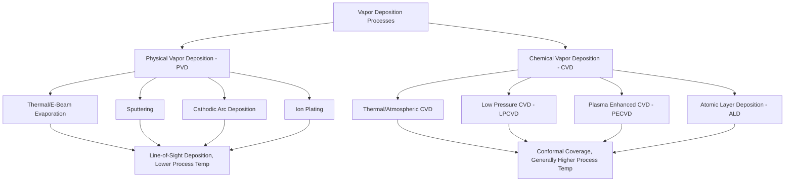

## Physical and Chemical Vapor Deposition

### Overview and Fundamental Distinction

Physical Vapor Deposition (PVD) and Chemical Vapor Deposition (CVD) are vacuum-based thin-film coating processes that build up coatings atom-by-atom or molecule-by-molecule from the vapor phase, in contrast to the molten-droplet-splat mechanism of thermal spray or the ionic reduction mechanism of electroplating. This atomistic deposition mechanism enables PVD and CVD to produce very thin (typically sub-micron to several microns), dense, well-adhered coatings with fine-grained or even columnar/epitaxial microstructures not achievable by other coating methods.

**Fundamental distinction:**

- **PVD**: Coating material is physically vaporized (via evaporation, sputtering, or arc erosion) from a solid or liquid source and transported to the substrate through vacuum or low-pressure gas, condensing directly onto the substrate without a chemical reaction being the primary deposition mechanism (though reactive gases are often introduced to form compound coatings)
- **CVD**: Coating material is deposited via a chemical reaction of gaseous precursors at or near the substrate surface, typically requiring elevated substrate temperature to drive the reaction and volatilize reaction byproducts away from the growing film

### Physical Vapor Deposition (PVD)

#### Thermal and Electron Beam Evaporation

The coating source material is heated (via resistive heating or a focused electron beam) within a high-vacuum chamber until it vaporizes, with vapor atoms traveling in a largely line-of-sight path to condense on the substrate.

**Characteristics:**

- Requires high vacuum (typically better than $10^{-4}$ to $10^{-6}$ Torr) to achieve sufficient mean free path for vapor atoms to reach the substrate without excessive gas-phase collision
- Line-of-sight deposition produces poor coverage on complex geometries, shadowed features, and internal surfaces, a significant limitation compared to sputtering or CVD for non-planar substrates
- Electron beam evaporation enables vaporization of high-melting-point materials not practically evaporated by resistive heating alone, and allows more precise control of deposition rate

#### Sputtering

Sputtering uses energetic ion bombardment (typically argon ions accelerated by an electric field within a plasma) to physically eject ("sputter") atoms from a target (source) material, which then travel to and condense on the substrate.

**Process variants:**

- **DC sputtering**: Uses a DC electric field to sustain the plasma and accelerate ions toward a conductive target; limited to electrically conductive target materials
- **RF sputtering**: Uses radio-frequency alternating field, enabling sputtering of insulating/dielectric target materials (which would otherwise accumulate charge and extinguish the plasma under DC excitation)
- **Magnetron sputtering**: Incorporates magnetic field confinement near the target surface to trap electrons and increase plasma density/ionization efficiency near the target, substantially increasing sputtering rate and enabling lower operating pressure compared to non-magnetron sputtering — this is the dominant sputtering configuration in modern industrial PVD equipment
- **Reactive sputtering**: Introduces a reactive gas (nitrogen, oxygen, or a hydrocarbon) into the chamber, which reacts with sputtered metal atoms either in-flight or at the substrate surface to form compound coatings (nitrides, oxides, carbides) rather than depositing the pure metal

**Characteristics:**

- Generally provides better step coverage and adhesion than simple evaporation, though still fundamentally a directional (though less strictly line-of-sight than evaporation) process, often requiring substrate rotation/fixturing strategies to achieve adequate coverage on complex 3D geometries
- Widely used for hard, wear-resistant tool coatings (titanium nitride, TiN; titanium aluminum nitride, TiAlN; chromium nitride, CrN) and decorative/functional thin films across many industries

#### Cathodic Arc Deposition (Arc-PVD)

Uses a high-current, low-voltage electric arc struck on a target (cathode) surface to generate a highly ionized vapor plume of target material (a distinguishing feature: arc deposition produces a substantially higher fraction of ionized vapor species compared to sputtering or evaporation), which is then accelerated toward the (typically negatively biased) substrate.

**Characteristics:**

- The high ionization fraction enables application of a substrate bias voltage to accelerate and direct ions toward the substrate, improving density, adhesion, and coverage on complex geometries compared to evaporation
- A characteristic defect of cathodic arc deposition is **macroparticle (droplet) formation**: molten micro-droplets ejected from the arc's cathode spot can become embedded in the growing film, producing surface roughness and localized defects that can be detrimental to coating performance in some applications (mitigated to varying degrees by filtered arc source designs that use magnetic filtering to remove macroparticles from the vapor stream before reaching the substrate)
- Widely used for hard coatings on cutting tools (TiN, TiAlN, TiCN, and multilayer/nanocomposite coating architectures), combining high deposition rate with good adhesion

#### Ion Plating

A hybrid PVD technique that combines evaporation (or sputtering) as the vapor source with simultaneous ion bombardment of the growing film (via plasma or ion beam), promoting densification, improved adhesion (through ion-induced interfacial mixing), and modified film stress state compared to simple evaporation.

### Chemical Vapor Deposition (CVD)

#### Process Fundamentals

CVD introduces gaseous precursor compounds (containing the desired coating elements, typically as halides, hydrides, or organometallic compounds) into a reaction chamber containing the heated substrate. At the substrate surface, the precursors undergo a chemical reaction (thermal decomposition, reduction, or a reaction between multiple precursor species), depositing the desired solid coating while releasing volatile byproducts that are removed from the chamber.

**Example reaction** (titanium nitride CVD, a classic example illustrating the general reaction type):

$$\text{TiCl}_4 (g) + \frac{1}{2}\text{N}_2 (g) + 2\text{H}_2 (g) \rightarrow \text{TiN} (s) + 4\text{HCl} (g)$$

#### Thermal (Atmospheric/Conventional) CVD

Performed at or near atmospheric pressure, typically requiring relatively high substrate temperatures (commonly 900–1100°C for classical hard-coating CVD chemistries such as TiN, TiC, Al2O3 on cemented carbide cutting tool substrates) to achieve adequate reaction rates and coating quality.

**Key limitation**: The high process temperature can be detrimental to substrate materials with limited high-temperature stability, particularly excluding conventional (non-carbide) tool steels from many classical CVD hard-coating applications due to the risk of substrate softening, distortion, or undesirable microstructural transformation at CVD process temperatures — this high-temperature requirement is a primary reason PVD (which operates at substantially lower substrate temperature, often 200-500°C) is preferred for temperature-sensitive substrates.

#### Low Pressure CVD (LPCVD)

Operates at reduced chamber pressure (typically sub-atmospheric, in the Torr range), which improves gas-phase mass transport uniformity and film thickness uniformity across the substrate (or across multiple substrates in a batch reactor) compared to atmospheric CVD, widely used in semiconductor device fabrication for uniform, conformal film deposition (polysilicon, silicon nitride, and other device-relevant films).

#### Plasma Enhanced CVD (PECVD)

Uses a plasma to provide additional energy for precursor dissociation, allowing the chemical reaction to proceed at substantially lower substrate temperature than thermal CVD would require for the same reaction, since plasma-generated reactive species (ions, radicals) reduce the activation energy barrier that would otherwise need to be overcome by thermal energy alone.

**Characteristics:**

- Enables CVD-type conformal coating on temperature-sensitive substrates (including some polymers and low-temperature-tolerant metals) not compatible with high-temperature thermal CVD
- Widely used in semiconductor manufacturing (dielectric and passivation films) and increasingly for hard coatings requiring lower deposition temperature than classical thermal CVD

#### Atomic Layer Deposition (ALD)

ALD is a specialized CVD variant using sequential, self-limiting surface reactions: precursor gases are introduced into the chamber one at a time (separated by purge steps), each precursor reacting with the surface until all available reactive surface sites are consumed (a self-limiting mechanism that caps film growth at a single atomic/molecular layer per cycle), before the next precursor is introduced to complete the reaction cycle.

**Characteristics:**

- Provides exceptional thickness uniformity, conformality (able to coat extremely high-aspect-ratio features, trenches, and porous structures uniformly), and atomic-level thickness control (since each cycle deposits a defined, self-limited increment), at the cost of substantially slower deposition rate compared to conventional CVD or PVD
- Widely used in advanced semiconductor device fabrication (high-k gate dielectrics, diffusion barriers) where extreme conformality and thickness precision on nanoscale features are required, and increasingly explored for functional coatings in other fields (catalysis, battery materials, corrosion barriers on complex geometries)

### Comparative Analysis: PVD vs. CVD

| Characteristic | PVD | CVD |
| --- | --- | --- |
| Deposition mechanism | Physical vaporization + condensation | Chemical reaction at substrate surface |
| Typical substrate temperature | Lower (often 200-500°C) | Higher (often 900-1100°C for thermal CVD; lower for PECVD/ALD) |
| Step coverage on complex geometry | Generally more directional/line-of-sight (improved by substrate rotation, bias) | Generally more conformal, especially LPCVD/ALD |
| Precursor/source handling | Solid target/source material | Gaseous precursors, often requiring hazardous gas handling infrastructure |
| Coating stress state | Often compressive (particularly sputtered/arc coatings) | Often tensile (thermal CVD), influenced by thermal expansion mismatch on cooling from high process temperature |
| Substrate material compatibility | Broader (compatible with more temperature-sensitive substrates) | More limited by process temperature (thermal CVD); improved with PECVD/ALD |
| Typical coating thickness range | Sub-micron to a few microns | Sub-micron to several microns; ALD sub-nanometer to nanometer control |

### Common Coating Materials and Applications

| Coating | Typical Process | Primary Application |
| --- | --- | --- |
| TiN (titanium nitride) | PVD (sputtering, arc), CVD | Cutting tool wear resistance, decorative gold-colored finish |
| TiAlN / AlTiN | PVD (sputtering, arc) | High-temperature cutting tool wear resistance (oxidation-resistant Al2O3 surface layer forms in service) |
| TiCN | PVD, CVD | Cutting tool wear resistance, intermediate hardness/toughness balance |
| CrN | PVD | Wear/corrosion resistant coating, mold and die applications, lower friction than TiN in some applications |
| Al2O3 (alumina) | CVD (thermal) | Cutting tool coating, particularly effective for high-temperature machining due to thermal/chemical stability |
| DLC (diamond-like carbon) | PVD, PECVD | Very low friction, high hardness coatings for automotive components, precision mechanical parts |
| Silicon nitride, silicon dioxide | PECVD, LPCVD | Semiconductor dielectric/passivation films |
| High-k dielectrics (HfO2, etc.) | ALD | Advanced semiconductor gate dielectrics |

### Cutting Tool Coating Application Context

PVD and CVD hard coatings are extensively applied to cutting tool substrates (cemented tungsten carbide, high-speed steel, ceramic) to improve wear resistance, reduce friction, and enable higher cutting speeds/tool life:

- **CVD coatings** on carbide inserts (multilayer TiN/TiCN/Al2O3 systems are common in industrial practice) benefit from CVD's ability to produce thick, well-adhered coatings with excellent high-temperature wear resistance, though the high CVD process temperature restricts this approach primarily to carbide substrates (which tolerate the process temperature without degradation) rather than high-speed steel tooling
- **PVD coatings** are preferred for high-speed steel tooling (due to PVD's lower process temperature, avoiding substrate tempering/softening) and are also widely used on carbide substrates for applications favoring PVD's characteristic compressive residual stress state (beneficial for edge sharpness retention and resistance to certain fatigue/chipping failure modes) and generally smoother as-deposited surface finish compared to CVD

[Inference] Coating selection between PVD and CVD options for a given cutting tool application typically depends on the specific machining operation, workpiece material, and required cutting edge geometry/sharpness, since the two coating families offer different combinations of coefficient of friction, hot hardness retention, residual stress state, and achievable edge radius — specific selection guidance should be based on tooling manufacturer application data and, where practical, application-specific trial cutting tests rather than generalized rules.

### Substrate Preparation and Adhesion Considerations

Both PVD and CVD require rigorous substrate surface preparation (cleaning, often combined with in-situ plasma etching or ion bombardment immediately prior to deposition) to remove contamination and native oxide layers that would otherwise impair coating adhesion, given the atomistic nature of film nucleation in both process families — even minor surface contamination at the atomic scale can significantly degrade interfacial bond quality.

**Key Points**

- Coating adhesion in PVD/CVD systems is influenced by substrate surface cleanliness, any interfacial reaction/diffusion layer formed during deposition, and residual stress state within the coating, with excessive residual stress (either tensile or compressive, if sufficiently high) capable of driving coating delamination or cracking independent of the intrinsic interfacial bond strength.
- Multilayer and gradient coating architectures (alternating hard/tough layers, or compositionally graded interfaces) are commonly employed in both PVD and CVD hard coating practice specifically to manage residual stress distribution and improve overall coating toughness/adhesion compared to single-layer coatings of equivalent total thickness.

**Related Topics**

- Cutting tool wear mechanisms and coating selection criteria
- Coating residual stress measurement (X-ray diffraction sin²ψ method) and its influence on coating performance
- Semiconductor thin-film deposition processes and device fabrication context
- Thermal spray coatings as a comparative thick-coating alternative
- Diamond-like carbon (DLC) coating structure and tribological properties
- Multilayer and nanocomposite hard coating architectures
- Coating characterization methods (nanoindentation hardness, scratch adhesion testing, SEM cross-section analysis)
- Reactive sputtering process control and compound stoichiometry