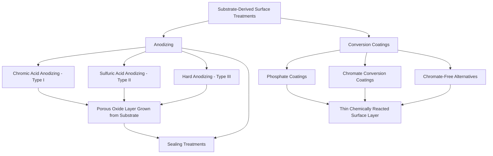

## Anodizing and Conversion Coatings

### Overview and Fundamental Distinction

Anodizing and chemical conversion coatings are both processes that transform the outermost layer of a metal substrate into a protective compound (typically an oxide, phosphate, or chromate) through electrochemical or chemical reaction, rather than depositing an entirely foreign material on top of the substrate as electroplating, thermal spray, or PVD/CVD do. This "substrate-derived" nature is the defining characteristic of the family:

- **Anodizing**: An electrochemical (electrolytic) oxidation process, using the workpiece as the anode in an electrolytic cell, that grows a thickened, adherent oxide layer from the substrate metal itself
- **Conversion coatings**: Chemical (non-electrolytic) reaction of the substrate surface with a specific bath chemistry, converting the outermost surface into a thin, adherent compound layer (phosphate, chromate, or chromate-free alternatives)

### Anodizing

#### Process Fundamentals

Anodizing is performed by immersing the workpiece (as the anode) along with a cathode (typically lead, stainless steel, or aluminum, process-dependent) in an acidic electrolyte, then applying DC current (or, in some processes, AC or pulsed waveforms). The applied current drives oxidation at the anode surface, converting the base metal into a hydrated oxide layer that grows into the substrate while simultaneously building outward.

**Aluminum anodizing** is by far the most common and commercially significant application, exploiting aluminum's naturally protective (though normally very thin, nanometers-scale) native oxide layer by electrochemically thickening it to a controlled, substantially greater thickness (typically several microns to over 50 microns depending on anodizing type).

#### Porous Oxide Structure

Under most conventional anodizing conditions (sulfuric acid electrolyte being the most common example), the growing oxide develops a characteristic **porous, columnar structure**: a dense, thin barrier layer forms immediately at the metal/oxide interface, while the bulk of the oxide layer above it consists of a regular array of hexagonally-packed columnar cells, each containing a central pore extending from the outer surface down to the barrier layer.

**Key Points**

- This porous structure is a critical functional feature: the open pore network provides sites for subsequent dye absorption (decorative coloring) and is later closed via a sealing process to achieve final corrosion resistance.
- Pore size, density, and oxide layer thickness are controlled by electrolyte composition, temperature, current density, and anodizing time, allowing the process to be tailored across a wide range of anodizing "types" and application-specific variants.
- Anodized oxide is significantly harder than the base aluminum substrate (aluminum oxide, $\text{Al}_2\text{O}_3$, has intrinsically high hardness), contributing to the wear resistance benefit of anodizing beyond its corrosion protection function.

#### Anodizing Type Classification (Aluminum, per common industry/MIL-spec categorization)

**Type I — Chromic Acid Anodizing**: Uses a chromic acid electrolyte, producing a thinner oxide layer (typically under 5 microns) than sulfuric acid processes, with the specific advantage of being less aggressive toward the base metal (important for thin sections, tight-tolerance parts, or fatigue-sensitive components, since chromic acid anodizing removes less base material and produces a less notch-sensitive oxide/metal interface than more aggressive processes) and offering good corrosion resistance with minimal dimensional change. [Unverified] The use of hexavalent chromium in Type I anodizing has become increasingly restricted in various regulatory jurisdictions, driving adoption of alternative processes in applications historically specified for chromic acid anodizing; current regulatory status should be verified for the specific application/jurisdiction rather than assumed.

**Type II — Sulfuric Acid Anodizing**: The most common and versatile anodizing type, using a sulfuric acid electrolyte to produce a moderate-thickness oxide layer (typically 5–25 microns), offering good corrosion resistance, excellent dye receptivity for decorative coloring, and moderate wear resistance. Widely used across architectural, consumer product, and general industrial applications.

**Type III — Hard Anodizing (Hardcoat)**: Uses sulfuric acid electrolyte (often with additives) under more aggressive conditions (higher current density, lower bath temperature) than standard Type II anodizing, producing a substantially thicker (typically 25–100+ microns), denser, and harder oxide layer specifically optimized for wear resistance and, to a lesser extent, enhanced corrosion resistance. Widely used for hydraulic components, gears, pistons, and other wear-critical aluminum components.

| Type | Electrolyte | Typical Thickness | Primary Benefit | Typical Application |
| --- | --- | --- | --- | --- |
| Type I | Chromic acid | <5 μm | Minimal dimensional/fatigue impact | Aerospace structural components, fatigue-sensitive parts |
| Type II | Sulfuric acid | 5-25 μm | Corrosion resistance + dye receptivity | Architectural, consumer products, general industrial |
| Type III | Sulfuric acid (hard) | 25-100+ μm | Wear resistance | Hydraulic components, gears, pistons, wear-critical parts |

#### Sealing

Because the as-anodized porous oxide structure is inherently absorptive (a functional necessity for dyeing) and would otherwise provide reduced corrosion resistance and contamination susceptibility, a **sealing** step is typically applied after anodizing (and after any dyeing step) to close the pore structure:

- **Hot water sealing**: Hydrothermal conversion of the porous oxide to a hydrated, expanded oxide phase (boehmite) that swells to close the pores, a widely used conventional sealing method
- **Cold sealing (nickel acetate/fluoride-based)**: Chemical sealing at lower temperature, offering process efficiency advantages and, depending on formulation, comparable sealing quality to hot sealing
- **Mid-temperature sealing**: An intermediate-temperature process balancing sealing quality and process efficiency

[Inference] Sealing quality is commonly assessed via standardized test methods (such as dye-stain resistance or admittance/impedance testing), and inadequate sealing can significantly compromise the corrosion resistance benefit of anodizing even when the underlying oxide layer itself was correctly formed, since the corrosion protection mechanism depends substantially on pore closure rather than oxide thickness alone.

#### Dyeing and Coloring

The porous structure of Type II (and to a lesser extent Type I) anodized coatings readily absorbs organic or inorganic dyes prior to sealing, enabling a wide range of decorative colors while retaining the underlying corrosion/wear protection function. **Electrolytic (two-step) coloring** is an alternative approach using a secondary electrolytic deposition of metal (commonly tin or nickel salts) within the pore structure, producing generally more lightfast/UV-stable coloring (bronze, black, and similar tones) than organic dyeing, particularly valued for architectural applications with extended outdoor exposure requirements.

### Conversion Coatings

#### Phosphate Coatings

Phosphate conversion coatings form by immersing (or spraying) the workpiece in a phosphoric acid-based bath containing metal phosphate salts (zinc, manganese, or iron phosphate being the most common), where the acidic solution etches the substrate surface while simultaneously precipitating an insoluble metal phosphate layer.

**Common phosphate types:**

- **Zinc phosphate**: Widely used as a paint/primer adhesion base layer (particularly in automotive body manufacturing) and, in heavier coating weights, for corrosion resistance and lubricity in cold-forming operations
- **Manganese phosphate**: Provides good wear resistance and oil retention, widely used on sliding/wearing components (firearm components, gears, engine parts) where the porous phosphate structure retains lubricating oil for improved break-in and wear characteristics
- **Iron phosphate**: A lighter-weight, more economical phosphate coating primarily used as a paint adhesion base for less demanding corrosion environments than zinc phosphate applications typically require

**Key Points**

- Phosphate coatings are rarely used as a standalone corrosion protection system; their primary value in most applications is as a base layer that dramatically improves the adhesion and corrosion performance of a subsequently applied paint, oil, or wax topcoat, through the phosphate crystal structure's mechanical keying and chemical compatibility with organic coating systems.
- Phosphate coating weight and crystal structure (fine vs. coarse crystalline) are controlled by bath chemistry, temperature, and accelerator additives, tailored to the specific downstream application (paint base vs. wear/lubricity application).

#### Chromate Conversion Coatings

Chromate conversion coatings (CCC) form by immersing (or applying) a chromate-containing acidic solution to a metal surface (most commonly aluminum, zinc, cadmium, and magnesium substrates), producing a thin, adherent, hexavalent-chromium-containing conversion layer that provides:

- **Corrosion resistance**: Both barrier protection and, notably, **self-healing capability** — hexavalent chromium within the coating is mobile and can migrate to repair minor coating damage/scratches, providing ongoing corrosion protection even after superficial coating disruption, a distinctive property not shared by most other conversion or barrier coatings
- **Paint adhesion base layer**: Similar to phosphate coatings, providing an excellent substrate for subsequent paint/organic coating adhesion
- **Electrical conductivity**: Unlike anodizing (which produces an electrically insulating oxide layer), chromate conversion coatings remain electrically conductive, making them the preferred surface treatment for aluminum components requiring both corrosion protection and electrical grounding/bonding continuity (a significant consideration in aerospace and electronics applications)

#### Regulatory Context and Chromate-Free Alternatives

Hexavalent chromium (present in classical chromate conversion coating chemistry, and historically in Type I chromic acid anodizing) is subject to substantial and evolving environmental/health regulation in many jurisdictions (including REACH restrictions in the European Union and various national/regional regulations elsewhere), driving significant industry development and adoption of chromate-free alternative technologies:

- **Trivalent chromium conversion coatings (TCP)**: Use trivalent rather than hexavalent chromium chemistry, offering substantially reduced toxicity while aiming to provide comparable corrosion protection performance to legacy hexavalent chromate coatings
- **Titanium/zirconium-based conversion coatings**: An entirely chromium-free chemistry increasingly used, particularly as a paint pretreatment replacing both phosphate and chromate conversion coatings in some automotive and general industrial applications
- **Rare-earth and other emerging chemistries**: Various additional chromate-free technologies continue to be developed and qualified across different industries

[Unverified] The specific performance parity (corrosion resistance, paint adhesion, self-healing capability) between chromate-free alternatives and legacy hexavalent chromate coatings varies by application, substrate alloy, and specific alternative chemistry; current comparative performance data and qualification status for any specific application should be verified against current industry/regulatory documentation (e.g., aerospace material specifications, automotive OEM standards) rather than assumed equivalent across the board, given the active and evolving state of this technology transition.

### Comparative Summary: Anodizing vs. Conversion Coatings

| Characteristic | Anodizing | Conversion Coatings |
| --- | --- | --- |
| Process type | Electrolytic (requires applied current) | Chemical (no external current) |
| Primary substrates | Aluminum (most common), also titanium, magnesium | Steel (phosphate), aluminum/zinc/magnesium (chromate) |
| Coating thickness | Several to 100+ microns | Typically sub-micron to a few microns |
| Electrical conductivity | Insulating (except at unsealed/thin coatings) | Generally conductive (chromate), non-conductive (thick phosphate) |
| Primary function | Corrosion resistance, wear resistance (hard anodizing), decorative (dyeing) | Paint adhesion base, corrosion resistance (chromate), lubricity/wear (phosphate) |
| Typical standalone use | Yes, particularly sealed Type II/III anodizing | Limited; typically used as a base layer beneath paint/oil |

### Selection Considerations by Application

**Key Points**

- **Decorative/architectural aluminum**: Type II sulfuric acid anodizing with dyeing and sealing is the dominant choice, balancing corrosion resistance, aesthetic flexibility, and cost.
- **Wear-critical aluminum components** (hydraulic parts, gears): Type III hard anodizing is preferred for its substantially greater thickness and hardness.
- **Fatigue-sensitive aerospace aluminum structure**: Type I chromic acid anodizing (or increasingly, approved chromate-free/TCP alternatives) is preferred where minimizing dimensional change and avoiding notch-sensitive interface effects is critical, though regulatory status of chromic acid processes should be verified for the specific program/jurisdiction.
- **Steel components requiring paint adhesion**: Zinc or iron phosphate conversion coating remains a standard pretreatment, particularly in automotive body manufacturing.
- **Sliding/wearing steel components requiring lubricity**: Manganese phosphate remains a standard choice, exploiting its oil-retentive porous structure.
- **Aluminum/zinc components requiring electrical conductivity plus corrosion protection**: Chromate (or increasingly trivalent chromium/chromate-free) conversion coating is preferred over anodizing specifically because anodizing's insulating oxide layer is incompatible with electrical bonding/grounding requirements.

**Related Topics**

- Aluminum alloy corrosion mechanisms and galvanic compatibility
- Paint and organic coating systems (primer/topcoat adhesion mechanisms)
- Hexavalent chromium regulation (REACH, RoHS) and industry transition to alternative chemistries
- Electroplating and electroless plating as complementary/alternative metallic coating approaches
- Surface hardening techniques (comparison of anodizing wear resistance vs. thermochemical case hardening)
- Corrosion testing methods (salt spray/fog testing per ASTM B117, electrochemical impedance spectroscopy)
- Magnesium and titanium anodizing process variants
- Aerospace material specifications for anodizing and conversion coating qualification (AMS, MIL-spec documents)