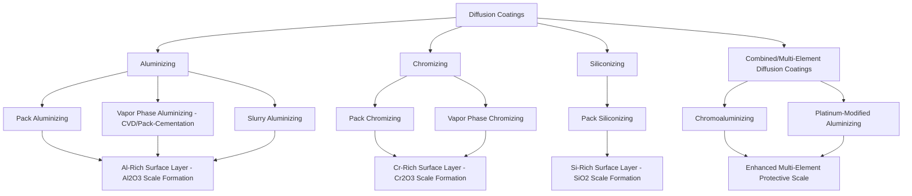

## Diffusion Coatings

### Overview and Fundamental Mechanism

Diffusion coatings are a class of surface treatments in which a coating element is deposited onto (or applied adjacent to) a substrate and subsequently allowed to diffuse into the surface at elevated temperature, forming a graded compositional layer that is metallurgically integral with the substrate rather than a discrete overlay. This mechanism distinguishes diffusion coatings from overlay coatings (thermal spray, PVD/CVD, electroplating), which deposit a distinct material on top of the substrate with a relatively sharp interface.

**Key distinction from thermochemical surface hardening**: While processes like carburizing and nitriding (covered under surface hardening) are technically diffusion coatings that introduce interstitial elements (carbon, nitrogen) primarily to increase hardness via subsequent phase transformation, the term "diffusion coatings" in a broader surface engineering context typically emphasizes diffusion of **substitutional alloying elements** (aluminum, chromium, silicon) primarily for high-temperature oxidation and hot corrosion resistance, rather than hardness/wear resistance — this chapter section focuses on this broader diffusion coating category, particularly aluminizing, chromizing, and siliconizing.

### Aluminizing

Aluminizing diffuses aluminum into the surface of nickel- and cobalt-based superalloys (and, less commonly, certain steels) to form an aluminum-rich intermetallic surface layer (predominantly $\beta$-NiAl in nickel-based systems), designed specifically to promote the formation of a slow-growing, protective, adherent alumina ($\text{Al}_2\text{O}_3$) scale during high-temperature service, which provides substantially superior oxidation resistance compared to the chromia or other oxide scales that would form on the uncoated base alloy.

#### Pack Cementation (Pack Aluminizing)

The classical aluminizing method, in which the workpiece is packed in a powder mixture containing an aluminum source (aluminum or aluminum alloy powder), an activator (typically a halide salt, such as ammonium chloride or ammonium fluoride), and an inert filler (alumina powder), then heated in a sealed retort. The activator reacts with the aluminum source to generate volatile aluminum halide vapor species, which transport aluminum to the workpiece surface where it deposits and subsequently diffuses inward.

**Process characteristics:**

- Coating can be produced as either a "high-activity" (lower-temperature) or "low-activity" (higher-temperature) process, which influences the resulting coating microstructure: high-activity processes tend to produce coatings with aluminum diffusing inward into the substrate (an "inward-growing" coating structure), while low-activity processes favor outward diffusion of nickel (or the base metal) into the aluminum-rich layer (an "outward-growing" structure), with each structure type offering somewhat different ductility, coating thickness distribution, and performance characteristics
- Coating thickness typically ranges from approximately 25–75 microns, tailored to the component's service requirements and expected coating consumption life

#### Vapor Phase (Out-of-Pack) Aluminizing

A variant in which the workpiece is positioned separately from (rather than embedded within) the powder pack, exposed only to the vapor phase generated by the pack, offering improved coating uniformity (particularly important for complex geometries with internal passages, such as turbine airfoil cooling channels) and reduced particulate contamination compared to direct pack embedding.

#### Slurry (Paint-On) Aluminizing

Applies an aluminum-rich slurry (aluminum powder in an organic or inorganic binder) directly to the component surface, followed by a diffusion heat treatment, offering greater flexibility for large or geometrically complex components where pack cementation retort sizing would be impractical, and allowing more selective/localized coating application than immersion-based pack processes.

### Chromizing

Chromizing diffuses chromium into the substrate surface, typically via pack cementation methods analogous to pack aluminizing (chromium source powder, halide activator, inert filler), to produce a chromium-enriched surface layer promoting formation of a protective chromia ($\text{Cr}_2\text{O}_3$) scale.

**Characteristics:**

- Chromia-forming coatings generally provide superior resistance to certain hot corrosion mechanisms (particularly Type II hot corrosion, occurring at somewhat lower temperatures than Type I hot corrosion) compared to alumina-forming coatings, making chromizing (or chromium-rich combined coatings) a preferred choice for some industrial gas turbine and marine gas turbine applications where sulfate/vanadate-driven hot corrosion is a dominant degradation mechanism
- Generally used at somewhat lower maximum service temperatures than pure aluminide coatings, since chromia scale volatility/degradation becomes more significant at very high temperatures compared to the generally more thermally stable alumina scale

### Siliconizing

Siliconizing diffuses silicon into the substrate surface to promote formation of a protective silica ($\text{SiO}_2$) scale, historically less widely applied to superalloys than aluminizing/chromizing but used in specific high-temperature oxidation-resistant applications, including certain refractory metal (e.g., molybdenum, niobium) protective coating systems where silicide-based coatings (formed via siliconizing-type diffusion processes) provide essential oxidation protection for base metals that would otherwise oxidize catastrophically at elevated temperature.

### Combined and Modified Diffusion Coatings

#### Chromoaluminizing

Combines chromium and aluminum diffusion (either sequentially or via a combined pack chemistry) to leverage benefits of both elements: aluminum's superior high-temperature oxidation resistance (via alumina scale formation) combined with chromium's improved lower-temperature hot corrosion resistance, producing a more balanced protective system than either element alone for applications experiencing both oxidation and hot corrosion degradation mechanisms across a service temperature range.

#### Platinum-Modified Aluminide Coatings

A widely used, performance-enhanced aluminide coating variant in which a thin platinum layer is first electroplated onto the substrate, followed by conventional aluminizing (pack or vapor phase), producing a platinum-modified aluminide (PtAl) coating structure.

**Benefits of platinum modification:**

- Improved alumina scale adhesion and reduced scale spallation tendency during thermal cycling, extending coating (and thus component) oxidation life compared to unmodified aluminide coatings
- Improved hot corrosion resistance compared to simple aluminide coatings
- Widely used as both a standalone environmental coating on turbine blades/vanes and as the bond coat beneath ceramic thermal barrier coating (TBC) top coats, where platinum-modified aluminide serves a dual function of environmental protection and TBC adhesion/oxidation-barrier support (as an alternative or complement to MCrAlY overlay bond coats applied via thermal spray, discussed under thermal spray coatings)

### Diffusion Coating Mechanism and Microstructure

The diffusion coating process fundamentally follows Fickian diffusion kinetics, similar in mathematical form to carburizing/nitriding case depth relationships, but the resulting coating microstructure and phase distribution are governed by the specific alloy system's phase diagram (e.g., the Ni-Al binary/ternary system for nickel-based superalloy aluminizing) rather than simple interstitial solid solution as in carburizing.

**Typical aluminide coating structure** (nickel-based superalloy substrate):

1. **Outer coating layer**: Predominantly $\beta$-NiAl intermetallic phase, providing the aluminum reservoir for sustained alumina scale formation/regrowth throughout service life
2. **Interdiffusion zone**: A transition region between the coating and unaffected substrate, containing complex precipitate phases (often including topologically close-packed, TCP, phases in some alloy systems) resulting from outward diffusion of substrate alloying elements (particularly refractory elements such as tungsten, molybdenum, tantalum) into the coating region during processing and service

[Inference] The interdiffusion zone's phase content and its evolution during extended high-temperature service is generally understood to influence coating (and potentially substrate) mechanical properties, including potential effects on fatigue behavior at the coating/substrate interface, and is an active area of ongoing materials characterization in high-temperature coating research, though specific quantitative property impacts are alloy-system- and service-condition-dependent rather than universally characterized.

### Oxidation Protection Mechanism

The protective function of diffusion coatings (and, analogously, MCrAlY overlay coatings) relies on the formation and maintenance of a slow-growing, adherent, self-healing protective oxide scale:

$$\text{Coating growth/consumption} \rightarrow \text{Selective oxidation of Al (or Cr) from coating} \rightarrow \text{Protective scale formation}$$

As the protective scale grows (or is locally damaged/spalled during thermal cycling), the aluminum (or chromium) reservoir within the diffusion coating is progressively depleted, supplying the continued oxide regrowth. **Coating life is fundamentally limited by this depletion process**: once the coating's aluminum (or chromium) reservoir is sufficiently depleted (either by cumulative oxide growth or by outward diffusion of the reservoir element into the substrate interdiffusion zone over extended service time), the coating can no longer sustain reformation of the protective scale upon local damage, and the underlying substrate becomes exposed to accelerated, non-protective oxidation/hot corrosion attack.

**Key Points**

- Diffusion coating (and MCrAlY) service life is generally governed by the rate of protective-element depletion relative to the initial reservoir content, making coating thickness and reservoir composition primary design variables for extending component oxidation-limited service life.
- Coating degradation is progressive and cumulative over service exposure, meaning periodic inspection and, where economically justified, recoating (stripping the depleted coating and reapplying a fresh diffusion coating) is a standard practice for extending the service life of high-value components such as turbine airfoils.

### Comparison to Overlay Coatings (MCrAlY)

| Characteristic | Diffusion Coatings (Aluminide, Chromide) | MCrAlY Overlay Coatings (Thermal Spray/PVD) |
| --- | --- | --- |
| Deposition mechanism | Diffusion into substrate (metallurgically integral) | Deposited overlay (mechanically/metallurgically bonded interface) |
| Composition control | Limited by substrate alloy composition interaction | Independently controllable (M, Cr, Al, Y content tailored to application) |
| Typical thickness | 25-75 μm | 75-300+ μm (process dependent) |
| Reservoir/depletion behavior | Reservoir partially shared with/diluted by substrate interdiffusion | More independent reservoir, less substrate composition dependence |
| Typical application | Turbine blade/vane external and internal cooling passage coating, simpler/lower-cost coating solution | TBC bond coats, applications requiring tailored composition independent of substrate |
| Relative cost | Generally lower cost, simpler process | Generally higher cost, more complex equipment (thermal spray or PVD) |

[Inference] Selection between diffusion coatings and MCrAlY overlay coatings for a given turbine component application typically involves trade-offs between cost, coating composition flexibility, and the specific oxidation/hot corrosion environment expected in service, with diffusion coatings often favored for internal cooling passages (where overlay coating application is difficult or impractical due to line-of-sight/access limitations) and MCrAlY overlays often favored where independent composition control or greater coating thickness/reservoir capacity is required, though specific selection is application- and OEM-specification-driven rather than governed by a single universal rule.

### Applications

- **Gas turbine hot section components**: Turbine blades, vanes, and combustor components in aircraft and industrial gas turbines, where diffusion aluminide (and platinum-aluminide) coatings remain a widely used environmental protection system, both as standalone coatings and as TBC bond coats
- **Refractory metal protection**: Silicide diffusion coatings on molybdenum and niobium-based alloys for high-temperature structural applications where these base metals would otherwise oxidize catastrophically
- **Internal cooling passage protection**: Vapor phase aluminizing is particularly valued for its ability to coat complex internal turbine airfoil cooling geometries not readily accessible to line-of-sight overlay coating processes

**Related Topics**

- Thermal spray coatings and MCrAlY bond coat application methods
- Thermal barrier coating (TBC) systems and bond coat/top coat interaction
- High-temperature oxidation and hot corrosion mechanisms (Type I and Type II hot corrosion)
- Nickel-based superalloy phase diagrams and interdiffusion zone phase formation
- Gas turbine hot section component life management and coating inspection/recoating practices
- Surface hardening techniques (carburizing/nitriding) as a related but functionally distinct diffusion process category
- Refractory metal oxidation protection systems
- Physical and chemical vapor deposition as alternative coating application methods for platinum layers and other diffusion coating precursors