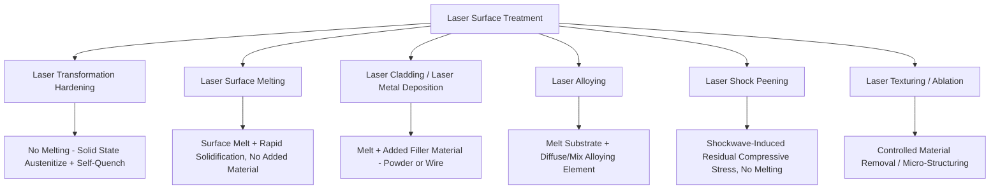

## Laser Surface Treatment

### Overview and Classification

Laser surface treatment encompasses a family of processes that use a high-energy-density, precisely controllable laser beam to modify a component's surface properties — through localized heating, melting, or ablation — without necessarily affecting the bulk material. The defining advantage across all laser surface treatment variants is the ability to deliver highly controlled, spatially precise, and rapidly quenched (self-quenching via conduction into the bulk) thermal input, enabling treatments with minimal distortion and a very limited heat-affected zone compared to furnace-based or torch-based alternatives.

### Laser Transformation Hardening

Laser transformation hardening (already introduced under surface hardening techniques) uses a laser beam to rapidly austenitize a thin surface layer of a hardenable steel or cast iron, without melting, followed by self-quenching via conduction into the cooler bulk material. This section expands on its process physics and practical implementation.

**Process physics**: The laser beam power density and dwell time (controlled by scan speed and spot size/beam shaping) are tuned to raise the surface temperature into the austenite phase field while remaining below the melting point, since melting would fundamentally change the process into laser surface melting (with correspondingly different resulting microstructure and surface finish characteristics).

**Beam shaping**: Because a simple circular Gaussian beam spot produces non-uniform power density distribution (leading to non-uniform case depth across the treated track), beam-shaping optics (integrators, scanning mirror rastering, or specialized beam-homogenizing optics) are commonly employed to produce a more uniform rectangular or "top-hat" intensity profile across the treated width, improving case depth uniformity for practical industrial application.

**Characteristics:**

- Case depths are typically shallower than induction or flame hardening (often well under 1 mm, though achievable depth depends on laser power, spot size, and scan speed)
- Excellent geometric selectivity, enabling hardening of specific, precisely defined zones (cam lobes, specific gear tooth flanks, localized wear tracks) that would be difficult to selectively treat with induction coils or flame torches
- Minimal distortion due to the highly localized, rapid thermal cycle and the large thermal mass of surrounding unheated material acting as an internal heat sink

### Laser Surface Melting

Laser surface melting deliberately melts a thin surface layer (without added filler material) and allows it to rapidly re-solidify via self-quenching, exploiting the very high cooling rates achievable (often $10^3$–$10^6$ K/s, process-parameter-dependent) to produce refined, often metastable microstructures not achievable by conventional bulk processing.

**Applications and effects:**

- **Grain refinement**: Rapid solidification produces substantially finer grain structure than conventional casting or bulk solidification, improving hardness and, in some applications, corrosion resistance (via more homogeneous distribution of alloying elements and reduced segregation)
- **Homogenization**: Can redistribute segregated constituents (e.g., in cast components) within the melted zone, reducing microsegregation-related property variation at the treated surface
- **Amorphization/metastable phase formation**: [Inference] In certain alloy systems with suitable glass-forming characteristics, sufficiently rapid laser-induced solidification cooling rates can suppress conventional crystalline phase formation, producing amorphous or metastable crystalline surface layers with distinct properties (e.g., enhanced corrosion resistance in some amorphous alloy surface layers), though this outcome is highly alloy-composition- and process-parameter-dependent rather than a general capability across all laser-melted materials

### Laser Cladding (Laser Metal Deposition)

Laser cladding melts a thin substrate surface layer while simultaneously introducing filler material (powder, delivered coaxially or via a side-feed nozzle, or wire) into the melt pool, producing a metallurgically fusion-bonded coating/deposit of a composition different from (and typically selected to improve upon) the substrate.

**Process characteristics:**

- Produces a true metallurgical bond (fusion welding-type bond) between clad layer and substrate, generally offering superior bond strength compared to thermal spray coatings, though typically with a greater degree of dilution (mixing of substrate material into the clad layer) than thermal spray, which must be accounted for in clad composition design to ensure the desired final deposit composition/properties are achieved after dilution
- Enables both **coating application** (wear-resistant or corrosion-resistant surface layers, often cobalt- or nickel-based hardfacing alloys, or carbide-reinforced composite deposits) and **additive/repair build-up** (dimensional restoration of worn components, or direct laser metal deposition additive manufacturing, sharing substantial process overlap with directed energy deposition AM as covered under additive manufacturing)
- Heat-affected zone and dilution are generally smaller than conventional arc welding-based hardfacing/cladding processes, due to the laser's more concentrated, controllable energy input, reducing distortion and enabling cladding of thinner-section or more geometrically complex components than arc-based cladding would permit

**Key Points**

- Laser cladding sits at the intersection of surface engineering and additive manufacturing/repair, since the same fundamental process (melt substrate, add filler, solidify) underlies both thin protective coating application and larger-scale additive build-up/repair.
- Dilution control is a critical process parameter: excessive dilution can compromise the intended clad layer composition/properties (e.g., diluting a hard, wear-resistant alloy with softer substrate material), while insufficient energy input risks poor fusion bonding (a lack-of-fusion-type defect analogous to that seen in powder bed fusion AM).

### Laser Alloying

Laser alloying melts the substrate surface while simultaneously introducing an alloying element (via pre-placed coating, powder injection, or gas-phase reaction) that mixes into the melt pool, forming a modified-composition surface layer that is compositionally blended with the substrate (in contrast to laser cladding, which aims to minimize dilution to preserve the filler material's intended composition).

**Applications**: Used to locally enhance surface properties (corrosion resistance, wear resistance, hardness) by introducing elements such as chromium, molybdenum, or carbide-forming elements into a surface region of an otherwise unmodified bulk alloy, offering a means to achieve a graded, substrate-integrated compositional modification distinct from both diffusion coatings (which rely on solid-state diffusion without melting) and cladding (which aims for minimal substrate dilution).

### Laser Shock Peening

Laser shock peening (already introduced under fatigue life improvement techniques) uses high-energy pulsed laser irradiation combined with an ablative surface coating and a confining medium (typically flowing water) to generate high-pressure shockwaves that induce plastic deformation and beneficial residual compressive stress, without melting the substrate — a fundamentally distinct mechanism from all the melt-based laser surface treatments described above.

**Process distinction**: Laser shock peening's mechanism relies on the mechanical shockwave generated by rapid plasma expansion (confined by the water overlay) rather than thermal melting/solidification, making it mechanistically closer to shot peening or deep rolling (mechanical surface treatments) than to the other laser surface treatments in this section, despite sharing the same laser energy source.

### Laser Texturing and Micro-Structuring

Laser texturing uses controlled, typically pulsed (often ultrashort-pulse, picosecond or femtosecond) laser ablation to create precisely defined micro- or nano-scale surface topography features, exploited for:

- **Tribological modification**: Engineered micro-dimple or micro-groove patterns can improve lubricant retention and reduce friction/wear in sliding contact applications (engine cylinder liners, bearing surfaces, seal faces)
- **Wettability control**: Laser-induced periodic surface structures (LIPSS) and related micro/nano-texturing can produce superhydrophobic, superhydrophilic, or otherwise tailored wetting behavior without chemical surface modification
- **Adhesion promotion**: Controlled surface roughening for improved mechanical interlocking adhesion in subsequent coating or bonding operations, offering a potentially more precisely controlled alternative to conventional grit blasting

[Inference] Ultrashort-pulse laser texturing (picosecond/femtosecond) generally produces more precisely controlled features with reduced heat-affected zone and thermal damage compared to longer-pulse or continuous-wave laser texturing, since the extremely short pulse duration limits thermal diffusion time during material removal (a mechanism sometimes described as "cold ablation"), though the specific advantage magnitude depends on the material system and desired feature geometry.

### Comparative Summary

| Technique | Melting Involved | Added Material | Primary Purpose |
| --- | --- | --- | --- |
| Laser transformation hardening | No | No | Wear/fatigue resistance via martensitic case (existing base carbon) |
| Laser surface melting | Yes | No | Grain refinement, homogenization, metastable phase formation |
| Laser cladding | Yes | Yes (minimized dilution) | Wear/corrosion resistant coating, additive repair/build-up |
| Laser alloying | Yes | Yes (intentional mixing) | Graded compositional surface modification |
| Laser shock peening | No | No | Residual compressive stress, fatigue life improvement |
| Laser texturing | Localized ablation only | No | Tribological/wetting surface topography control |

### Process Selection Considerations

**Key Points**

- The choice among laser surface treatment variants depends fundamentally on whether melting is acceptable/desired (ruling in/out transformation hardening and shock peening if melting must be avoided) and whether compositional modification is required (distinguishing cladding/alloying from surface melting alone).
- Laser processes generally offer superior geometric selectivity and reduced distortion compared to furnace-based, torch-based, or arc-based alternatives performing analogous functions, but typically at higher equipment cost and, for large-area treatment, potentially lower throughput compared to broader-area methods (induction hardening, thermal spray) — making laser treatments particularly well suited to high-value components with localized, precisely defined treatment zone requirements rather than blanket large-area treatment.
- Behavior may vary substantially with specific laser type (fiber, diode, Nd:YAG, CO2 — each offering different wavelength, beam quality, and power characteristics relevant to material absorption and process outcome), beam delivery method, and process parameter optimization; process-specific qualification testing is standard practice given the sensitivity of laser-material interaction outcomes to these variables.

**Related Topics**

- Surface hardening techniques (induction, flame, and other transformation hardening comparisons)
- Fatigue life improvement techniques (laser shock peening in the broader residual stress context)
- Additive manufacturing directed energy deposition (process overlap with laser cladding)
- Thermal spray coatings as an alternative, non-fusion-bonded coating approach
- Rapid solidification processing and metastable microstructure formation
- Tribology and surface texturing for friction/wear control
- Laser-material interaction physics (absorption, melt pool dynamics, keyhole formation)
- Residual stress measurement and its role in fatigue-critical laser-treated components