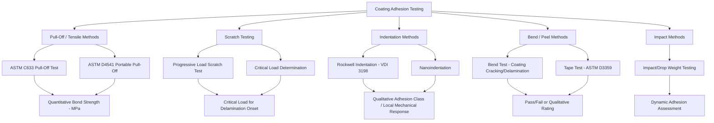

## Surface Characterization and Adhesion Testing

### Overview

Surface characterization and adhesion testing encompass the analytical and mechanical evaluation methods used to qualify coatings and surface treatments — verifying that a coating meets its intended composition, structure, thickness, and, critically, that it remains adherent to the substrate under the mechanical, thermal, and chemical loads it will encounter in service. These methods are applied across all coating families previously discussed (thermal spray, PVD/CVD, electroplating, anodizing, diffusion coatings) and form the verification backbone of surface engineering process qualification.

**Key Points**

- Characterization addresses "what was deposited and how" (composition, thickness, microstructure, roughness), while adhesion testing addresses "will it stay attached" (bond strength, failure mode, and location).
- No single test method is universally applicable across all coating/substrate combinations; test method selection must account for coating type, thickness, hardness, ductility, and substrate characteristics.
- Adhesion failure can occur at multiple interfaces (coating/substrate interface, within the coating itself — cohesive failure, or within the substrate near-surface region), and identifying the failure mode/location is often as informative as the quantitative adhesion value itself.

### Surface Roughness Characterization

Surface roughness governs coating adhesion (mechanical interlocking), tribological performance, fatigue behavior (as a stress concentration source), and optical/aesthetic properties, and is characterized both before coating (substrate preparation verification) and after coating (final surface quality verification).

#### Roughness Parameters

- **$R_a$ (arithmetic mean roughness)**: The most commonly cited roughness parameter, representing the arithmetic average of the absolute deviations of the surface profile from the mean line
- **$R_z$ (mean roughness depth)**: Average of the maximum peak-to-valley heights over several sampling lengths, more sensitive to occasional large surface features than $R_a$
- **$R_q$ (RMS roughness)**: Root-mean-square deviation, giving greater statistical weight to larger deviations than $R_a$
- **$R_t$ (maximum peak-to-valley height)**: The single largest peak-to-valley deviation across the entire measured length, useful for identifying worst-case surface defects

#### Measurement Techniques

**Contact profilometry (stylus profilometry)**: A diamond-tipped stylus is mechanically traversed across the surface, with vertical stylus displacement recorded to generate a surface profile trace; widely used, well-standardized, but limited by stylus tip radius (which cannot resolve features finer than the tip geometry) and potential for stylus-induced surface damage on soft coatings.

**Non-contact optical profilometry** (white light interferometry, confocal microscopy, focus variation): Uses optical interference or focus-detection principles to map surface topography without physical contact, avoiding stylus damage risk and typically offering faster area-based (rather than line-based) measurement, though optical methods can be sensitive to surface reflectivity and steep-sided features that scatter light away from the detector.

**Atomic force microscopy (AFM)**: Provides nanometer-to-sub-nanometer scale resolution by scanning a sharp probe tip across the surface while monitoring probe-surface interaction forces, used for very fine-scale roughness/topography characterization beyond the resolution of conventional profilometry, particularly relevant for thin PVD/CVD films and semiconductor-relevant surfaces.

### Coating Thickness Measurement

#### Destructive Methods

**Metallographic cross-sectioning**: The coated component is sectioned, mounted, ground, and polished to reveal a cross-sectional view, then examined via optical or scanning electron microscopy (SEM) to directly measure coating thickness. This remains a reference/calibration standard method for most coating thickness measurement techniques, offering direct visual confirmation of coating thickness, uniformity, and, often, microstructural quality (porosity, interface characteristics) simultaneously — but is inherently destructive and provides only localized information at the sectioned plane.

**Ball cratering (calo test)**: A rotating ball, charged with abrasive slurry, is used to grind a shallow spherical crater through the coating into the substrate; the resulting crater's geometry (measured via optical microscopy) allows coating thickness calculation from the crater's concentric ring diameters, offering a relatively simple, semi-destructive method particularly suited to thin (sub-10 micron) coatings.

#### Non-Destructive Methods

**Magnetic induction / eddy current methods**: Measure coating thickness based on the magnetic or electrical response of the coating/substrate system to an applied field, widely used for common combinations (non-magnetic coating on magnetic substrate via magnetic induction; non-conductive coating on conductive substrate, or vice versa, via eddy current), offering fast, portable, non-destructive measurement suited to production quality control.

**X-ray fluorescence (XRF)**: Measures characteristic X-ray emission from the coating (and, for thin coatings, the substrate) under X-ray excitation, providing both thickness and compositional information non-destructively; widely used for electroplated and other metallic coating thickness verification.

**Beta backscatter**: Uses the difference in beta particle backscatter intensity between coating and substrate materials of differing atomic number to determine coating thickness, an older but still applied method for certain coating/substrate combinations.

### Compositional and Microstructural Characterization

#### Scanning Electron Microscopy (SEM) with Energy Dispersive X-ray Spectroscopy (EDS)

SEM provides high-resolution surface and cross-sectional imaging of coating microstructure (porosity, splat structure in thermal spray coatings, columnar structure in PVD coatings, interdiffusion zones in diffusion coatings), while coupled EDS analysis provides localized elemental composition information, widely used to verify coating composition, detect contamination, and characterize interface/interdiffusion regions.

#### X-ray Diffraction (XRD)

XRD identifies crystalline phases present in a coating (distinguishing, for example, between different nitride/carbide phases in hard coatings, or verifying the intended oxide phase in diffusion coating scales) and, via peak shift/broadening analysis (the $\sin^2\psi$ method being a standard approach), quantifies **residual stress** within the coating or near-surface region — a critical parameter given residual stress's significant influence on coating adhesion, fatigue performance, and spallation resistance across virtually all coating types discussed in this chapter.

#### X-ray Photoelectron Spectroscopy (XPS) and Auger Electron Spectroscopy (AES)

Both techniques provide surface-sensitive (typically top few nanometers) compositional and, for XPS, chemical bonding state information, valuable for characterizing very thin films, native oxide layers, contamination layers, and interfacial chemistry not accessible to bulk-sensitive techniques like EDS.

### Adhesion Testing Methods

#### Pull-Off (Tensile Adhesion) Testing

**ASTM C633** (the standard reference method for thermal spray coatings) bonds a coated test specimen to a mating stud using a high-strength adhesive, then applies tensile load perpendicular to the coating surface until failure, with bond strength reported as failure load divided by cross-sectional area (typically MPa or psi). Failure mode (adhesive failure at the coating/substrate interface, cohesive failure within the coating, cohesive failure within the adhesive itself, or a mixed-mode failure) is documented alongside the quantitative strength value, since the failure mode significantly affects interpretation (e.g., adhesive-limited failure, where the bonding glue itself fails before the coating, indicates the true coating adhesion strength exceeds the reported test value).

**ASTM D4541** (portable pull-off adhesion tester) provides a similar principle applied via a portable dolly/adhesive system suited to field testing of paint and other organic coatings, offering practical in-situ adhesion assessment without requiring laboratory specimen preparation.

#### Scratch Testing

A diamond stylus is drawn across the coated surface under progressively increasing normal load, while acoustic emission, friction force, and/or optical/microscopy observation are used to identify the **critical load** at which coating delamination, cracking, or other characteristic failure event occurs. Scratch testing is particularly well suited to thin, hard coatings (PVD/CVD hard coatings) where pull-off testing would be impractical due to the coating's limited thickness and high hardness relative to available adhesives.

**Key Points**

- Scratch test critical load is a comparative/relative adhesion indicator rather than a direct measurement of absolute interfacial bond strength (in fundamental units of stress), since the critical load depends on coating hardness, thickness, substrate hardness, and stylus geometry in a complex, coupled manner not reducible to a simple bond-strength value.
- Multiple failure modes can be identified during a single scratch test (e.g., initial cohesive cracking followed by later adhesive spallation at higher load), providing diagnostic information about coating failure progression beyond a single critical load number.

#### Indentation Adhesion Testing (Rockwell Indentation Method)

**VDI 3198** (a widely referenced qualitative method, particularly for hard PVD/CVD coatings on cutting tools) applies a standard Rockwell C indentation to the coated surface, then compares the resulting fracture/delamination pattern around the indentation against a set of reference images corresponding to defined adhesion quality classes (HF1 through HF6, ranging from acceptable adhesion with minor cracking to unacceptable extensive delamination), providing a rapid, low-cost qualitative screening method widely used in industrial hard-coating quality control.

#### Bend Testing

The coated specimen is bent around a mandrel of specified radius (or to a specified bend angle), with resulting coating cracking, flaking, or delamination assessed visually or under magnification. Bend testing evaluates coating ductility and adhesion simultaneously under a combined tensile/compressive strain state, particularly relevant for coatings applied to components that will themselves experience bending or forming operations after coating (or components where in-service flexure is a design consideration).

#### Tape Testing

**ASTM D3359** applies a controlled adhesive tape over a cross-hatch or lattice pattern cut into the coating, then rapidly removes the tape, with the percentage/pattern of coating removed compared against a standard rating scale. Widely used for paint and thin organic coatings as a simple, low-cost, qualitative pass/fail adhesion screening method, though generally inadequate for evaluating the higher bond strengths typical of metallic or hard ceramic/cermet coatings.

#### Impact Testing

Applies a controlled dynamic impact (falling weight, or a specified projectile/indenter impact) to the coated surface, assessing coating response (cracking, spallation) under dynamic rather than quasi-static loading, relevant for applications where the coating will experience impact or high-strain-rate loading in service (e.g., erosion-prone components, tooling subject to interrupted cutting).

### Failure Mode Classification

Understanding and correctly classifying the location and mode of adhesion test failure is essential to correctly interpreting test results:

- **Adhesive failure**: Separation occurs precisely at the coating/substrate interface, indicating the interfacial bond itself is the limiting factor
- **Cohesive failure (within coating)**: Fracture occurs within the coating layer itself, above the coating/substrate interface, indicating the coating's internal (cohesive) strength is lower than the interfacial adhesion strength — a favorable outcome in the sense that it demonstrates the interface is not the weak link, though it still indicates a strength limitation of the overall coated system
- **Cohesive failure (within substrate)**: Fracture occurs within the substrate material near the surface (relevant for cases involving substrate near-surface embrittlement, such as hydrogen embrittlement from electroplating processes, or a substrate heat-affected zone weakened by the coating process)
- **Mixed-mode failure**: A combination of the above, common in practice and requiring careful fractographic examination (often via SEM) to properly characterize the relative contribution of each failure mechanism

### Test Method Selection Considerations

**Key Points**

- **Thick, relatively ductile coatings** (thermal spray, thick electroplated deposits): Pull-off testing (ASTM C633/D4541) is generally applicable and provides quantitative bond strength values directly comparable against specification requirements.
- **Thin, hard coatings** (PVD/CVD hard coatings, thin anodized layers): Scratch testing and Rockwell indentation methods (VDI 3198) are generally preferred, since pull-off testing becomes impractical as coating thickness decreases toward and below typical adhesive bond-line thickness and adhesive strength limitations.
- **Organic/paint coatings**: Tape testing (ASTM D3359) and portable pull-off testing (ASTM D4541) are standard, reflecting the generally lower bond strength and greater ductility of organic coating systems compared to metallic/ceramic coatings.
- **Behavior may vary** significantly with specimen preparation quality, test operator technique (particularly for methods involving visual/microscopic failure assessment, such as tape testing and Rockwell indentation rating), and environmental testing conditions; standardized test method procedures (per the referenced ASTM/VDI/ISO documents) should be followed rigorously, and results should generally be interpreted as comparative/qualification indicators within a defined test protocol rather than as universal absolute material properties independent of test conditions.

### Relationship to Coating Process Qualification

Surface characterization and adhesion testing collectively form the verification layer of coating process qualification programs (paralleling the process-structure-property qualification philosophy discussed for additive manufacturing): establishing that a given coating process, applied under controlled and validated parameters, reliably produces coatings meeting specified thickness, composition, microstructure, and adhesion requirements, typically through a combination of witness specimen testing (destructive methods applied to specimens processed alongside production parts) and non-destructive in-process or final inspection of production components themselves.

**Related Topics**

- Thermal spray coating porosity, bond strength, and residual stress relationships
- PVD/CVD hard coating adhesion and cutting tool coating qualification
- X-ray diffraction residual stress measurement ($\sin^2\psi$ method)
- Surface preparation methods (grit blasting, chemical etching) and their influence on adhesion
- Coating failure analysis and fractography (SEM-based failure mode identification)
- Defects and qualification in additive manufacturing (parallel process-structure-property qualification philosophy)
- Hydrogen embrittlement considerations in electroplated coating substrates
- Nanoindentation and thin-film mechanical property characterization