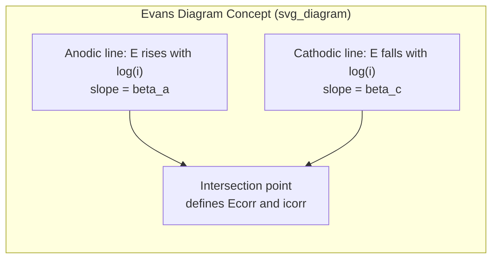
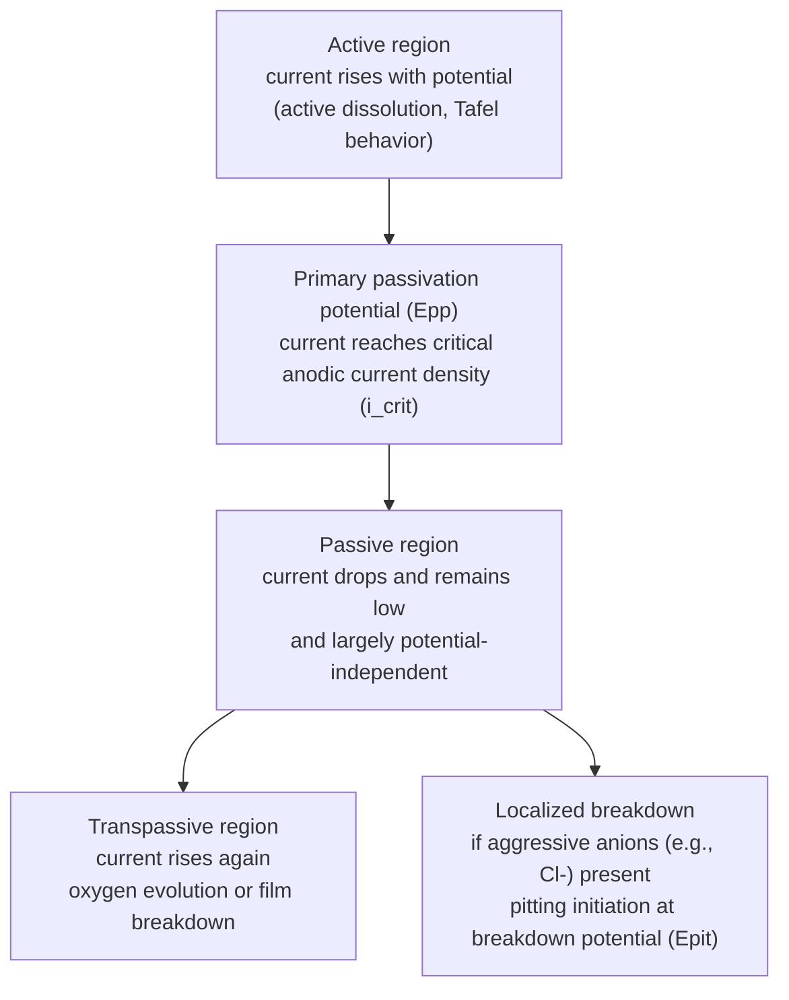
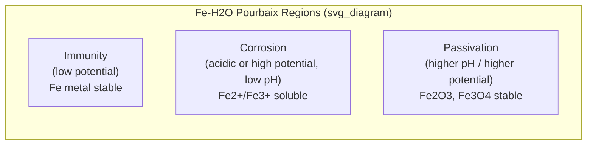

## Electrochemical Principles of Corrosion

### Overview

Corrosion is the degradation of a metal resulting from an electrochemical reaction with its environment. Unlike purely chemical attack (e.g., direct oxidation in dry gas at high temperature), aqueous corrosion is fundamentally electrochemical: it requires an anode, a cathode, an electrolyte, and a metallic path connecting anode and cathode. Removing any one of these four elements stops the corrosion cell from functioning. This framework — the corrosion cell — underlies nearly all wet corrosion phenomena in metallurgy, from uniform rusting of steel to localized pitting of stainless alloys.

### The Corrosion Cell

**Key Points**

- **Anode**: the electrode where oxidation (metal dissolution) occurs: $M \rightarrow M^{n+} + ne^-$
- **Cathode**: the electrode where reduction occurs, consuming the electrons released at the anode
- **Electrolyte**: an ionically conductive medium (moisture film, soil water, seawater, etc.) that carries ionic current between anode and cathode
- **Metallic path**: an electronically conductive connection (often the bulk metal itself) that carries electron current from anode to cathode

At the anode, metal atoms lose electrons and enter solution as cations, leaving the solid lattice. At the cathode, those electrons are consumed by a reduction reaction — they do not accumulate. The two half-reactions are physically separated in space but electrically coupled, so the overall rate of metal loss at the anode is stoichiometrically tied to the rate of the cathodic reaction consuming electrons.

### Anodic Reaction

For most engineering metals, the anodic reaction is metal oxidation:

$$M \rightarrow M^{n+} + ne^-$$

Examples:

- Iron: $Fe \rightarrow Fe^{2+} + 2e^-$
- Zinc: $Zn \rightarrow Zn^{2+} + 2e^-$
- Aluminum: $Al \rightarrow Al^{3+} + 3e^-$

The dissolved metal ions may subsequently react with hydroxide or other species in solution to form corrosion products (e.g., $Fe(OH)_2$, further oxidizing to $Fe(OH)_3$ and eventually hydrated iron oxides — rust).

### Cathodic Reactions

The cathodic reaction depends on the electrolyte's composition, pH, and dissolved oxygen content. The two dominant reactions in aqueous corrosion are:

**Hydrogen evolution (acidic or oxygen-free conditions):**

$$2H^+ + 2e^- \rightarrow H_2$$

**Oxygen reduction (neutral/alkaline, aerated conditions):**

$$O_2 + 2H_2O + 4e^- \rightarrow 4OH^-$$

In most natural environments (neutral pH, exposed to air), oxygen reduction dominates and is often the rate-limiting step because dissolved oxygen diffusion to the metal surface is slow. This is why corrosion rate frequently correlates with oxygen availability rather than with the intrinsic reactivity of the metal alone — a low-oxygen crevice can corrode faster locally than a well-aerated open surface, despite the metal being identical, because of how the cathodic supply governs the coupled reaction (differential aeration, discussed below).

### Thermodynamics: Electrode Potentials

Whether a metal tends to corrode in a given environment is governed by thermodynamics — specifically, the standard electrode potential $E^0$, referenced to the standard hydrogen electrode (SHE).

The **Nernst equation** gives the equilibrium potential of a half-cell at non-standard conditions:

$$E = E^0 - \frac{RT}{nF}\ln Q$$

where $R$ is the gas constant, $T$ is absolute temperature, $n$ is the number of electrons transferred, $F$ is Faraday's constant, and $Q$ is the reaction quotient.

**The Galvanic (EMF) Series** ranks metals by standard electrode potential under standardized conditions. A metal with a more negative (active) potential tends to act as the anode when galvanically coupled to a metal with a more positive (noble) potential. Common ordering (active to noble): magnesium, zinc, aluminum, mild steel, cast iron, lead, tin, brass, copper, stainless steel (passive), silver, gold, platinum.

[Inference] The EMF series is derived under specific standard-state laboratory conditions; the **Galvanic Series** (as measured in actual seawater, for instance) is the more practically relevant ranking for engineering material selection because it reflects real environmental effects such as passive film formation, which can reorder relative nobility compared to the theoretical EMF series.

### Kinetics: Mixed Potential Theory and Polarization

Thermodynamics predicts whether corrosion is possible, but kinetics determines how fast it proceeds. **Mixed potential theory** (Wagner and Traud, 1938) states that the total rate of oxidation equals the total rate of reduction on a freely corroding surface, and that the system settles at a single **mixed potential** (or corrosion potential, $E_{corr}$) where these rates are equal in charge terms — not necessarily an equilibrium potential for either individual reaction.

**Polarization** describes the deviation of an electrode's potential from its equilibrium value as current flows. Three principal polarization mechanisms:

- **Activation polarization**: controlled by the activation energy of the electrochemical reaction step at the electrode surface, dominant at low current densities
- **Concentration polarization**: controlled by the rate of mass transport (diffusion) of reacting species to/from the electrode surface, dominant at high current densities or when reactant supply is limited (e.g., dissolved oxygen)
- **Resistance (IR) polarization**: caused by the ohmic resistance of the electrolyte or any surface films between anode and cathode

**Activation-controlled polarization** is described by the **Tafel equation**:

$$\eta = \beta \log\left(\frac{i}{i_0}\right)$$

where $\eta$ is overpotential, $\beta$ is the Tafel slope, $i$ is current density, and $i_0$ is the exchange current density (the equilibrium rate of forward and reverse reaction at zero net current).

### Evans Diagrams

An **Evans diagram** plots potential (y-axis) against the logarithm of current density (x-axis) for both the anodic and cathodic reactions on the same electrode. The intersection of the extrapolated anodic and cathodic Tafel lines gives $E_{corr}$ and the **corrosion current density**, $i_{corr}$, from which corrosion rate is calculated via Faraday's law.

<svg xmlns="http://www.w3.org/2000/svg" viewBox="0 0 520 360">
<text x="260" y="24" text-anchor="middle" font-size="15" font-weight="bold" fill="#222">Evans Diagram (svg_diagram)</text>
<line x1="70" y1="300" x2="480" y2="300" stroke="#333" stroke-width="1.5" />
<line x1="70" y1="40" x2="70" y2="300" stroke="#333" stroke-width="1.5" />
<text x="275" y="335" text-anchor="middle" font-size="13" fill="#333">log(current density), log(i)</text>
<text x="30" y="170" text-anchor="middle" font-size="13" fill="#333" transform="rotate(-90 30 170)">Potential, E</text>
<line x1="90" y1="270" x2="400" y2="90" stroke="#c0392b" stroke-width="2.5" />
<text x="405" y="85" font-size="12" fill="#c0392b">Anodic (M → M^n+ + ne^-)</text>
<line x1="90" y1="90" x2="400" y2="250" stroke="#2980b9" stroke-width="2.5" />
<text x="405" y="255" font-size="12" fill="#2980b9">Cathodic (O2 + 2H2O + 4e^- → 4OH^-)</text>
<circle cx="260" cy="176" r="5" fill="#111" />
<line x1="260" y1="176" x2="260" y2="300" stroke="#555" stroke-dasharray="4,3" />
<line x1="70" y1="176" x2="260" y2="176" stroke="#555" stroke-dasharray="4,3" />
<text x="264" y="316" font-size="12" fill="#111">i_corr</text>
<text x="35" y="180" font-size="12" fill="#111">E_corr</text>
</svg>

### Faraday's Law and Corrosion Rate

Corrosion current density converts directly to a mass-loss or penetration rate via Faraday's law:

$$w = \frac{i \cdot t \cdot M}{n \cdot F}$$

where $w$ is mass loss, $i$ is current, $t$ is time, $M$ is atomic/molar mass, $n$ is valence (electrons transferred per atom), and $F$ is Faraday's constant.

For engineering practice, this is often expressed as **corrosion penetration rate (CPR)**, in mils per year (mpy):

$$CPR = \frac{K \cdot i_{corr} \cdot M}{n \cdot \rho}$$

where $K$ is a unit-conversion constant, and $\rho$ is density. This relationship is the basis for converting electrochemical measurements (e.g., from potentiodynamic polarization testing) into practical corrosion-rate estimates.

### Types of Corrosion Cells

**Example**

- **Galvanic (dissimilar metal) corrosion**: two different metals in electrical contact, immersed in the same electrolyte, form a cell where the more active metal is the anode. Example: a steel bolt in a copper fitting corrodes preferentially at the steel.
- **Concentration cell corrosion**: identical metal, but differing electrolyte concentration or oxygen availability creates a potential difference.
  - **Differential aeration cell**: the region with lower oxygen concentration (e.g., under a deposit, in a crevice, under a gasket) becomes anodic relative to the well-aerated region, because oxygen reduction cannot proceed as readily there, forcing that local mixed potential to shift active. This is the electrochemical basis of **crevice corrosion**.
  - **Differential concentration cell**: variation in metal-ion or salt concentration between two regions of the same metal surface.
- **Microstructural (composition) cells**: second-phase particles, grain boundaries, or segregated regions with different electrode potential than the matrix act as local anodes or cathodes — relevant to intergranular corrosion (e.g., sensitized austenitic stainless steel with chromium-depleted grain boundaries after chromium carbide precipitation).
- **Stress cells**: cold-worked or highly stressed regions (e.g., at a bend, weld, or crack tip) tend to be more anodic than unstressed regions, relevant to stress corrosion cracking.

### Area Effects

The **anode-to-cathode area ratio** strongly influences the severity of localized attack. A small anodic area coupled to a large cathodic area concentrates the total anodic current into a small region, producing a high local current density and rapid penetration — this is why a small steel fastener in a large copper structure fails quickly, while the reverse pairing (large steel structure, small copper fastener) causes comparatively minor, diffuse attack on the steel.

### Passivity

Many technologically important metals and alloys (stainless steels, aluminum, titanium, chromium, nickel-based alloys) rely on **passivation**: formation of a thin, adherent, protective oxide film (often only a few nanometers thick) that dramatically reduces the anodic dissolution rate, effectively shifting the metal's behavior far more noble than its position in the EMF series would suggest.

A **potentiodynamic polarization curve** for a passivating metal shows characteristic regions:

**Key Points**

- $i_{crit}$: the critical anodic current density that must be exceeded to initiate passivation
- $i_{pass}$: the low, roughly constant current density maintained in the passive region
- **Pitting potential** ($E_{pit}$): the potential above which localized breakdown of the passive film occurs, typically promoted by chloride or other aggressive halide ions
- Passive films can be locally and mechanically disrupted (mechanical damage, chloride attack, or microbial activity), reinitiating active dissolution at that specific site while the surrounding surface remains passive — this area imbalance (tiny active anode, huge passive cathode) is why **pitting** and **crevice corrosion** produce deep, rapid local penetration

[Inference] The exact position and shape of the active-passive-transpassive curve is alloy- and environment-specific (pH, chloride content, temperature, and alloying elements such as Cr, Mo, and N all shift $E_{pp}$, $i_{crit}$, and $E_{pit}$), so quoted numerical potentials from any single reference should be treated as illustrative rather than universal.

### Pourbaix Diagrams

A **Pourbaix diagram** (potential–pH diagram) maps the thermodynamically stable phase (immunity, corrosion, or passivation) of a metal-water system as a function of electrode potential and pH, at a given temperature and assumed ionic activity.

- **Immunity**: region where the metal itself is the thermodynamically stable species (no driving force for oxidation)
- **Corrosion**: region where soluble ionic species are stable (metal dissolution is thermodynamically favored)
- **Passivation**: region where a stable solid oxide or hydroxide film is thermodynamically favored

**Illustrative example (iron-water system, simplified)**:

[Inference] Pourbaix diagrams describe thermodynamic tendency only — they say nothing about the rate of corrosion or the mechanical integrity/adherence of a passive film, so a metal shown "passivated" on a Pourbaix diagram can still corrode rapidly in practice if the film is porous, non-adherent, or mechanically unstable.

### Practical Implications for Materials Selection

**Next Steps**

The electrochemical framework above directly informs engineering corrosion control strategies:

- **Cathodic protection**: deliberately making the structure the cathode (sacrificial anodes or impressed current) so it cannot act as the anodic half of a cell
- **Coatings**: interrupting the electrolyte or metallic-path requirement of the cell
- **Inhibitors**: adsorbing species that raise activation polarization at the anode, cathode, or both, suppressing $i_{corr}$
- **Alloy/material selection**: choosing alloys whose passive film is stable in the service environment's pH and chloride content, and avoiding unfavorable galvanic area ratios in design

### Related Topics

- Types of Corrosion (uniform, galvanic, crevice, pitting, intergranular, erosion-corrosion, stress corrosion cracking)
- Cathodic Protection Design (sacrificial anode vs. impressed current systems)
- Corrosion Inhibitors and Mechanisms
- Passivity and Stainless Steel Metallurgy (role of Cr, Mo, N)
- Potentiodynamic Polarization Testing (ASTM G5, G61)
- High-Temperature Oxidation (distinguishing dry oxidation kinetics from aqueous electrochemical corrosion)
- Corrosion Monitoring Techniques (linear polarization resistance, electrochemical impedance spectroscopy)